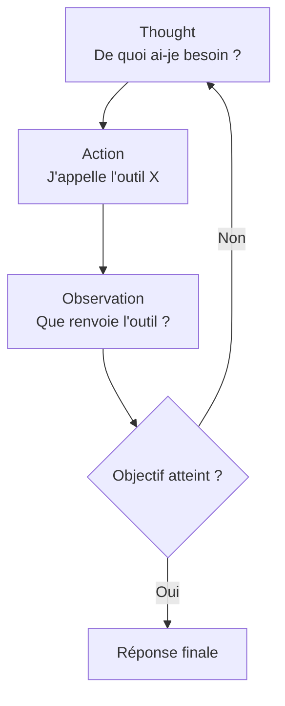
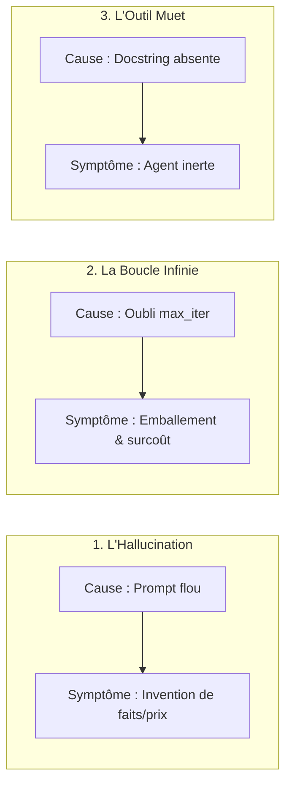

# Module 1 : Fondations & Anatomie d'un Agent IA

> [!ABSTRACT] Vision du Module
> Un LLM seul est un cerveau brillant, mais **passif et isolé**. Un **Agent IA** est un système complet : un LLM équipé d'une **boussole** (objectif), de **mains** (outils), d'une **méthode** (prompt système) et de **garde-fous**. Ce module pose les fondations : le saut du LLM à l'agent, le moteur de pensée ReAct qui structure son raisonnement pas-à-pas, l'anatomie en huit piliers de configuration, puis les pièges classiques et les garde-fous opérationnels qui distinguent un agent de démo d'un agent de production. Aucun jargon mathématique : tout est illustré par analogies et cas d'usage concrets.

> [!NOTE] 📑 Table des Matières
> - [[#1. 💡 Section 1 : La Théorie Accessible & Concepts Clés|1. Section 1 : La Théorie Accessible & Concepts Clés]]
>   - [[#1.1. Du LLM à l'Agent IA : Le Saut vers l'Autonomie|1.1. Du LLM à l'Agent IA : Le Saut vers l'Autonomie]]
>     - [[#1.1.1. Le LLM seul : Un cerveau brillant mais passif et isolé|1.1.1. Le LLM seul]]
>     - [[#1.1.2. L'Agent IA : Un système complet doté d'une boussole, de mains et de garde-fous|1.1.2. L'Agent IA]]
>     - [[#1.1.3. La métaphore du stagiaire enfermé vs l'employé équipé|1.1.3. La métaphore du stagiaire]]
>   - [[#1.2. Le Moteur de Pensée : La Boucle ReAct (Reasoning + Acting)|1.2. Le Moteur de Pensée : La Boucle ReAct]]
>     - [[#1.2.1. Le cycle Thought / Action / Observation|1.2.1. Le cycle Thought / Action / Observation]]
>     - [[#1.2.2. Thought (La Pensée)|1.2.2. Thought]]
>     - [[#1.2.3. Action (L'Action)|1.2.3. Action]]
>     - [[#1.2.4. Observation (Le Constat)|1.2.4. Observation]]
>     - [[#1.2.5. L'évaluation continue de l'objectif|1.2.5. L'évaluation continue de l'objectif]]
>   - [[#1.3. L'Anatomie de l'Agent : Les 8 Piliers de Configuration|1.3. L'Anatomie de l'Agent : Les 8 Piliers]]
>     - [[#1.3.1. Cadrage Mental & Identité (role, goal, backstory)|1.3.1. Cadrage Mental & Identité]]
>       - [[#`role` : Le titre de poste et la posture cognitive|1.3.1.a role]]
>       - [[#`goal` : L'objectif métier mesurable et la boussole d'accomplissement|1.3.1.b goal]]
>       - [[#`backstory` : Le Prompt Système, la méthode pas-à-pas et les interdictions strictes|1.3.1.c backstory]]
>     - [[#1.3.2. Moteur & Actionneurs (llm, tools)|1.3.2. Moteur & Actionneurs]]
>       - [[#`llm` : Le cerveau référent et la puissance de calcul choisie pour l'agent|1.3.2.a llm]]
>       - [[#`tools` : La liste des fonctions informatiques exécutables fournies à l'agent|1.3.2.b tools]]
>     - [[#1.3.3. Sécurité & Contrôle (max_iter, verbose, allow_delegation)|1.3.3. Sécurité & Contrôle]]
>       - [[#`max_iter` : Le nombre maximal d'essais ReAct autorisés pour éviter les emballements|1.3.3.a max_iter]]
>       - [[#`verbose` : Le mode de débogage pour visualiser le fil de pensée de l'agent en direct|1.3.3.b verbose]]
>       - [[#`allow_delegation` : Autoriser ou interdire la sous-traitance spontanée entre agents|1.3.3.c allow_delegation]]
> - [[#2. ⚡ Section 2 : Les Notions Avancées & Garde-Fous Opérationnels|2. Section 2 : Notions Avancées & Garde-Fous]]
>   - [[#2.1. Les 3 Pièges Majeurs de la Conception d'Agents|2.1. Les 3 Pièges Majeurs]]
>     - [[#2.1.1. Le Prompt Système flou (Le piège de l'Hallucination)|2.1.1. Hallucination]]
>     - [[#2.1.2. L'absence de limite d'itérations (Le piège de la Boucle Infinie)|2.1.2. Boucle Infinie]]
>     - [[#2.1.3. L'Outil sans description (Le piège de l'Agent Inerte)|2.1.3. Outil Muet]]
>   - [[#2.2. Maîtriser le Cadrage de l'Identité & Des Limites de l'Agent|2.2. Maîtriser le Cadrage de l'Identité]]
>     - [[#2.2.1. Éviter le piège de l'agent "Couteau Suisse"|2.2.1. Couteau Suisse]]
>     - [[#2.2.2. Verrouiller les comportements par des règles d'interdiction strictes|2.2.2. Règles d'interdiction]]
>   - [[#2.3. Sécurité d'Exécution & Contrôle Budgétaire|2.3. Sécurité d'Exécution & Contrôle Budgétaire]]
>     - [[#2.3.1. Calibrer max_iter selon la complexité de la tâche|2.3.1. Calibrer max_iter]]
>     - [[#2.3.2. Désactiver allow_delegation pour des flux déterministes|2.3.2. allow_delegation]]
> - [[#3. 📊 Section 3 : Fiche Synthèse / Tableau Récapitulatif|3. Section 3 : Fiche Synthèse & Check-list]]
>   - [[#3.1. Matrice Récapitulative d'Anatomie : Paramètre vs Rôle vs Risque Système|3.1. Matrice Récapitulative]]
>   - [[#3.2. Check-list opérationnelle du Concepteur d'Agent IA Solo|3.2. Check-list opérationnelle]]
> - [[#4. Liens entre Notes|4. Liens entre Notes]]

---

## 1. 💡 Section 1 : La Théorie Accessible & Concepts Clés

> [!INFO] Chapeau de la Section 1
> Avant de configurer un agent, il faut comprendre ce qui le distingue d'un simple LLM et ce qui le rend **autonome**. Cette première section part de la nature passive du LLM seul, définit l'agent comme un système complet, puis décrit le moteur de pensée qui structure son raisonnement (la boucle ReAct en cinq temps), et enfin formalise l'anatomie de l'agent en huit piliers de configuration regroupés en trois familles. À l'issue de cette section, vous saurez **ce qu'est un agent** et **de quoi il est fait**, ce qui est le préalable indispensable aux garde-fous de la Section 2.

---

### 1.1. Du LLM à l'Agent IA : Le Saut vers l'Autonomie

> [!INFO] Chapeau de sous-section
> Pour comprendre l'ingénierie d'agents, il faut d'abord saisir le changement de nature qu'impose le passage du LLM à l'agent : un saut architectural qui transforme un moteur de texte passif en un système autonome et actif.

#### 1.1.1. Le LLM seul : Un cerveau brillant mais passif et isolé

Un **LLM** (Large Language Model) comme ChatGPT dans sa version standard est un **cerveau isolé**. Il est extrêmement **érudit** — il a "lu" des milliards de textes pendant son entraînement — mais il est **totalement passif** : il attend une question, calcule le texte de réponse en se basant sur son passé, puis s'arrête. Deux limitations en découlent : il n'a **pas d'accès au monde réel** (pas de web, pas d'outils, pas de mémoire d'action entre deux requêtes), et il ne **déclenche rien de lui-même**. Sans prompt, il ne fait rien.

Cette passivité n'est pas un défaut du modèle, c'est sa nature : un LLM est un **moteur de génération de texte**, pas un système d'action. Lui demander "Quel est le cours de l'action Apple ?" sans lui donner accès à Internet, c'est attendre une réponse exacte d'un cerveau coupé du monde — il inventera ou avouera son impuissance.

> [!WARNING] Le piège de l'omniscience
> On prête souvent aux LLM une fausse omniscience parce qu'ils "savent beaucoup". Mais leur savoir est **figé à leur date d'entraînement** et **sans prise sur le réel**. Un LLM seul ne peut ni vérifier, ni agir, ni persister.

*Comprendre l'isolement du LLM passif permet de mesurer ce qu'apporte la couche agentique : l'habiller d'une boussole, de mains et de garde-fous pour en faire un système autonome complet.*

---

#### 1.1.2. L'Agent IA : Un système complet doté d'une boussole, de mains et de garde-fous

Un **Agent IA** est un **système complet**. C'est un LLM auquel on a ajouté quatre composants qui le transforment : une **boussole** (un objectif mesurable), des **mains** (des outils informatiques), une **méthode** (un Prompt Système structuré) et des **garde-fous** (des règles d'interdiction et des limites d'exécution). Le LLM reste le cerveau, mais il est maintenant **emballé** dans une architecture qui le rend actif, contrôlable et persévérant.

La distinction est essentielle : l'agent n'est pas un LLM "meilleur", c'est un LLM **encadré**. Toute la valeur ajoutée d'un agent vient de l'**architecture** qui l'entoure — les outils, le prompt système, les limites —, pas du modèle lui-même. C'est pourquoi ce module et les suivants traitent autant de l'architecture que du modèle.

*Cette distinction conceptuelle entre le LLM seul et l'Agent IA encadré s'illustre de façon limpide par une métaphore du monde du travail.*

---

#### 1.1.3. La métaphore du stagiaire enfermé vs l'employé équipé

Pour saisir l'écart de manière intuitive, la meilleure image est celle du stagiaire. Le LLM seul est un **stagiaire brillant enfermé dans un bureau sans téléphone ni ordinateur** : si vous lui demandez la météo de demain, il va deviner ou avouer son impuissance, car il n'a aucun moyen d'accéder au monde. L'Agent IA, c'est ce même stagiaire équipé d'un **bureau, d'un accès Web, d'un téléphone, d'une calculatrice et d'une méthode de travail** : il peut chercher l'information, la vérifier, la croiser, et vous rendre un rapport complet.

> [!EXAMPLE] Analogie & cas d'usage
> **Analogie :** le stagiaire en chambre close vs l'employé équipé et autonome.
> **Cas d'usage agent :** un Agent Analyste de Marché doit produire un rapport sur les concurrents d'un secteur. Le LLM seul en est incapable (pas d'accès au web, pas de persévérance). L'agent, équipé d'un outil `recherche_web` et d'un objectif "cartographier 5 concurrents", enchaîne les recherches, vérifie les sources, et livre un rapport sourcé.

*Maintenant que nous avons défini ce qui fait le saut vers l'autonomie, voyons le moteur de pensée qui rend cette autonomie intelligente et méthodique : la boucle ReAct.*

---

### 1.2. Le Moteur de Pensée : La Boucle ReAct (Reasoning + Acting)

> [!INFO] Chapeau de sous-section
> L'autonomie d'un agent n'est pas une carte blanche improvisée : elle est structurée par un cycle de raisonnement qui force l'agent à avancer pas-à-pas au lieu de répondre d'un bloc. Ce cycle s'appelle ReAct (Reasoning + Acting).

#### 1.2.1. Le cycle Thought / Action / Observation

Le cycle **ReAct** structure la réflexion de l'agent sous la forme d'une alternance de trois temps : **Thought** (pensée), **Action** (action), **Observation** (constat). Plutôt que de générer une réponse d'un seul tenant, l'agent réfléchit à ce dont il a besoin, agit pour l'obtenir, observe le résultat, puis recommence jusqu'à pouvoir formuler une réponse finale. C'est ce cycle qui rend un agent **persévérant et vérifiable** — chaque étape est inspectable.



> [!TIP] Analogie
> Le bricoleur qui monte un meuble : il **réfléchit** à la prochaine pièce (Thought), **agit** en la posant (Action), **observe** si ça tient (Observation), puis recommence jusqu'à finir le meuble. Il n'improvise pas tout d'un coup.

*Le cycle ReAct s'articule autour de trois temps indissociables. Examinons d'abord le premier temps : la Pensée (Thought).*

---

#### 1.2.2. Thought (La Pensée)

La **Thought** est l'étape où l'agent **évalue le besoin immédiat** et choisit la prochaine étape. C'est un raisonnement explicite, formulé en texte, qui précède toute action. Cette étape est cruciale : elle empêche l'agent de se précipiter sur un outil sans réfléchir, et elle rend son cheminement **auditable** — on peut relire ses pensées pour comprendre ses choix.

La Thought répond à la question : *"De quoi ai-je besoin maintenant pour avancer vers mon objectif ?"* Selon la situation, l'agent peut conclure qu'il lui manque une information (donc appeler un outil de recherche), qu'il doit vérifier un fait (donc appeler un outil de vérification), ou qu'il a déjà tout ce qu'il faut (donc formuler la réponse finale).

> [!EXAMPLE] Cas concret
> *"Thought : Je n'ai pas la météo en direct. Je dois utiliser l'outil de recherche pour obtenir les conditions actuelles à Lyon."* Cette pensée précède l'action — et permet au développeur de comprendre, en lisant le log, pourquoi l'agent a choisi cet outil.

*La pensée évalue le besoin ; l'étape suivante consiste à passer à l'acte informatique concret via l'Action.*

---

#### 1.2.3. Action (L'Action)

L'**Action** est le déclenchement d'un **outil informatique** avec des **arguments précis**. C'est ici que l'agent cesse de réfléchir et **agit** sur le monde réel : il appelle une fonction (`recherche_web`, `run_python`, `get_weather`…) en lui passant des arguments structurés (souvent en JSON).

Une nuance fondamentale : l'agent **n'exécute pas lui-même** l'outil. Il émet une demande structurée, et c'est l'**orchestrateur** (le code du framework) qui exécute réellement la fonction puis renvoie le résultat. Cette séparation est la frontière de sécurité de l'agent : tout appel d'outil peut être **intercepté, modifié ou refusé** par l'orchestrateur (voir Module 5).

> [!EXAMPLE] Cas concret
> *"Action : `recherche_web(query='météo Lyon demain')`."* L'agent a formulé l'appel ; l'orchestrateur exécute réellement la recherche et renvoie le texte trouvé. Sans cette séparation, l'agent aurait un pouvoir non contrôlé sur le système.

*Une fois l'action transmise à l'orchestrateur et la fonction exécutée, l'agent doit analyser les données obtenues : c'est le rôle de l'Observation.*

---

#### 1.2.4. Observation (Le Constat)

L'**Observation** est l'analyse du **retour d'information** fourni par l'outil. L'agent lit le résultat, en extrait ce qui est utile, et **réévalue la situation** à la lumière de cette nouvelle donnée. C'est l'étape qui rend l'agent **adaptatif** : il ajuste sa stratégie en fonction de ce qu'il apprend.

L'observation n'est pas une simple lecture passive : c'est une **interprétation**. L'agent peut découvrir que l'outil a échoué (donc réessayer ou changer d'outil), que l'information est partielle (donc compléter par une autre recherche), ou qu'elle est suffisante (donc passer à la formulation finale).

> [!EXAMPLE] Cas concret
> *"Observation : L'outil renvoie 'Lyon : Pluie modérée, 14°C'."* L'agent en déduit qu'il a l'information utile pour répondre à la question "dois-je prendre un parapluie ?" — il peut maintenant formuler sa réponse finale.

*L'observation apporte une donnée nouvelle, mais pour décider s'il faut relancer la boucle ou conclure la mission, l'agent doit évaluer son objectif.*

---

#### 1.2.5. L'évaluation continue de l'objectif

Le cycle ne boucle pas indéfiniment : à chaque tour, l'agent **évalue son objectif** pour décider s'il doit continuer ou s'arrêter. C'est le **critère d'arrêt** du cycle ReAct. Si l'objectif est atteint, l'agent formule sa réponse finale ; sinon, il relance un nouveau cycle Thought/Action/Observation.

Cette évaluation continue est ce qui distingue un agent d'une simple chaîne d'appels : l'agent **sait quand il a fini** (parce que son `goal` est mesurable), tandis qu'un pipeline naïf s'arrêterait au hasard. C'est aussi ce qui justifie l'existence d'un objectif clair (le pilier `goal`, vu en 1.3) : sans objectif mesurable, l'agent ne peut pas évaluer s'il a atteint son but — et donc ne sait pas quand s'arrêter.

> [!WARNING] Sans critère d'arrêt
> Un agent sans objectif mesurable ne sait jamais quand s'arrêter : il boucle ou s'arrête au hasard. C'est pourquoi le pilier `goal` et le garde-fou `max_iter` (Section 2.3) sont **complémentaires** — l'un donne le cap, l'autre le plafond de sécurité.

*Nous avons décrit le moteur de pensée de l'agent. Voyons maintenant ses pièces constitutives en code : l'anatomie en huit piliers de configuration.*

---

### 1.3. L'Anatomie de l'Agent : Les 8 Piliers de Configuration

> [!INFO] Chapeau de sous-section
> En code (ex. framework CrewAI), la création d'un agent se résume à la définition de huit composants fondamentaux. Chaque paramètre joue un rôle stratégique précis, regroupés en trois familles : cadrage mental, moteur & actionneurs, et sécurité.

#### 1.3.1. Cadrage Mental & Identité (role, goal, backstory)

La première famille définit **qui est l'agent**. Trois piliers la composent, qui forment ensemble le "contrat psychologique" de l'agent.

##### `role` : Le titre de poste et la posture cognitive

Le pilier **`role`** est le **titre de poste et la posture cognitive** attribués à l'agent. Il agit comme un **filtre d'attention prioritaire** dans la mémoire du LLM : définir un rôle active automatiquement le **champ lexical**, les **méthodes de travail** et les **réflexes professionnels** associés à ce métier. Un `role = "Avocat d'affaires"` fait spontanément chercher les clauses contractuelles et les risques juridiques ; un `role = "Développeur Python"` privilégie la syntaxe et la gestion des exceptions.

*Si le rôle définit la posture professionnelle, il doit être immédiatement complété par la cible à atteindre : le goal.*

##### `goal` : L'objectif métier mesurable et la boussole d'accomplissement

Le pilier **`goal`** est l'**objectif métier mesurable** et la boussole d'accomplissement de l'agent. C'est le **critère d'évaluation permanent** : à chaque boucle ReAct, le LLM compare son état actuel avec le `goal` pour décider s'il continue ou s'arrête. Un goal flou (*"cherche des infos sur les PME"*) laisse l'agent incapable de savoir quand il a fini ; un goal précis (*"cartographier 5 concurrents réels"*) donne un cap clair et un critère d'arrêt objectif.

*Le rôle fixe la posture, le goal donne le cap ; il reste à fixer la méthode de travail et les interdictions strictes dans le backstory.*

##### `backstory` : Le Prompt Système, la méthode pas-à-pas et les interdictions strictes

Le pilier **`backstory`** est le **Prompt Système**, la méthode pas-à-pas et les **règles d'interdiction strictes**. Il reste injecté au sommet du contexte lors de **tous** les appels d'outils. C'est le **levier n°1** contre les hallucinations et pour imposer une méthodologie : on y loge les règles absolues (*"Si tu ne trouves pas d'URL officielle, indique 'Non vérifié' au lieu d'inventer"*). Cette backstory est traitée en détail au Module 2 (règle des 6 piliers).

```python
role = "Scanner d'Offres Concurrentes"
goal = "Cartographier 5 concurrents réels proposant de l'automatisation n8n en France."
backstory = (
    "Tu es un analyste concurrentiel expert. Règle absolue : si tu ne trouves "
    "pas d'URL officielle pour un concurrent, indique 'Non vérifié' au lieu "
    "d'inventer. Tu DOIS vérifier chaque entreprise via l'outil web."
)
```

> [!TIP] Analogie
> Le `role` est le **titre de poste**, le `goal` est la **fiche de mission**, le `backstory` est le **règlement intérieur**. Les trois ensemble définissent le contrat de travail de l'agent — incomplet si l'un manque.

*Le cadrage mental définit qui est l'agent. Mais pour agir, il lui faut un cerveau pour calculer et des mains pour exécuter : c'est la famille Moteur & Actionneurs (llm, tools).*

---

#### 1.3.2. Moteur & Actionneurs (llm, tools)

La deuxième famille définit **ce qui fait fonctionner l'agent** : son cerveau et ses mains.

##### `llm` : Le cerveau référent et la puissance de calcul choisie pour l'agent

Le pilier **`llm`** est le **cerveau référent** et la puissance de calcul choisie pour l'agent. Ce paramètre détermine la **capacité de raisonnement brut**, la **vitesse de génération**, la **tolérance au contexte** et le **coût par requête**. On l'adapte au rôle (voir Module 4) : un modèle rapide et économique (DeepSeek Chat, Claude Haiku) pour les tâches répétitives de recherche/extraction ; un modèle puissant (Claude) avec réflexion activée pour les synthèses stratégiques.

*Avoir un cerveau puissant ne sert à rien si l'agent ne peut pas interagir avec le monde réel. C'est le rôle de la liste des outils (tools).*

##### `tools` : La liste des fonctions informatiques exécutables fournies à l'agent

Le pilier **`tools`** est la **liste des fonctions informatiques exécutables** fournies à l'agent. Le framework extrait le nom, la description et les arguments de chaque fonction, et les traduit en un **schéma JSON** envoyé au LLM. Si le LLM veut agir, il génère un JSON qui déclenche l'exécution de la **vraie fonction Python** locale. Un agent avec `tools = []` n'a aucune capacité d'action — il ne peut que raisonner sur ce qu'on lui donne.

```python
llm = LLM_SCANNER_CONCURRENTS      # Modèle économique et rapide
tools = [recherche_web]  # L'outil DOIT avoir une docstring explicite
```

> [!WARNING] Outil muet = outil inutile
> Un agent ne devine pas ce que fait une fonction. Si sa description (`docstring`) est **floue ou absente**, l'agent ne l'utilisera jamais — il ne sait même pas qu'elle existe. Le Tool Engineering (Module 5) traite ce point en profondeur.

*Un agent doté d'une identité et d'outils est fonctionnel, mais sans freins, il peut devenir incontrôlable. La troisième famille réunit les paramètres de Sécurité & Contrôle (max_iter, verbose, allow_delegation).*

---

#### 1.3.3. Sécurité & Contrôle (max_iter, verbose, allow_delegation)

La troisième famille définit **ce qui contient l'agent**. Sans elle, l'agent est une voiture sans frein.

##### `max_iter` : Le nombre maximal d'essais ReAct autorisés pour éviter les emballements

Le pilier **`max_iter`** est le **nombre maximal d'essais ReAct** autorisés pour une seule tâche. À chaque appel d'outil, un compteur s'incrémente ; au-delà du plafond, le framework interrompt l'agent et le force à formuler sa réponse avec les données récoltées. C'est le **garde-fou anti-emballement**.

*Plafonner les itérations évite la ruine. Pour comprendre comment l'agent utilise ses itérations pendant le développement, on active le mode verbose.*

##### `verbose` : Le mode de débogage pour visualiser le fil de pensée de l'agent en direct

Le pilier **`verbose`** est un **interrupteur booléen** qui contrôle la transparence. À `True`, le framework affiche en couleur dans la console l'intégralité du fil de pensée (`Thought`, `Action`, `Action Input`, `Observation`). Indispensable en développement pour comprendre les échecs ; à `False` en production pour garder une console propre.

*Enfin, le dernier verrou de contrôle concerne la capacité de l'agent à faire appel spontanément à d'autres agents : la sous-traitance.*

##### `allow_delegation` : Autoriser ou interdire la sous-traitance spontanée entre agents

Le pilier **`allow_delegation`** autorise ou interdit la **sous-traitance spontanée** entre agents. À `True`, le framework ajoute un outil virtuel de délégation : l'agent peut interrompre son travail pour demander l'avis d'un collègue. À `False`, l'agent ne peut que faire son propre travail — garantissant des flux **déterministes**.

```python
max_iter = 10
verbose = True
allow_delegation = False  # Flux 100% prévisible et économique
```

Nous avons posé l'anatomie. Mais connaître les 8 piliers ne suffit pas à produire un agent fiable : il faut éviter les pièges classiques qui guettent le concepteur. C'est l'objet de la Section 2.

---

## 2. ⚡ Section 2 : Les Notions Avancées & Garde-Fous Opérationnels

> [!INFO] Chapeau de la Section 2
> Configurer un agent, c'est facile ; le rendre **fiable en production**, c'est une autre affaire. Cette section détaille les pièges majeurs qui guettent le concepteur (les trois causes de 90 % des frustrations de débutant), puis les principes de cadrage de l'identité qui rendent un agent spécialisé plutôt que vague, et enfin les réglages de sécurité et de contrôle budgétaire qui empêchent l'agent de dériver ou de ruiner son propriétaire.

---

### 2.1. Les 3 Pièges Majeurs de la Conception d'Agents

> [!INFO] Chapeau de sous-section
> Avant de coder votre premier agent, gardez ces trois erreurs fondamentales en tête. Elles représentent 90 % des frustrations chez les débutants, et chacune correspond à un pilier mal configuré.



#### 2.1.1. Le Prompt Système flou (Le piège de l'Hallucination)

Le premier piège est **l'hallucination**, causée par un `backstory` trop vague. Si vous ne donnez pas de **limites explicites** à votre agent (*"Si tu ne trouves rien, réponds 'Inconnu'"*), le LLM **inventera** des réponses **convaincantes mais fausses**. Ce n'est pas de la malhonnêteté : c'est la nature même d'un LLM, qui est un moteur de **plausibilité statistique** — quand il ne sait pas, il produit la réponse la plus "probable", même si elle est fausse.

> [!EXAMPLE] Cas concret
> Un agent d'analyse concurrentielle sans règle de repli, face à un concurrent dont il ne trouve pas le prix, peut inventer *"49 €/mois"* — chiffre plausible mais inventé. Avec une règle *"Si le prix n'est pas affiché, indique 'Sur devis'"*, l'agent avoue son ignorance plutôt que d'inventer.

*L'hallucination concerne la fidélité du raisonnement. Le deuxième piège touche la durée de l'exécution et la protection du budget : la boucle infinie.*

---

#### 2.1.2. L'absence de limite d'itérations (Le piège de la Boucle Infinie)

Le deuxième piège est la **boucle infinie**, causée par l'oubli du `max_iter`. Un agent qui ne trouve pas une information (site en panne, requête qui échoue) peut tenter de chercher sur le web **des centaines de fois de suite** s'il n'a pas de plafond d'essais. Le résultat est une **explosion budgétaire** : des dizaines ou centaines de dollars d'API consommés sur une seule mission qui n'a jamais abouti.

> [!WARNING] Cas concret
> Un site web recherché est en panne (erreur 500). Sans `max_iter`, l'agent réinterroge le web indéfiniment, persuadé que le prochain essai marchera. Avec `max_iter = 10`, le système coupe court après 10 itérations, protège le budget, et force l'agent à formuler une réponse avec ce qu'il a — ou à signaler l'échec.

*Si le Prompt Système contrôle la qualité des idées et max_iter la durée d'exécution, le troisième piège bloque l'interaction avec le monde extérieur : l'outil muet.*

---

#### 2.1.3. L'Outil sans description (Le piège de l'Agent Inerte)

Le troisième piège est l'**outil muet**, causé par une docstring absente ou ambiguë. Un agent ne devine jamais ce que fait une fonction Python : il ne "voit" que sa **description textuelle**. Si cette description est floue ou manquante, l'agent **n'utilisera jamais l'outil** — il agit comme s'il n'existait pas. Le système tourne, mais ne fait rien.

> [!TIP] Analogie
> Un outil sans description, c'est un **bouton sans étiquette** dans un ascenseur : on ne sait pas où il mène, donc on ne l'utilise pas. L'étiquette (la docstring) est ce qui rend l'outil utilisable.

*Les trois pièges majeurs identifiés, voyons comment les prévenir par conception en maîtrisant le cadrage de l'identité et les limites de l'agent.*

---

### 2.2. Maîtriser le Cadrage de l'Identité & Des Limites de l'Agent

> [!INFO] Chapeau de sous-section
> La prévention des pièges commence par un cadrage rigoureux de l'identité de l'agent. Deux principes gouvernent cette étape : la spécialisation étroite du rôle et le verrouillage par des règles d'interdiction strictes.

#### 2.2.1. Éviter le piège de l'agent "Couteau Suisse"

Le premier principe est la **hyper-spécialisation**. Un agent doit être **spécialisé sur une seule tâche**, pas être un "couteau suisse" qui fait tout. Pourquoi ? Parce qu'un agent qui fait trop de choses dilue son `role`, encombre son `backstory` de règles contradictoires, et finit par tout faire mal. La spécialisation est ce qui rend chaque prompt court, clair et efficace.

> [!EXAMPLE] Cas concret
> Ne créez pas un agent "Analyste-Rédacteur-Comptable" qui analyse, rédige et valide les chiffres. Créez **trois agents séparés** : un Analyste (cherche), un Rédacteur (synthétise), un Comptable (valide). Chacun a un rôle étroit, un LLM adapté, et un prompt court. C'est la logique multi-agents détaillée au Module 3.

> [!TIP] Analogie
> Un couteau suisse fait tout, mais rien parfaitement. Un set d'outils spécialisés — ciseaux, épluche-légume, opinel — fait chaque tâche mieux. Vos agents fonctionnent pareil : **un rôle, une mission, un outil**.

*La spécialisation garantit qu'un agent ne se disperse pas. Pour fermer la porte aux hallucinations restantes, il faut verrouiller ses comportements par des règles d'interdiction strictes.*

---

#### 2.2.2. Verrouiller les comportements par des règles d'interdiction strictes

Le second principe est le **verrouillage par règles d'interdiction** dans le `backstory`. Un agent laissé libre à son instinct comble les manques par invention (hallucination). La parade est d'inscrire dans le `backstory` des **règles absolues** qui encadrent explicitement les cas d'incertitude : *"Si introuvable, répondre 'Inconnu'"*, *"N'invente jamais un prix"*, *"Toute information doit provenir d'une recherche web exécutée en session"*.

Ces rules agissent comme des **garde-fous anti-hallucination**. Elles transforment l'incertitude (le point faible naturel d'un LLM) en un **comportement défini** plutôt qu'en une invention. Plus la règle est **explicite et négative** ("Ne fais jamais X"), plus elle est respectée — car le LLM répond mieux aux interdictions claires qu'aux incitations vagues.

> [!WARNING] Règle d'or
> Une règle d'interdiction n'a de valeur que si elle est **explicite**. *"Sois prudent"* est inefficace ; *"N'invente jamais un prix. Si le prix n'est pas affiché, écris 'Sur devis'"* est opérant. La précision de la règle est proportionnelle à son efficacité.

*Le cadrage de l'identité règle la qualité du comportement ; reste à verrouiller les paramètres d'exécution et de budget pour empêcher l'agent de dériver.*

---

### 2.3. Sécurité d'Exécution & Contrôle Budgétaire

> [!INFO] Chapeau de sous-section
> Même doté d'une identité parfaitement cadrée, un agent peut sur-consommer si ses paramètres d'exécution ne sont pas verrouillés. Deux réglages sont critiques : le calibrage de max_iter et la désactivation de allow_delegation.

#### 2.3.1. Calibrer max_iter selon la complexité de la tâche

Le **calibrage de `max_iter`** consiste à fixer le plafond d'itérations **en fonction de la complexité de la tâche**. Un `max_iter` trop bas coupe l'agent avant qu'il n'ait fini (mission inachevée) ; un `max_iter` trop haut l'expose à l'emballement budgétaire en cas d'échec répété. La règle pragmatique : une tâche simple (une recherche ciblée) se contente de `max_iter = 3-5` ; une tâche complexe (cartographier 5 concurrents) mérite `max_iter = 10-15`. Au-delà, on risque la sur-consommation d'API sans gain de qualité.

> [!TIP] Raisonnement par budget
> Calibrez `max_iter` en **fonction du budget** que vous acceptez de perdre en cas d'échec. Si un appel coûte 0,05 € et que vous acceptez 0,50 € de perte maximale par mission, `max_iter = 10` est un plafond cohérent. Le calibrage est un acte **financier**, pas seulement technique.

*Le calibrage de max_iter sécurise le nombre de tours de pensée d'un agent individuel. Pour maîtriser la prévisibilité et le coût d'un système multi-agents, il faut également statuer sur la sous-traitance spontanée via allow_delegation.*

---

#### 2.3.2. Désactiver allow_delegation pour des flux déterministes

La **désactivation de `allow_delegation`** garantit des **flux de travail déterministes et prévisibles** en production. Quand `allow_delegation = True`, l'agent peut spontanément sous-traiter une sous-tâche à un autre agent — ce qui, en production, introduit de l'**imprévisibilité** : on ne maîtrise plus qui fait quoi, ni combien d'agents sont réveillés, ni le coût final. En mode *Workflow Déterministe* (le nôtre), on fixe donc `allow_delegation = False` : les agents s'exécutent dans l'ordre prévu, sans s'interpeller mutuellement.

> [!WARNING] Quand l'activer ?
> `allow_delegation = True` se justifie en mode *Brainstorming Libre* ou en architecture en essaim (Module 3), où l'on veut justement une fluidité émergente. Mais en production avec un budget à maîtriser, c'est un risque. On l'active **délibérément**, jamais par défaut.

*Ces trois familles de garde-fous — les pièges évités, l'identité cadrée, l'exécution contrôlée — forment le socle d'un agent production-ready. Synthétisons l'ensemble du module en une fiche opérationnelle.*

---

## 3. 📊 Section 3 : Fiche Synthèse / Tableau Récapitulatif

> [!INFO] Chapeau de la Section 3
> Cette dernière section condense le module en deux outils de concepteur : une matrice récapitulative des huit piliers (rôle, utilité et risque en cas de mauvaise configuration), et une check-list de huit points pour auditer un agent avant sa mise en production.

---

### 3.1. Matrice Récapitulative d'Anatomie : Paramètre vs Rôle vs Risque Système

| Pilier | Famille | Rôle principal | Risque majeur si mal configuré | Analogie clé |
| :--- | :--- | :--- | :--- | :--- |
| **`role`** | Cadrage | Active la posture cognitive et le vocabulaire métier | **Hors-sujet** : l'agent répond avec le mauvais angle d'analyse | Le titre de poste |
| **`goal`** | Cadrage | Fixe la boussole et le critère d'accomplissement | **Inachèvement** : l'agent s'arrête avant d'avoir trouvé | La fiche de mission |
| **`backstory`** | Cadrage | Impose la méthode et les interdictions | **Hallucinations** : l'agent invente des faits ou des prix | Le règlement intérieur |
| **`llm`** | Moteur | Fournit la puissance de raisonnement brute | **Surcoût ou lenteur** : modèle trop cher pour des tâches simples | Le cerveau référent |
| **`tools`** | Moteur | Donne la capacité d'agir sur le monde | **Inaction** : description floue = outil jamais utilisé | Les mains de l'agent |
| **`max_iter`** | Sécurité | Limite le nombre de réflexions ReAct | **Boucle infinie** : consommation hors-contrôle du budget | Le plafond d'essais |
| **`verbose`** | Sécurité | Affiche le fil de pensée dans la console | **Cécité au débug** : impossible de comprendre les échecs | Le mode débugger |
| **`allow_delegation`** | Sécurité | Gère la sous-traitance inter-agents | **Chaos organisationnel** : agents se renvoyant la balle en boucle | La délégation contrôlée |

> [!TIP] Lecture transversale
> La famille **Cadrage** détermine la **qualité** (bonne réponse, bon angle). La famille **Moteur** détermine la **capacité** (vitesse, outils, action). La famille **Sécurité** détermine la **maîtrise** (coût, prévisibilité, auditabilité). Un agent production-ready est celui qui configure les **trois familles** avec la même rigueur — pas une seule.

*Une fois la matrice récapitulative des huit piliers assimilée, l'ultime étape avant tout déploiement consiste à faire passer votre agent au filtre des 8 points de contrôle de la check-list.*

---

### 3.2. Check-list opérationnelle du Concepteur d'Agent IA Solo

> [!SUCCESS] Les 8 points de contrôle avant la mise en production d'un Agent IA
> 1. **`role` hyper-spécialisé** : un seul métier par agent, jamais un "couteau suisse".
> 2. **`goal` mesurable** : un critère d'accomplissement objectif (ex. "5 concurrents vérifiés"), pas une intention vague.
> 3. **`backstory` avec règles d'interdiction explicites** : au moins une règle de repli anti-hallucination ("Si introuvable, répondre 'Inconnu'").
> 4. **`llm` adapté au rôle** : modèle économique pour les tâches répétitives, puissant pour la synthèse — pas l'inverse.
> 5. **`tools` avec descriptions chirurgicales** : chaque fonction a une docstring claire indiquant *quand* et *comment* l'utiliser.
> 6. **`max_iter` calibré** : plafond d'essais cohérent avec le budget acceptable en cas d'échec (ex. 10 pour une mission complexe).
> 7. **`verbose = True` en dev, `False` en prod** : transparence en développement, console propre en production.
> 8. **`allow_delegation = False` en production déterministe** : pas de sous-traitance spontanée sauf besoin explicite (essaim, brainstorming).

> [!TIP] Esprit de la check-list
> Les points 1 à 3 garantissent le **bon cadrage** (l'agent sait qui il est et quand il a fini). Les points 4 et 5 garantissent la **bonne capacité** (l'agent a le bon cerveau et les bons outils). Les points 6 à 8 garantissent la **bonne maîtrise** (l'agent ne dérive pas, reste observable, et n'agrandit pas le chaos). Un agent en production est celui qui coche les **trois familles** — pas une seule.

---

> [!QUOTE] Principe final
> Un Agent IA n'est pas un LLM "amélioré", c'est un LLM **encadré**. La valeur d'un agent ne vient pas de la taille de son modèle, mais de l'**architecture** qui l'entoure : une boussole (`goal`), une méthode (`backstory`), des mains (`tools`), et des freins (`max_iter`, `allow_delegation`). Le moteur de pensée ReAct donne à cet ensemble sa persévérance vérifiable. Le reste — prompts, outils, architectures multi-agents — n'est que l'ingénierie de ces huit piliers.

---

## 4. Liens entre Notes
- Aller au [[00_MOC_MAITRISE_AGENTS_IA]]
- Fiche suivante : [[02_Masterclass_Prompt_Engineering_Et_Prompt_Parfait]]