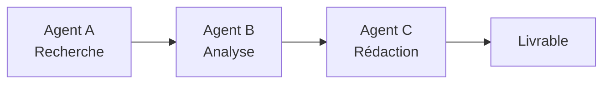
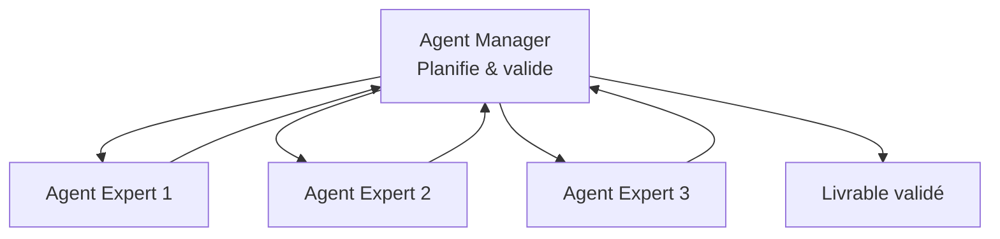
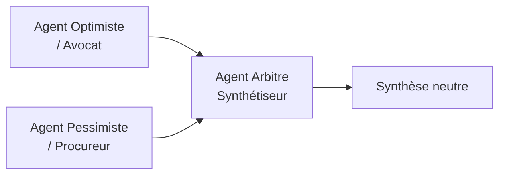
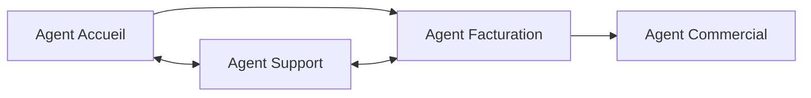
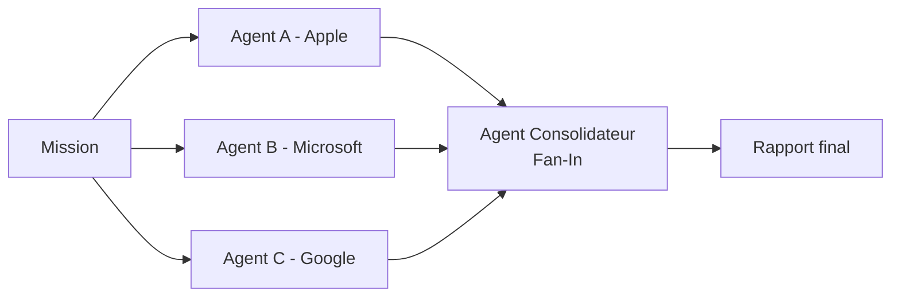
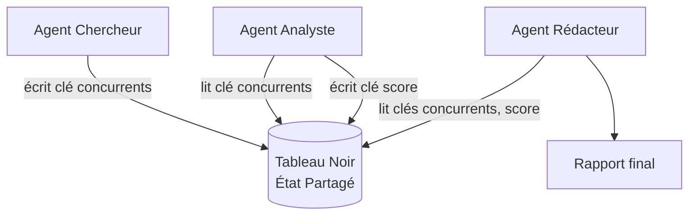
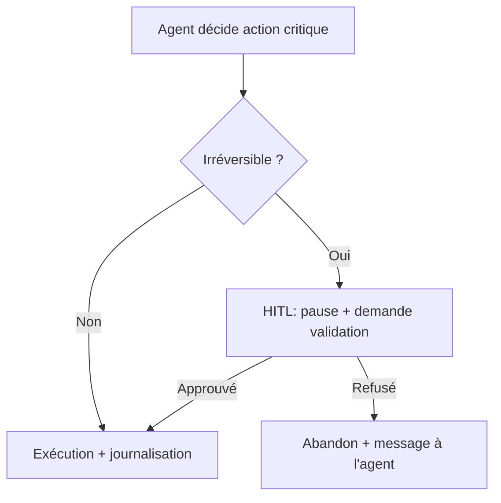
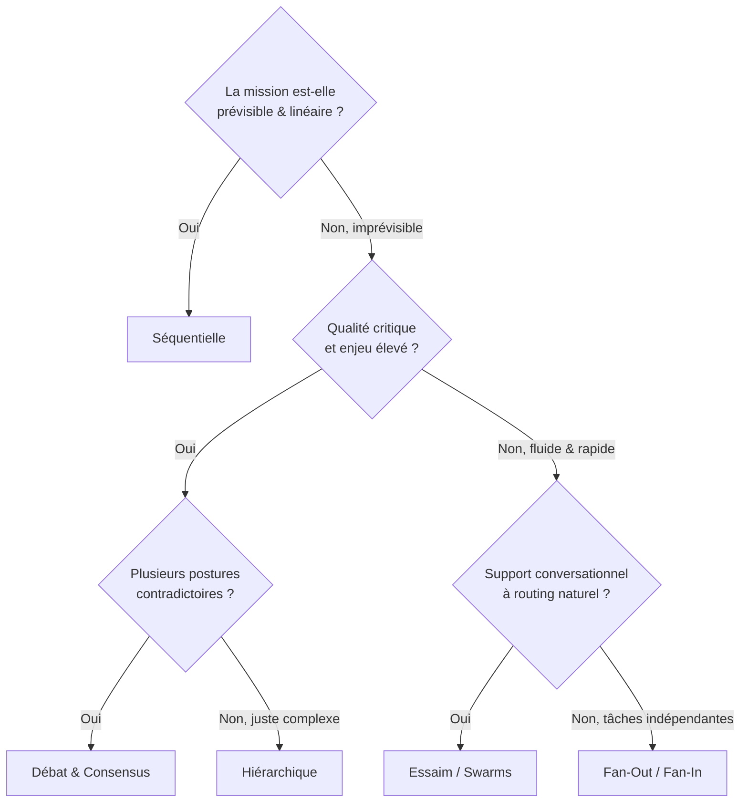

# Module 3 : Architectures & Topologies Multi-Agents

> [!ABSTRACT] Vision du Module
> Un agent IA seul finit toujours par saturer. La solution n'est pas un modèle plus grand, mais une **équipe** d'agents spécialisés dont on orchestre la collaboration. Ce module enseigne les **4 architectures fondamentales** (Séquentielle, Hiérarchique, Débat, Essaim), les **modes d'exécution** séquentiel vs parallèle, puis les **garde-fous opérationnels** qui rendent une équipe multi-agents fiable en production : routage, délégation, fallback, état partagé, validation humaine et disjoncteur budgétaire. Aucun jargon mathématique : tout est illustré par analogies et cas d'usage concrets.

> [!NOTE] 📑 Table des Matières
> - [[#1. 💡 Section 1 : La Théorie Accessible & Concepts Clés|1. Section 1 : La Théorie Accessible & Concepts Clés]]
>   - [[#1.1. Pourquoi créer une "Équipe" d'Agents ? (Les limites de l'Agent Solo)|1.1. Pourquoi créer une "Équipe" d'Agents ?]]
>   - [[#1.2. Les 4 Architectures Fondamentales de Communication|1.2. Les 4 Architectures Fondamentales de Communication]]
>     - [[#1.2.1. L'Architecture Séquentielle (Le Pipeline Direct)|1.2.1. L'Architecture Séquentielle (Le Pipeline Direct)]]
>     - [[#1.2.2. L'Architecture Hiérarchique (Le Manager / Chef de Projet)|1.2.2. L'Architecture Hiérarchique (Le Manager)]]
>     - [[#1.2.3. L'Architecture de Débat & Consensus (L'Évaluation par les Pairs)|1.2.3. Le Débat & Consensus]]
>     - [[#1.2.4. L'Architecture en Essaim (Swarms & Transferts Autonomes / Handoffs)|1.2.4. L'Essaim (Swarms & Handoffs)]]
>   - [[#1.3. Les Modes d'Exécution : Synchronie vs Parallélisme|1.3. Les Modes d'Exécution]]
> - [[#2. ⚡ Section 2 : Les Notions Avancées & Garde-Fous Opérationnels|2. Section 2 : Notions Avancées & Garde-Fous]]
>   - [[#2.1. Motifs d'Aiguillage & Contrôle du Flux (Routing & Delegation)|2.1. Motifs d'Aiguillage & Contrôle du Flux]]
>   - [[#2.2. Stratégies de Résilience & Réseaux de Secours|2.2. Stratégies de Résilience & Réseaux de Secours]]
>   - [[#2.3. Gestion de la Mémoire d'Équipe : L'Architecture à État Partagé|2.3. Gestion de la Mémoire d'Équipe]]
>   - [[#2.4. Sécurité & Validation Humaine (Human-in-the-Loop - HITL)|2.4. Sécurité & Validation Humaine (HITL)]]
>   - [[#2.5. Garde-Fous Financiers, Temporels et Anti-Boucles|2.5. Garde-Fous Financiers, Temporels et Anti-Boucles]]
> - [[#3. 📊 Section 3 : Fiche Synthèse / Tableau Récapitulatif|3. Section 3 : Fiche Synthèse & Check-list]]
>   - [[#3.1. Matrice Comparative des Topologies & Garde-Fous Multi-Agents|3.1. Matrice Comparative]]
>   - [[#3.2. Arbre de Décision : Comment Choisir la Bonne Architecture ?|3.2. Arbre de Décision]]
>   - [[#3.3. Check-list opérationnelle de l'Architecte Multi-Agents|3.3. Check-list opérationnelle]]
> - [[#4. Liens entre Notes|4. Liens entre Notes]]

---

## 1. 💡 Section 1 : La Théorie Accessible & Concepts Clés

> [!INFO] Chapeau de la Section 1
> Avant de bâtir une équipe, il faut comprendre pourquoi un agent seul finit toujours par butter sur trois murs : la saturation de sa mémoire, l'impossibilité d'endosser plusieurs rôles contradictoires et la dérive silencieuse de ses réponses. Cette première section pose les fondations du raisonnement multi-agents en partant des limites de l'agent solo, puis présente les quatre manières fondamentales d'organiser la communication entre agents, et enfin les deux modes d'exécution qui en découlent — le séquentiel et le parallèle.

---

### 1.1. Pourquoi créer une "Équipe" d'Agents ? (Les limites de l'Agent Solo)

> [!INFO] Chapeau de sous-section
> Un agent IA seul finit inévitablement par butter sur trois plafonds de verre : la saturation de son contexte, l'incapacité d'incarner des rôles contradictoires et le risque de dérive unilatérale. Comprendre ces trois limites est le préambule fondamental à la conception d'architectures multi-agents.

Un agent IA seul — fût-il bâti sur le meilleur LLM du marché — ressemble à un stagiaire surdoué à qui l'on demanderait simultanément d'être avocat, comptable, traducteur et commercial. Quelle que soit sa brillance, il finit par s'épuiser. Trois limites cognitives plafonnent inéluctablement ses performances, et c'est leur diagnostic qui justifie l'existence même de l'ingénierie multi-agents.

La **première limite** est la **saturation de la fenêtre de contexte**, que l'on appelle aussi le phénomène du *Lost in the Middle* (déjà vu au Module 4). Plus on empile de consignes, d'outils, de documents RAG et d'historique dans le prompt, plus le modèle risque de négliger des informations cruciales noyées au milieu. Un agent seul à qui l'on confie une mission complexe finit donc par "oublier" une partie de ce qu'on lui a dit — non par inattention, mais par construction.

> [!TIP] 💡 Analogie
> Demandez à un collaborateur de mémoriser une liste de courses de 80 items, puis de rédiger un menu, puis de calculer le budget, puis de rédiger un email au traiteur. Au cinquième message, il aura oublié la moitié de la liste. La mémoire de travail d'un LLM a les mêmes limites que la nôtre : elle sature.

La **deuxième limite**, plus subtile, est **l'impossibilité d'adopter des postures contradictoires simultanées**. Un même "cerveau" ne peut pas, dans le même prompt, être un créatif débridé qui propose dix pistes folles ET un comptable rigoureux qui valide chaque chiffre au centime près. Ces deux rôles exigent des températures, des instructions et des garde-fous opposés. Les forcer à coexister produit un compromis mou qui n'est ni créatif ni rigoureux.

La **troisième limite** est le **risque de dérive** : un agent seul qui s'enchaîne sur plusieurs étapes sans contrôle extérieur a tendance à s'éloigner progressivement de la mission initiale, à inventer des éléments (hallucination) ou à entrer en boucle. Sans relecture par un pair, aucune de ces dérives n'est interceptée.

La réponse à ces trois limites est le **principe de spécialisation métier**, ou *Role-Based Agent System*. Au lieu de demander à un agent unique de tout faire, on découpe le problème en **rôles d'experts indépendants**, chacun avec un prompt court, un LLM adapté à sa tâche, et un périmètre précis. L'**architecture** — ou **topologie** — est alors l'art d'organiser la communication entre ces experts : qui parle à qui, dans quel ordre, et qui valide quoi.

> [!EXAMPLE] Cas d'usage
> Pour un agent d'analyse d'appel d'offres, on ne confie pas tout à un seul cerveau. On instancie un **Agent Juridique** (lit les clauses), un **Agent Financier** (vérifie les chiffres), un **Agent Rédacteur** (synthétise). Chacun voit un contexte réduit, spécialisé, et n'est pas pollué par les préoccupations des deux autres.

*Maintenant que nous avons posé pourquoi une équipe est nécessaire, voyons comment organiser leur communication : c'est l'objet des 4 architectures fondamentales.*

---

### 1.2. Les 4 Architectures Fondamentales de Communication

> [!INFO] Chapeau de sous-section
> Organiser la communication d'une équipe multi-agents relève de l'ingénierie topologique. Quatre architectures dominent le domaine, offrant chacune un arbitrage spécifique entre niveau de contrôle, vitesse et coût en tokens.

Une architecture multi-agents n'est pas qu'un dessin : c'est un **choix d'organisation** qui détermine le contrôle, la vitesse, le coût et la résilience du système. Il en existe quatre grandes familles, des plus rigides aux plus fluides. Chacune résout un problème précis et paie son compromis.

#### 1.2.1. L'Architecture Séquentielle (Le Pipeline Direct)

La séquentielle est l'architecture la plus simple et la plus déterministe : un flux de travail **linéaire** où l'Agent A termine sa tâche, transmet son résultat à l'Agent B, qui transmet le sien à l'Agent C. Aucun retour en arrière, aucun arbitre, aucune bifurcation.

Son **principe** est la simplicité absolue : un pipeline direct `A → B → C`. Ses **avantages** sont nets — 100 % déterministe, facile à concevoir et à déboguer, et surtout **très économique en tokens** puisque seul l'agent actif consomme du contexte. Sa **limite** est tout aussi claire : si l'Agent A se trompe au départ, son erreur **pollue toute la chaîne en cascade**. C'est ce que l'on appelle la *propagation d'erreur* ou la pollution du pipeline.

> [!EXAMPLE] Analogie & cas d'usage
> **Analogie :** une ligne de montage automobile — on ne peint pas la voiture avant d'avoir monté les portières.
> **Cas d'usage agent :** un pipeline de traduction `Traduis (EN→FR) → Révise (orthographe) → Adapte (ton marketing)`. Chaque étape est prévisible et le coût reste minimal.

> [!WARNING] ⚠️ Le piège
> Si l'Agent A se trompe au début, son erreur se propage à toute la chaîne. On atténue ce risque en ajoutant une **étape de validation** en fin de pipeline (un Agent Contrôleur), ou en passant à l'architecture hiérarchique quand la qualité est critique.

*Puisque la séquentielle sature dès qu'un imprévu survient en cours de route, passons à l'architecture qui résout cette rigidité en confiant le pilotage à un manager : l'architecture hiérarchique.*

---

#### 1.2.2. L'Architecture Hiérarchique (Le Manager / Chef de Projet)

Quand le pipeline séquentiel est trop rigide pour absorber les imprévus, on introduit un agent central — le **Manager** — qui reçoit la mission globale, la découpe, distribue les sous-tâches aux agents spécialistes, **contrôle leur qualité** et valide le livrable final. C'est l'architecture d'un chef de projet.

Le **principe** est un contrôle centralisé : un Manager planifie, distribue, contrôle, valide. Les **avantages** sont une **très forte adaptabilité** aux imprévus — le Manager peut relancer un expert, redécouper la mission, demander une refonte — et un **contrôle qualité à chaque étape**. La **limite** tient au coût : le Manager doit **lire et analyser tous les rapports** de ses experts à chaque itération, ce qui consomme beaucoup de tokens et ralentit l'ensemble.

> [!EXAMPLE] Analogie & cas d'usage
> **Analogie :** un chef de chantier. Il ne pose pas les briques ; il donne les ordres aux maçons et aux plombiers, puis inspecte le travail avant de les payer.
> **Cas d'usage agent :** un assistant de recherche qui doit produire un rapport sur un sujet mal défini. Le Manager affine le brief, demande à un Chercheur de collecter, à un Analyste de synthétiser, refuse le premier jet et redemande une version plus pointue — exactement comme un chef de projet humain.

> [!TIP] 💡 Quand l'adopter ?
> Dès que la mission est **imprévisible** ou que la **qualtié prime sur le coût**. Inutile pour un pipeline fixe : le Manager deviendrait une surcouche coûteuse sans valeur ajoutée.

*La hiérarchique excelle à corriger les erreurs par le contrôle du manager. Mais pour éliminer les biais d'analyse à la source, on peut confronter directement des points de vue opposés : c'est l'architecture de débat.*

---

#### 1.2.3. L'Architecture de Débat & Consensus (L'Évaluation par les Pairs)

Ici, on met délibérément **deux agents aux postures opposées** face au même document ou à la même question, puis un troisième agent — l'**Arbitre** ou Agent Synthétiseur — écoute leurs arguments et rédige une synthèse neutre. C'est l'évaluation par les pairs, transposée aux agents.

Le **principe** est la confrontation contradictoire arbitrée. Les **avantages** sont remarquables : on élimine **quasi totalement les hallucinations** et les **biais cognitifs**, car chaque argument de l'un est contesté par l'autre, et l'Arbitre ne retient que ce qui survit à l'épreuve. La **limite** est le **coût et la latence** : un débat nécessite plusieurs tours d'échanges (optimiste → pessimiste → réplique → arbitre), donc beaucoup de tokens et de temps.

> [!EXAMPLE] Analogie & cas d'usage
> **Analogie :** un tribunal. L'avocat de la défense (Agent A) s'oppose au procureur (Agent B), et le juge (Arbitre) tranche en s'appuyant sur les arguments qui ont résisté à la contradiction.
> **Cas d'usage agent :** évaluation d'un investissement. L'Agent "Bull" (pour) et l'Agent "Bear" (contre) argumentent, l'Arbitre pondère et produit une recommandation nuancée plutôt qu'un avis unilatéral.

> [!WARNING] ⚠️ À réserver aux enjeux critiques
> Le débat triple ou quadruple la facture. On le réserve aux décisions **irréversibles ou à fort enjeu** (investissement, audit juridique), pas aux tâches de routine où une hiérarchique suffit.

*Le débat garantit la rigueur maximale mais alourdit la structure. À l'opposé de la rigidité, l'architecture en essaim privilégie la fluidité et les transferts autonomes.*

---

#### 1.2.4. L'Architecture en Essaim (Swarms & Transferts Autonomes / Handoffs)

L'essaim (*Swarm*) supprime le chef. Les agents se passent le relais librement, selon l'évolution du contexte : dès qu'un agent estime qu'une question dépasse ses compétences, il déclenche un **Handoff** — un transfert autonome — vers l'expert qu'il juge pertinent. Il n'y a pas de plan global, juste une coordination émergente.

Le **principe** est l'auto-routage : pas de chef, des transferts libres selon le contexte. Les **avantages** sont une **fluidité conversationnelle maximale** et une **réactivité immédiate**, idéales pour le service client où la requête de l'utilisateur dessine elle-même son parcours. La **limite** est le risque de **boucles d'échanges infinies** (deux agents se renvoient la balle indéfiniment) ou de **perte de cap** (*deadlock* : aucun agent ne prend la responsabilité finale).

> [!EXAMPLE] Analogie & cas d'usage
> **Analogie :** une équipe de football. Les joueurs se font des passes sur le terrain, de manière fluide, jusqu'à trouver le bon angle pour marquer — sans qu'un coach ne dicte chaque passe.
> **Cas d'usage agent :** un support client conversationnel. L'Agent Accueil accueille, identifie une question technique, fait un handoff vers l'Agent Support, qui identifie un problème de facturation et passe le relais à l'Agent Facturation — tout en conservant l'historique de la conversation.

> [!WARNING] ⚠️ Sans garde-fou
> Un essaim sans limitation de tours d'handoffs peut boucler. On l'encadre toujours d'un **max_iter** et idéalement d'un **Agent de clôture** qui force une réponse finale au bout d'un nombre défini de transferts (voir Section 2.5).

*Nous avons exploré les quatre topologies d'organisation du travail. Mais l'organisation n'est qu'une dimension : il faut aussi régler le timing des tâches en distinguant exécution synchrone et exécution parallèle.*

---

### 1.3. Les Modes d'Exécution : Synchronie vs Parallélisme

> [!INFO] Chapeau de sous-section
> Au-delà de la forme du réseau de communication, le choix du timing d'exécution conditionne directement la vitesse globale de traitement : les tâches dépendantes s'exécutent en série, tandis que les tâches indépendantes se parallélisent en Fan-Out / Fan-In.

Une architecture ne dit pas si les agents travaillent **en même temps** ou **l'un après l'autre**. Ce choix est indépendant de la topologie, et il est aussi déterminant pour les performances que l'architecture elle-même.

#### 1.3.1. Exécution Séquentielle (Synchronie)

L'exécution séquentielle est **obligatoire dès qu'il existe une dépendance stricte de données** entre tâches : la sortie de A est nécessaire à B. C'est le cas de la plupart des pipelines de rédaction (chercher → analyser → rédiger). L'Agent B ne peut rien produire de pertinent s'il n'a pas d'abord reçu le résumé de l'Agent A.

> [!EXAMPLE] Cas concret
> *"Cherche le profil de ce prospect ET rédige-lui un email ultra-personnalisé."* L'Agent Rédacteur ne peut rien écrire sans le résumé du Chercheur. La parallélisation est ici une erreur : on obtiendrait un email générique et inutilisable.

*L'exécution séquentielle s'impose en cas de dépendance logique. À l'inverse, lorsque les sous-tâches sont totalement indépendantes, la parallélisation permet un gain de temps spectaculaire.*

---

#### 1.3.2. Exécution Parallèle (Fan-Out / Fan-In)

Quand les sous-tâches sont **indépendantes**, on les lance simultanément. Le motif **Fan-Out / Fan-In** se déroule en deux temps : le *Fan-Out* déclenche plusieurs agents indépendants en parallèle pour réduire le temps de traitement ; le *Fan-In* rassemble et synthétise leurs sorties via un agent consolidateur.

> [!EXAMPLE] Cas concret
> *"Analyse les entreprises Apple, Microsoft et Google."* En séquentiel : 2 min par entreprise × 3 = **6 minutes**. En Fan-Out : 3 agents lancés en même temps, chacun cible une entreprise, puis un consolidateur fusionne les rapports. **Total : 2 minutes.** Le gain est presque linéaire avec le nombre de branches indépendantes.

> [!WARNING] ⚠️ Condition sine qua non
> On ne parallélise **que des branches indépendantes**. Si la sortie de A conditionne B, ils sont séquentiels par construction. Tenter de paralléliser des tâches dépendantes produit des appels avec des arguments absents — et l'agent s'effondre.

*Les fondations théoriques étant posées (raisons de l'équipe, topologies, modes d'exécution), intéressons-nous aux garde-fous opérationnels qui régulent les flux d'exécution et protègent le système en production.*

---

## 2. ⚡ Section 2 : Les Notions Avancées & Garde-Fous Opérationnels

> [!INFO] Chapeau de la Section 2
> Une équipe d'agents peut dériver, se perdre, s'engouffrer dans des boucles ou pire, commettre une action irréparable. Cette section détaille les cinq familles de garde-fous qui distinguent une démo jouet d'un système production-ready : le routage et la délégation, la résilience et ses réseaux de secours, la mémoire d'équipe partagée, la validation humaine des actes critiques, et enfin le disjoncteur financier et temporel qui empêche l'emballement.

---

### 2.1. Motifs d'Aiguillage & Contrôle du Flux (Routing & Delegation)

> [!INFO] Chapeau de sous-section
> Une équipe multi-agents consomme beaucoup de ressources si chaque requête mobilise l'ensemble des experts. L'aiguillage dynamique et la régulation de la délégation permettent d'activer uniquement les ressources nécessaires.

#### 2.1.1. Le Routeur Dynamique (Router Agent / L'Aiguilleur)

Le routeur est un **agent ultra-rapide et économique** placé en première ligne, qui analyse la demande en une fraction de seconde et l'oriente **uniquement** vers le bon spécialiste — sans réveiller le reste de l'équipe. C'est un petit modèle (ex. Claude Haiku, GPT-4o-mini) dédié à une tâche de classification à très faible coût.

> [!TIP] 💡 Analogie
> L'aiguilleur de train : il tourne le rail pour envoyer le train sur la bonne voie, sans déplacer toute la gare.
> **Cas d'usage :** un client écrit *"Je veux une facture"*. Le routeur lit, classe en "facturation", et transmet **uniquement** à l'Agent Facturation. Les Agents Support et Commercial restent endormis — et non facturés.

> [!WARNING] ⚠️ Routeur vs Essaim
> Le routeur est **centralisé et déterministe** (un aiguilleur décide), là où l'essaim est **décentralisé** (les agents se transfèrent entre eux). On peut combiner les deux : un routeur en première ligne, puis un essaim pour les cas complexes qui débordent d'un seul expert.

*Le routeur dynamique optimise le point d'entrée du flux. Mais une fois la mission transmise à un spécialiste, il convient de définir les règles d'escalade et de sous-traitance : c'est la politique de délégation.*

---

#### 2.1.2. La Politique de Délégation (Delegation Control)

La **délégation** est la capacité d'un agent à **transférer** une sous-tâche à un autre agent de lui-même. Sans contrôle, elle devient chaos : les agents se délèguent en cascade, se renvoient la balle, et le budget part en fumée. La **politique de délégation** est l'ensemble de règles qui **régule ou interdit** ces transferts autonomes.

En pratique, on distingue trois niveaux : **délégation libre** (les agents se transfèrent à leur guise, mode essaim), **délégation supervisée** (les transferts passent par un Manager qui valide), et **délégation interdite** (chaque agent ne voit que sa tâche, mode pipeline strict). Le choix dépend du degré de confiance et du besoin de contrôle.

> [!EXAMPLE] Cas concret
> Dans un pipeline de facturation, on **interdit** à l'Agent Vérificateur de redéléguer à l'Agent Saisie : il doit seulement valider ou rejeter. Sinon, une erreur de saisie déclencherait une boucle infinie "saisie → vérif → resaisie → vérif" qui ne convergerait jamais.

*L'aiguillage et la délégation régulent le flux nominal. Cependant, dans un environnement réel où les outils et API peuvent défaillir, l'équipe doit être équipée de stratégies de résilience.*

---

### 2.2. Stratégies de Résilience & Réseaux de Secours

> [!INFO] Chapeau de sous-section
> Dans un environnement informatique réel, les pannes d'API, de réseau ou de services web sont inévitables. La résilience d'équipe consiste à prévoir des mécanismes de repli pour continuer à livrer en mode dégradé.

#### 2.2.1. Le Fallback (Stratégie de Repli)

Le **Fallback** est une règle de secours automatique : *"Si l'Agent A échoue N fois, bascule automatiquement sur l'Option B."* C'est le mode dégradé sans crash. On l'applique à trois niveaux : panne d'un **agent** (basculer sur un agent plus simple), panne d'un **outil** (basculer sur un outil secondaire), panne d'un **modèle** (basculer sur un autre LLM via OpenRouter, voir Module 4).

> [!TIP] 💡 Analogie
> La roue de secours : si un pneu crève sur l'autoroute, vous n'abandonnez pas la voiture ; vous installez la roue de secours pour finir le trajet.
> **Cas d'usage :** un agent d'analyse cherche sur un site bloqué (erreur 403). Au lieu de planter, le Fallback bascule sur le cache Google et extrait l'information — le rapport est livré, en qualité légèrement dégradée.

*Le Fallback permet de basculer immédiatement sur une solution de repli. Si ce plan B échoue également, il faut isoler l'erreur pour empêcher l'effondrement en cascade.*

---

#### 2.2.2. La Gestion des Échecs en Cascade

Dans un pipeline séquentiel, l'échec d'une étape peut **se propager** à toute la chaîne. La gestion des échecs en cascade consiste à **isoler** et **contourner** l'étape faillible pour préserver la livraison globale. Concrètement, on marque l'étape échouée comme "sautée avec avertissement", on fournit une **valeur de repli** (un résumé partiel, une donnée par défaut) à l'étape suivante, et on journalise l'incident pour audit.

> [!WARNING] ⚠️ Différence subtile
> Le Fallback **remplace** un composant faillible par un plan B. La gestion en cascade **contourne** l'étape faillible en fournissant un substitut pour préserver le reste. Les deux sont complémentaires : on tente d'abord un Fallback, et si le repli échoue aussi, on contourne en cascade.

*La résilience empêche l'effondrement du système face aux pannes. Néanmoins, pour que les agents collaborent sans alourdir le contexte au fil de l'exécution, il convient d'aborder la gestion de la mémoire d'équipe.*

---

### 2.3. Gestion de la Mémoire d'Équipe : L'Architecture à État Partagé (Shared State / Tableau Noir)

> [!INFO] Chapeau de sous-section
> Lorsque plusieurs agents collaborent, transmettre l'intégralité du contexte à chaque étape alourdit le prompt et fait exploser les coûts. L'architecture à état partagé (Tableau Noir) résout ce problème en centralisant les données.

#### 2.3.1. Le problème du "Téléphone Arabe"

Sans état partagé, chaque agent doit **retransmettre** tout le contexte accumulé à son successeur. La taille du contexte croît de façon cumulative, et on paie N fois le même texte. C'est un anti-pattern classique des systèmes multi-agents naïfs.

*Comprendre les dérives du téléphone arabe amène naturellement à l'adoption de l'architecture du Tableau Noir.*

---

#### 2.3.2. Le motif du Tableau Noir (Blackboard Architecture)

Le **Tableau Noir** est une **mémoire centrale** où chaque agent **lit et écrit uniquement les clés de variables qui le concernent**. L'Agent 1 y dépose `prix = 490 €` ; l'Agent 2 lit uniquement la clé `prix`, sans avoir à relire tout le contexte de l'Agent 1. Chaque agent ne manipule que le strict nécessaire.

> [!TIP] 💡 Analogie
> Le tableau blanc d'une salle de réunion : au lieu que chaque collaborateur réécrive ce qu'a dit son voisin sur son carnet, tout le monde lit et complète le même tableau au mur. L'information est **unique** et **partagée**.

*Si le Tableau Noir centralise l'information, l'accès simultané par plusieurs agents exige de réguler les écritures via le partitionnement et la synchronisation d'état.*

---

#### 2.3.3. Partitionnement et Synchronisation d'État

Dès que plusieurs agents écrivent **simultanément** sur le tableau noir (en mode parallèle), on risque des **conflits d'écriture** : deux agents écrivent la même clé en même temps avec des valeurs différentes. On résout cela par le **partitionnement** — chaque agent ne peut écrire que dans son **espace de noms** (préfixe de clés réservé) — et par la **synchronisation** — on sérialise les écritures sur une clé partagée, ou on les horodate pour détecter les versions concurrentes.

> [!WARNING] ⚠️ Sans partitionnement
> Un agent Analyste qui écrirait `score` en même temps qu'un agent Évaluateur sur la même clé produirait une **valeur corrompue** non déterministe. Le partitionnement par préfixe (ex. `analyste.score` vs `evaluateur.score`) est la parade minimale.

*La mémoire partagée fiabilise la communication technique entre agents. Toutefois, lorsqu'un agent s'apprête à réaliser une action irréversible sur le monde réel, le contrôle automatique doit s'effacer devant la validation humaine (HITL).*

---

### 2.4. Sécurité & Validation Humaine (Human-in-the-Loop - HITL)

> [!INFO] Chapeau de sous-section
> Malgré tous les garde-fous logiciels, certaines actions (financières, juridiques, publications) comportent un niveau de risque inacceptable en autonomie pure. Le mécanisme HITL garantit une validation humaine avant l'exécution d'actes irréversibles.

#### 2.4.1. Pourquoi le HITL est indispensable

Le HITL protège les **actions irréparables** dans trois domaines : **financier** (virement, paiement, remboursement), **juridique** (génération de contrat, engagement contractuel), et **communication** (envoi d'email, publication publique). Dans ces cas, une erreur de l'agent a des conséquences réelles que ni un retry ni un fallback ne peuvent annuler.

*Identifier la nécessité absolue du contrôle humain mène à la mise en œuvre technique des modes de pause et de reprise.*

---

#### 2.4.2. Les Modes de Pause et Reprise (Escalation Policy)

L'agent s'exécute de manière autonome jusqu'à atteindre une **action critique**. Là, il se met **automatiquement en pause**, envoie une alerte avec le contexte de ce qu'il s'apprête à faire, et **attend la validation humaine**. L'exécution ne reprend qu'après approbation — ou s'annule proprement en cas de refus, avec journalisation.

> [!EXAMPLE] Cas concret
> Un agent de service client prépare un remboursement de 500 €. Avant l'ordre de virement, il s'interrompt : *"Demande de confirmation : autorisez-vous le remboursement de 500 € pour Jean Dupont ? [Valider / Refuser]"*. L'humain décide, l'agent exécute ou abandonne.

*La gestion des pauses s'intègre dans une réflexion plus large sur les niveaux d'autonomie accordés à l'agent.*

---

#### 2.4.3. Niveaux d'Autonomie

On distingue trois niveaux de pilotage humain : l'**autonomie totale** (l'agent agit sans validation, réservé aux actions réversibles : recherche, lecture), la **supervision passive** (l'agent agit mais journalise tout, l'humain audite a posteriori), et la **validation explicite préalable** (le HITL actif décrit ci-dessus, réservé aux actes irréversibles).

> [!TIP] 💡 Pas de HITL à tout-va
> Un HITL sur **chaque** action paralyse l'agent et fatigue l'humain. On le réserve aux actes **irréversibles ou externes**. Les outils de lecture (`search`, `get`) n'en ont pas besoin.

*La validation humaine sécurise les actions critiques isolées. Pour prévenir le risque d'emballement global ou d'enlisement financier d'une équipe complète, il faut enfin installer les garde-fous temporels et financiers.*

---

### 2.5. Garde-Fous Financiers, Temporels et Anti-Boucles

> [!INFO] Chapeau de sous-section
> Au-delà des erreurs ponctuelles, une équipe multi-agents risque de s'enliser dans des boucles de réflexion infinies. Les plafonds d'itérations et le disjoncteur financier (Circuit Breaker) verrouillent le budget et le temps de calcul.

#### 2.5.1. Prévenir l'Emballement d'Équipe (Runaway Multi-Agent Execution)

L'**emballement** survient quand un agent, ou une chaîne d'agents, se répète sans converger. La parade est de fixer des **plafonds stricts** : nombre maximum d'**itérations** par agent (ex. 10 tours d'outils), nombre maximum d'**appels API** par run (ex. 50), nombre maximum d'**handoffs** dans un essaim (ex. 5 transferts). Au-delà, l'exécution s'interrompt avec un rapport d'échec contrôlé.

On ajoute souvent une **détection de cycles** : si le même agent rappelle le **même outil avec les mêmes arguments** 2-3 fois de suite, c'est un signe d'enlisement — on peut l'interrompre **avant** le plafond, en renvoyant une erreur douce lisible ("vous bouclez sur `search_web`, essayez une autre stratégie").

*La détection de cycles et le plafonnement des itérations protègent chaque agent individuellement. Pour prémunir l'ensemble du système contre toute dérive globale, on installe un disjoncteur général (Circuit Breaker).*

---

#### 2.5.2. Disjoncteur Global (Circuit Breaker)

Le **Circuit Breaker** est le garde-fou de dernier recours : il impose un **plafond global** sur le **budget financier (USD)** et la **durée maximale d'exécution** du run complet, toutes agents confondus. Dès qu'un des deux seuils est atteint, le système s'arrête immédiatement, libère les ressources, et renvoie un échec contrôlé plutôt que de laisser la facture diverger.

> [!TIP] 💡 Analogie
> Le disjoncteur électrique : quand trop de courant passe, il coupe pour éviter l'incendie. Ici, "trop de courant" = trop de dollars ou trop de minutes — le disjoncteur coupe le run pour éviter l'incendie budgétaire.

> [!WARNING] ⚠️ Couplage budget × itérations
> Le `max_iter` et le budget guard sont **complémentaires** : un agent à faible `max_iter` mais avec des appels massifs peut tout de même brûler le budget en quelques tours. On arrête le run sur le **premier des deux** seuils atteint. Sans ce couplage, on ne maîtrise ni la latence ni le coût.

*Ces cinq familles de garde-fous — routage, résilience, mémoire, validation humaine, disjoncteur — forment le socle d'un système multi-agents production-ready. Synthétisons-les en une fiche opérationnelle.*

---

## 3. 📊 Section 3 : Fiche Synthèse / Tableau Récapitulatif

> [!INFO] Chapeau de la Section 3
> Cette dernière section condense l'ensemble du module en trois outils d'architecte : une matrice comparative des topologies et garde-fous, un arbre de décision pas-à-pas pour choisir la bonne architecture, et une check-list de déploiement en production.

---

### 3.1. Matrice Comparative des Topologies & Garde-Fous Multi-Agents

| Topologie / Garde-Fou                   | Degré de contrôle      | Vitesse / Latence                | Coût en tokens                | Problème résolu                          | Analogie clé              |
| :-------------------------------------- | :----------------------- | :------------------------------- | :----------------------------- | :----------------------------------------- | :------------------------- |
| **Séquentielle**                 | 🟢 100 % déterministe   | 🟡 Lente (à la chaîne)         | 🟢 Faible                      | Exécution stricte étape par étape.      | La chaîne de montage      |
| **Hiérarchique**                 | 🟡 Dépend du Manager    | 🔴 Lente (beaucoup d'échanges)  | 🔴 Élevée (Manager lit tout) | Mission imprévisible, contrôle qualité. | Le chef de chantier        |
| **Débat & Consensus**            | 🟢 Élevé (via Arbitre) | 🔴 Lente (tours contradictoires) | 🔴 Très élevée              | Éliminer hallucinations et biais.         | Le tribunal                |
| **Essaim (Swarms)**               | 🔴 Faible (autonome)     | 🟢 Rapide (transferts directs)   | 🟡 Moyenne                     | Fluidité du support conversationnel.      | Les passes de football     |
| **Fan-Out / Fan-In**              | 🟢 Très élevée        | 🟢 Ultra-rapide                  | 🟡 Moyenne (parallèle)        | Traiter des tâches indépendantes.        | Des chercheurs répartis   |
| **Routeur Dynamique**             | 🟢 Déterministe         | 🟢 Très rapide                  | 🟢 Très faible                | Éviter de réveiller des agents inutiles. | L'aiguilleur de train      |
| **Délégation contrôlée**      | 🟢 Paramétrable         | 🟡 Variable                      | 🟡 Selon politique             | Réguler les transferts inter-agents.      | La procédure d'escalade   |
| **Fallback**                      | 🟢 Élevée              | 🟢 Rapide                        | 🟢 Mode dégradé              | Éviter le crash sur panne.                | La roue de secours         |
| **État Partagé (Tableau Noir)** | 🟢 Élevée              | 🟢 Économique                   | 🟢 Faible                      | Éviter le téléphone arabe.              | Le tableau blanc commun    |
| **HITL**                          | 🟢 Contrôle absolu      | 🟡 Dépend de l'humain           | 🟢 Ponctuel                    | Sécuriser les actions critiques.          | La clé de validation      |
| **Circuit Breaker**               | 🟢 Plafond global        | 🟢 Coupe l'emballement           | 🟢 Plafonné                   | Empêcher l'emballement financier/temps.   | Le disjoncteur électrique |

> [!TIP] 💡 Lecture transversale
> Aucune topologie n'est "meilleure" dans l'absolu. La séquentielle est **la moins chère et la plus prévisible** ; la hiérarchique est **la plus adaptable** ; le débat est **le plus rigoureux** ; l'essaim est **le plus fluide**. On choisit selon le **problème**, pas selon la mode.

*La matrice comparative formalise les arbitrages théoriques ; l'arbre de décision suivant guide le choix pratique de votre architecture.*

---

### 3.2. Arbre de Décision : Comment Choisir la Bonne Architecture pour Son Projet ?

**Lecture pas-à-pas :**

1. **La mission est-elle prévisible et linéaire ?** Si oui, la **Séquentielle** suffit : prévisible, économique, déterministe.
2. Sinon, **la qualité est-elle critique avec un enjeu élevé ?** Si oui, on entre dans la famille "rigueur".
3. Dans cette famille, **faut-il confronter des postures contradictoires ?** Si oui → **Débat & Consensus** (élimination des biais). Sinon → **Hiérarchique** (contrôle qualité par un Manager).
4. Si la mission n'est pas critique mais demande **fluidité et rapidité** : s'agit-il d'un **support conversationnel** où la requête se route naturellement ? Si oui → **Essaim**. Sinon, s'il s'agit de **tâches indépendantes** → **Fan-Out / Fan-In**.

> [!EXAMPLE] Application
> - *"Traduis et révise un document"* → prévisible & linéaire → **Séquentielle**.
> - *"Audit juridique d'un contrat avec enjeu financier"* → critique, postures contradictoires → **Débat**.
> - *"Rapport de recherche sur un sujet mal défini"* → critique, pas de contradiction → **Hiérarchique**.
> - *"Support client multithématique"* → fluide, routage naturel → **Essaim**.
> - *"Analyse de 50 concurrents"* → tâches indépendantes → **Fan-Out / Fan-In**.

*Une fois l'architecture choisie via l'arbre de décision, l'ultime étape avant le déploiement consiste à auditer la configuration d'équipe grâce à la check-list.*

---

### 3.3. Check-list opérationnelle de l'Architecte Multi-Agents

> [!SUCCESS] Les 10 points de contrôle avant déploiement d'une équipe d'agents en production
> 1. **Topologie justifiée :** choix de l'architecture validé par l'arbre de décision, pas par habitude.
> 2. **Spécialisation des rôles :** chaque agent a un périmètre étroit, un prompt court et un LLM adapté à sa tâche.
> 3. **Dépendances identifiées :** séquentiel pour les tâches dépendantes, Fan-Out/Fan-In pour les indépendantes — jamais l'inverse.
> 4. **Routeur en première ligne :** un agent aiguilleur économique pour éviter de réveiller toute l'équipe sur les requêtes simples.
> 5. **Politique de délégation explicite :** libre, supervisée ou interdite — mais toujours **définie**, jamais implicite.
> 6. **Fallback et gestion en cascade :** repli défini pour les agents, outils et modèles ; étapes faillibles contournables.
> 7. **État partagé partitionné :** un Tableau Noir avec espaces de noms par agent pour éviter les conflits d'écriture.
> 8. **HITL sur actes irréversibles :** validation humaine obligatoire pour financier, juridique et communication externe.
> 9. **Max itérations et détection de cycles :** plafond strict d'itérations par agent et détection des boucles de même appel.
> 10. **Circuit Breaker global :** plafond USD et durée maximale du run, arrêt propre au premier seuil atteint.

> [!TIP] 💡 Esprit de la check-list
> Les points 1 à 3 garantissent la **bonne conception** (la bonne architecture pour le bon problème). Les points 4 à 7 garantissent la **fluidité et la résilience** (on route, on replie, on partage). Les points 8 à 10 garantissent la **sécurité et la maîtrise** (on valide, on plafonne, on coupe). Une équipe de production est celle qui coche les **trois familles** — pas une seule.

---

> [!QUOTE] Principe final
> Concevoir un système multi-agents, ce n'est pas empiler des LLM, c'est **choisir une topologie** qui épouse la forme du problème, puis l'encadrer de garde-fous qui contiennent sa dérive naturelle. L'architecture décide de la fluidité ; les garde-fous décident de la confiance. Les deux ensemble décident de la production.

---

## 4. Liens entre Notes

- Aller au [[00_MOC_MAITRISE_AGENTS_IA]]
- Fiche précédente : [[02_Masterclass_Prompt_Engineering_Et_Prompt_Parfait]]
- Fiche suivante : [[04_Comprendre_Evaluer_Configurer_LLM_Agents_IA]]
