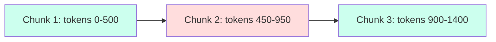
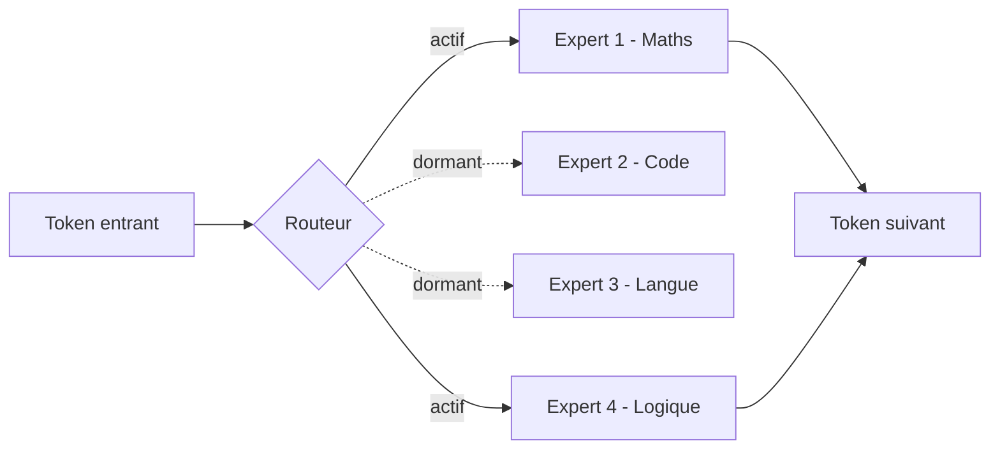
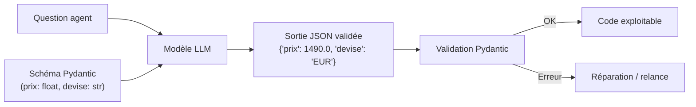
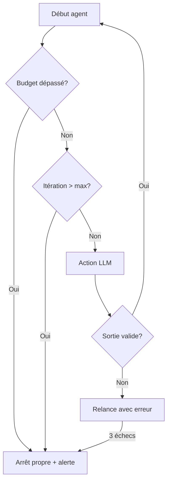

# Module 4 : Comprendre, Évaluer & Configurer les LLM pour les Agents IA

> [!ABSTRACT] Vision du Cours
> Ce cours enseigne, pour des **créateurs d'agents IA**, ce qu'est un LLM, comment il découpe et compte le texte, comment gérer son contexte et son coût, quels hyperparamètres régler, quelles architectures (Dense vs MoE) et quelles quantifications choisir, comment fiabiliser ses sorties et, enfin, comment **associer scientifiquement le bon LLM au bon rôle d'agent**. Aucun jargon mathématique : tout est illustré par analogies et cas d'usage.

> [!NOTE] 📑 Table des Matières
> - [[#1. 💡 Section 1 : La Théorie Accessible & Concepts Clés|1. Section 1 : La Théorie Accessible & Concepts Clés]]
>   - [[#1.1. Qu'est-ce qu'un LLM pour un Créateur d'Agents ?|1.1. Qu'est-ce qu'un LLM pour un Créateur d'Agents ?]]
>     - [[#1.1.1. Un moteur de génération linguistique auto-régressif|1.1.1. Un moteur de génération linguistique auto-régressif]]
>     - [[#1.1.2. La notion de Token : comment le LLM compte et découpe|1.1.2. La notion de Token : comment le LLM compte et découpe]]
>     - [[#1.1.3. Modèles de Base (Raw) vs Modèles Alignés (Instruction Following)|1.1.3. Modèles de Base (Raw) vs Modèles Alignés]]
>   - [[#1.2. La Tokenisation & Le Chunking (Découpage de Texte)|1.2. La Tokenisation & Le Chunking]]
>     - [[#1.2.1. Pourquoi découper le texte ?|1.2.1. Pourquoi découper le texte ?]]
>     - [[#1.2.2. Les stratégies de Chunking|1.2.2. Les stratégies de Chunking]]
>     - [[#1.2.3. La gestion du chevauchement (Overlap)|1.2.3. La gestion du chevauchement (Overlap)]]
>   - [[#1.3. La Fenêtre de Contexte & La Gestion des Coûts (FinOps)|1.3. La Fenêtre de Contexte & La Gestion des Coûts (FinOps)]]
>     - [[#1.3.1. Fenêtre d'Entrée (Input)|1.3.1. Fenêtre d'Entrée (Input)]]
>     - [[#1.3.2. Le risque d'oubli ("Lost in the Middle")|1.3.2. Le risque d'oubli ("Lost in the Middle")]]
>     - [[#1.3.3. Fenêtre de Sortie (Max Output Tokens)|1.3.3. Fenêtre de Sortie (Max Output Tokens)]]
>     - [[#1.3.4. Pourquoi les tokens de sortie coûtent plus cher|1.3.4. Pourquoi les tokens de sortie coûtent plus cher]]
>     - [[#1.3.5. Le Prompt Caching|1.3.5. Le Prompt Caching]]
>   - [[#1.4. Le Guide Pratique des Hyperparamètres|1.4. Le Guide Pratique des Hyperparamètres]]
>     - [[#1.4.1. Température — Régler la créativité vs le déterminisme|1.4.1. Température (Créativité vs Déterminisme)]]
>     - [[#1.4.2. Top_P — Contrôler la diversité de vocabulaire|1.4.2. Top_P (Diversité du vocabulaire)]]
>     - [[#1.4.3. Max Tokens — Sécuriser la longueur des réponses|1.4.3. Max Tokens (Sécuriser la longueur)]]
>     - [[#1.4.4. Stop Sequences — Marqueurs d'arrêt pour l'exécution d'outils|1.4.4. Stop Sequences (Marqueurs d'arrêt)]]
>     - [[#1.4.5. Seed — Reproductibilité pour les tests|1.4.5. Seed (Reproductibilité des tests)]]
> - [[#2. ⚡ Section 2 : Les Notions Avancées & Garde-Fous Opérationnels|2. Section 2 : Les Notions Avancées & Garde-Fous Opérationnels]]
>   - [[#2.1. Architectures : Modèles Denses vs MoE (Mixture of Experts)|2.1. Architectures : Denses vs MoE]]
>     - [[#2.1.1. Modèles Denses|2.1.1. Modèles Denses]]
>     - [[#2.1.2. Modèles MoE|2.1.2. Modèles MoE]]
>     - [[#2.1.3. Arbitrage pragmatique|2.1.3. Arbitrage pragmatique]]
>   - [[#2.2. Précision Numérique & Quantification|2.2. Précision Numérique & Quantification]]
>     - [[#2.2.1. Précision originale des poids|2.2.1. Précision originale (FP32, FP16, BF16)]]
>     - [[#2.2.2. Les formats de quantification|2.2.2. Formats (INT8, FP8, AWQ, GGUF)]]
>     - [[#2.2.3. Impact sur l'agent|2.2.3. Impact sur l'agent]]
>   - [[#2.3. Les Modèles de Raisonnement (Reasoning / Thinking Models)|2.3. Modèles de Raisonnement (Reasoning / Thinking)]]
>     - [[#2.3.1. Instruction directe vs réflexion préalable|2.3.1. Instruction directe vs réflexion préalable]]
>     - [[#2.3.2. Thinking Effort|2.3.2. Thinking Effort]]
>   - [[#2.4. Garantir la Fiabilité : La Structuration des Sorties|2.4. Garantir la Fiabilité : Structuration des Sorties]]
>     - [[#2.4.1. Le problème du texte libre|2.4.1. Le problème du texte libre]]
>     - [[#2.4.2. Sorties structurées (JSON & Pydantic)|2.4.2. Sorties structurées (JSON & Pydantic)]]
>     - [[#2.4.3. Gérer et réparer les erreurs de format|2.4.3. Gérer et réparer les erreurs de format]]
>   - [[#2.5. Grille d'Évaluation Scientifique & Benchmarks LLM pour Agents|2.5. Benchmarks LLM pour Agents]]
>     - [[#2.5.1. Benchmarks de Raisonnement & Culture|2.5.1. Raisonnement & Culture (MMLU-Pro, GPQA)]]
>     - [[#2.5.2. Benchmarks de Code & Génération|2.5.2. Code & Génération (SWE-bench)]]
>     - [[#2.5.3. Benchmarks Spécifiques aux Agents & Tooling|2.5.3. Agents & Tooling (BFCL, GAIA)]]
>     - [[#2.5.4. Classements indépendants|2.5.4. Classements indépendants]]
>   - [[#2.6. Contextualisation : Associer le Bon LLM au Bon Agent|2.6. Model-Matching : Associer le Bon LLM au Bon Agent]]
>     - [[#2.6.1. Le LLM dans le rôle de l'Agent|2.6.1. Rôles (Planificateur, Exécuteur, Synthétiseur)]]
>     - [[#2.6.2. La Matrice de Sélection d'Équipe|2.6.2. Matrice de Sélection d'Équipe]]
>     - [[#2.6.3. Les Guardrails indispensables|2.6.3. Guardrails indispensables]]
> - [[#3. 📊 Section 3 : Fiche Synthèse / Tableau Récapitulatif|3. Section 3 : Fiche Synthèse & Check-list]]
>   - [[#3.1. Matrice Récapitulative : Paramètres, Quantification & Choix par Rôle|3.1. Matrice Récapitulative]]
>   - [[#3.2. Check-list opérationnelle avant déploiement d'un LLM dans un Agent|3.2. Check-list opérationnelle]]
> - [[#4. Liens entre Notes|4. Liens entre Notes (Pied de page)]]

---

## 1. 💡 Section 1 : La Théorie Accessible & Concepts Clés

> [!INFO] Chapeau d'introduction
> Pour concevoir un agent IA performant, il ne suffit pas de le considérer comme un "assistant intelligent". Il faut en comprendre les rouages fondamentaux : comment il lit, comment il compte sa consommation, quelles sont ses limites physiques de mémoire et comment régler sa sensibilité. Cette première section pose le socle théorique indispensable à tout ingénieur système.

---

---

### 1.1. Qu'est-ce qu'un LLM pour un Créateur d'Agents ?

> [!INFO] Chapeau de sous-section
> Avant de connecter des outils informatiques à un modèle, comprenons la nature exacte du moteur que nous manipulons : ses principes de génération, la façon dont il découpe le texte et son niveau d'obéissance aux consignes.

#### 1.1.1. Un moteur de génération linguistique auto-régressif

Un **LLM** (*Large Language Model*) est un programme entraîné sur des milliards de textes dont la fonction unique est de **prédire le fragment de texte le plus probable** qui suit une entrée donnée. Il ne "pense" pas au sens humain ; il modélise des probabilités linguistiques.

Le terme **auto-régressif** signifie simplement que le modèle produit sa réponse **un fragment à la fois**, en réinjectant chaque fragment produit à la fin de son entrée pour calculer le suivant : *Prédire ➔ Ajouter ➔ Réinjecter ➔ Prédire*.

> [!TIP] Analogie
> Le LLM fonctionne comme un **clavier prédictif ultra-puissant** : à l'image de votre smartphone qui suggère le mot suivant, mais doté de la capacité de lire des milliers de pages avant de proposer la suite.

Pour un créateur d'agents, la conséquence est capitale : **l'agent ne "réfléchit" pas d'un bloc avant de répondre**. Il génère incrémentalement. C me pourquoi un cadrage initial strict (rôle, règles, format) est indispensable dès la première ligne du prompt.

*Puisque la génération auto-régressive produit du texte fragment par fragment, une question pratique se pose immédiatement : quelle est cette unité minimale de texte manipulée et facturée par le modèle ? C'est ici qu'intervient la notion de Token.*

---

#### 1.1.2. La notion de Token : comment le LLM compte et découpe

Le LLM ne voit ni des lettres ni des mots complets, mais des **tokens** : des fragments de mots d'environ 4 caractères générés par un algorithme de découpage (*tokenizer*). La **tokenisation** est la conversion du texte brut en une suite d'identifiants numériques manipulables par le modèle.

> 💡 **Règle empirique de conversion :**  
> **1 token ≈ 0,75 mot en français ou en anglais** (soit 100 tokens ≈ 75 mots).

Un mot long ou accentué en français (ex: *"anticonstitutionnellement"*) se découpe en plusieurs tokens, tandis qu'un mot court (ex: *"le"*) n'en forme qu'un seul. C'est la raison pour laquelle les API d'IA ne facturent pas au mot, mais au token réellement découpé.

> [!EXAMPLE]
> La phrase `"Je voudrais réserver une table"` se transforme en `[Je, voud, rais, réser, ver, une, table]` = 7 tokens pour 6 mots. Pour estimer rapidement un coût : **Nombre de mots × 1,3**.

*Comprendre le comptage des tokens est indispensable pour anticiper la facture et la vitesse d'exécution. Cependant, savoir compter le texte ne suffit pas : encore faut-il que le modèle comprenne la différence entre une histoire à inventer et un ordre strict à exécuter. C'est l'enjeu de la distinction entre modèles de base et modèles alignés.*

---

#### 1.1.3. Modèles de Base (Raw) vs Modèles Alignés (Instruction Following)

Un **modèle de base** (*Raw* ou *Foundation*) a uniquement appris à compléter du texte brut. Si vous lui donnez *"Il était une fois"*, il continue le conte. Mais si vous lui donnez une consigne (*"Résume ce texte"*), il risque simplement d'inventer d'autres consignes !

À l'inverse, un **modèle aligné** (*Instruction / Chat*) a subi un entraînement complémentaire (notamment via **RLHF** : *Reinforcement Learning from Human Feedback*) pour lui apprendre à **obéir à des ordres**, respecter des consignes et agir comme un assistant.

> [!WARNING] Règle d'or pour les agents
> Un agent **doit impérativement utiliser un modèle aligné** (`-instruct`, `-chat`). Brancher un modèle Raw sur un agent revient à demander à un auteur de fiction de jouer le rôle d'un logiciel comptable : il inventera des faits au lieu d'exécuter la tâche.

---

### 1.2. La Tokenisation & Le Chunking (Découpage de Texte)

> [!INFO] Chapeau de sous-section
> Une fois le modèle aligné sélectionné, l'agent est souvent confronté à une contrainte physique : les documents à analyser dépassent la capacité d'absorption immédiate du LLM. C'est là qu'intervient la stratégie de découpage du texte en blocs assimilables (Chunking).

#### 1.2.1. Pourquoi découper le texte ?

Le **chunking** (découpage) consiste à fractionner un document volumineux en morceaux plus petits (*chunks*). Cette technique est la brique de base du **RAG** (*Retrieval-Augmented Generation*), où l'agent recherche d'abord les morceaux pertinents dans une base de données avant de les transmettre au LLM.

> [!TIP] Analogie
> Tenter de faire lire un rapport de 300 pages en une seule fois au modèle équivaut à avaler un livre d'un coup. Le découper en **chapitres assimilables** permet à l'agent de traiter l'information sans étouffer sa mémoire.

*Une fois la nécessité du découpage admise, la question opérationnelle devient : selon quelle logique scientifique découper le texte sans en briser la continuité sémantique ? Plusieurs stratégies de chunking répondent à ce besoin.*

---

#### 1.2.2. Les stratégies de Chunking

Pour découper efficacement, plusieurs approches existent selon la nature de vos données. Certaines s'appuient sur la structure visuelle, d'autres sur des **embeddings** (des représentations vectorielles capturant le sens sémantique des phrases).

- **Taille fixe** (ex. tous les 500 tokens) : Très simple à coder, mais risque de couper au milieu d'une phrase essentielle.
- **Par paragraphe** : Respecte la structure naturelle du rédacteur. Excellent compromis.
- **Par phrase** : Extrêmement précis, mais multiplie le nombre de chunks à traiter.
- **Sémantique** : Regroupe les phrases partageant le même sens via des calculs de similarité vectorielle. C'est la méthode la plus intelligente, bien que plus coûteuse en calcul.

*Quelle que soit la stratégie retenue, découper un texte crée inévitablement des frontières artificielles entre les blocs. Pour éviter qu'une idée essentielle ne soit tronquée à la frontière de deux morceaux, on applique un mécanisme de chevauchement (Overlap).*

---

#### 1.2.3. La gestion du chevauchement (Overlap)

Lorsqu'on découpe un texte, une phrase située exactement sur la frontière entre deux morceaux risque de perdre son sens. Pour éviter cette amnésie aux bordures, on applique un **chevauchement** (*overlap*), qui réinjecte la fin du chunk 1 au début du chunk 2.



> [!TIP] Règle pratique
> Appliquez un overlap de **10 à 15 %** de la taille du chunk. Un chevauchement trop grand entraîne des redondances et gonfle inutilement votre facture d'API.

---

### 1.3. La Fenêtre de Contexte & La Gestion des Coûts (FinOps)

> [!INFO] Chapeau de sous-section
> Le découpage en chunks permet d'alimenter la mémoire de travail de l'agent. Mais comment cette mémoire est-elle gérée à l'échelle du modèle et quel est son impact financier ? C'est le domaine du FinOps, la maîtrise budgétaire appliquée aux LLM.

#### 1.3.1. Fenêtre d'Entrée (Input)

La **fenêtre de contexte** (*context window*) représente la quantité maximale de tokens (prompt système + documents RAG + historique + réponse) que le LLM peut traiter lors d'une même requête.

Si votre modèle accepte 128 000 tokens, cela semble immense. Cependant, remplir aveuglément cette mémoire déclenche un problème pernicieux.

*Remplir aveuglément cette fenêtre de contexte semble séduisant, mais plus le volume de données injecté augmente, plus l'attention du modèle devient inégale. Ce biais cognitif est documenté sous le nom de Lost in the Middle.*

---

#### 1.3.2. Le risque d'oubli ("Lost in the Middle")

Le phénomène du **Lost in the Middle** est une faiblesse structurelle des modèles de langage : ils prêtent une attention maximale au **début** et à la **fin** de leur fenêtre de contexte, mais ont tendance à "oublier" les informations situées au milieu.

> [!WARNING] Conséquence pour vos agents
> Bourrer le contexte "au cas où" dégrade la précision de votre agent. Si une consigne de sécurité ou une donnée RAG cruciale se retrouve noyée au milieu de 80 000 tokens, le modèle l'ignorera fréquemment. **Privilégiez un contexte court, trié et bien ordonné.**

*La dégradation de l'attention n'est pas le seul facteur à surveiller lors de la gestion du contexte : il faut également distinguer ce que le modèle lit de ce qu'il écrit. C'est la différence entre la fenêtre d'entrée et la fenêtre de sortie.*

---

#### 1.3.3. Fenêtre de Sortie (Max Output Tokens)

Distincte de la fenêtre d'entrée, la **fenêtre de sortie** limite la quantité maximale de tokens que le modèle peut générer en **une seule réponse**.

> [!EXAMPLE]
> Si votre agent rédige une synthèse de 5 000 tokens mais que son plafond de sortie est réglé à 4 000, la génération sera **coupée net au milieu d'une phrase**. La solution consiste à soit relever la limite de sortie, soit découper la rédaction en plusieurs sous-tâches.

*Cette séparation entre entrée et sortie n'est pas seulement conceptuelle, elle est au cœur du modèle économique des API : pourquoi la génération de sortie est-elle facturée nettement plus cher que la lecture d'entrée ?*

---

#### 1.3.4. Pourquoi les tokens de sortie coûtent plus cher

Dans la facture de votre fournisseur d'API, vous remarquerez que les tokens générés en sortie coûtent généralement **3 à 5 fois plus cher** que les tokens lus en entrée.

La raison est technique : pour lire l'entrée, le modèle parallélise ses calculs sur les GPU. Mais pour générer la sortie (processus auto-régressif), il doit calculer le token 1, puis le réinjecter pour calculer le token 2, et ainsi de suite. Ce calcul séquentiel monopolise les cartes graphiques beaucoup plus longtemps.

> [!TIP] Optimisation budgétaire
> Pour réduire vos coûts, imposez à vos agents des formats de réponse concis et structurés (JSON sans bavardage). Raccourcir la sortie est financièrement plus rentable que raccourcir l'entrée.

*Face au coût élevé du traitement répétitif des mêmes consignes (notamment les règles du System Prompt), les fournisseurs d'API ont développé un mécanisme d'optimisation majeure : le Prompt Caching.*

---

#### 1.3.5. Le Prompt Caching

Pour éviter de payer à chaque itération la lecture des mêmes consignes système, les fournisseurs d'API proposent le **Prompt Caching**. 

Cette technologie s'appuie sur la mise en mémoire intermédiaire (*KV cache*) des calculs d'attention des premiers tokens du prompt. Si le début de votre prompt (les règles de l'agent) ne change pas entre deux requêtes, le serveur réutilise le cache et vous accorde jusqu'à **90 % de réduction** sur ces tokens d'entrée.

---

### 1.4. Le Guide Pratique des Hyperparamètres

> [!INFO] Chapeau de sous-section
> Après avoir dimensionné le contexte et compris sa tarification, il reste à régler les "boutons de contrôle" du modèle : les hyperparamètres. Ce sont les réglages transmis lors de chaque appel d'API qui dictent la créativité, le vocabulaire et les limites du LLM.

#### 1.4.1. Température — Régler la créativité vs le déterminisme

La **température** (de `0.0` à `2.0`) modifie la distribution de probabilité lors du choix du token suivant :
- **À `0.0`** : Le modèle choisit systématiquement le token le plus probable. Le comportement devient **déterministe** et d'une rigueur absolue.
- **À `0.7` et plus** : Le modèle autorise des tirages moins probables, introduisant de la variété et de la **créativité**.

> [!WARNING] Règle d'or pour les agents
> Tout agent chargé d'appeler des outils, d'exécuter du code ou de produire du JSON doit impérativement fonctionner à **température 0.0**. L'aléatoire dans la syntaxe d'un appel système est un bug, pas une qualité.

*La température contrôle la variabilité globale des probabilités. Pour affiner encore plus le choix des mots en éliminant le vocabulaire rare ou hors-sujet, on utilise le paramètre complémentaire Top_P.*

---

#### 1.4.2. Top_P — Contrôler la diversité de vocabulaire

Le **Top_P** (*Nucleus Sampling*, de `0.0` à `1.0`) offre un contrôle complémentaire : il restreint le choix aux tokens dont la somme des probabilités atteint le seuil P.

> [!EXAMPLE]
> À `top_p=0.1`, pour compléter *"Le ciel est"*, le modèle conserve uniquement `"bleu"` (90%) et `"gris"` (8%), tout en ignorant totalement les mots rares. C'est le réglage idéal pour verrouiller le vocabulaire d'un agent de données.

*Si la température et le Top_P déterminent la diversité du style, il faut également garantir la sécurité physique de l'exécution en plafonnant la longueur totale de la réponse : c'est le rôle de Max Tokens.*

Le paramètre `max_tokens` fixe le plafond de sécurité des tokens générés pour une requête. Il évite qu'un agent parti sur une mauvaise piste ne consomme l'intégralité de votre crédit API en une seule réponse.

> [!EXAMPLE] Cas d'usage & calibrage pragmatique
> - **Agent Classificateur / Routeur** : `max_tokens = 50`. Une réponse de 3 mots suffit (`{"categorie": "facturation"}`). Autoriser 4 000 tokens risquerait de vous faire payer des explications inutiles si le modèle hallucine une dissertation.
> - **Agent Rédacteur de Synthèse** : `max_tokens = 2000`. Permet de générer un rapport complet sans risque de boucle infinie qui viderait le compte API en cas de bug.
> ```python
> # Exemple avec l'API OpenAI / LiteLLM
> response = client.chat.completions.create(
>     model="gpt-4o-mini",
>     messages=[{"role": "user", "content": "Classe ce ticket en un seul mot."}],
>     max_tokens=10  # Verrouille la réponse à 10 tokens maximum
> )
> ```

---

#### 1.4.4. Stop Sequences — Marqueurs d'arrêt pour l'exécution d'outils

Une **stop sequence** est une chaîne de caractères (ex. `</tool>` ou `OBSERVATION:`) qui ordonne au LLM d'arrêter immédiatement sa génération dès qu'il l'écrit.

Sans séquence d'arrêt, un agent qui vient de rédiger un ordre d'outil risque d'enchaîner en inventant lui-même la réponse de l'outil ! Le marqueur d'arrêt redonne instantanément la main à votre code d'orchestration.

> [!EXAMPLE] Exemple de boucle ReAct protégée
> Dans un protocole ReAct manuel, l'agent génère sa réflexion et son action :
> ```text
> Thought: Je dois chercher la météo de Paris.
> Action: get_weather("Paris")
> Observation: 
> ```
> En définissant `stop=["Observation:"]`, le LLM **s'arrête net** juste après avoir écrit `Observation:`. 
> Si on omettait cette stop sequence, le LLM continuerait tout seul en inventant la réponse : `Observation: Il fait 25°C et grand soleil à Paris` sans jamais laisser la vraie fonction Python s'exécuter !
> ```python
> response = client.chat.completions.create(
>     model="gpt-4o",
>     messages=[...],
>     stop=["Observation:", "</tool_call>"]  # Interrompt le LLM dès qu'il appelle un outil
> )
> ```

---

#### 1.4.5. Seed — Reproductibilité pour les tests

Le **seed** (graine aléatoire) permet d'initialiser le générateur du modèle. Combiné avec une température de `0.0`, un même `seed` garantit que le modèle renverra **exactement la même réponse au mot près** d'un test à l'autre. C'est l'outil indispensable pour debugger un pipeline agentique.

> [!EXAMPLE] Application en Test Unitaire & CI/CD
> En développement d'agents, vous souhaitez tester si une modification de prompt casse l'extraction de données sans subir la variabilité statistique du LLM :
> ```python
> # Test de non-régression déterministe
> response = client.chat.completions.create(
>     model="gpt-4o",
>     temperature=0.0,
>     seed=42,  # Fixe la graine aléatoire
>     messages=[{"role": "user", "content": "Extrais le montant JSON : 'Facture 12 : 450€'"}]
> )
> # Relancé 100 fois avec seed=42, le résultat sera 100% identique au bit près :
> # assert response.choices[0].message.content == '{"montant": 450}'
> ```

---

## 2. ⚡ Section 2 : Les Notions Avancées & Garde-Fous Opérationnels

> [!INFO] Chapeau d'introduction
> Une fois la théorie et les paramètres de base maîtrisés, l'ingénierie d'agents en production exige de faire des choix d'infrastructure avancés. Quelle architecture matérielle privilégier ? Comment réduire la mémoire VRAM sans casser la logique de l'agent ? Comment utiliser les modèles de réflexion (*Reasoning*) et fiabiliser la communication inter-agents ? Cette section détaille les arbitrages de niveau expert.

---

### 2.1. Architectures : Modèles Denses vs MoE (Mixture of Experts)

> [!INFO] Chapeau de sous-section
> Lors du choix d'un LLM pour un agent, on se heurte rapidement à un dilemme : les modèles légers sont rapides mais peu intelligents, tandis que les grands modèles sont très intelligents mais lents et coûteux. L'architecture interne du réseau de neurones permet de trancher ce compromis.

#### 2.1.1. Modèles Denses

Un modèle **Dense** active la **totalité de ses paramètres** (poids) pour chaque token généré. Si le modèle compte 70 milliards de paramètres, les 70 milliards effectuent un calcul à chaque mot.

> [!TIP] Analogie
> C'est l'équivalent d'une entreprise où **l'ensemble des employés** se réunit dans la même pièce pour répondre à la moindre question. La qualité est très homogène, mais le coût en fonctionnement est maximal.

*L'architecture dense offre une qualité homogène mais devient extrêmement gourmande en calculs à grande échelle. Pour contourner cette contrainte sans réduire le volume total de connaissances du modèle, les chercheurs ont créé les modèles MoE (Mixture of Experts).*

---

#### 2.1.2. Modèles MoE (Mixture of Experts)

Une architecture **MoE** découpe le réseau en plusieurs sous-réseaux spécialisés (les "experts"). Un **routeur interne** (*gate*) analyse chaque token et active uniquement 1 ou 2 experts pertinents. 

Ainsi, un modèle comme DeepSeek V3 possède 671 milliards de paramètres au total, mais n'en active que **37 milliards par token**.



*Comprendre le fonctionnement comparé des architectures Denses et MoE permet à l'architecte de procéder à un arbitrage pragmatique pour chaque rôle dans son équipe multi-agents.*

---

#### 2.1.3. Arbitrage pragmatique pour vos agents

- **Modèles Denses :** À réserver au rôle de **Stratège / Décideur final**, où chaque nuance compte et où le volume d'appels reste faible.
- **Modèles MoE :** Idéaux pour les agents d'**Exécution, de Scraping et de Routage**, qui effectuent des milliers d'appels quotidiens avec un besoin d'efficacité économique maximale.

---

### 2.2. Précision Numérique & Quantification

> [!INFO] Chapeau de sous-section
> Outre l'organisation des paramètres (Dense vs MoE), la précision avec laquelle chaque poids est codé en mémoire VRAM conditionne la vitesse d'exécution et le coût d'hébergement. C'est le domaine de la précision numérique et de la quantification.

#### 2.2.1. Précision originale des poids

À l'origine, les poids d'un modèle sont codés sous forme de nombres à virgule sur 16 ou 32 bits (**FP32**, **FP16**, **BF16**). Le format **BF16** (*Bfloat16*) est devenu le standard de l'industrie car il conserve la même amplitude dynamique que le FP32 tout en divisant la consommation mémoire par deux.

*Conserver la précision originale en 16 bits (FP16/BF16) garantit une fidélité maximale mais exige une mémoire VRAM colossale. Pour réduire cette empreinte matérielle, on recourt aux techniques de compression par quantification.*

---

#### 2.2.2. Les formats de quantification

La **quantification** consiste à compresser ces poids en les convertissant vers des formats d'empreinte plus faible (8 bits ou 4 bits).

| Format | Bits | Compression vs FP16 | Perte de précision | Usage recommandé |
|---|---|---|---|---|
| **INT8 / FP8** | 8 | ×2 | Quasiment nulle | Production standard pour agents |
| **AWQ** | 4 | ×4 | Optimisée (poids clés préservés) | Bon compromis mémoire / qualité |
| **GGUF** | 4-8 | Variable | Flexible | Exécution locale sur CPU/GPU mixte |

*Gagner de la vitesse et réduire l'empreinte mémoire grâce à la quantification est un avantage précieux, mais compresser les poids d'un modèle comporte un risque direct sur la fiabilité de l'agent.*

---

#### 2.2.3. Impact sur la fiabilité de l'agent

Si la quantification à 4 bits (INT4) permet de faire tourner de grands modèles sur des cartes graphiques modestes, elle dégrade la finesse de raisonnement.

> [!WARNING] Point de vigilance agent
> Une quantification trop agressive (INT4 basique) fait fréquemment dérailler le respect des formats JSON et la syntaxe des outils. Gardez vos agents exécuteurs et structurés en **FP16 ou INT8/FP8**.

---

### 2.3. Les Modèles de Raisonnement (Reasoning / Thinking Models)

> [!INFO] Chapeau de sous-section
> L'infrastructure matérielle et la précision des poids étant fixées, la question suivante concerne la méthode cognitive du modèle : doit-il répondre immédiatement du premier coup ou générer une réflexion interne préalable avant de conclure ?

#### 2.3.1. Instruction directe vs réflexion préalable

- **Modèles d'Instruction directe (ex: GPT-4o, Claude 3.5 Sonnet) :** Ils répondent immédiatement en générant leur réponse au premier jet.
- **Modèles de Raisonnement (ex: OpenAI o1/o3, DeepSeek R1) :** Avant de formuler leur réponse finale visible, ils génèrent d'abord une longue **chaîne de pensée interne** (*Thinking process*) pour explorer différentes hypothèses et vérifier leur propre logique.

> [!TIP] Analogie
> L'instruction directe correspond à un candidat répondant du tac-au-tac à l'oral. Le modèle de raisonnement prend une **feuille de brouillon**, pose ses équations, rature ses erreurs, puis livre son résultat propre.

*La capacité de réflexion préalable apporte un gain logique spectaculaire sur les problèmes complexes, mais elle consomme du temps et des tokens. Il est donc nécessaire de savoir doser cet effort de pensée grâce au réglage du Thinking Effort.*

---

#### 2.3.2. Le réglage du Thinking Effort

Les API modernes permettent de doser la longueur de ce brouillon interne via le paramètre `thinking_effort` (`low`, `medium`, `high`).

- Pour une tâche de simple extraction de texte ou de parsing : choisissez `low` (ou désactivez le thinking) pour préserver votre budget.
- Pour l'agent Stratège chargé de résoudre un problème d'architecture complexe : passez en `high`.

---

### 2.4. Garantir la Fiabilité : La Structuration des Sorties

> [!INFO] Chapeau de sous-section
> Même doté du meilleur modèle de raisonnement, un agent reste inexploitable pour un système informatique si ses réponses sont formulées sous forme de texte libre et imprévisible.

#### 2.4.1. Le problème du texte libre

Si un agent répond : *"Le prix identifié est de 1 490 € TTC avec une remise possible"*, votre code Python devra utiliser une expression régulière (*regex*) fragile pour extraire le chiffre. Si l'agent change une virgule ou la tournure de sa phrase le lendemain, votre pipeline d'automatisation plante.

*Pour éliminer cette fragilité liée au parsing de texte libre, l'architecture d'agents moderne exige l'utilisation de sorties structurées garanties par un schéma Pydantic et du JSON typé.*

---

#### 2.4.2. Sorties structurées (JSON & Pydantic)

Pour interconnecter des agents sans risque de casse, on exige des **sorties structurées**. En Python, on définit un schéma via la bibliothèque **Pydantic**, que l'on transmet au provider pour forcer le LLM à respecter une structure typée.



*Même si la structuration forcée garantit le format dans la majorité des cas, des erreurs de validation peuvent ponctuellement survenir. Il convient d'équiper l'agent d'une boucle de réparation automatique.*

---

#### 2.4.3. Gérer et réparer les erreurs de format

En cas d'échec de validation (ex. le LLM a renvoyé une chaîne au lieu d'un nombre), la bonne pratique consiste à réinjecter le message d'erreur précis de Pydantic dans l'appel suivant. L'agent comprend immédiatement sa faute de frappe et **corrige sa propre sortie**.

---

### 2.5. Grille d'Évaluation Scientifique & Benchmarks LLM pour Agents

> [!INFO] Chapeau de sous-section
> Pour choisir scientifiquement le modèle adapté à chaque rôle sans céder aux arguments marketing, il est nécessaire de s'appuyer sur des métriques standardisées : les benchmarks.

Pour choisir scientifiquement le modèle adapté à chaque rôle sans céder aux arguments marketing, il est nécessaire de s'appuyer sur des métriques standardisées : les **benchmarks**. 

Cependant, attention aux pièges : un modèle classé 1er sur un test de culture générale peut s'avérer incapable de formuler un appel d'outil JSON correct. Examinons les principales familles de benchmarks.

#### 2.5.1. Benchmarks de Raisonnement & Culture

Ces tests mesurent le socle de connaissances théoriques et la profondeur logique du modèle :
- **MMLU-Pro :** Évalue la culture générale et professionnelle académique (droit, médecine, économie). Reflète la largeur du savoir.
- **GPQA :** Questions de niveau doctorat en sciences pures. Mesure la profondeur d'expertise.
- **MATH / AIME :** Problèmes de mathématiques de compétition. Évalue la pure logique calculatoire.

*Les tests de culture générale et de logique pure (MMLU-Pro, GPQA) sont d'excellents indicateurs généraux, mais si votre agent doit manipuler ou générer du code informatique, il faut se tourner vers les benchmarks de génération de code.*

---

#### 2.5.2. Benchmarks de Code & Génération

Indispensables pour les agents qui doivent analyser ou produire du code source :
- **HumanEval / MBPP :** Évalue la rédaction de petites fonctions Python isolées.
- **SWE-bench :** Le test le plus realistic : il soumet de **vrais problèmes GitHub d'open-source** au modèle. Un bon score garantit que le modèle sait s'orienter dans un projet multi-fichiers.

*Le code et les mathématiques évaluent la puissance technique brute, mais ils ne mesurent pas la capacité d'un modèle à orchestrer des outils ou à suivre une boucle ReAct. C'est l'objet des benchmarks spécifiques aux agents.*

---

#### 2.5.3. Benchmarks Spécifiques aux Agents & Tooling

C'est la catégorie la plus importante pour notre métier de créateur d'agents :
- **BFCL (Berkeley Function Calling Leaderboard) :** Évalue la capacité exacte du modèle à **choisir le bon outil** et à formuler les bons arguments JSON sans hallucination. **C'est le benchmark n°1 à vérifier pour vos agents exécuteurs.**
- **GAIA :** Propose des missions complexes nécessitant la combinaison d'outils web, de calculs et de raisonnement multi-étapes.

*Pour suivre l'évolution constante des performances entre modèles commerciaux et open-source, l'architecte doit s'appuyer sur des classements indépendants mis à jour en temps réel.*

---

#### 2.5.4. Classements indépendants de référence

Pour suivre l'état de l'art en temps réel :
- **Artificial Analysis :** Le tableau de bord de référence qui croise la qualité, le prix par million de tokens et la vitesse (tokens/seconde).
- **LMSYS Chatbot Arena :** Évaluation par duels aveugles auprès d'utilisateurs humains (très axé sur la discussion générale).

---

### 2.6. Contextualisation : Associer le Bon LLM au Bon Agent

> [!INFO] Chapeau de sous-section
> Forts de cette grille de lecture complète (architectures, hyperparamètres, formats et benchmarks), nous pouvons aborder la phase finale d'assemblage : associer scientifiquement le bon LLM au bon rôle au sein de l'équipe.

#### 2.6.1. Le LLM dans le rôle de l'Agent

De même qu'une entreprise ne recrute pas le même profil pour la direction stratégique et pour la saisie de données, vous devez distribuer des LLM différents selon la responsabilité de chaque agent :
- **L'Agent Planificateur / Stratège :** Exige un grand modèle Dense ou Reasoning avec un fort score GPQA/SWE-bench.
- **L'Agent Exécuteur d'outils :** Exige un modèle réactif, économique et doté d'un score BFCL irréprochable.
- **L'Agent Rédacteur / Synthétiseur :** Exige une grande aisance rédactionnelle (MMLU-Pro) avec une température modérée.

*Cette répartition par profil métier se traduit concrètement dans une matrice de sélection qui fixe la configuration optimale de chaque agent.*

---

#### 2.6.2. La Matrice de Sélection d'Équipe

| Profil d'Agent | Modèle Type | Température | Quantification | Benchmark Clé |
|---|---|---|---|---|
| **Scraping / Recherche Web** | MoE ultra-rapide (ex: Haiku, DeepSeek MoE) | `0.0` | INT4 / AWQ / FP8 | BFCL & Vitesse |
| **Comptable / Parsing Data** | Modèle structuré (ex: GPT-4o-mini) | `0.0` | FP16 / INT8 | BFCL & MATH |
| **Rédacteur de Contenu** | Modèle fluide (ex: Claude 3.5 Sonnet) | `0.7` | INT8 / FP16 | MMLU-Pro |
| **Stratège / Architecte** | Modèle Reasoning / Grand Dense (ex: o1, Sonnet 3.5) | `0.2` (ou Thinking) | FP16 | GPQA & SWE-bench |

*Même avec une matrice d'équipe parfaitement dimensionnée, aucun agent ne doit opérer sans un cadre de protection automatisé : les guardrails d'exécution.*

---

#### 2.6.3. Les Guardrails indispensables

Quel que soit le modèle choisi, aucun agent ne doit être déployé sans un cadre de protection automatisé :



- **Budget Guard :** Verrouille la dépense maximale autorisée par exécution (ex. arrêt spécialisé si la tâche dépasse 15$).
- **Max Iterations :** Limite le nombre de boucles ReAct pour stopper les agents bloqués dans des recherches infinies.

---

## 3. 📊 Section 3 : Fiche Synthèse / Tableau Récapitulatif

> [!INFO] Chapeau d'introduction
> Cette dernière section résume l'intégralité du module sous forme d'outils opérationnels directement utilisables lors de la phase de conception : un tableau de synthèse des réglages par rôle et une check-list de contrôle avant la mise en production.

---

### 3.1. Matrice Récapitulative : Paramètres, Quantification & Choix par Rôle

| Rôle d'agent | Temp | Top_P | Max Tokens | Thinking | Quantif. conseillée | Benchmark cible |
|---|---|---|---|---|---|---|
| **Scraping / web** | 0.0 | 1.0 | 512 | Low | INT4 / AWQ | BFCL, latence |
| **Data / comptable** | 0.0 | 1.0 | 2 000 | Low | FP16 / INT8 | BFCL, MATH |
| **Rédacteur** | 0.7 | 0.95 | 4 000 | Low | INT8 | MMLU-Pro |
| **Stratège / décideur** | 0.2 | 1.0 | 4 000 | High | FP16 (Dense) | GPQA, MATH, BFCL |
| **Codeur** | 0.0 | 1.0 | 4 000 | Medium | FP16 / INT8 | SWE-bench, BFCL |
| **MoE / économique** | 0.0 | 1.0 | 1 500 | Low | Natif (déjà léger) | BFCL, prix/token |

*Une fois la matrice récapitulative consultée pour choisir les paramètres de chaque agent, l'étape ultime avant le déploiement consiste à passer votre configuration au cribles des 7 points de contrôle de la check-list.*

---

### 3.2. Check-list opérationnelle avant déploiement d'un LLM dans un Agent

> [!SUCCESS] Les 7 points de contrôle
> 1. **Modèle aligné confirmé :** Le modèle possède la mention `-instruct` ou `-chat` (jamais un modèle Raw).
> 2. **Fenêtre de contexte validée :** Le total *(entrée + sortie attendue)* n'excède pas 70 % de la taille maximale de fenêtre.
> 3. **Hyperparamètres cohérents :** `temperature=0.0` pour tout agent d'action ou de données ; des `stop sequences` sont définies pour stopper la génération lors de l'appel des outils.
> 4. **Sortie structurée étanche :** La réponse est validée par un schéma Pydantic avec mécanisme de relance plafonné à 3 essais en cas d'erreur.
> 5. **Garde-fous d'arrêt actifs :** Un plafond budgétaire (*Budget Guard*) et un nombre maximal d'itérations (`max_iter`) sont configurés.
> 6. **Prompt Caching configuré :** Le prompt système fixe est placé au tout début de la requête pour exploiter la mise en cache du provider.
> 7. **Benchmark validé pour le rôle :** Le modèle a été vérifié sur le BFCL pour l'outillage ou sur SWE-bench pour le code.

---

> [!QUOTE] Principe final
> Un LLM ne se "choisit" pas au hasard : il se **spécialise par rôle**. La performance globale d'un système agentique tient moins à la taille brute de son modèle qu'à la **cohérence** entre ses hyperparamètres, son architecture, sa quantification, sa structuration de sortie et la tâche précise qu'on lui confie.

---

## 4. Liens entre Notes
- Aller au [[00_MOC_MAITRISE_AGENTS_IA]]
- Fiche précédente : [[03_Architectures_Multi_Agents_Et_Topologies]]
- Fiche suivante : [[05_Tool_Engineering_et_Standard_MCP]]
