# Module 6 : Le RAG & Graph RAG Masterclass

> [!ABSTRACT] Vision du Cours
> Un Modèle de Langage (LLM) sans RAG est un érudit amnésique : il possède une culture générale colossale mais ne connaît ni vos documents d'entreprise, ni vos données financières récentes, ni vos processus internes secrets. Le **RAG** (*Retrieval-Augmented Generation*) et sa version évoluée le **Graph RAG** sont la passerelle industrielle qui connecte le cerveau statistique de l'IA à la mémoire vivante de votre organisation sans ré-entraîner le modèle. Ce module enseigne la théorie accessible de la vectorisation, le pipeline RAG naïf, puis les stratégies avancées (*Parent-Child*, *HyDE*, *Re-ranking*, *Recherche Hybride BM25+Vecteurs*, *RAG Multimodal*, *RBAC & Sécurité Multi-Tenant*), l'architecture **Graph RAG** et l'**Agentic RAG**, pour finir par les métriques d'évaluation scientifique. Aucun jargon mathématique inutile : chaque concept est illustré par une explication limpide, une analogie du monde réel et un cas d'usage agentique concret.

> [!NOTE] 📑 Table des Matières
> - [[#1. 💡 Section 1 : La Théorie Accessible & Concepts Clés|1. Section 1 : La Théorie Accessible & Concepts Clés]]
>   - [[#1.1. Qu'est-ce que le RAG (Retrieval-Augmented Generation) ?|1.1. Qu'est-ce que le RAG ?]]
>     - [[#1.1.1. Définition simple : Connecter les LLM et les Agents aux bases de connaissances privées sans ré-entraîner le modèle (Zero Fine-Tuning)|1.1.1. Définition simple & Zero Fine-Tuning]]
>     - [[#1.1.2. Le problème résolu : Éliminer les hallucinations, surmonter la limite de date de connaissance et sécuriser la confidentialité|1.1.2. Le problème résolu]]
>     - [[#1.1.3. La métaphore de l'étudiant à un examen : Passer d'un examen à livre fermé à un examen à livre ouvert|1.1.3. La métaphore de l'examen à livre ouvert]]
>   - [[#1.2. Le Pipeline RAG Naïf (Les 3 Étapes Fondamentales)|1.2. Le Pipeline RAG Naïf]]
>     - [[#1.2.1. L'Ingestion & Indexation : Extraction des documents, découpage (Chunking), vectorisation (Embeddings) et stockage en Base Vectorielle|1.2.1. L'Ingestion & Indexation]]
>     - [[#1.2.2. La Recherche (Retrieval) : Transformer la requête de l'agent en vecteur et trouver les K morceaux les plus similaires|1.2.2. La Recherche (Retrieval)]]
>     - [[#1.2.3. La Génération (Generation) : Injecter les morceaux récupérés dans le prompt du LLM pour produire une réponse ancrée|1.2.3. La Génération (Grounded Answer)]]
>   - [[#1.3. Les Fondations Vectorielles & Bases de Données Vectorielles|1.3. Les Fondations Vectorielles]]
>     - [[#1.3.1. La notion d'Embedding : Représenter le sens sémantique d'un texte sous forme de coordonnées numériques|1.3.1. La notion d'Embedding]]
>     - [[#1.3.2. Mesurer la similarité : Distance cosinus, produit scalaire et distance euclidienne|1.3.2. Mesurer la similarité]]
>     - [[#1.3.3. Fonctionnement d'une Base Vectorielle : Indexation rapide par graphes d'adjacence (HNSW) et recherche par plus proches voisins (ANN)|1.3.3. Fonctionnement d'une Base Vectorielle]]
>   - [[#1.4. L'Évolution vers le Graph RAG|1.4. L'Évolution vers le Graph RAG]]
>     - [[#1.4.1. Les limites du RAG vectoriel classique : Échec sur les questions holistiques et relationnelles|1.4.1. Les limites du RAG vectoriel]]
>     - [[#1.4.2. Définition du Graph RAG : Combiner les Graphes de Connaissances et la recherche vectorielle|1.4.2. Définition du Graph RAG]]
>     - [[#1.4.3. Construction d'un Graphe de Connaissances : Extraction d'Entités, de Relations, détection de communautés (Leiden / Louvain) et résumés hiérarchiques|1.4.3. Construction du Graphe & Algorithmes Leiden/Louvain]]
> - [[#2. ⚡ Section 2 : Les Notions Avancées & Garde-Fous Opérationnels|2. Section 2 : Notions Avancées & Garde-Fous Opérationnels]]
>   - [[#2.1. Les Stratégies Avancées de Recherche & Ingestion (Advanced RAG)|2.1. Les Stratégies Avancées (Advanced RAG)]]
>     - [[#2.1.1. Stratégies de Chunking Avancées : Parent-Child / Small-to-Big Retrieval & Sentence Window Retrieval|2.1.1. Chunking Avancé (Parent-Child & Small-to-Big)]]
>     - [[#2.1.2. Pre-Retrieval : Reformulation de requête, expansion et HyDE (Hypothetical Document Embeddings)|2.1.2. Pre-Retrieval & HyDE]]
>     - [[#2.1.3. Post-Retrieval : Ré-ordonnancement (Re-ranking / Cross-Encoders) & Compression de contexte|2.1.3. Post-Retrieval & Re-ranking]]
>   - [[#2.2. Recherche Hybride & RAG Multimodal|2.2. Recherche Hybride & RAG Multimodal]]
>     - [[#2.2.1. La Recherche Hybride : Fusionner la recherche sémantique (Vecteurs) et la recherche exacte (BM25) via Reciprocal Rank Fusion (RRF)|2.2.1. Recherche Hybride (BM25 + Vecteurs & RRF)]]
>     - [[#2.2.2. Le RAG Multimodal : Traiter les PDF complexes contenant du texte, des tableaux financiers et des graphiques|2.2.2. Le RAG Multimodal (PDFs & Tableaux)]]
>   - [[#2.3. Sécurité, Confidentialité & Contrôle d'Accès dans le RAG|2.3. Sécurité, Confidentialité & Contrôle d'Accès]]
>     - [[#2.3.1. Contrôle d'accès basé sur les rôles (RBAC in RAG)|2.3.1. Contrôle d'accès RBAC]]
>     - [[#2.3.2. Isolation multi-locataires (Multi-Tenant Isolation)|2.3.2. Isolation multi-locataires]]
>   - [[#2.4. L'Agentic RAG : Le RAG Piloté par les Agents IA|2.4. L'Agentic RAG]]
>     - [[#2.4.1. Le RAG comme Outil (RAG as a Tool) vs L'Agent Auto-Correcteur (Corrective RAG / CRAG)|2.4.1. RAG as a Tool vs CRAG]]
>     - [[#2.4.2. L'Agent Évaluateur de Contexte : Auto-évaluation, repli web et reformulation|2.4.2. L'Agent Évaluateur de Contexte]]
>     - [[#2.4.3. Routage multi-index : Sélection dynamique de la base de connaissances|2.4.3. Routage multi-index]]
>   - [[#2.5. Évaluation & Métriques Scientifiques d'un Système RAG|2.5. Évaluation & Métriques RAG]]
>     - [[#2.5.1. Le Trièdre d'Évaluation de la Qualité RAG : Fidélité, Pertinence de la réponse, Précision & Rappel du contexte|2.5.1. Le Trièdre d'Évaluation (Ragas Framework)]]
> - [[#3. 📊 Section 3 : Fiche Synthèse / Tableau Récapitulatif|3. Section 3 : Fiche Synthèse & Check-list]]
>   - [[#3.1. Matrice Comparative des Architectures RAG|3.1. Matrice Comparative des Architectures RAG]]
>   - [[#3.2. Check-list opérationnelle de l'Architecte RAG pour Agents IA|3.2. Check-list opérationnelle]]
> - [[#4. Liens entre Notes|4. Liens entre Notes]]

---

## 1. 💡 Section 1 : La Théorie Accessible & Concepts Clés

> [!INFO] Chapeau de la Section 1
> Avant de concevoir des agents capables d'interroger des millions de documents d'entreprise, il faut maîtriser la physique fondamentale de l'information sémantique. Cette première section pose les bases conceptuelles du RAG classique : la transition du modèle passif à l'ancrage documentaire, la mécanique des trois étapes du pipeline naïf (Ingestion, Recherche, Génération), la géométrie des espaces vectoriels et enfin l'émergence des graphes de connaissances avec le Graph RAG pour résoudre les questions globales.

---

### 1.1. Qu'est-ce que le RAG (Retrieval-Augmented Generation) ?

> [!INFO] Chapeau de sous-section
> Le RAG est le composant architectural qui permet à un modèle de langage d'accéder à des connaissances externes dynamiques et privées au moment précis où il génère une réponse, sans jamais modifier les poids internes du réseau de neurones.

---

#### 1.1.1. Définition simple : Connecter les LLM et les Agents aux bases de connaissances privées sans ré-entraîner le modèle (Zero Fine-Tuning)

Le **RAG** (*Retrieval-Augmented Generation*, ou Génération Augmentée par Récupération) est un motif d'architecture logicielle qui consiste à associer deux briques distinctes : un **système de recherche d'information** (*Retrieval*) et un **modèle de langage** (*Generation*).

Lorsqu'un agent IA reçoit une question, au lieu de solliciter immédiatement la mémoire interne du LLM, l'architecture RAG commence par **extraire les morceaux de documents les plus pertinents** depuis une base de connaissances externe. Ces morceaux de texte sont ensuite insérés directement dans la fenêtre de contexte du prompt envoyé au LLM. Le modèle de langage n'a plus qu'à lire ces documents frais pour formuler sa réponse.

La force majeure du RAG réside dans le principe de **Zero Fine-Tuning** : on ne ré-entraîne pas le LLM et on n'en modifie aucun poids mathématique. Entraîner ou *fine-tuner* un LLM coûte des milliers d'euros, prend des jours et fige à nouveau la connaissance à la date du réglage. Le RAG, à l'inverse, permet de mettre à jour la mémoire de l'agent **en temps réel** : il suffit d'ajouter, modifier ou supprimer un document dans la base de données externe pour que l'agent en soit instantanément informé lors de la requête suivante.

> [!TIP] Analogie
> Le **Fine-Tuning**, c'est envoyer un médecin suivre cinq ans d'études universitaires complémentaires à chaque fois qu'un nouveau médicament sort sur le marché. Le **RAG**, c'est donner à ce même médecin un accès instantané à la banque de données du Vidal sur sa tablette : il lit la fiche du nouveau médicament au moment exact où le patient entre dans son cabinet.

> [!EXAMPLE] Cas d'usage agentique concret
> Un **Agent Support Client B2B** pour un éditeur de logiciel SaaS. La documentation produit évolue chaque semaine avec de nouvelles fonctionnalités. Au lieu de payer un fine-tuning mensuel coûteux du modèle, l'agent utilise un RAG : dès qu'un développeur pousse une mise à jour dans la base documentaire Notion, l'agent support cite la nouvelle procédure exacte trois secondes plus tard.

*Comprendre que le RAG alimente le modèle en connaissances fraîches mène naturellement à analyser les trois faiblesses majeures des LLM nus que cette architecture vient éradiquer.*

---

#### 1.1.2. Le problème résolu : Éliminer les hallucinations, surmonter la limite de date de connaissance et sécuriser la confidentialité

L'intégration d'une architecture RAG résout simultanément **trois des plus grands défis opérationnels** qui empêchent le déploiement des LLM nus en entreprise :

1. **L'élimination des hallucinations** : Un LLM isolé est un moteur de plausibilité statistique. Quand il ne connaît pas une réponse, son mécanisme auto-régressif invente un fait plausible. En lui fournissant les documents réels dans le prompt et en lui ordonnant : *"Réponds EXCLUSIVEMENT en appuyant ta réponse sur les extraits ci-joints"*, on transforme le travail d'invention du LLM en un travail de **synthèse sous contrainte**.
2. **Le dépassement de la date de coupure (*Knowledge Cut-Off*)** : Tous les LLM ont une date limite d'entraînement (ex: janvier 2025). Tout événement, loi, produit ou rapport financier postérieur à cette date est inconnu du modèle brut. Le RAG injecte les données du jour même (août 2026) sans restriction.
3. **La sécurité de la confidentialité des données** : Envoyer des documents confidentiels d'entreprise (bilans, secrets industriels) pour fine-tuner un modèle commercial hébergé chez un tiers expose ces données à des risques de fuite dans les poids du modèle. Avec le RAG, les données restent stockées dans **votre infrastructure sécurisée** (base vectorielle interne) et ne sont transmises au LLM qu'au compte-gouttes, sous forme d'extraits éphémères nécessaires à une seule réponse.

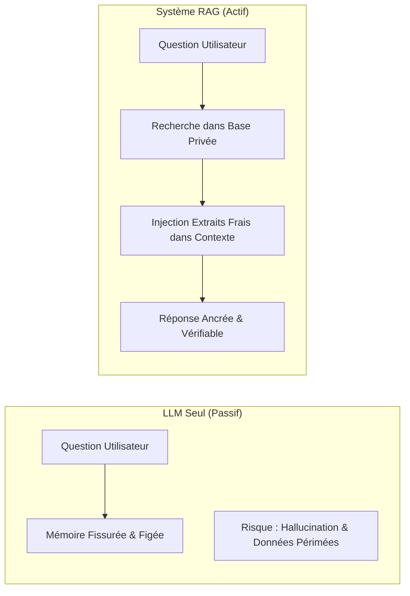

> [!TIP] Analogie
> L'avocat qui plaide un dossier au tribunal : sans ses notes, il plaide de mémoire et risque de confondre les dates ou les chiffres (*Hallucination*). Avec le RAG, il a les **pièces officielles du dossier posées ouvertes devant lui** sur le pupitre : chaque phrase qu'il prononce s'appuie sur la pièce n°3 du dossier.

> [!WARNING] Idée reçue dangereuse
> Le RAG ne "rend pas le LLM plus intelligent" ; il lui fournit des **preuves factuelles vérifiables**. Si le document injecté est faux ou incomplet, la réponse du LLM sera fausse ou incomplète. Le RAG déplace le problème de l'intelligence artificielle vers l'**ingénierie de la qualité des données**.

*Cette triple résolution s'illustre de manière d'autant plus évidente qu'on la compare à la situation d'un étudiant passant un examen.*

---

#### 1.1.3. La métaphore de l'étudiant à un examen : Passer d'un examen à livre fermé à un examen à livre ouvert

Pour saisir la différence fondamentale de posture cognitive entre un LLM seul, un LLM fine-tuné et un LLM augmenté par RAG, la meilleure image est celle de l'examen universitaire.

- **Le LLM seul** passe un **examen à livre fermé** : il doit répondre à toutes les questions complexes de mémoire pure. S'il a un trou de mémoire ou si la question porte sur un décret voté ce matin, il doit deviner ou échouer.
- **Le LLM Fine-tuné** est un étudiant qu'on a forcé à **réviser toute la nuit** avant l'examen pour apprendre un nouveau livre par cœur. Il est fatigué, cela a coûté très cher en cours particuliers, et si le livre contient une erreur, il faut lui refaire passer toute la nuit de révision.
- **L'Agent avec RAG** passe un **examen à livre ouvert** avec un bibliothécaire ultra-rapide à ses côtés. Quand une question arrive, le bibliothécaire (*Retrieval*) va chercher les deux pages exactes du bon manuel, les pose ouvertes sur la table devant l'étudiant (*Context Injection*), et l'étudiant (*LLM Generation*) n'a plus qu'à lire ces deux pages pour rédiger une réponse exacte, sourcée et sans trou de mémoire.

> [!TIP] Analogie
> **Le livre ouvert avec le bibliothécaire** : Au lieu de vous forcer à retenir par cœur les 10 000 pages des encyclopédies d'une bibliothèque, le bibliothécaire vous amène directement la fiche exacte sur votre table de travail au moment précis où vous posez votre question.

> [!EXAMPLE] Cas d'usage agentique concret
> Un **Agent Juridique d'Entreprise** chargé d'analyser la conformité des contrats avec le RGPD et les nouvelles réglementations IA de 2026. L'agent utilise le RAG : à chaque question d'un juriste, le système extrait les articles de loi applicables et les clauses modèles de l'entreprise. L'agent rédige sa note d'analyse en citant expressément l'article de loi et le paragraphe du contrat.

*Maintenant que la philosophie et les avantages du RAG sont clarifiés, observons la mécanique précise qui compose le pipeline RAG naïf en trois étapes.*

---

### 1.2. Le Pipeline RAG Naïf (Les 3 Étapes Fondamentales)

> [!INFO] Chapeau de sous-section
> Le pipeline RAG classique, dit "naïf", s'articule autour d'une séquence linéaire de trois phases indissociables : l'Ingestion (préparation hors-ligne), la Recherche (extraction au fil de l'eau) et la Génération (synthèse ancrée).

Le fonctionnement de tout système RAG repose sur une architecture en deux temps : un **traitement préparatoire asynchrone** (l'Ingestion) et un **traitement synchrone à la requête** (Recherche & Génération).

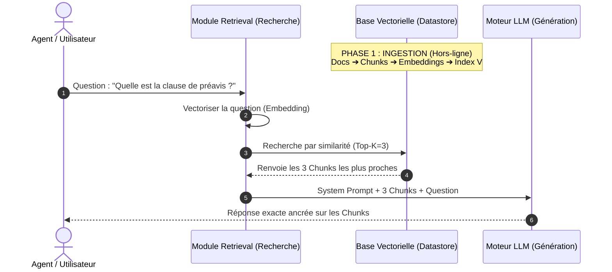

---

#### 1.2.1. L'Ingestion & Indexation : Extraction des documents, découpage (Chunking), vectorisation (Embeddings) et stockage en Base Vectorielle

L'**Ingestion** est la phase de préparation qui transforme des fichiers bruts (PDF, fichiers Word, pages Notion, bases de données) en une structure de données interrogeable à la milliseconde par des algorithmes mathématiques. Elle se déroule en quatre sous-étapes :

1. **L'Extraction de texte (*Parsing*)** : Le système lit les fichiers sources (ex. un PDF de 100 pages) et en extrait le texte brut en éliminant le code de mise en page inutile.
2. **Le Découpage (*Chunking*)** : Un document de 100 pages ne peut pas être vectorisé d'un seul bloc sans perdre toute sa précision sémantique. On le découpe en petits morceaux appelés **chunks** (ex. des blocs de 300 à 500 tokens). Comme vu au Module 4, on applique un **chevauchement (*overlap*)** de 10 à 15 % entre deux chunks consécutifs pour ne pas couper une phrase clé au milieu.
3. **La Vectorisation (*Embeddings*)** : Chaque chunk de texte est envoyé à un modèle spécialisé (*Embedding Model*, ex: `text-embedding-3-small` d'OpenAI ou `bge-large-en`). Ce modèle convertit le texte en un vecteur — une liste de 1 536 nombres flottants représentant le sens sémantique exact du chunk.
4. **Le Stockage & Indexation** : Les morceaux de texte brut, leurs métadonnées (nom du fichier, numéro de page, date) et leurs vecteurs d'embeddings sont enregistrés dans une **Base de Données Vectorielle** (ex. ChromaDB, Qdrant, Pinecone, Pgvector).

> [!TIP] Analogie
> L'ingestion est l'équivalent du travail d'un **archiviste municipal** : il reçoit des registres de 1 000 pages, découpe chaque fait marquant sur une fiche bristol (*chunk*), colle au dos de la fiche une étiquette avec ses coordonnées d'indexation (*embedding*), et classe la fiche dans le bon tiroir du meuble d'archives (*vector database*).

*Une fois les documents découpés et stockés dans la base vectorielle lors de l'ingestion, découvrons la deuxième étape du pipeline : la recherche sémantique du bon extrait.*

---

#### 1.2.2. La Recherche (Retrieval) : Transformer la requête de l'agent en vecteur et trouver les K morceaux les plus similaires

Lorsqu'un agent IA pose une question (ex. *"Quel est le montant de la franchise d'assurance en cas de dégât des eaux ?"*), le composant de **Recherche** entre en action de manière totalement transparente :

1. La question en langage naturel est envoyée au **même modèle d'embedding** que celui utilisé lors de l'ingestion. La question devient elle aussi un vecteur de 1 536 dimensions.
2. La base de données vectorielle effectue une **recherche de similarité sémantique** (*Similarity Search*) : elle compare le vecteur de la question avec les millions de vecteurs de chunks stockés en mémoire.
3. La base renvoie les **$K$ morceaux les plus proches** géométriquement (souvent $K = 3$ à $5$). Ces morceaux sont appelés le **contexte extrait** (*retrieved context*).

> [!TIP] Analogie
> **L'aimant sémantique** : La question agit comme un aimant sémantique puissant plongé dans un grand bac de fiches textuelles. L'aimant n'attire pas les fiches qui contiennent la même couleur d'encre, mais celles dont le thème magnétique est le plus proche.

> [!WARNING] Le piège de la recherche vectorielle pure
> La recherche vectorielle cherche la **proximité de sens**, pas les mots exacts. Si la question contient un code référence strict (ex: `REF-2026-99X`), la recherche vectorielle pure peut passer à côté du bon chunk s'il n'a pas été capté sémantiquement. C'est pour résoudre ce problème qu'on utilise la recherche hybride (Section 2.2.1).

*Après avoir isolé les quelques extraits les plus pertinents lors de la phase de recherche, étudions la troisième et dernière étape : la génération de la réponse ancrée par le LLM.*

---

#### 1.2.3. La Génération (Generation) : Injecter les morceaux récupérés dans le prompt du LLM pour produire une réponse ancrée

Une fois les $K$ chunks pertinents récupérés par le composant de recherche, l'orchestrateur assemble le prompt final qui sera soumis au LLM de génération. Ce prompt suit l'anatomie du Prompt Parfait vue au Module 2 :

```text
================ SYSTEM PROMPT (Cadre & Règles d'Or) ================
Tu es un Agent Expert en Assurance. Réponds à la question de l'utilisateur
en t'appuyant EXCLUSIVEMENT sur les extraits de documents fournis ci-dessous.
Si l'information n'est pas présente dans les extraits, réponds exactement :
"Information non disponible dans les documents de l'entreprise."
N'invente AUCUN fait et ne fais AUCUNE supposition.

================ CONTEXTE EXTRAIT (Retrieved Chunks) ================
<document index="1" source="Contrat_Assurance_2026.pdf" page="14">
Section 4.2 : En cas de sinistre lié à un dégât des eaux, la franchise légale
fixe restant à la charge de l'assuré s'élève à 150 euros TTC.
</document>

================ QUESTION UTILISATEUR ================
Quel est le montant de la franchise pour un dégât des eaux ?
```

Le LLM lit ce prompt composite, extrait l'information présente dans la balise `<document>` et formule une réponse claire, fluide et ancrée : *"Le montant de la franchise restant à votre charge en cas de dégât des eaux est de 150 € TTC (Source : Contrat_Assurance_2026.pdf, page 14)."*

> [!TIP] Analogie
> **Le secrétaire de séance consciencieux** : Il ne rédige pas le compte-rendu d'après ses souvenirs personnels de la réunion, mais recopie les faits exacts notés au sous-main par les participants.

> [!EXAMPLE] Cas d'usage agentique concret
> Un **Agent RH Onboarding** qui répond aux nouvelles recrues. Quand un employé demande *"Combien de jours de RTT ai-je droit par an ?"*, l'agent n'utilise pas ses connaissances générales sur le droit du travail français : le RAG extrait la convention collective précise de l'entreprise (ex. 12 jours), et l'agent répond avec le chiffre exact de la société.

*Pour comprendre comment la recherche vectorielle parvient à retrouver ce texte parmi des millions de phrases en quelques millisecondes, il faut ouvrir le capot des espaces vectoriels.*

---

### 1.3. Les Fondations Vectorielles & Bases de Données Vectorielles

> [!INFO] Chapeau de sous-section
> La magie sémantique du RAG repose sur une représentation mathématique intuitive du langage : la conversion de mots et de phrases en points géométriques au sein d'une carte d'idées à plusieurs dimensions.

---

#### 1.3.1. La notion d'Embedding : Représenter le sens sémantique d'un texte sous forme de coordonnées numériques

Un **Embedding** (ou plongement sémantique) est la représentation d'un texte sous la forme d'une **liste de coordonnées numériques** (un vecteur) dans un espace sémantique.

L'idée fondamentale des embeddings est que **des textes qui ont un sens similaire sont placés proches les uns des autres dans cet espace géométrique**, même s'ils n'utilisent aucun mot en commun.

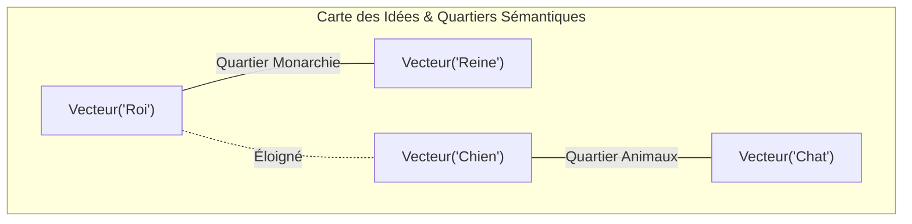

Par exemple, dans un espace d'embedding de qualité :
- Le vecteur de *"Monogramme de la société"* sera géométriquement très proche du vecteur de *"Logo de l'entreprise"*, car ils partagent le même concept sémantique.
- À l'inverse, le vecteur de *"Recette de la tarte aux pommes"* sera projeté dans un quartier totalement opposé de l'espace.

> [!TIP] Analogie
> **La carte géographique des idées** : Imaginez une carte où les villes ne sont pas classées par latitude et longitude, mais par thématique : le quartier "Finances" regroupe les mots *argent, chiffre d'affaires, bilan, banque* ; le quartier "Cuisine" regroupe *tarte, four, farine, recette*. Deux phrases voisines sur cette carte parlent exactement du même sujet.

*Une fois les mots positionnés sur cette carte sémantique géante, voyons comment la base de données mesure la distance d'orientation entre deux phrases.*

---

#### 1.3.2. Mesurer la similarité : Distance cosinus, produit scalaire et distance euclidienne

Une fois que les textes et les questions sont convertis en vecteurs (points sur la carte sémantique), comment la base de données mesure-t-elle si deux phrases sont proches ? Elle utilise des outils de mesure d'orientation :

1. **La Distance Cosinus (*Cosine Similarity*)** : C'est la mesure reine en RAG. Elle ne compte pas les mètres entre deux points, mais **l'angle formé par la direction des deux phrases**. Si les deux phrases pointent vers le même quartier sémantique, l'orientation est identique (score de `1.0`). Si elles n'ont aucun rapport, elles forment un angle droit (score de `0.0`).
2. **Le Produit Scalaire (*Dot Product*)** : Mesure à la fois la direction et la longueur des phrases. Ultra-rapide pour les calculs informatiques.
3. **La Distance Euclidienne ($L2$)** : Mesure la distance en ligne droite ("à la règle") entre deux points.

| Métrique | Tolère les différences de longueur de texte ? | Vitesse | Usage recommandé |
| :--- | :--- | :--- | :--- |
| **Cosine Similarity** | 🟢 Oui (Parfait pour comparer 10 mots vs 300 mots) | 🟡 Bonne | Standard universel RAG texte |
| **Dot Product** | 🔴 Non | 🟢 Ultra-rapide | Modèles normés & grands volumes |
| **Distance Euclidienne** | 🔴 Non | 🟡 Bonne | Images & RAG Multimodal |

> [!TIP] Analogie
> **Le rapporteur d'angle vs le mètre ruban** : La distance cosinus agit comme un rapporteur d'angle qui vérifie si deux aiguilles de boussole pointent vers la même direction (le même sujet), peu importe que l'une des aiguilles soit plus longue que l'autre.

*Savoir mesurer l'angle entre deux phrases est une chose, mais comment retrouver rapidement cet angle parmi des millions de documents sans tout recalculer un par un ? C'est le rôle des moteurs de bases vectorielles HNSW.*

---

#### 1.3.3. Fonctionnement d'une Base Vectorielle : Indexation rapide par graphes d'adjacence (HNSW) et recherche par plus proches voisins (ANN)

Si votre entreprise possède 500 000 chunks de documents, comparer la question de l'agent avec **chacun des 500 000 morceaux un par un** prendrait plusieurs secondes. C'est trop lent pour une application en direct.

Pour répondre en moins de 20 millisecondes, les **Bases de Données Vectorielles** (ChromaDB, Qdrant, Pinecone, Milvus, Pgvector) utilisent un algorithme de recherche hiérarchique appelé **HNSW** (*Hierarchical Navigable Small World*).

L'algorithme HNSW organise les données comme un réseau routier à 3 niveaux :
- **Le niveau Autoroute (Couche supérieure)** : Permet de sauter directement d'un grand domaine à un autre (ex. sauter directement du quartier "RH" au quartier "Informatique").
- **Le niveau Route Nationale (Couche moyenne)** : Affine la recherche dans le bon domaine (ex. cibler la section "Gestion des mots de passe").
- **Le niveau Ruelle (Couche inférieure)** : Retrouve la phrase exacte au mot près.

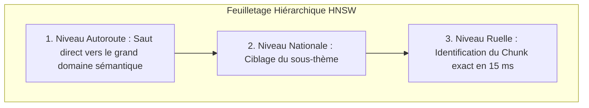

> [!TIP] Analogie
> **Feuilleter un dictionnaire** : Vous ne lisez pas chaque page de A à Z. Vous ouvrez d'abord le dictionnaire au milieu (Autoroute), vous voyez la lettre "M", vous sautez à la lettre "R" (Nationale), puis vous feuilletez la page exacte pour trouver le mot "RAG" (Ruelle). HNSW fait exactement ce parcours hiérarchique instantané.

> [!EXAMPLE] Cas d'usage agentique concret
> Un **Agent de Trading & Support Financier** interrogeant une base de 2 millions d'analyses de marché. Grâce à l'indexation HNSW sur Qdrant, l'agent trouve les 4 rapports boursiers pertinents en 12 millisecondes, permettant au système de répondre au trader en temps réel.

*Le RAG naïf vectoriel est parfait pour retrouver un fait précis. Cependant, lorsqu'on lui pose une question globale qui nécessite de relier plusieurs concepts dispersés dans tout le corpus, le RAG vectoriel s'effondre. C'est ce qui a imposed l'évolution vers le Graph RAG.*

---

### 1.4. L'Évolution vers le Graph RAG

> [!INFO] Chapeau de sous-section
> Le Graph RAG combine la puissance des Graphes de Connaissances (structuration des entités et de leurs relations) et la recherche vectorielle pour résoudre les questions globales, synthétiques et holistiques sur lesquelles le RAG vectoriel classique échoue.

---

#### 1.4.1. Les limites du RAG vectoriel classique : Échec sur les questions holistiques et relationnelles

Le RAG naïf basé uniquement sur les vecteurs possède deux **angles morts structurels** majeurs :

1. **L'incapacité à répondre aux questions globales / holistiques** : Si vous demandez à un RAG classique *"Quels sont les 5 principaux thèmes de crise abordés dans l'ensemble des 500 comptes-rendus du conseil d'administration ?"*, le moteur vectoriel va chercher 3 ou 5 chunks proches du mot "crise". Mais la réponse ne se trouve dans aucun chunk isolé : elle est **distribuée transversalement dans les 500 documents**. Le RAG vectoriel rate la vue d'ensemble.
2. **La cécité sur les relations complexes à plusieurs rebonds (*Multi-hop Reasoning*)** : Si le document A dit que *"Jean Dupont est le gérant de la société Novatech"*, et que le document B (100 pages plus loin) dit que *"Novatech détient 40 % de la filiale BioTech"*, le RAG vectoriel peine à faire le lien si la question est *"Existe-t-il un lien indirect entre Jean Dupont et BioTech ?"*. Les deux chunks n'ont pas de similarité vectorielle directe avec la question.

> [!TIP] Analogie
> **Chercher dans l'index vs lire tout le dossier** : Le RAG vectoriel classique est comme chercher un mot dans l'index à la fin du livre : il trouve la page exacte, mais il est incapable de vous faire une synthèse globale de l'histoire du livre.

> [!WARNING] Le symptôme de la réponse fragmentée
> Face à une question transversale, un RAG vectoriel classique renvoie des bribes d'informations trouvées au hasard des 3 meilleurs chunks, donnant l'illusion d'une synthèse alors qu'il manque 90 % du panorama global.

*Face à ces limites du RAG vectoriel sur les vues d'ensemble, découvrons comment l'architecture Graph RAG réunit le meilleur des deux mondes.*

---

#### 1.4.2. Définition du Graph RAG : Combiner les Graphes de Connaissances et la recherche vectorielle

Le **Graph RAG** (pionnérisé par Microsoft Research) résout cette limite en combinant deux mondes :
- La **recherche vectorielle** (pour retrouver des morceaux par proximité de sens).
- Un **Graphe de Connaissances (*Knowledge Graph*)** (pour relier explicitement les personnes, entreprises, concepts et objets entre eux).

Dans un Graph RAG, l'information n'est pas seulement découpée en blocs de texte passifs. Un LLM analyse le corpus lors de l'ingestion pour **extraire toutes les entités** (personnes, entreprises, produits, lieux) et **toutes les relations** qui les lient, sous la forme de triplets simple : `(Jean Dupont) ➔ [est gérant de] ➔ (Novatech)`.

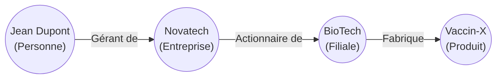

Lorsque l'agent pose une question à rebonds ou transversale, le système ne se contente pas de chercher des chunks : il **navigue sur la carte du graphe** d'un nœud à l'autre (*graph traversal*) et lit les résumés pré-calculés des sous-groupes d'entités.

> [!TIP] Analogie
> **L'arbre généalogique interactif** : Le RAG vectoriel ressemble à une boîte de photos d'identité en vrac. Le **Graph RAG**, c'est l'**arbre généalogique complet** de la famille : vous voyez immédiatement en un coup d'œil qui est l'oncle de qui, même s'ils sont nés dans deux pays différents.

*Maintenant que le principe du Graph RAG est posé, examinons concrètement les 4 étapes de construction d'un graphe de connaissances avec détection de communautés.*

---

#### 1.4.3. Construction d'un Graphe de Connaissances : Extraction d'Entités, de Relations, détection de communautés (Leiden / Louvain) et résumés hiérarchiques

La construction d'un système Graph RAG s'effectue en 4 étapes simples :

1. **Extraction des Entités & Relations** : Un LLM lit le texte et relève les acteurs et les liens. Ex. *"Jean Dupont (Personne) a signé (Lien) le Contrat-X (Document)"*.
2. **Détection de Communautés (*Algorithme Leiden / Louvain*)** : Un algorithme de théorie des graphes analyse le réseau et **regroupe automatiquement les entités très connectées en "familles/communautés"**.
3. **Génération de Résumés par Communauté** : Un LLM rédige un **résumé synthétique de chaque famille d'entités** (ex. résumé de toute la communauté "Litiges Juridiques").
4. **Interrogation Globale (*Global Search*)** : Quand l'agent pose une question d'ensemble (*"Quels sont nos principaux risques ?"*), il lit directement **les résumés des communautés**. La réponse est 100 % complète et panoramique.

| Caractéristique | RAG Vectoriel Naïf | Graph RAG |
| :--- | :--- | :--- |
| **Questions idéales** | Factuelles et précises (*"Quel est le prix de X ?"*) | Transversales et globales (*"Synthèse globale des risques ?"*) |
| **Structure de données** | Base vectorielle de chunks | Base de graphes (Neo4j) + Vecteurs |
| **Temps d'ingestion** | 🟢 Rapide & économique | 🔴 Plus lent (Analyse des liens par LLM) |
| **Raisonnement multi-rebonds** | 🔴 Limité | 🟢 Excellent (Parcours du graphe) |

> [!TIP] Analogie
> **Le plan de table d'un mariage (Algorithme Leiden)** : L'algorithme Leiden agit comme un organisateur de mariage expérimenté : il regarde qui connaît qui dans la liste des 200 invités et les regroupe naturellement par affinité sur des tables thématiques (la table de la famille, la table des collègues de travail, la table des amis d'enfance).

> [!EXAMPLE] Cas d'usage agentique concret
> Un **Agent Audit & Compliance** analysant 2 000 rapports d'inspection d'usines textiles. Le RAG vectoriel raterait les schémas de fraude diffus. Le Graph RAG détecte la communauté "Sous-traitants non déclarés dans la région X", lie les entités par l'algorithme de Leiden, et livre à l'agent un rapport d'audit panoramique instantané.

*Les fondations théoriques du RAG naïf et du Graph RAG étant posées, abordons la Section 2 : les garde-fous et stratégies avancées qui font passer un RAG du stade de prototype à celui de système industriel résilient.*

---

## 2. ⚡ Section 2 : Les Notions Avancées & Garde-Fous Opérationnels

> [!INFO] Chapeau de la Section 2
> En production, le RAG naïf sature rapidement : les découpages maladroits coupent les phrases, les recherches vectorielles rapportent du bruit et le manque de contrôle d'accès expose des secrets. Cette section détaille l'attirail complet de l'Advanced RAG (Parent-Child, HyDE, Re-ranking), de la recherche hybride (BM25+Vecteurs), du RAG Multimodal (vision & tableaux), du contrôle d'accès RBAC, de l'Agentic RAG et des métriques d'évaluation scientifiques.

---

### 2.1. Les Stratégies Avancées de Recherche & Ingestion (Advanced RAG)

> [!INFO] Chapeau de sous-section
> L'Advanced RAG résout le dilemme fondamental du découpage en séparant la taille des blocs utilisés pour la recherche mathématique de la taille des blocs transmis au LLM pour la génération.

---

#### 2.1.1. Stratégies de Chunking Avancées : Parent-Child / Small-to-Big Retrieval & Sentence Window Retrieval

Dans un RAG naïf, la taille du morceau découper est un dilemme :
- Si le morceau est **très petit** (1 phrase), la recherche est **ultra-précise**, mais l'IA manque de texte autour pour comprendre le contexte.
- Si le morceau est **très grand** (3 pages), l'IA a tout le texte, mais la recherche vectorielle devient **floue et immanquable** car le sujet principal est dilué.

La solution d'Advanced RAG consiste à séparer la recherche et la lecture.

##### 1. La Stratégie Parent-Child (*Small-to-Big*)
On découpe le document en grands paragraphes appelés **Chunks Parents** (ex. 1 000 tokens). Puis on découpe chaque Parent en petits morceaux enfants appelés **Chunks Enfants** (ex. 150 tokens).
- Lors de la recherche vectorielle, on compare la question de l'agent uniquement avec les **petits Chunks Enfants** ➔ Précision maximale.
- Quand un Enfant est trouvé, le système remonte et **injecte le Chunk Parent complet** dans le prompt de l'IA ➔ Contexte riche pour la réponse.

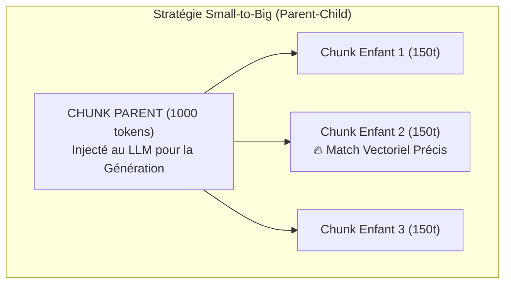

> [!TIP] Analogie
> **L'épingle et le dossier suspendu** : Vous utilisez une **épingle de couleur** (le Chunk Enfant) pour repérer la ligne exacte dans l'armoire d'archives, mais vous décrochez et donnez le **dossier suspendu complet** (le Chunk Parent) au juge pour qu'il puisse tout lire.

> [!EXAMPLE] Exemple d'application : Chunking Parent-Child
> **Agent Support Technique Code & API** : Un fichier de code Python contient une fonction clé de 10 lignes (Enfant). Lors de la recherche, l'agent matche les 10 lignes, mais le système Parent-Child injecte tout le fichier module de 300 lignes (Parent) dans le LLM, permettant à l'agent de comprendre les imports et les variables globales environnantes.

*Si la séparation Parent-Child règle le dilemme du découpage à l'ingestion, il faut aussi optimiser la formulation de la question avant d'interroger la base : c'est le rôle des techniques de Pre-Retrieval.*

---

#### 2.1.2. Pre-Retrieval : Reformulation de requête, expansion et HyDE (Hypothetical Document Embeddings)

Souvent, la question posée par l'utilisateur est trop courte ou mal rédigée (ex. *"Facture manquante"*). Les techniques de **Pre-Retrieval** réécrivent ou enrichissent la question *avant* de lancer la recherche.

##### HyDE (*Hypothetical Document Embeddings*)
HyDE est une technique très astucieuse :
1. On prend la question de l'utilisateur (*"Comment résilier un abonnement ?"*).
2. On demande à une IA de **générer une fausse réponse hypothétique**.
3. On **vectorise cette fausse réponse** au lieu de vectoriser la question !
4. Pourquoi ? Parce qu'un texte de réponse ressemble beaucoup plus géométriquement aux documents de la base qu'une simple question.

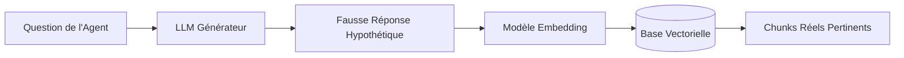

> [!TIP] Analogie
> **Le portrait-robot** : HyDE, c'est dessiner un **portrait-robot** du suspect avant d'entrer dans la foule. Même si le dessin comporte de petites erreurs de détails, chercher dans la foule quelqu'un qui ressemble au portrait-robot est beaucoup plus efficace que de chercher quelqu'un qui ressemble à la question "À quoi ressemble le suspect ?".

> [!EXAMPLE] Exemple d'application : Reformulation HyDE
> **Agent de Recherche de Directives Assurance** : L'utilisateur demande *"Vol de voiture à l'étranger"*. L'agent génère une fausse attestation d'assurance hypothétique de 4 lignes, vectorise cette attestation, et retrouve instantanément les 2 paragraphes exacts du contrat de garantie internationale.

*La pré-recherche optimisée capte mieux l'intention. Mais une fois les chunks récupérés, ils contiennent encore du bruit : il faut filtrer et ré-ordonner le résultat grâce au Post-Retrieval.*

---

#### 2.1.3. Post-Retrieval : Ré-ordonnancement (Re-ranking / Cross-Encoders) & Compression de contexte

La recherche vectorielle ramène rapidement les 20 morceaux les plus proches. Mais cette recherche est une approximation rapide. Pour garantir une précision parfaite, on applique un filtre de **Post-Retrieval** appelé **Re-ranking**.

Un modèle spécialisé (le **Re-ranker**, ex. Cohere Rerank) relit attentivement la question ET les 20 morceaux **en même temps**. Il attribue une note exacte de 0 à 100 à chaque morceau et ne conserve que les **Top-3 meilleures pépites** à donner à l'IA.

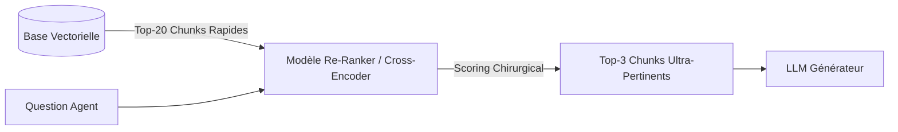

> [!TIP] Analogie
> **L'entretien individuel de recrutement** : La recherche vectorielle rapide agit comme un logiciel RH qui sélectionne 20 CV en 1 seconde. Le **Re-ranker**, c'est l'entretien individuel de 45 minutes mené par le manager avec chacun des 20 candidats pour retenir uniquement la meilleure personne.

> [!EXAMPLE] Exemple d'application : Post-Retrieval & Re-ranking
> **Agent d'Assistance Médicale & Posologie** : La recherche vectorielle renvoie 15 fiches qui parlent de "maux de tête". Le Re-ranker relit la question spécifique du patient (femme enceinte, 3e trimestre) et remonte en #1 la seule fiche posologique sans contre-indication de grossesse.

*Le re-ranking optimise le tri des résultats sémantiques. Néanmoins, lorsque la requête contient des identifiants exacts ou des codes produits, la recherche sémantique seule montre ses limites. C'est l'intérêt de la recherche hybride.*

---

### 2.2. Recherche Hybride & RAG Multimodal

> [!INFO] Chapeau de sous-section
> Un RAG industriel moderne ne repose jamais sur une seule méthode de recherche ni sur du texte pur. Il combine la recherche sémantique et la recherche par mots-clés (Recherche Hybride) et absorbe les documents complexes contenant des tableaux et des schémas (RAG Multimodal).

---

#### 2.2.1. La Recherche Hybride : Fusionner la recherche sémantique (Vecteurs) et la recherche exacte (BM25) via Reciprocal Rank Fusion (RRF)

La **Recherche Hybride** combine deux moteurs de recherche :
1. **La Recherche Vectorielle (Sémantique)** : Excelle à comprendre l'intention et le sens sémantique (*"fuite d'eau"* ➔ trouve *"dégât des eaux"*).
2. **La Recherche par Mots-clés (BM25 / Lexicale)** : Excelle à trouver les chaînes de caractères exactes (codes barres, numéros de pièces, références SQL ex: `ERR_CODE_904`).

##### L'Algorithme de Fusion RRF (*Reciprocal Rank Fusion*)
Pour fusionner les deux résultats de manière équitable sans calculs complexes, l'algorithme **RRF** attribue des points en fonction du **rang (classement)** du document dans chaque moteur. Un document classé dans le top 3 des deux moteurs obtient le score maximal et gagne la première place.

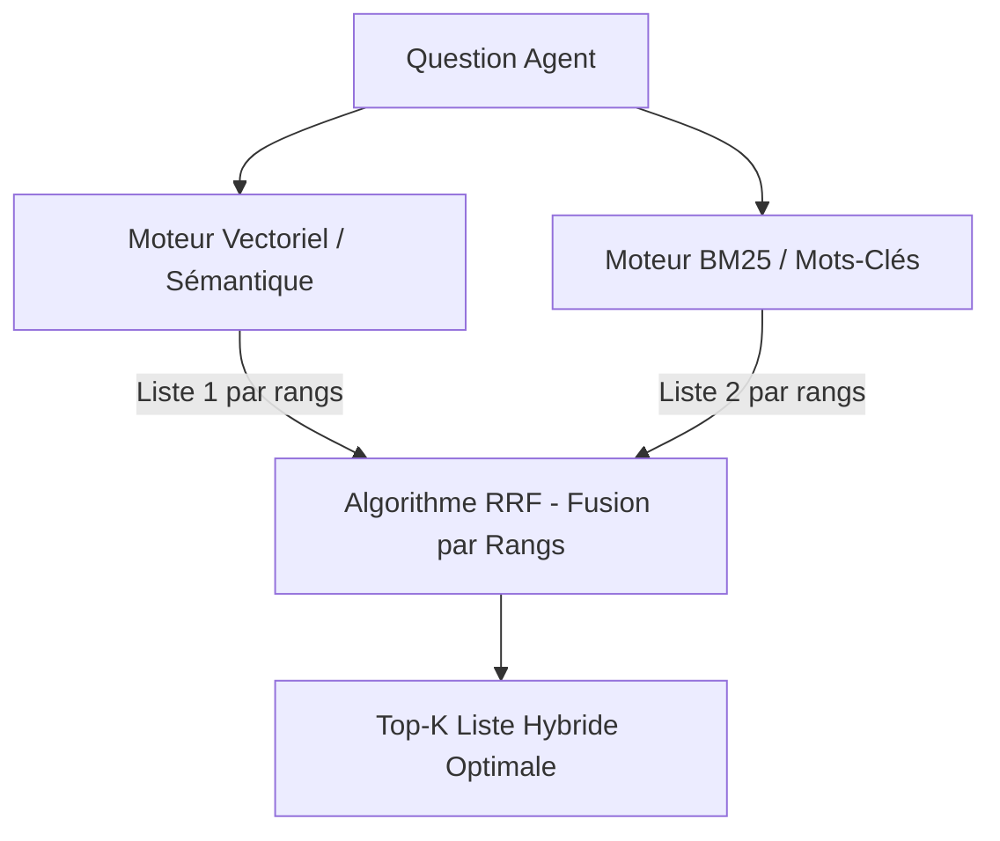

> [!TIP] Analogie
> **Le détective privé et l'archiviste comptable** : Le détective (Vectoriel) comprend le mobile et la psychologie ; l'archiviste (BM25) cherche le numéro de plaque d'immatriculation exact dans les registres. Les deux ensemble résolvent l'enquête sans rater ni le sens ni le détail.

> [!EXAMPLE] Exemple d'application : Recherche Hybride
> **Agent de Gestion de Pièces Aéronautiques** : Un technicien demande *"Remplacement du joint de valve pour modèle A320 ref REF-V88"*. La recherche vectorielle trouve le manuel du modèle A320, tandis que la recherche BM25 isole la référence exacte `REF-V88`. La fusion RRF présente la bonne page de maintenance en 1er résultat.

*Combiner les vecteurs et les mots-clés règle la recherche textuelle. Mais comment l'agent traite-t-il les documents riches contenant des tableaux comptables ou des graphiques ? C'est le rôle du RAG Multimodal.*

---

#### 2.2.2. Le RAG Multimodal : Traiter les PDF complexes contenant du texte, des tableaux financiers et des graphiques

En entreprise, 80 % des documents cruciaux sont des **PDF complexes** (bilans comptables, tableaux à double entrée, schémas techniques). Un RAG texte naïf mélange les lignes et rend les tableaux illisibles.

Le **RAG Multimodal** résout ce problème en utilisant des **Parsers Visuels** (ex. LlamaParse) qui convertissent automatiquement les tableaux PDF en **tableaux HTML `<table>` ou Markdown** parfaits. L'IA conserve ainsi l'alignement exact des colonnes et des lignes lors de sa lecture.

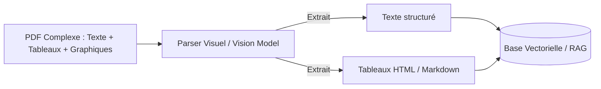

> [!TIP] Analogie
> **Le traducteur visuel** : Au lieu de recopier à la main une grille de chiffres en vrac sur une feuille de papier, le traducteur visuel prend une **photo HD du tableau complet** et la pose directement sur la table de travail de l'expert.

> [!EXAMPLE] Exemple d'application : RAG Multimodal
> **Agent Analyste Financier M&A** : Analyse d'un bilan annuel PDF de 150 pages. Le parser visuel convertit le tableau des dettes en format HTML `<table>`. L'agent extrait le chiffre exact de la dette 2026 sans jamais confondre la ligne avec celle de 2025.

*La performance de la recherche et la gestion des formats multimodes sont essentielles. Cependant, l'accès aux documents pose une question critique de gouvernance : comment empêcher un agent de divulguer des données confidentielles ? C'est l'enjeu de la sécurité RBAC et multi-tenant.*

---

### 2.3. Sécurité, Confidentialité & Contrôle d'Accès dans le RAG

> [!INFO] Chapeau de sous-section
> Un système RAG en entreprise ne doit jamais être un "open bar" de données. La sécurité exige d'appliquer un contrôle d'accès strict basé sur les rôles (RBAC) et une isolation physique ou logique multi-locataires au niveau de la base vectorielle.

---

#### 2.3.1. Contrôle d'accès basé sur les rôles (RBAC in RAG)

Si un stagiaire demande à un agent généraliste *"Quel est le salaire du Directeur ?"*, et que la base vectorielle contient les fiches de paie RH, un RAG naïf va répondre sans réfléchir. C'est une **faille de sécurité majeure**.

La solution est le **RBAC (*Role-Based Access Control*) avec Pre-filtering** :
1. Chaque document est étiqueté avec son niveau de sécurité (`allowed_roles: ["RH", "DIR"]`).
2. Quand le stagiaire (rôle `EMPLOYEE`) pose une question, le système **injecte un filtre de sécurité automatique** dans la recherche vectorielle.
3. La base vectorielle masque physiquement les documents RH. Pour le moteur de recherche, ces documents n'existent tout simplement pas pour le stagiaire.

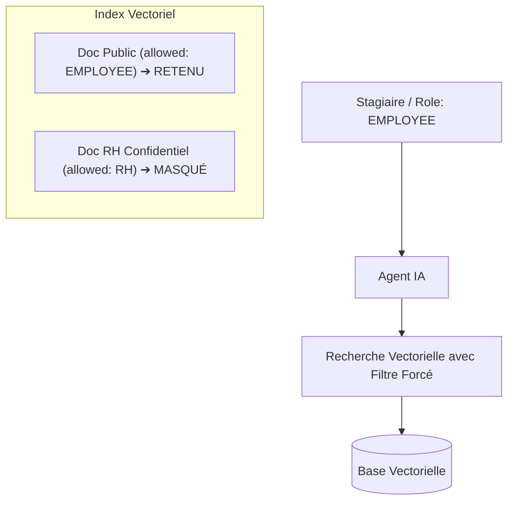

> [!TIP] Analogie
> **Le badge d'accès de sécurité** : Votre badge d'employé vous permet d'ouvrir la porte de la cafétéria et de votre bureau, mais la porte de l'ascenseur menant au bureau de la direction financière reste verrouillée.

> [!EXAMPLE] Exemple d'application : Contrôle d'accès RBAC
> **Agent Assistant RH & Généraliste** : Un employé demande les détails du plan de restructuration. Le système applique le filtre RBAC lié à son rôle `EMPLOYEE` : la recherche vectorielle ignore les documents confidentiels du comité de direction et l'agent répond : *"Information non disponible dans votre périmètre d'accès."*

*Au-delà du filtrage des rôles au sein d'une même entreprise, découvrons comment étanchéiser totalement les bases de données entre différents clients en mode SaaS.*

---

#### 2.3.2. Isolation multi-locataires (Multi-Tenant Isolation)

Pour une application SaaS servant plusieurs entreprises clientes, le risque absolu est la **fuite de données entre deux clients** (le Client A lisant un document du Client B).

On applique deux méthodes :
- **Isolation Logique** : Une seule base vectorielle, mais chaque morceau comporte une étiquette `client_id: "A"`.
- **Isolation Physique** : Création d'une **base vectorielle physiquement séparée** pour chaque client (un coffre-fort dédié).

> [!TIP] Analogie
> **Les coffres-forts séparés** : L'isolation logique, c'est mettre les dossiers de deux clients dans la même armoire avec des étiquettes de couleurs différentes. L'**isolation physique**, c'est placer les dossiers du Client A dans un coffre à Paris et ceux du Client B dans un coffre à Lyon.

> [!EXAMPLE] Exemple d'application : Isolation Multi-Tenant
> **Agent SaaS Multi-Entreprises** : Une plateforme SaaS de gestion de brevets héberge 50 cabinets d'avocats. Chaque cabinet dispose d'un index vectoriel Qdrant physiquement étanche, garantissant qu'aucune requête d'un cabinet ne peut s'égarer sur les données d'un concurrent.

*La sécurité et le filtrage garantissent l'étanchéité des données. Mais pour rendre le RAG intelligent et capable d'auto-correction, il faut passer au niveau supérieur : l'Agentic RAG.*

---

### 2.4. L'Agentic RAG : Le RAG Piloté par les Agents IA

> [!INFO] Chapeau de sous-section
> L'Agentic RAG transforme le pipeline passif en un processus dynamique et autonome où l'agent évalue lui-même la qualité des documents extraits, corrige ses recherches, bascule sur des outils alternatifs et oriente ses requêtes vers le bon index.

---

#### 2.4.1. Le RAG comme Outil (RAG as a Tool) vs L'Agent Auto-Correcteur (Corrective RAG / CRAG)

Dans l'**Agentic RAG**, le RAG devient un **outil dynamique (`search_knowledge_base`)** que l'agent choisit de déclencher uniquement s'il en a besoin.

Le framework **CRAG (*Corrective RAG*)** ajoute un agent *Évaluateur* :
- Si les documents extraits sont de **Bonne qualité** ➔ L'agent génère la réponse.
- Si les documents sont **Insuffisants ou absents** ➔ L'agent **rejette les résultats** et bascule automatiquement sur un outil secondaire (ex. une recherche web via Tavily API).

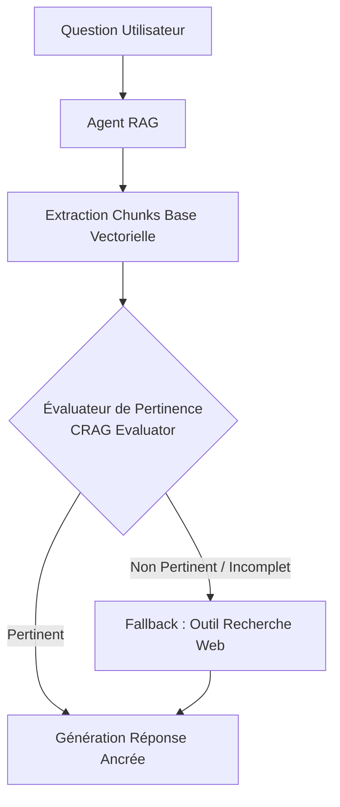

> [!TIP] Analogie
> **Le chercheur autonome avec plan B** : Si le livre qu'il cherche est absent de la bibliothèque interne, le chercheur ne baisse pas les bras : il sort de la bibliothèque et va consulter les archives publiques sur Internet pour trouver l'information manquante.

> [!EXAMPLE] Exemple d'application : CRAG & Repli Web
> **Agent de Veille Concurrentielle** : L'agent cherche les derniers tarifs d'un concurrent dans la base interne. Le module CRAG évalue que le document interne date de 2024. L'agent rejette la donnée interne périmée et bascule sur l'outil `web_search` pour ramener le tarif officiel publié ce matin sur le site du concurrent.

*Une fois la mécanique de repli comprise, étudions le rôle exact de l'agent évaluateur qui contrôle la qualité des extraits avant la génération.*

---

#### 2.4.2. L'Agent Évaluateur de Contexte : Auto-évaluation, repli web et reformulation

L'**Agent Évaluateur** vérifie la qualité des extraits avant d'autoriser la réponse :
1. **Auto-évaluation** : Si le score de pertinence est faible (ex. $< 0.60$), l'agent refuse de générer une réponse au hasard.
2. **Reformulation** : Il réessaie automatiquement avec d'autres mots-clés.
3. **Alerte** : Si rien n'est trouvé, il répond honnêtement qu'il ne sait pas.

> [!TIP] Analogie
> **Le filtre à eau à trois étages** : L'eau passe par trois filtres successifs : si le premier filtre laisse passer de la boue, le deuxième filtre stoppe l'écoulement pour éviter de remplir le verre avec de l'eau sale.

> [!EXAMPLE] Exemple d'application : Agent Évaluateur
> **Agent Support Technique Dépannage** : Un client pose une question sur un code erreur rare. L'évaluateur constate un score de confiance de 0.35 sur la base interne. L'agent s'auto-corrige, relance une recherche élargie et trouve la procédure exacte.

*Après la vérification de pertinence du contexte, découvrons comment l'agent sait vers quelle base de données orienter sa question lorsqu'il existe plusieurs bases dans l'entreprise.*

---

#### 2.4.3. Routage multi-index : Sélection dynamique de la base de connaissances

Dans une grande entreprise, l'agent utilise un **Routeur de Connaissances** pour diriger sa question vers la bonne base spécialisée :

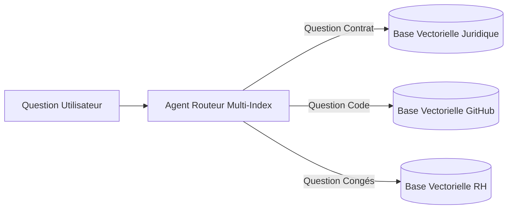

> [!TIP] Analogie
> **L'aiguilleur de gare** : L'aiguilleur lit la destination sur le train et actionne le levier pour l'envoyer sur la bonne voie (Voie Juridique, Voie RH, ou Voie Technique).

> [!EXAMPLE] Exemple d'application : Routage Multi-Index
> **Agent Helpdesk d'Entreprise** : Si la question concerne un bug sur le code source, l'agent route la requête vers l'index GitHub. Si elle concerne une note de frais, l'agent la route vers l'index Comptabilité.

*Le RAG agentique apporte une résilience et une adaptabilité remarquables. Mais comment mesurer scientifiquement la qualité d'un RAG pour prouver qu'il est prêt pour la production ? C'est le rôle des métriques scientifiques d'évaluation.*

---

### 2.5. Évaluation & Métriques Scientifiques d'un Système RAG

> [!INFO] Chapeau de sous-section
> L'évaluation d'un RAG ne se fait pas "au feeling". Elle repose sur des cadres d'évaluation scientifiques automatisés (notamment le framework Ragas) qui mesurent de manière indépendante la qualité de la recherche et la qualité de la génération.

---

#### 2.5.1. Le Trièdre d'Évaluation de la Qualité RAG : Fidélité, Pertinence de la réponse, Précision & Rappel du contexte (Ragas Framework)

Pour évaluer scientifiquement un pipeline RAG, l'industrie s'appuie sur le **Trièdre d'Évaluation RAG** (*Ragas Framework*) qui mesure 4 métriques de 0.0 à 1.0 :

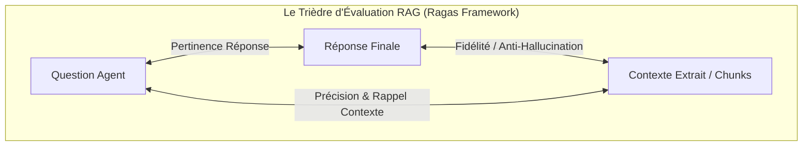

1. **La Fidélité (*Faithfulness*)** : Est-ce que 100 % des faits cités dans la réponse proviennent bien des documents extraits ? (Anti-hallucination, score visé $\ge 0.95$).
2. **La Pertinence de la Réponse (*Answer Relevance*)** : Est-ce que l'agent répond directement à la question sans tourner autour du pot ?
3. **La Précision du Contexte (*Context Precision*)** : Y a-t-il du bruit inutile parmi les morceaux extraits ?
4. **Le Rappel du Contexte (*Context Recall*)** : Le système a-t-il réussi à retrouver toutes les pièces nécessaires du puzzle ?

| Métrique Ragas | Composant évalué | Ce qu'un score faible indique | Solution opérationnelle |
| :--- | :--- | :--- | :--- |
| **Faithfulness** | Génération (LLM) | L'agent invente des détails. | Consignes System Prompt plus meutes & Température 0.0. |
| **Answer Relevance** | Génération (LLM) | L'agent fait du bavardage inutile. | Exiger un Format de Sortie JSON strict. |
| **Context Precision** | Recherche | Beaucoup de bruit dans les chunks. | Ajouter un modèle de **Re-ranking**. |
| **Context Recall** | Ingestion & Recherche | Des documents clés ont été ratés. | Passer en **Parent-Child** ou **Recherche Hybride**. |

> [!TIP] Analogie
> **L'inspecteur de l'Éducation Nationale** : Il évalue l'élève selon une grille précise : l'élève a-t-il bien lu la consigne ? A-t-il sagement cité les documents officiels sans rien inventer ? La copie est-elle claire et concise ?

> [!EXAMPLE] Exemple d'application : Métriques Ragas en CI/CD
> **Pipeline CI/CD d'un Agent Bancaire** : Avant chaque déploiement d'une nouvelle version de l'agent, un script automatisé teste 100 questions clés avec le framework **Ragas**. Si le score de *Faithfulness* (anti-hallucination) descend en dessous de 0.95, le déploiement est automatiquement annulé.

*L'ensemble des concepts théoriques, des garde-fous avancés et des métriques d'évaluation étant maîtrisés, synthétisons ce module sous forme d'outils opérationnels pour l'Architecte RAG.*

---

## 3. 📊 Section 3 : Fiche Synthèse / Tableau Récapitulatif

> [!INFO] Chapeau de la Section 3
> Cette dernière section résume l'ensemble du module en deux outils d'architecte : une matrice comparative des quatre grandes architectures RAG et une check-list de déploiement en dix points pour valider la mise en production.

---

### 3.1. Matrice Comparative des Architectures RAG

| Architecture RAG | Complexité | Cas d'usage idéal | Avantages majeurs | Limites & Risques | Analogie Clé |
| :--- | :--- | :--- | :--- | :--- | :--- |
| **RAG Naïf** | 🟢 Faible | Questions factuelles simples sur petits corpus | Très rapide à coder, économique | Risque de bruit et d'hallucinations | L'index à la fin du livre |
| **Advanced RAG** *(Parent-Child, Re-rank)* | 🟡 Moyenne | Documents d'entreprise complexes, PDF | Haute précision, contexte riche sans bruit | Requièrt un modèle de Re-ranker | L'épingle + Le dossier suspendu |
| **Graph RAG** *(Leiden, Knowledge Graph)* | 🔴 Élevée | Audits globaux, synthèses de tendance, données très liées | Vue 100 % panoramique, raisonnement multi-rebonds | Ingestion plus lente & coûteuse | L'arbre généalogique complet |
| **Agentic RAG** *(CRAG, Multi-index)* | 🔴 Élevée | Assistants polyvalents multi-sources avec repli web | Résilience maximale, auto-correction, pas de blocage | Latence variable selon les boucles d'auto-correction | Le chercheur autonome avec plan B |

---

### 3.2. Check-list opérationnelle de l'Architecte RAG pour Agents IA

> [!SUCCESS] Les 10 points de contrôle avant mise en production d'un système RAG
> 1. **Stratégie de Chunking adaptée** : Utilisation d'une approche *Parent-Child (Small-to-Big)* pour séparer la précision de recherche de la richesse de contexte.
> 2. **Recherche Hybride configurée** : Fusion de la recherche sémantique (Vecteurs Cosinus) et lexicale (BM25) via l'algorithme *Reciprocal Rank Fusion (RRF)*.
> 3. **Modèle de Re-ranking actif** : Présence d'un Re-ranker (Cross-Encoder) en Post-Retrieval pour éliminer le bruit.
> 4. **Pre-Retrieval optimisé** : Utilisation de la reformulation de requête ou de *HyDE* pour enrichir les questions courtes.
> 5. **Parsing Visuel / Multimodal** : Conservation de la structure des tableaux PDF (`<table>` / Markdown) pour éviter la corruption des données financières.
> 6. **Contrôle d'accès RBAC étanche** : Filtrage forcé par métadonnées d'autorisation (*Pre-filtering*) directement dans la base vectorielle.
> 7. **Isolation Multi-Tenant** : Partitionnement logique rigoureux ou isolation physique des index par client/département.
> 8. **Boucle Agentique & Auto-Correction (CRAG)** : Capacité de l'agent à évaluer la pertinence du contexte extrait et à basculer sur un repli web en cas de manquement.
> 9. **Règles d'Or Anti-Hallucination** : System Prompt imposant un ancrage strict ("Réponds EXCLUSIVEMENT d'après les documents fournis").
> 10. **Trièdre d'Évaluation Ragas validé** : Score de *Faithfulness* $\ge 0.95$ et *Context Precision* $\ge 0.90$ validés sur un dataset de référence en CI/CD.

---

> [!QUOTE] Principe final
> Le RAG n'est pas un simple moteur de recherche textuel, c'est l'**architecture de mémoire externe de votre Agent IA**. La qualité d'une réponse agentique ne dépend pas uniquement de la taille du LLM, mais de la **pureté sémantique de l'information extraite**. Un bon architecte RAG cherche avec la précision d'une épingle (*Small Chunk*), lit avec la richesse d'un dossier (*Parent Chunk*), filtre le bruit par ré-ordonnancement (*Re-ranking*), et protège les secrets par un contrôle d'accès chirurgical (*RBAC*).

---

## 4. Liens entre Notes
- Aller au [[00_MOC_MAITRISE_AGENTS_IA]]
- Fiche précédente : [[05_Tool_Engineering_et_Standard_MCP]]
- Fiche suivante : [[07_Reflexion_Auto_Amelioration_Et_Auto_Creation_Outils]]
