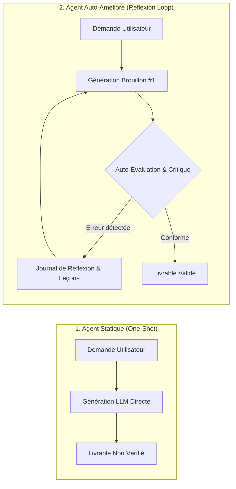
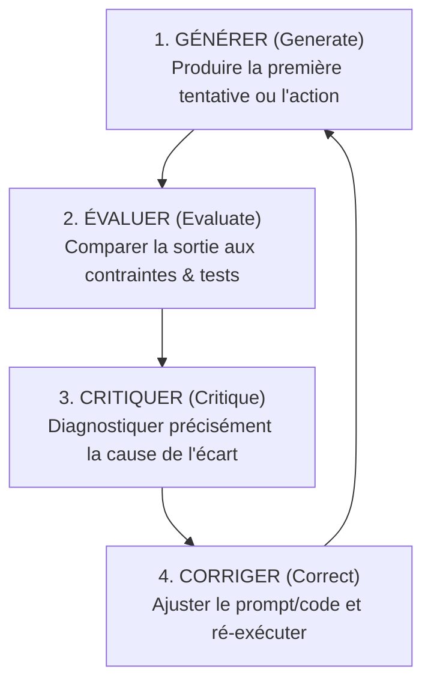
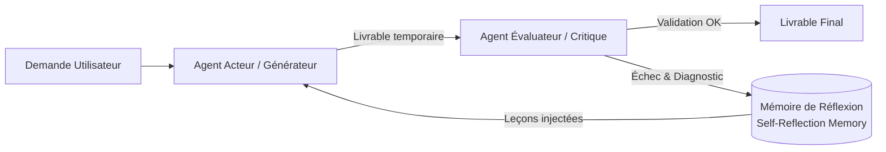
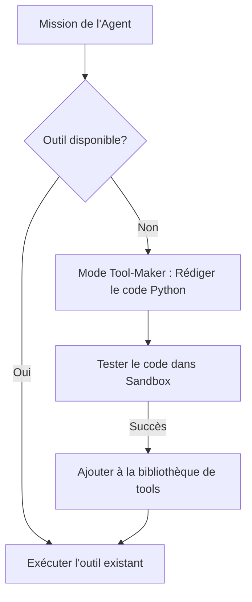
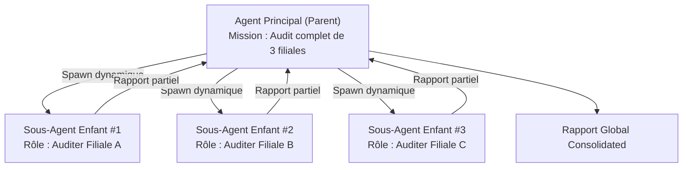
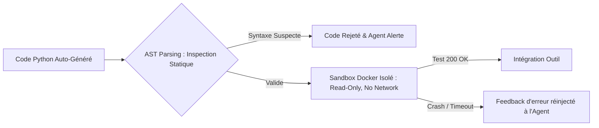
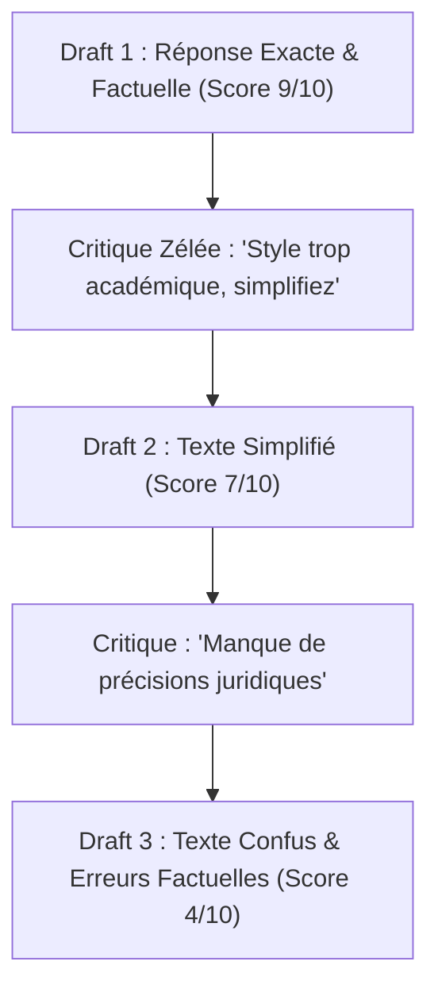
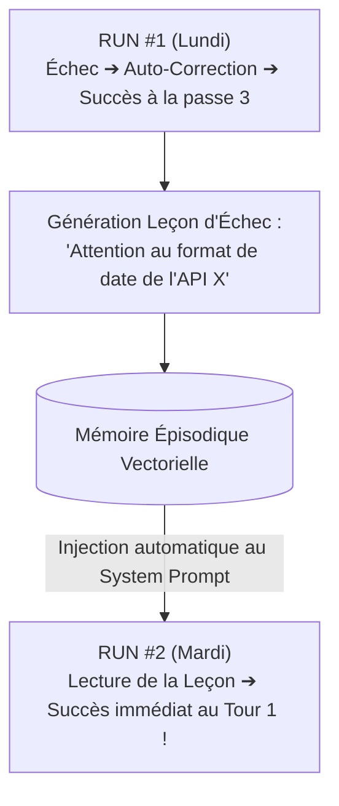
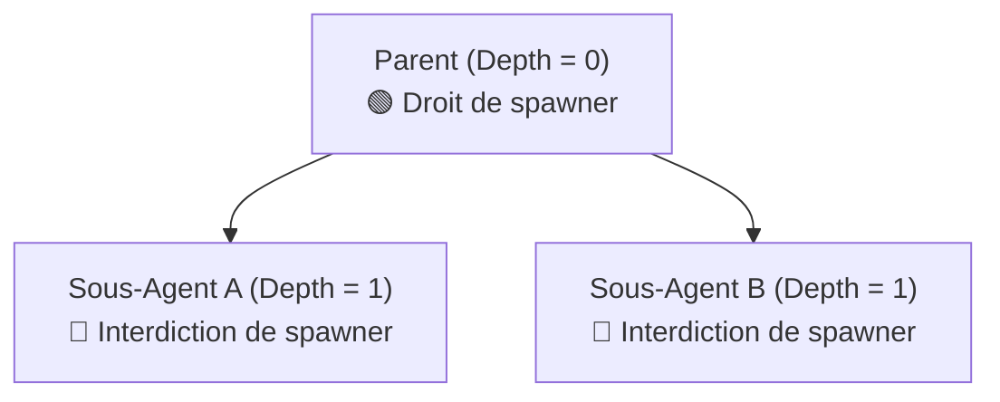
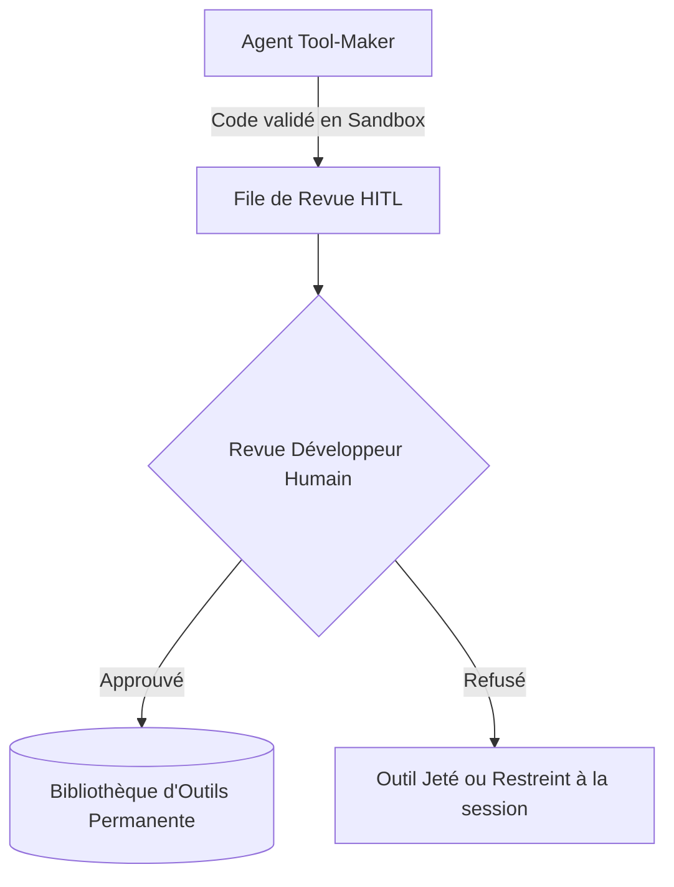

# Module 7 : Auto-Amélioration (Reflexion), Self-Correction & Auto-Création d'Outils et Sous-Agents

> [!ABSTRACT] Vision du Cours
> Un agent IA traditionnel qui commet une erreur dans son raisonnement ou qui heurte une limitation technique est condamné à l'échec ou à l'hallucination s'il ne dispose d'aucun moyen de revenir sur ses pas. L'**Auto-Amélioration** (*Self-Improvement*) et le **Framework de Réflexion** (*Reflexion Pattern*) transforment un agent passif en une entité véritablement autonome capables d'évaluer son propre travail, de corriger ses erreurs de logique, de rédiger lui-même le code des outils informatiques manquants (*Tool-Maker Agents*) et d'instancier à la volée des sous-agents éphémères spécialisés (*Sub-Agent Spawning*). Ce module enseigne la mécanique cognitive de ces boucles de rétroaction, la sécurisation du code auto-généré par analyse statique AST et sandboxing Docker, la prévention des dérives de sur-correction (*Over-Correction*), la persistance des leçons d'échecs en mémoire épisodique inter-sessions, et le contrôle par validation humaine (HITL). Aucun jargon mathématique inutile : chaque concept est illustré par une explication limpide, une analogie du monde réel et un cas d'usage agentique concret.

> [!NOTE] 📑 Table des Matières
> - [[#1. 💡 Section 1 : La Théorie Accessible & Concepts Clés|1. Section 1 : La Théorie Accessible & Concepts Clés]]
>   - [[#1.1. De l'Agent Statique à l'Agent Auto-Amélioré|1.1. De l'Agent Statique à l'Agent Auto-Amélioré]]
>     - [[#1.1.1. Définition simple : Passer d'une exécution directe en une passe (One-Shot) à une exécution itérative avec auto-évaluation|1.1.1. Définition simple : One-Shot vs Exécution itérative]]
>     - [[#1.1.2. Le problème des erreurs non détectées : Pourquoi un agent sans boucle de réflexion valide des réponses partiellement fausses|1.1.2. Le problème des erreurs non détectées]]
>     - [[#1.1.3. Le cycle fondamental de la cognition autonome : Générer ➔ Évaluer ➔ Critiquer ➔ Corriger|1.1.3. Le cycle fondamental de la cognition autonome]]
>   - [[#1.2. Le Framework de Réflexion (Reflexion Pattern)|1.2. Le Framework de Réflexion (Reflexion Pattern)]]
>     - [[#1.2.1. L'architecture à 3 rôles complémentaires : Actor / Generator, Evaluator / Critic & Self-Reflection Memory|1.2.1. L'architecture à 3 rôles complémentaires]]
>     - [[#1.2.2. L'Auto-Raffinage (Self-Refinement / Self-Correction) : Améliorer un travail par passes successives sans repartir de zéro|1.2.2. L'Auto-Raffinage (Self-Refinement)]]
>     - [[#1.2.3. Réflexion implicite vs Réflexion explicite : Utilisation d'un journal de réflexion interne (Scratchpad)|1.2.3. Réflexion implicite vs explicite (Scratchpad)]]
>   - [[#1.3. L'Auto-Création d'Outils (Tool-Maker Agents)|1.3. L'Auto-Création d'Outils (Tool-Maker Agents)]]
>     - [[#1.3.1. Le principe du Tool-Maker : Quand un agent identifie une incapacité technique et rédige lui-même le code Python de l'outil manquant|1.3.1. Le principe du Tool-Maker]]
>     - [[#1.3.2. Le cycle de vie d'un outil auto-créé : Détection ➔ Génération ➔ Test ➔ Validation ➔ Intégration|1.3.2. Le cycle de vie d'un outil auto-créé]]
>   - [[#1.4. L'Instanciation Autonome de Sous-Agents (Sub-Agent Spawning)|1.4. L'Instanciation Autonome de Sous-Agents]]
>     - [[#1.4.1. Définition : La capacité d'un agent principal à créer à la volée des 'agents enfants' éphémères spécialisés|1.4.1. Définition du Sub-Agent Spawning]]
>     - [[#1.4.2. La délégation dynamique de sous-tâches : Transmettre une mission restreinte avec des consignes et un budget dédiés|1.4.2. La délégation dynamique de sous-tâches]]
> - [[#2. ⚡ Section 2 : Les Notions Avancées & Garde-Fous Opérationnels|2. Section 2 : Notions Avancées & Garde-Fous Opérationnels]]
>   - [[#2.1. Sécuriser l'Auto-Création d'Outils : Bac à Sable & Analyse de Code|2.1. Sécuriser l'Auto-Création d'Outils]]
>     - [[#2.1.1. Le risque du code auto-généré : Empêcher un agent d'exécuter du code Python dangereux|2.1.1. Le risque du code auto-généré]]
>     - [[#2.1.2. Inspection dynamique et analyse statique de code (AST Parsing) : Filtrer les modules et fonctions interdits|2.1.2. Inspection dynamique et analyse statique (AST Parsing)]]
>     - [[#2.1.3. Exécution sécurisée en Bac à Sable (Sandboxing) : Tester le nouvel outil dans un environnement isolé|2.1.3. Exécution sécurisée en Bac à Sable]]
>   - [[#2.2. Prévenir les Dérives d'Auto-Correction (Over-Correction & Degeneration Loops)|2.2. Prévenir les Dérives d'Auto-Correction]]
>     - [[#2.2.1. Le piège de la sur-correction (Over-Correction) : Empêcher l'agent d'altérer une réponse initialement correcte|2.2.1. Le piège de la sur-correction]]
>     - [[#2.2.2. Plafonds stricts d'itérations de réflexion : Limiter le nombre de passes d'auto-correction|2.2.2. Plafonds stricts d'itérations]]
>     - [[#2.2.3. Critères d'arrêt quantitatifs (Convergence Criteria) : Définir des règles d'évaluation claires|2.2.3. Critères d'arrêt quantitatifs]]
>   - [[#2.3. Persistance & Mémoire d'Échec (Episodic Reflection Memory)|2.3. Persistance & Mémoire d'Échec]]
>     - [[#2.3.1. Mémoire d'échecs inter-sessions (Cross-Run Reflexion) : Sauvegarder les erreurs passées et les leçons rédigées|2.3.1. Mémoire d'échecs inter-sessions]]
>     - [[#2.3.2. Injecter le journal des leçons apprises au démarrage des exécutions futures pour ne jamais répéter la même erreur|2.3.2. Injection des leçons apprises]]
>   - [[#2.4. Gouvernance & Cycle de Vie des Sous-Agents|2.4. Gouvernance & Cycle de Vie des Sous-Agents]]
>     - [[#2.4.1. Limite de profondeur d'instanciation (Max Spawning Depth) : Interdire la création en cascade infinie|2.4.1. Limite de profondeur d'instanciation]]
>     - [[#2.4.2. Allocation et héritage de budget : Fraction stricte du budget financier et temporel attribuée au sous-agent|2.4.2. Allocation et héritage de budget]]
>     - [[#2.4.3. Nettoyage et destruction automatique des sous-agents éphémères en fin de mission|2.4.3. Nettoyage et destruction des sous-agents]]
>   - [[#2.5. Validation Humaine (Human-in-the-Loop - HITL) sur les Nouvelles Capacités|2.5. Validation Humaine (HITL)]]
>     - [[#2.5.1. Validation humaine préalable avant d'enregistrer définitivement un outil généré dans la bibliothèque permanente|2.5.1. Validation humaine préalable (HITL)]]
> - [[#3. 📊 Section 3 : Fiche Synthèse / Tableau Récapitulatif|3. Section 3 : Fiche Synthèse & Check-list]]
>   - [[#3.1. Matrice Comparative des Motifs d'Auto-Amélioration & Autonomie|3.1. Matrice Comparative des Motifs d'Auto-Amélioration]]
>   - [[#3.2. Check-list opérationnelle de l'Architecte d'Agents Auto-Améliorés|3.2. Check-list opérationnelle]]
> - [[#4. Liens entre Notes|4. Liens entre Notes]]

---

## 1. 💡 Section 1 : La Théorie Accessible & Concepts Clés

> [!INFO] Chapeau de la Section 1
> L'autonomie réelle d'un agent IA ne réside pas dans sa capacité à produire une réponse parfaite du premier coup, mais dans sa capacité à inspecter son propre travail, à identifier ses erreurs de logique, à combler ses manques techniques par l'écriture de nouveaux outils et à déléguer des tâches à des sous-agents éphémères. Cette première section pose les fondations théoriques du saut cognitif de l'agent statique vers l'agent auto-amélioré, décortique le framework de réflexion (*Reflexion Pattern*) à trois rôles, analyse la création automatique d'outils (*Tool-Maker*) et introduit l'instanciation dynamique de sous-agents (*Sub-Agent Spawning*).

---

### 1.1. De l'Agent Statique à l'Agent Auto-Amélioré

> [!INFO] Chapeau de sous-section
> Passer d'un agent statique qui génère une réponse en une seule passe aveugle à un agent auto-amélioré exige d'introduire une boucle de rétroaction cognitive où la première tentative n'est considérée que comme un brouillon à évaluer et à corriger.

---

#### 1.1.1. Définition simple : Passer d'une exécution directe en une passe (*One-Shot*) à une exécution itérative avec auto-évaluation

Un **Agent Statique** (ou exécution en une passe *One-Shot*) est un système où le LLM reçoit une consigne, exécute sa pensée ou ses appels d'outils, puis livre directement sa réponse finale à l'utilisateur sans aucun contrôle qualité interne. Si le LLM a commis une faute de calcul à l'étape 2 ou a mal interprété une consigne du System Prompt, l'erreur est transmise telle quelle au client final.

Un **Agent Auto-Amélioré** (*Self-Improving Agent*), à l'inverse, est un système qui sépare la **production** d'un livrable de sa **validation**. L'agent génère un premier jet (*Draft 1*), puis interrompt la livraison pour soumettre ce jet à un module de critique interne. Si la critique détecte une non-conformité, un biais ou une erreur de calcul, l'agent formule des consignes d'amélioration textuelles (*Self-Reflection*) et relance une passe de correction. Le livrable n'est transmis à l'utilisateur que lorsqu'il a franchi la barre de qualité exigée.



> [!TIP] Analogie
> L'**Agent Statique**, c'est un élève étourdi qui rend sa copie d'examen au bout de 15 minutes sans l'avoir relue une seule fois. L'**Agent Auto-Amélioré**, c'est un écrivain chevronné qui rédige un premier manuscrit, le confie à son éditeur de texte, note toutes les remarques dans la marge, et retravaille son livre chapitre par chapitre jusqu'à la perfection avant publication.

> [!EXAMPLE] Cas d'usage agentique concret
> Un **Agent Développeur de Code Python**. Lorsqu'on lui demande de rédiger un script de conversion de données, un agent statique génère le script et s'arrête. L'agent auto-amélioré génère le script, **exécute un test unitaire automatique**, s'aperçoit que la ligne 14 lève une `KeyError`, lit le message d'erreur, corrige le script, et ne livre le code à l'utilisateur que lorsqu'il s'exécute avec un résultat `200 OK`.

---

#### 1.1.2. Le problème des erreurs non détectées : Pourquoi un agent sans boucle de réflexion valide des réponses partiellement fausses

Pourquoi les LLM commettent-ils des erreurs sans s'en apercevoir lors d'une génération *One-Shot* ? La raison tient à la nature même de la génération auto-régressif (Module 4) :
1. Le LLM calcule le token suivant en se basant sur le passé. Si à l'étape 3 il s'est engagé dans une fausse piste sémantique ou a commis une faute de frappe dans un calcul, les mécanismes d'attention l'obligent à **poursuivre et rationaliser son erreur** dans les tokens suivants.
2. Le LLM n'a **pas de recul cognitif** pendant qu'il écrit. C'est la différence entre parler du tac-au-tac et prendre du recul pour relire un texte imprimé.

Sans boucle de réflexion explicite, un agent valide des réponses qui "semblent très plausibles" (bonne grammaire, ton professionnel) mais dont les chiffres ou les faits sont partiellement faux. C'est l'un des facteurs majeurs d'échec des agents de première génération en production.

> [!WARNING] Le piège de l'assurance statistique
> Plus un LLM est puissant, plus il exprime ses erreurs avec **une assurance et un ton professionnel convaincants**. Sans un module d'évaluation distinct, la forme parfaite masque le fond vicié.

---

#### 1.1.3. Le cycle fondamental de la cognition autonome : Générer ➔ Évaluer ➔ Critiquer ➔ Corriger

La cognition autonome de deuxième génération s'appuie sur une boucle à quatre temps immuable :



1. **Générer (*Generate*)** : Produire une première réponse, un code ou une séquence d'appels d'outils basée sur le prompt initial.
2. **Évaluer (*Evaluate*)** : Inspecter la sortie via des critères objectifs (tests unitaires, assertions Pydantic, règles d'Or, grille de comparaison).
3. **Critiquer (*Critique*)** : Rédiger un diagnostic en langage naturel expliquant **pourquoi** la sortie a échoué (*"Le montant TTC calculé ne prend pas en compte la remise de 10%"*).
4. **Corriger (*Correct*)** : Réinjecter le diagnostic de la critique dans le contexte et relancer la génération.

*Comprendre ce cycle à quatre temps mène naturellement à l'analyse de son architecture logicielle de référence : le Reflexion Pattern à trois rôles.*

---

### 1.2. Le Framework de Réflexion (*Reflexion Pattern*)

> [!INFO] Chapeau de sous-section
> Formalisé par les chercheurs de Princeton et du MIT, le framework Reflexion découpe la cognition autonome en trois rôles spécialisés : l'Acteur qui tente, l'Évaluateur qui juge et la Mémoire de Réflexion qui consigne les leçons.

---

#### 1.2.1. L'architecture à 3 rôles complémentaires : *Actor / Generator*, *Evaluator / Critic* & *Self-Reflection Memory*

Le **Reflexion Pattern** évite de demander à un prompt monolithique de s'auto-évaluer au même moment où il produit. Il sépare la responsabilité entre trois entités fonctionnelles :

1. **L'Acteur / Générateur (*Actor / Generator*)** : C'est l'agent exécutant principal. Il reçoit le besoin métier et produit les tentatives. Il dispose d'un rôle orienté action et exécution.
2. **L'Évaluateur / Critique (*Evaluator / Critic*)** : C'est un agent ou une fonction de test impartiale. Il lit le travail de l'Acteur et le compare aux exigences. Il ne cherche pas à faire le travail à la place de l'Acteur, mais attribue une **note de conformité** et rédige des **remarques constructives**.
3. **La Mémoire de Réflexion (*Self-Reflection Memory*)** : C'est le journal de bord texte où sont stockés les retours de la Critique sous forme de **leçons apprises** (*"Tentative 1 échouée car X. Pour la tentative 2, penser à faire Y"*).



> [!TIP] Analogie
> L'architecture Reflexion reproduit l'organisation d'un **studio de création de jeux vidéo** : l'**Acteur** est le développeur qui code la fonctionnalité ; le **Critique** est le testeur QA (*Quality Assurance*) qui cherche les bugs et rédige un ticket d'incident ; la **Mémoire de Réflexion**, c'est le système Jira où sont consignés les bugs à corriger avant la prochaine version.

> [!EXAMPLE] Cas d'usage agentique concret
> Un **Agent Rédacteur de Synthèses Financières**. L'Acteur génère le rapport. Le Critique (équipé de contraintes strictes) relit le rapport et note : *"Erreur : le chiffre d'affaires 2025 est cité à 4.2M€ alors que le document RAG indique 4.5M€"*. Cette remarque est inscrite dans la mémoire de réflexion. L'Acteur relit cette remarque et corrige le chiffre exact au deuxième tour.

---

#### 1.2.2. L'Auto-Raffinage (*Self-Refinement / Self-Correction*) : Améliorer un travail par passes successives sans repartir de zéro

L'**Auto-Raffinage** (*Self-Refinement*) est le mécanisme par lequel l'agent modifie son livrable **de manière chirurgicale** au lieu de tout réécrire depuis une page blanche.

Lors du tour $N+1$, l'Acteur reçoit dans son prompt :
- Le prompt d'origine.
- Sa tentative précédente (*Draft $N$*).
- La critique de l'Évaluateur.
- La leçon de réflexion.

Grâce à cet assemblage, le LLM effectue un **diff conceptuel** : il conserve 90 % du travail déjà validé à la tentative $N$ et ne modifie que la partie incriminée par la critique. Cela préserve le budget de génération et accélère la convergence.

---

#### 1.2.3. Réflexion implicite vs Réflexion explicite : Utilisation d'un journal de réflexion interne (*Scratchpad*)

Il existe deux manières d'implémenter la réflexion au sein d'un agent :

1. **La Réflexion Implicite (Internal Thought / CoT)** : L'agent écrit sa réflexion dans le fil de sa pensée (la balise `Thought:` du protocole ReAct). Avantage : simple à coder. Limite : la réflexion est éphémère et noyée dans la conversation.
2. **La Réflexion Explicite (Scratchpad / Memory Log)** : L'agent écrit sa réflexion dans une structure de données dédiée — le **Scratchpad** — séparée du flux d'échange principal. Cette réflexion explicite peut être **extraite, analysée, stockée en base de données** et réinjectée lors de sessions futures.

```python
# Exemple de structure d'un Scratchpad de Réflexion (Pydantic)
class ReflectionStep(BaseModel):
    attempt_number: int
    generated_output: str
    is_successful: bool
    critic_feedback: str
    reflection_lesson: str  # La leçon apprise pour la passe suivante
```

> [!TIP] Règle d'ingénierie
> Privilégiez la **réflexion explicite** pour les agents de production. Conserver le journal des réflexions dans un Scratchpad structuré permet de comprendre **pourquoi** un agent a échoué à la tentative 1 avant de réussir à la tentative 3.

*Si la réflexion permet à l'agent d'améliorer son texte ou sa logique, qu'arrive-t-il lorsque l'agent se heurte à une vraie limitation technique (ex: l'absence d'un outil pour calculer une médiane) ? C'est le domaine de l'Auto-Création d'Outils.*

---

### 1.3. L'Auto-Création d'Outils (*Tool-Maker Agents*)

> [!INFO] Chapeau de sous-section
> Le motif Tool-Maker permet à un agent IA de surmonter ses propres limitations fonctionnelles en concevant, codant, testant et intégrant de manière autonome de nouveaux outils Python dans sa propre boîte à outils.

---

#### 1.3.1. Le principe du *Tool-Maker* : Quand un agent identifie une incapacité technique et rédige lui-même le code Python de l'outil manquant

Dans une architecture d'agents classique (Module 5), la liste des outils (`tools`) est fixe et définie par le développeur. Si l'agent doit convertir un fichier PDF en images PNG et qu'aucun outil `pdf_to_png` n'a été codé par le développeur, l'agent échoue.

Le motif **Tool-Maker** (pionnérisé par les travaux sur *LATM - LLMs As Tool Makers*) dote l'agent d'une meta-capacité : **la capacité d'écrire ses propres outils**. Lorsqu'il constate qu'aucune fonction de sa bibliothèque ne permet d'accomplir une sous-tâche, l'agent bascule en mode *Tool-Maker* :
1. Il définit la fiche de poste de l'outil manquant (Nom, Description, Arguments, Retour).
2. Il rédige le **code source Python** de la fonction.
3. Il soumet ce code à un environnement de test isolé.
4. Une fois l'outil validé, il l'ajoute dynamique à sa propre liste `tools` et l'exécute pour résoudre sa mission initiale.



> [!TIP] Analogie
> **Robinson Crusoé sur son île** : arrivant sur l'île, il ne possède qu'un couteau (outil initial). Lorsqu'il doit couper un grand arbre pour faire un radeau, au lieu d'essayer d'abattre l'arbre au couteau pendant des jours, il s'arrête, utilise son couteau pour sculpter une **hache en pierre** (Auto-création d'outil), puis utilise sa hache pour abattre l'arbre en 10 minutes.

---

#### 1.3.2. Le cycle de vie d'un outil auto-créé : Détection ➔ Génération ➔ Test ➔ Validation ➔ Intégration

L'auto-création d'un outil par un agent ne doit pas être un bricolage chaotique. Elle suit un cycle de vie en 5 étapes rigoureuses :

1. **Détection du manque (*Capability Gap Detection*)** : L'agent analyse sa mission et conclut qu'aucun outil courant ne satisfait la demande.
2. **Génération de la fonction (*Tool Generation*)** : L'agent génère le code Python propre, avec typage Pydantic et docstring explicite selon les règles du *Tool Description Engineering* (Module 5).
3. **Exécution de tests unitaires (*Sandbox Testing*)** : L'agent génère 2 ou 3 jeux de données de test et exécute la fonction dans un bac à sable isolé (Section 2.1).
4. **Validation de conformité (*Quality Gate*)** : Si la fonction lève une exception pendant les tests, l'agent utilise sa boucle de réflexion (Section 1.2) pour corriger son propre code Python.
5. **Enregistrement & Intégration (*Dynamic Tool Registration*)** : La fonction validée est enregistrée dans le registre d'outils du système et devient immédiatement disponible pour le run en cours.

> [!EXAMPLE] Cas d'usage agentique concret
> Un **Agent Analyste de Données**. L'utilisateur lui demande de calculer le *coefficient de Gini* sur un fichier CSV de revenus. L'agent constate qu'il n'a qu'un outil `execute_python_basic`. Il écrit une fonction `calculate_gini(income_list: list[float]) -> float`, la teste sur une liste fictive `[10, 20, 30]`, vérifie qu me elle renvoie le bon résultat sans planter, puis l'exécute sur le CSV de 50 000 lignes.

*Outre la création de nouveaux outils, l'agent peut également se retrouver débordé par une mission trop vaste. La solution consiste à créer dynamiquement d'autres agents pour l'aider : le Sub-Agent Spawning.*

---

### 1.4. L'Instanciation Autonome de Sous-Agents (*Sub-Agent Spawning*)

> [!INFO] Chapeau de sous-section
> Le Sub-Agent Spawning permet à un agent principal (parent) de créer à la volée des agents enfants éphémères spécialisés, leur confiant une sous-mission ciblée avec des ressources et un budget strictly délimités.

---

#### 1.4.1. Définition : La capacité d'un agent principal à créer à la volée des "agents enfants" éphémères spécialisés

Dans les architectures multi-agents statiques (Module 3), l'équipe d'agents est définie au démarrage de l'application (ex. 1 Chercheur, 1 Rédacteur, 1 Contrôleur).

Le **Sub-Agent Spawning** (Instanciation de Sous-Agents) introduit une dynamique biologique : l'agent principal, confronté à une tâche complexe ou volumineuse, décide **de créer lui-même de nouveaux agents** pendant l'exécution. Ces agents enfants sont :
- **Spécialisés** : Le parent leur attribue un `role`, un `goal` et un `backstory` ultra-étroits.
- **Éphémères** : Ils sont instanciés pour accomplir une sous-tâche précise et sont **détruits dès que la mission est accomplie**, libérant leur mémoire VRAM et leur contexte.



> [!TIP] Analogie
> Le **Chef d'entreprise qui embauche des consultants intérimaires** : il reçoit une mission d'audit géante. Plutôt que de tout faire seul, il décroche son téléphone, recrute 3 consultants experts pour une mission de 48 heures (Spawning), leur donne leur cahier des charges, récupère leurs 3 rapports, les paie, et met fin à leur contrat (Destruction).

---

#### 1.4.2. La délégation dynamique de sous-tâches : Transmettre une mission restreinte avec des consignes et un budget dédiés

Lorsqu'un agent parent instancie un sous-agent, la délégation suit un **contrat d'isolation** strict. Le parent transmet au sous-agent :
1. **Un périmètre de données réduit** : Le sous-agent ne reçoit **pas** tout l'historique du parent, mais uniquement le contexte pertinent pour sa sous-mission (prévention du *Lost in the Middle*).
2. **Une boîte à outils restreinte** : Le sous-agent ne reçoit que les outils stricts dont il a besoin (principe du moindre privilège, Module 5).
3. **Un plafond d'exécution hérité** : Le parent alloue au sous-agent une fraction de son propre budget (ex. 2 $USD maximum et `max_iter = 5`).

> [!EXAMPLE] Cas d'usage agentique concret
> Un **Agent Orchestrateur de Veille Concurrentielle**. Recevant la mission de cartographier 10 concurrents, l'orchestrateur lance un *Fan-Out* (Module 3) en instanciant **10 sous-agents chercheurs éphémères en parallèle**. Chaque sous-agent reçoit la consigne : *"Cherche les prix de l'entreprise X uniquement. Budget max : 0.10 $USD. Durée max : 30s"*. Les 10 sous-agents travaillent en parallèle, renvoient leurs résultats au parent, et disparaissent.

*Les concepts fondamentaux de l'auto-amélioration, du Tool-Maker et du Spawning étant posés, abordons la Section 2 : les garde-fous opérationnels indispensables pour éviter que le code auto-généré ou les sous-agents ne fassent dérailler le système en production.*

---

## 2. ⚡ Section 2 : Les Notions Avancées & Garde-Fous Opérationnels

> [!INFO] Chapeau de la Section 2
> Accorder à un agent le droit de corriger son travail, de rédiger du code Python et de créer d'autres agents introduit des risques majeurs : exécution de code malveillant, boucles infinies de sur-correction et prolifération de sous-agents gourmands en budget. Cette section détaille la sécurisation par AST Parsing, la prévention de l'Over-Correction, la mémoire d'échec épisodique inter-sessions, la gouvernance de sous-agents et la validation humaine (HITL).

---

### 2.1. Sécuriser l'Auto-Création d'Outils : Bac à Sable & Analyse de Code

> [!INFO] Chapeau de sous-section
> Laisser un LLM rédiger et exécuter du code Python sans contrôle équivaut à exécuter un script inconnu téléchargé sur Internet. La sécurité impose une double barrière : l'analyse statique de l'arbre syntaxique (AST Parsing) et l'exécution contrainte en bac à sable.

---

#### 2.1.1. Le risque du code auto-généré : Empêcher un agent d'exécuter du code Python dangereux

Lorsqu'un agent agit en tant que *Tool-Maker* (Section 1.3), le code Python qu'il génère peut contenir des failles graves :
- **Appels système destructeurs** : Le LLM peut générer `import os; os.system("rm -rf /")` en croyant nettoyer un dossier temporaire.
- **Exfiltration de données** : Le code généré peut lire des variables d'environnement contenant des clés API et les envoyer sur un serveur distant via `requests.post()`.
- **Ressources infinies** : Une boucle `while True:` dans le code de l'outil bloque le processus hôte.

> [!WARNING] Règle d'or de sécurité
> Ne faites **jamais** confiance au code Python généré par un LLM. Tout code auto-créé doit être traité comme **potentiellement hostile** et subir une double inspection (statique + dynamique) avant d'être exécuté.

---

#### 2.1.2. Inspection dynamique et analyse statique de code (*AST Parsing*) : Filtrer les modules et fonctions interdits

Avant même de tenter d'exécuter le code créé par l'agent, l'orchestrateur doit analyser la structure du code au niveau syntaxique via le module `ast` (*Abstract Syntax Tree*) de Python.

L'**AST Parsing** consiste à décomposer le code Python en un arbre de nœuds syntaxiques et à vérifier qu'aucun nœud interdit n'est présent dans l'arbre :
- **Modules interdits** : `os`, `sys`, `subprocess`, `shutil`, `socket`, `threading`.
- **Built-in interdits** : `eval()`, `exec()`, `open()` (si écriture hors dossier autorisé), `__import__`.

```python
import ast

class SafetyVisitor(ast.NodeVisitor):
    FORBIDDEN_MODULES = {"os", "sys", "subprocess", "socket", "shutil"}
    FORBIDDEN_FUNCTIONS = {"eval", "exec", "__import__"}

    def visit_Import(self, node):
        for alias in node.names:
            if alias.name in self.FORBIDDEN_MODULES:
                raise ValueError(f"Module interdit détecté dans l'outil : {alias.name}")
        self.generic_visit(node)

    def visit_Call(self, node):
        if isinstance(node.func, ast.Name) and node.func.id in self.FORBIDDEN_FUNCTIONS:
            raise ValueError(f"Fonction dangereuse détectée dans l'outil : {node.func.id}")
        self.generic_visit(node)

def inspect_generated_tool_code(code_str: str) -> bool:
    tree = ast.parse(code_str)
    visitor = SafetyVisitor()
    visitor.visit(tree)  # Lève une exception si le code est dangereux
    return True
```

> [!TIP] Analogie
> L'**AST Parsing**, c'est le **scanner à rayons X de l'aéroport** : avant même que le passager (le code Python) ne monte dans l'avion (le système), son sac passe aux rayons X. Si le scanner repère une arme (la fonction `os.system`), le passager est intercepté avant d'avoir pu faire le moindre geste.

---

#### 2.1.3. Exécution sécurisée en Bac à Sable (*Sandboxing*) : Tester le nouvel outil dans un environnement isolé

Une fois l'AST Parsing validé, l'outil auto-créé doit être exécuté dans un **Bac à Sable (*Sandbox*)** pour son test d'évaluation.

Comme vu au Module 5, le sandbox combine :
- **Isolation Docker** : Conteneur éphémère non-root avec système de fichiers en lecture seule (*read-only*).
- **Isolation Réseau** : Option `--network none` pour couper toute communication sortante pendant le test.
- **Timeouts stricts** : Interruption forcée du sous-processus si l'exécution dépasse 5 secondes.



*L'analyse AST et le sandboxing sécurisent la création d'outils. Mais la boucle d'auto-correction comporte un autre risque : celui de dégrader une bonne réponse par excès de zèle. C'est le piège de la sur-correction.*

---

### 2.2. Prévenir les Dérives d'Auto-Correction (*Over-Correction & Degeneration Loops*)

> [!INFO] Chapeau de sous-section
> L'auto-correction mal encadrée peut devenir contre-productive : l'agent risque de modifier indéfiniment un livrable initialement correct ou d'entrer dans des boucles de dégradation où la version 3 est pire que la version 1.

---

#### 2.2.1. Le piège de la sur-correction (*Over-Correction*) : Empêcher l'agent d'altérer une réponse initialement correcte

Le piège classique des systèmes de réflexion naïfs est l'**Over-Correction** (Sur-correction) : un agent Critique trop zélé trouve toujours une "petite imperfection" stylistique à redire, forçant l'Acteur à réécrire sa réponse. À la tentative 3 ou 4, l'Acteur commence à introduire de vraies fautes qu'il n'avait pas commises à la tentative 1.



> [!WARNING] La loi des rendements décroissants
> En réflexion agentique, **la première ou deuxième passe d'auto-correction apporte 90 % du gain de qualité**. Au-delà de 3 passes, la qualité stagne ou se dégrade, tandis que la consommation de tokens et la latence explosent.

---

#### 2.2.2. Plafonds stricts d'itérations de réflexion : Limiter le nombre de passes d'auto-correction

Pour prémunir l'agent contre les boucles de dégradation, l'architecte doit imposer un **plafond d'itérations de réflexion strict** (ex. `max_reflection_steps = 2` ou `3`).

Si au bout de 3 tentatives le Critique n'a toujours pas donné son aval à 100 %, l'orchestrateur interrompt la boucle et applique une politique de choix :
- **Politique du Meilleur Score (*Best-of-N*)** : L'orchestrateur compare les notes attribuées par le Critique à chaque tour et livre la version ayant obtenu la **meilleure note** (souvent la tentative 1 ou 2), rejetant la version 3 dégradée.

---

#### 2.2.3. Critères d'arrêt quantitatifs (*Convergence Criteria*) : Définir des règles d'évaluation claires

La boucle de réflexion ne doit pas reposer sur une appréciation vague (*"Est-ce que le texte est bon ?"*). Elle doit s'appuyer sur des **critères d'arrêt quantitatifs** objectifs :

1. **Passage de Tests Unitaires / Assertions Pydantic** : Code qui s'exécute sans erreur avec 100 % des assertions validées.
2. **Score de Conformité Seuil** : Le Critique attribue une note sur 10. Si $\text{Score} \ge 8.5/10$, la boucle s'arrête immédiatement (*Early Stopping*).
3. **Absence de Violations des Règles d'Or** : Un validateur booléen vérifie que zéro règle d'interdiction (Module 2) n'a été enfreinte.

> [!EXAMPLE] Cas d'usage agentique concret
> Un **Agent Comptable Générateur de Bilans JSON**. Le critère d'arrêt est une assertion mathématique stricte : `assert total_actif == total_passif`. Dès que cette équation est vérifiée à la passe 2, la boucle de réflexion s'arrête immédiatement sans chercher à "améliorer le style" de l'objet JSON.

*Prévenir l'over-correction sécurise la session courante. Mais pour qu'un agent devienne réellement plus intelligent au fil des jours, il faut que les leçons tirées de ses échecs persistent d'un run à l'autre : c'est la mémoire épisodique d'échecs.*

---

### 2.3. Persistance & Mémoire d'Échec (*Episodic Reflection Memory*)

> [!INFO] Chapeau de sous-section
> Un agent qui oublie ses réflexions à la fin d'une session est condamné à commettre exactement les mêmes erreurs le lendemain. La mémoire d'échec épisodique enregistre les leçons apprises et les réinjecte lors des exécutions futures.

---

#### 2.3.1. Mémoire d'échecs inter-sessions (*Cross-Run Reflexion*) : Sauvegarder les erreurs passées et les leçons rédigées

La **Mémoire Épisodique de Réflexion** (*Cross-Run Reflexion*) est une base de données vectorielle ou un registre JSON persistant où l'on enregistre chaque couple `(Erreur Commise, Leçon Rédigée)` à la fin d'un run.

Quand une mission échoue ou nécessite 3 passes d'auto-correction pour réussir, la **Mémoire de Réflexion (Section 1.2)** génère un résumé de synthèse :
- *Problème rencontré* : "L'API de la banque X renvoie une date au format DD/MM/YYYY au lieu de ISO-8601."
- *Leçon retenue* : "Toujours appliquer la fonction `parse_custom_date()` après un appel à l'API de la banque X."

Ce résumé est converti en embedding et stocké dans le datastore de mémoire à long terme de l'agent.



---

#### 2.3.2. Injecter le journal des leçons apprises au démarrage des exécutions futures pour ne jamais répéter la même erreur

Lorsqu'un nouveau run démarre le lendemain (Run #2), l'orchestrateur effectue une recherche vectorielle dans la mémoire épisodique en utilisant la consigne de la nouvelle mission comme requête.

Si une leçon similaire est trouvée, elle est automatiquement injectée au sommet du System Prompt de l'agent sous la forme d'un bloc **"Retour d'Expérience & Leçons Passées"** :

```text
================ SYSTEM PROMPT ================
Tu es un Agent Analyste Financier.

====== RETOUR D'EXPÉRIENCE (Leçons Apprises des Runs Précédents) ======
⚠️ ATTENTION : Lors des exécutions précédentes sur un sujet similaire,
l'erreur suivante a été commise :
- "L'API Banque-X renvoie des dates non standards. Tu DOIS appliquer la
  fonction parse_custom_date() dès la réception des données."
Prends en compte cette leçon pour NE PAS répéter cette erreur.
```

Grâce à cette injection, l'agent au Run #2 **réussit du premier coup (One-Shot)** là où il avait fallu 3 passes de réflexion au Run #1. C'est l'essence même de l'**apprentissage par l'expérience** sans ré-entraînement.

> [!TIP] Analogie
> Le **Carnet d'erreurs du pilote de ligne** : après chaque vol, si un incident mineur survient, le pilote note dans son carnet personnel *"Sur l'aéroport X, la piste 2 a un vent de travers trompeur au coucher du soleil"*. Avant de décoller 6 mois plus tard pour le même aéroport, il relit son carnet et évite le piège sans hésitation.

*La mémoire épisodique garantit l'apprentissage long terme. Cependant, lorsque l'agent dispose de la capacité d'instancier des sous-agents, il convient d'aborder les règles de gouvernance pour éviter la prolifération incontrôlée.*

---

### 2.4. Gouvernance & Cycle de Vie des Sous-Agents

> [!INFO] Chapeau de sous-section
> L'instanciation autonome de sous-agents doit être soumise à des règles de gouvernance strictes : plafonnement de la profondeur de création, héritage d'une fraction de budget et destruction automatique en fin de mission.

---

#### 2.4.1. Limite de profondeur d'instanciation (*Max Spawning Depth*) : Interdire la création en cascade infinie

Le risque majeur du *Sub-Agent Spawning* (Section 1.4) est la **création en cascade infinie** (la "bombe fork" agentique) : l'Agent Parent crée l'Agent Enfant A, qui décide à son tour de créer l'Agent Petit-Enfant B, qui crée l'Agent Arrière-Petit-Enfant C...

En quelques secondes, des dizaines d'agents sont réveillés, consommant des milliers d'appels API et saturant les processeurs.

La parade obligatoire est la métrique **`max_spawning_depth`** :
- **Profondeur 0** : L'Agent Parent principal.
- **Profondeur 1** : Les Sous-Agents enfants directs créés par le Parent.
- **Profondeur 2+** : **Interdiction absolue de spawner**. Un sous-agent de niveau 1 n'a **pas le droit** d'instancier d'autres sous-agents.



> [!WARNING] Règle de gouvernance
> Bloquez systématiquement le droit de spawner dès le niveau `depth = 1`. Dans 99 % des cas d'usage industriels, une hiérarchie à 1 seul niveau de sous-agents suffit largement. Autoriser une profondeur $N$ sans contrôle est un risque financier majeur.

---

#### 2.4.2. Allocation et héritage de budget : Fraction stricte du budget financier ($USD) et temporel attribuée au sous-agent

Un sous-agent ne doit jamais disposer d'un "chèque en blanc" budgétaire. Lorsqu'un agent parent alloue une sous-tâche, il applique un **héritage par fractionnement de budget** :

- Si l'Agent Parent dispose d'un budget restant de **10.00 $USD** et d'un temps max de **300 secondes**,
- Il instancie 2 sous-agents et attribue à chacun **2.00 $USD max** et **60 secondes max**.
- Les budgets alloués aux sous-agents sont **déduits du budget réservé du parent**.

Si un sous-agent dépasse son enveloppe de 2.00 $USD, l'orchestrateur le coupe net et renvoie un rapport d'échec partiel au parent, qui reprend la main sans que le budget global du système ne soit compromis.

---

#### 2.4.3. Nettoyage et destruction automatique des sous-agents éphémères en fin de mission

Contrairement aux agents permanents, un sous-agent est un objet éphémère. Dès que sa sous-mission est terminée et que son rapport texte a été transmis au parent, l'orchestrateur déclenche sa **destruction garbage-collector** :
1. Suppression du contexte en mémoire RAM.
2. Fermeture des connexions serveurs MCP et sessions HTTP.
3. Libération des ressources de processeur.

Cette destruction automatique garantit que le système multi-agents ne souffre d'aucune fuite de mémoire (*memory leak*) même après des milliers d'instanciations quotidiennes.

*La gouvernance logicielle encadre la prolifération des sous-agents. Mais lorsqu'un agent auto-crée un nouvel outil informatique permanent, le contrôle automatique doit s'effacer devant la validation humaine (HITL).*

---

### 2.5. Validation Humaine (*Human-in-the-Loop - HITL*) sur les Nouvelles Capacités

> [!INFO] Chapeau de sous-section
> Un outil Python auto-créé par un agent peut fonctionner parfaitement en bac à sable tout en introduisant une faille logique subtile. La validation humaine (HITL) est le filtre ultime requis avant d'inscrire une nouvelle capacité dans le registre permanent de l'entreprise.

---

#### 2.5.1. Validation humaine préalable avant d'enregistrer définitivement un outil généré dans la bibliothèque permanente

Comme vu en Section 1.3, un agent *Tool-Maker* peut créer un outil pour son besoin immédiat (session courante).

Cependant, si l'on souhaite **sauvegarder cet outil dans la bibliothèque permanente** pour que *tous les autres agents* de l'entreprise puissent l'utiliser à l'avenir, la validation automatique ne suffit plus. Un filtre **HITL (*Human-in-the-Loop*)** est obligatoire :

1. L'agent soumet le code de l'outil validé en sandbox à une **file d'attente de revue de code** (*Tool Review Queue*).
2. Un développeur ou un architecte humain reçoit une notification avec :
   - Le problème que l'outil cherche à résoudre.
   - Le code source Python généré.
   - Le rapport d'inspection AST et les résultats des tests unitaires en sandbox.
3. Si l'humain clique sur **"Approuver"**, l'outil est commité dans le dépôt d'outils officiel de l'entreprise. Si l'humain refuse, l'outil reste éphémère ou est supprimé.



> [!TIP] Analogie
> L'**Approbation du brevet d'invention** : un ingénieur invente une nouvelle machine dans son garage pour son propre besoin (outil éphémère). Mais pour fabriquer cette machine en série et la vendre à toute l'usine (bibliothèque permanente), l'invention doit passer devant le **Bureau des Brevets** (Revue HITL) pour vérifier que le design est sûr et ne viole aucune règle de sécurité.

*L'ensemble des concepts théoriques de l'auto-amélioration, du Tool-Maker, du Spawning, des garde-fous AST, de la mémoire épisodique et de la gouvernance HITL étant maîtrisés, synthétisons ce module sous forme d'outils opérationnels.*

---

## 3. 📊 Section 3 : Fiche Synthèse / Tableau Récapitulatif

> [!INFO] Chapeau de la Section 3
> Cette dernière section résume l'ensemble du module sous la forme d'une matrice comparative des motifs d'auto-amélioration et d'une check-list de déploiement en dix points pour valider un agent autonome avant sa mise en production.

---

### 3.1. Matrice Comparative des Motifs d'Auto-Amélioration & Autonomie

| Motif d'Autonomie | Mécanisme Principal | Problème Résolu | Garde-Fou Obligatoire | Analogie Clé |
| :--- | :--- | :--- | :--- | :--- |
| **Reflexion Pattern** *(3 Rôles)* | Boucle `Actor ➔ Critic ➔ Memory` par passes successives | Erreurs de logique et réponses aveugles non relues | Plafond itérations (max 2-3) + Best-of-N | L'élève qui fait relire sa copie par un testeur QA |
| **Scratchpad Explicite** | Journal de réflexion texte séparé du flux principal | Perte de contexte et cécité au débogage | Structuration Pydantic du journal | Le carnet de notes de marge de l'écrivain |
| **Tool-Maker Agent** | Génération autonome de code Python d'outils manquants | Incapacité technique face à un outil manquant | AST Parsing + Sandbox Docker + HITL permanent | Robinson Crusoé taillant sa hache |
| **Sub-Agent Spawning** | Instanciation dynamique d'agents enfants éphémères | Surcharge cognitive et tâches parallèles massives | `max_spawning_depth = 1` + Héritage budget $USD | Le chef d'entreprise recrutant des consultants 48h |
| **Cross-Run Reflexion** | Stockage vectoriel des leçons d'échecs passés | Répétition des mêmes erreurs d'un run à l'autre | Injection sélective au System Prompt au démarrage | Le carnet d'incidents du pilote de ligne |

> [!TIP] Lecture transversale
> L'autonomie agentique est un **gradient**. N'activez pas le *Tool-Maker* ou le *Sub-Agent Spawning* pour des tâches de routine : la **Reflexion simple (2 passes max)** suffit à éliminer 90 % des erreurs. Réservez l'auto-création d'outils et le spawning aux agents d'ingénierie et d'exploration complexe.

---

### 3.2. Check-list opérationnelle de l'Architecte d'Agents Auto-Améliorés

> [!SUCCESS] Les 10 points de contrôle avant déploiement d'un agent auto-amélioré
> 1. **Architecture Reflexion à 3 rôles** : Séparation nette entre le rôle d'exécutant (*Actor*) et le rôle de validateur (*Critic*).
> 2. **Scratchpad structuré** : Journal de réflexion explicite capturé dans un schéma Pydantic pour l'auditabilité.
> 3. **Plafond d'itérations de réflexion** : Limite stricte de passes d'auto-correction (ex. `max_reflection_steps = 2`) pour éviter l'Over-Correction.
> 4. **Critères d'arrêt quantitatifs** : Définition d'assertions objectives ou d'un score de conformité (ex. $\ge 8.5/10$) pour stopper la boucle dès que le niveau est atteint.
> 5. **Analyse statique AST sur le code créé** : Filtrage automatique des modules interdits (`os`, `subprocess`, `sys`) via `ast.NodeVisitor` avant toute tentative d'exécution de code auto-généré.
> 6. **Sandbox Docker étanche** : Exécution de tout outil auto-créé dans un conteneur restreint (user non-root, filesystem read-only, `--network none`).
> 7. **Mémoire épisodique d'échecs activée** : Sauvegarde des leçons d'erreurs en base vectorielle et réinjection sélective au démarrage des runs futurs.
> 8. **Profondeur de spawning limitée** : Verrouillage strict de la profondeur d'instanciation de sous-agents (`max_spawning_depth = 1`).
> 9. **Héritage et fractionnement de budget** : Sous-agents recevant une fraction stricte et étanche du budget financier ($USD) et temporel du parent.
> 10. **Validation HITL sur les outils permanents** : Revue de code humaine obligatoire avant d'enregistrer un outil auto-créé dans le dépôt officiel de l'entreprise.

---

> [!QUOTE] Principe final
> L'intelligence d'un agent ne se mesure pas à l'absence d'erreurs lors de son premier jet, mais à sa **capacité à détecter ses propres fautes, à apprendre de ses échecs et à se fabriquer les outils de sa réussite**. Un bon architecte n'essaie pas d'obtenir un agent parfait en une passe ; il conçoit une boucle de réflexion rigoureuse (*Reflexion Pattern*), protège le système par une analyse de code impitoyable (*AST & Sandbox*), et transforme chaque erreur passée en une leçon persistant dans la mémoire épisodique de l'organisation.

---

## 4. Liens entre Notes
- Aller au [[00_MOC_MAITRISE_AGENTS_IA]]
- Fiche précédente : [[06_Le_RAG_Et_Graph_RAG_Masterclass]]
- Fiche suivante : [[08_Fine_Tuning_Et_Customization_Modeles_Agents_IA]]
