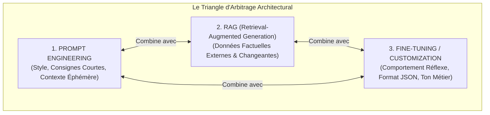
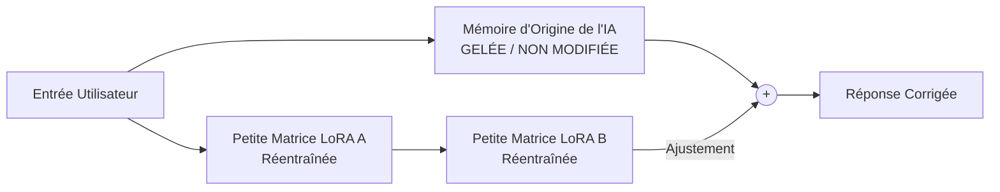
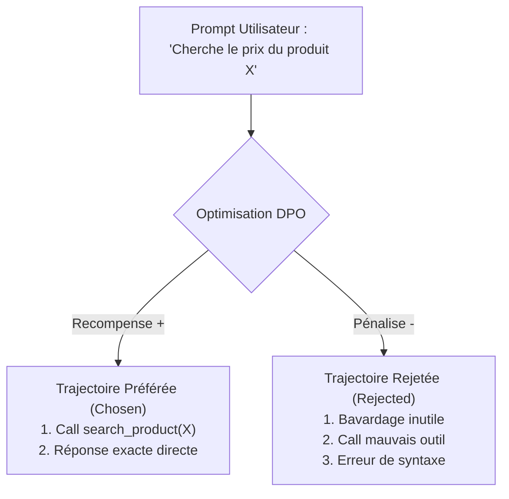
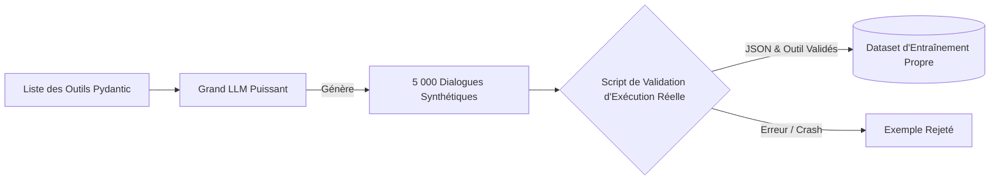
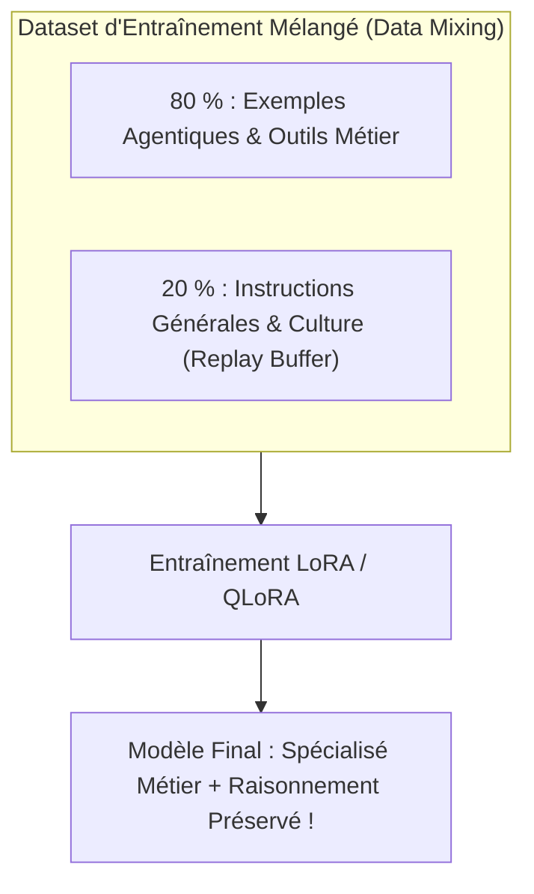
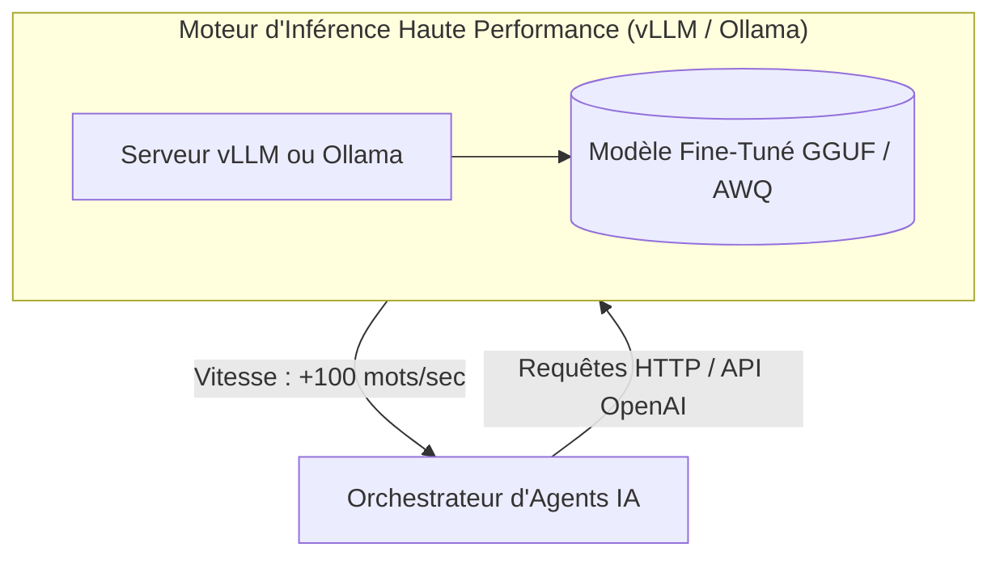

# Module 8 : Fine-Tuning & Customization des Modèles pour Agents IA

> [!ABSTRACT] Vision du Cours
> Dépendre exclusivement d'APIs propriétaires cloud (OpenAI, Anthropic) avec des consignes géantes est une impasse à grande échelle : cela coûte cher, génère de la latence, pose des problèmes de confidentialité des données et n'assure pas un respect à 100 % des formats structurés. La **personnalisation des modèles (*Model Customization*)** et le **Fine-Tuning spécialisé** (*LoRA, QLoRA, DPO*) permettent de réentraîner des modèles *Open-Weight* légers et autonomes (ex. Llama 3 8B, Qwen 2.5 7B, Mistral) pour leur apprendre nativement le suivi d'outils (*Tool Calling*), le respect strict des formats JSON et le ton métier de votre entreprise, tout en réduisant la taille des prompts de 80 %. Ce module enseigne la méthodologie d'arbitrage (Prompt vs RAG vs Fine-Tuning), les techniques d'entraînement économiques sur cartes graphiques accessibles, l'alignement des préférences agentiques via DPO, la création de jeux de données synthétiques, et le déploiement sur moteurs d'inférence ultra-rapides (vLLM, Ollama, GGUF). Aucun jargon mathématique complexe : chaque concept est vulgarisé avec clarté, une analogie du monde réel et un cas d'usage agentique concret.

> [!NOTE] 📑 Table des Matières
> - [[#1. 💡 Section 1 : La Théorie Accessible & Concepts Clés|1. Section 1 : La Théorie Accessible & Concepts Clés]]
>   - [[#1.1. Pourquoi et Quand Personnaliser un LLM pour un Agent IA ?|1.1. Pourquoi et Quand Personnaliser un LLM pour un Agent IA ?]]
>     - [[#1.1.1. Le Triangle d'Arbitrage : Prompt Engineering vs RAG vs Fine-Tuning|1.1.1. Le Triangle d'Arbitrage : Prompt vs RAG vs Fine-Tuning]]
>     - [[#1.1.2. Les bénéfices majeurs pour les architectures d'agents : Réduction des Prompts, garantie JSON, spécialisation métier & souveraineté|1.1.2. Les bénéfices majeurs pour les architectures d'agents]]
>   - [[#1.2. Les Différents Niveaux de Fine-Tuning|1.2. Les Différents Niveaux de Fine-Tuning]]
>     - [[#1.2.1. Full Parameter Fine-Tuning : Réentraîner 100 % des poids|1.2.1. Full Parameter Fine-Tuning]]
>     - [[#1.2.2. PEFT (Parameter-Efficient Fine-Tuning) : Entraîner des matrices d'adaptation légères|1.2.2. PEFT (Parameter-Efficient Fine-Tuning)]]
>     - [[#1.2.3. LoRA (Low-Rank Adaptation) & QLoRA (Quantized LoRA) : Le standard moderne|1.2.3. LoRA & QLoRA]]
>   - [[#1.3. Le Fine-Tuning pour le Suivi d'Instructions & Tool Calling (Function-Calling Fine-Tuning)|1.3. Le Fine-Tuning pour le Suivi d'Instructions & Tool Calling]]
>     - [[#1.3.1. Entraîner un modèle Open-Weight à exécuter nativement des fonctions et des outils|1.3.1. Entraîner un modèle Open-Weight au Tool Calling]]
>     - [[#1.3.2. Le formatage des jeux de données de conversation (Chat Formats / Turn-by-Turn)|1.3.2. Le formatage des jeux de données (Chat Formats)]]
>   - [[#1.4. L'Alignement des Préférences pour Agents (DPO / KTO)|1.4. L'Alignement des Préférences pour Agents]]
>     - [[#1.4.1. DPO (Direct Preference Optimization) : Apprendre la meilleure trajectoire d'action|1.4.1. DPO (Direct Preference Optimization)]]
>     - [[#1.4.2. Éliminer les comportements indésirables (boucles d'outils, bavardages inutiles)|1.4.2. Éliminer les comportements indésirables]]
> - [[#2. ⚡ Section 2 : Les Notions Avancées & Garde-Fous Opérationnels|2. Section 2 : Notions Avancées & Garde-Fous Opérationnels]]
>   - [[#2.1. Constitution & Curation des Datasets d'Agents|2.1. Constitution & Curation des Datasets d'Agents]]
>     - [[#2.1.1. Génération de données synthétiques (Self-Instruct / Agentic Synthetic Data)|2.1.1. Génération de données synthétiques]]
>     - [[#2.1.2. Curation des logs d'exécutions réelles : Nettoyage, anonymisation et dédoublonnage|2.1.2. Curation des logs d'exécutions réelles]]
>     - [[#2.1.3. Équilibre des données (Dataset Balance) : Diversifier les cas de succès et d'erreurs|2.1.3. Équilibre des données (Dataset Balance)]]
>   - [[#2.2. Prévenir les Risques du Fine-Tuning (Catastrophic Forgetting & Overfitting)|2.2. Prévenir les Risques du Fine-Tuning]]
>     - [[#2.2.1. L'Oubli Catastrophique (Catastrophic Forgetting) : Préserver le raisonnement général|2.2.1. L'Oubli Catastrophique (Catastrophic Forgetting)]]
>     - [[#2.2.2. Le Surapprentissage (Overfitting) : Empêcher le modèle de mémoriser aveuglement|2.2.2. Le Surapprentissage (Overfitting)]]
>     - [[#2.2.3. Technique de mélange de données (Data Mixing / Replay Buffers)|2.2.3. Technique de mélange de données (Data Mixing)]]
>   - [[#2.3. Fusion, Quantification & Inférence Locale Haute Performance|2.3. Fusion, Quantification & Inférence Locale Haute Performance]]
>     - [[#2.3.1. Fusion des adaptateurs LoRA (LoRA Adapter Merging) : Unifier le modèle|2.3.1. Fusion des adaptateurs LoRA]]
>     - [[#2.3.2. Conversion vers les formats d'inférence optimisés : GGUF, AWQ, EXL2|2.3.2. Formats d'inférence optimisés]]
>     - [[#2.3.3. Déploiement sur moteurs d'inférence haute performance (vLLM, Ollama)|2.3.3. Déploiement sur moteurs vLLM & Ollama]]
>   - [[#2.4. Évaluation & Validation Post-Fine-Tuning|2.4. Évaluation & Validation Post-Fine-Tuning]]
>     - [[#2.4.1. Évaluation comparative Avant / Après Fine-Tuning : Précision JSON, vitesse et coût|2.4.1. Évaluation comparative Avant / Après]]
>     - [[#2.4.2. Validation sur des tâches hors-distribution (Out-of-Distribution Testing)|2.4.2. Validation hors-distribution]]
> - [[#3. 📊 Section 3 : Fiche Synthèse / Tableau Récapitulatif|3. Section 3 : Fiche Synthèse & Check-list]]
>   - [[#3.1. Matrice Comparative des Techniques de Customization LLM|3.1. Matrice Comparative des Techniques]]
>   - [[#3.2. Check-list opérationnelle de l'Architecte Fine-Tuning pour Agents IA|3.2. Check-list opérationnelle]]
> - [[#4. Liens entre Notes|4. Liens entre Notes]]

---

## 1. 💡 Section 1 : La Théorie Accessible & Concepts Clés

> [!INFO] Chapeau de la Section 1
> Lorsqu'un agent IA doit exécuter des milliers d'appels d'outils par jour avec un respect absolu de formats structurés, s'appuyer uniquement sur du Prompt Engineering devient extrêmement coûteux et peu fiable. Cette première section introduit le modèle décisionnel d'arbitrage entre Prompting, RAG et Fine-Tuning, détaille le fonctionnement de l'entraînement économique (*PEFT, LoRA, QLoRA*), explique comment spécialiser un modèle Open-Weight au *Function-Calling*, et dévoile l'alignement des trajectoires d'agents via DPO (*Direct Preference Optimization*).

---

### 1.1. Pourquoi et Quand Personnaliser un LLM pour un Agent IA ?

> [!INFO] Chapeau de sous-section
> La personnalisation d'un LLM n'est pas un substitut au RAG ni au Prompt Engineering, mais un levier complémentaire qui redéfinit l'efficacité opérationnelle, la latence et l'indépendance financière d'un système d'agents IA.

---

#### 1.1.1. Le Triangle d'Arbitrage : Prompt Engineering vs RAG vs Fine-Tuning

Tout créateur d'Agents IA est confronté à la question fondamentale : **quelle technique utiliser pour transmettre une compétence ou une donnée à mon agent ?** Pour y répondre avec clarté, on utilise le **Triangle d'Arbitrage architectural** :



1. **Prompt Engineering (Module 2)** : Idéal pour définir le rôle, les contraintes éphémères de la session et le guidage de haut niveau. *Limites* : Répéter de longues consignes coûte cher à chaque requête et l'IA finit par dévier des consignes trop longues.
2. **RAG (Module 6)** : Idéal pour injecter des **connaissances factuelles fraîches, privées ou changeantes** (ex. le tarif d'un produit mis à jour ce matin, un dossier client). *Limites* : Le RAG apporte des documents de lecture, mais n'apprend pas à l'IA *comment* utiliser des outils complexes.
3. **Fine-Tuning (Module 8)** : Idéal pour imprégner **un format de sortie JSON strict, une syntaxe d'outils parfaite et un ton métier réflexe** directement dans la mémoire de l'IA.

| Besoin opérationnel | Prompt Engineering | RAG | Fine-Tuning |
| :--- | :--- | :--- | :--- |
| **Accéder à des documents d'entreprise frais** | 🔴 Inadapté | 🟢 **Idéal (Zéro Fine-Tuning)** | 🔴 Inefficace & Périmé vite |
| **Garantir 100 % de format JSON valide sans erreurs** | 🟡 Imprécis (85-90 %) | 🔴 Inadapté | 🟢 **Idéal (99.9 % de précision)** |
| **Apprendre un langage technique ou un ton métier** | 🟡 Coûteux en tokens | 🔴 Inadapté | 🟢 **Idéal (Ancré dans l'IA)** |
| **Réduire la taille des System Prompts de 80 %** | 🔴 Impossible | 🔴 Inadapté | 🟢 **Idéal (Règles intégrées)** |

> [!TIP] Analogie
> Imaginez le recrutement d'un **pilote de ligne** :
> - Le **RAG**, c'est donner au pilote la carte météo du jour et le plan de vol du matin (données externes éphémères).
> - Le **Prompt Engineering**, ce sont les consignes verbales données par la tour de contrôle avant le décollage.
> - Le **Fine-Tuning**, c'est l'**entraînement réflexe au simulateur de vol** pendant des mois : le pilote acquiert des réflexes si profonds qu'il sait exactement sur quel bouton appuyer en cas d'urgence sans relire le manuel.

> [!EXAMPLE] Exemple d'application : Arbitrage architectural
> **Agent de Calcul de Remboursement Santé** : Pour connaître les barèmes de la mutuelle révisés ce matin, l'agent utilise le **RAG**. Pour comprendre la consigne du jour de l'assuré, il utilise le **Prompt**. Mais pour transformer automatiquement les montants en un fichier JSON 100 % valide destiné au logiciel comptable sans jamais commettre d'erreur de syntaxe, l'agent s'appuie sur son modèle **Fine-Tuné**.

*Après avoir vu quand privilégier le Fine-Tuning face au RAG et aux Prompts, découvrons les 4 avantages financiers et techniques majeurs qu'il apporte à vos agents en entreprise.*

---

#### 1.1.2. Les bénéfices majeurs pour les architectures d'agents : Réduction des Prompts, garantie JSON, spécialisation métier & souveraineté

Lorsqu'on déploie une flotte multi-agents en entreprise (Module 3), l'utilisation de modèles génériques via API propriétaire montre rapidement 4 limites majeures que le Fine-Tuning permet de résoudre :

1. **Réduction drastique des Prompts (Gain Financier FinOps)** : Dans un agent classique, les consignes contiennent souvent 2 000 tokens d'exemples de formatage. En fine-tunant le modèle, toutes ces consignes sont intégrées directement dans la mémoire de l'IA. Le prompt initial passe de 2 000 à 50 tokens, générant **80 % d'économie sur chaque appel**.
2. **Garantie absolue du respect de schémas JSON et de Tool Calling** : Les modèles génériques commettent parfois des fautes de syntaxe dans la génération d'outils JSON (virgule manquante, guillemets mal fermés). Un fine-tuning ciblé fait passer le taux d'erreur de syntaxe de 15 % à **moins de 0,1 %**.
3. **Spécialisation métier & vocabulaire propre** : Le modèle apprend le jargon technique interne de l'entreprise (codes d'erreurs industriels, classifications médicales) sans avoir besoin de définitions dans le prompt.
4. **Souveraineté et confidentialité des données** : Fine-tuner un modèle *Open-Weight* autonome (ex. Llama 3 8B, Qwen 2.5 14B) permet de l'héberger sur vos propres serveurs privés : aucune donnée confidentielle ne quitte votre entreprise.

> [!TIP] Analogie
> **Le traducteur bilingue chevronné** : Un traducteur débutant doit lire un dictionnaire de 50 pages avant chaque phrase (Prompt géant). Le traducteur chevronné a fine-tuné son cerveau : il traduit instantanément et sans faute dans le jargon de l'entreprise.

> [!EXAMPLE] Exemple d'application : Bénéfices majeurs
> **Agent d'Extraction de Factures Médicales** : Au lieu de payer un service cloud 15 € pour 1 million de tokens avec un prompt géant de 3 000 tokens, l'entreprise fine-tune un modèle compact `Qwen 2.5 7B` sur 2 000 factures d'exemples. Hébergé en interne sur un petit serveur, l'agent répond en 150 ms avec un respect JSON de 100 %, pour un coût divisé par 20.

*Maintenant que les avantages stratégiques sont clairs, examinons les différentes méthodes techniques pour entraîner un modèle, du réentraînement complet à la méthode ultra-économique LoRA.*

---

### 1.2. Les Différents Niveaux de Fine-Tuning

> [!INFO] Chapeau de sous-section
> Réentraîner un modèle de langage ne nécessite plus de posséder un supercalculateur à des millions d'euros. Les techniques modernes d'efficacité paramétrique (PEFT) permettent d'adapter des LLM de pointe sur de simples cartes graphiques.

---

#### 1.2.1. Full Parameter Fine-Tuning : Réentraîner 100 % des poids

Le **Full Parameter Fine-Tuning** (Fine-Tuning complet) consiste à modifier **l'intégralité des milliards de paramètres** du cerveau d'origine du modèle.

- *Avantage* : Capacité de réécriture maximale du modèle.
- *Inconvénients majeurs* : 
  1. **Coût financier colossal** : Il faut mobiliser plusieurs gros serveurs équipés de cartes graphiques ultra-puissantes (des dizaines de milliers d'euros d'infrastructures).
  2. **Risque de tout faire oublier à l'IA** : Le modèle risque d'effacer ses connaissances générales si le jeu de données n'est pas gigantesque.

> [!TIP] Analogie
> **Démolir et reconstruire une maison entière** juste pour repeindre la couleur des murs du salon.

> [!EXAMPLE] Exemple d'application : Full Fine-Tuning
> **Laboratoire de Recherche en IA Médicale** : Un laboratoire entraînant un modèle de fondation de zéro sur 10 millions d'imagerie et comptes-rendus opératoires pour créer un modèle natif de chirurgie. Pour 99 % des applications d'entreprise, cette méthode est beaucoup trop lourde et inutile.

*Face au coût astronomique du réentraînement complet, les chercheurs ont inventé une méthode beaucoup plus intelligente : les adaptateurs légers (PEFT).*

---

#### 1.2.2. PEFT (Parameter-Efficient Fine-Tuning) : Entraîner des matrices d'adaptation légères

Pour éviter le coût prohibitif du réentraînement complet, la recherche a inventé la méthode **PEFT** (*Parameter-Efficient Fine-Tuning*).

Le principe est simple : **on verrouille complètement le cerveau d'origine de l'IA** (ses poids sont gelés et ne sont jamais modifiés) et on ajoute une **toute petite couche de mémoire à côté** (qui représente seulement 0,1 % de la taille du modèle).

Pendant l'entraînement, seule cette petite mémoire d'adaptation (appelée *adaptateur*) est modifiée. La consommation d'énergie et de mémoire est divisée par 10, et le fichier final ne pèse que quelques dizaines de mégaoctets au lieu de plusieurs gigaoctets.

> [!TIP] Analogie
> **Ajouter un petit bloc-notes d'astuces sur la couverture d'un grand manuel** : Au lieu d'imprimer à nouveau tout le manuel de 1 000 pages, vous collez juste un petit pense-bête sur la couverture contenant les 10 règles spécifiques à votre métier.

> [!EXAMPLE] Exemple d'application : Adaptateurs PEFT
> **Agent de Support Technique Informatique** : L'entreprise conserve le modèle d'origine intact et lui ajoute un petit adaptateur PEFT de 30 Mo contenant la liste des 50 codes d'erreur internes de l'entreprise.

*Parmi toutes les techniques d'adaptateurs légers, une méthode s'est imposée comme le standard mondial : LoRA et sa version compressée QLoRA.*

---

#### 1.2.3. LoRA (Low-Rank Adaptation) & QLoRA (Quantized LoRA) : Le standard moderne

Dans la famille PEFT, **LoRA** (*Low-Rank Adaptation*) et sa version compressée **QLoRA** sont devenus le standard industriel absolu.

##### 1. La mécanique de LoRA (*Low-Rank Adaptation*)
LoRA simplifie les calculs en décomposant les réglages en deux petites sous-matrices très minces. Au lieu de recalculer des millions de connexions complexes, LoRA ne règle qu'un petit nombre de paramètres clés, offrant **une réduction de 99 % de la charge de calcul**.



##### 2. QLoRA (*Quantized LoRA*) : Le Fine-Tuning sur simple carte graphique grand public
QLoRA pousse la sobriété encore plus loin :
1. Le modèle de base d'origine est **compressé en 4-bit** (format de haute sobriété) pour occuper un minimum de mémoire RAM sur la carte graphique.
2. Les petites matrices LoRA sont entraînées au-dessus avec une précision parfaite.

Grâce à QLoRA, il devient possible de fine-tuner un modèle complet de 8 milliards de paramètres (ex. Llama 3 8B) sur **une seule carte graphique d'ordinateur ou un serveur cloud à 0,50 € / heure**, tout en atteignant la même qualité qu'un réentraînement complet.

> [!TIP] Analogie
> **Le boîtier d'optimisation électronique** : LoRA, c'est comme brancher un petit boîtier électronique reprogrammable sur la prise diagnostic d'une voiture : le moteur d'origine reste inchangé, mais le petit boîtier règle l'injection pour adapter parfaitement la voiture à vos besoins.

> [!EXAMPLE] Exemple d'application : LoRA & QLoRA
> **Fine-Tuning d'un Agent Commercial** : Un consultant spécialisé réentraîne un modèle `Llama 3 8B` en 2 heures sur une simple carte graphique de PC portable grâce à QLoRA. Le résultat est un fichier adaptateur ultra-léger de 45 Mo qui s'active à la demande.

*La méthode LoRA/QLoRA choisie, voyons comment fabriquer le jeu de données d'apprentissage pour apprendre à l'agent à appeler des outils sans jamais commettre d'erreur.*

---

### 1.3. Le Fine-Tuning pour le Suivi d'Instructions & Tool Calling (Function-Calling Fine-Tuning)

> [!INFO] Chapeau de sous-section
> Entraîner un modèle pour un agent ne consiste pas à lui faire lire du texte au kilomètre, mais à lui apprendre la grammaire conversationnelle tour-par-tour (*Turn-by-Turn*) et la syntaxe d'appel d'outils.

---

#### 1.3.1. Entraîner un modèle Open-Weight à exécuter nativement des fonctions et des outils

Dans une boucle d'agent (Module 1 & Module 5), l'IA doit alterner avec une précision parfaite entre :
- Réfléchir à la situation (`Thought`).
- Émettre un ordre d'action JSON propre pour appeler un outil (`Tool Call`).
- Lire le résultat renvoyé par l'outil (`Observation`).
- Rédiger la réponse finale (`Final Answer`).

Le **Function-Calling Fine-Tuning** injecte des milliers d'exemples de ces cycles dans la mémoire de l'IA. À la fin de l'entraînement, le modèle sait naturellement qu'il **doit** générer un format JSON propre dès qu'une action est requise, sans bavardage superflu.

> [!TIP] Analogie
> **Le mécanicien et sa boîte à outils** : Le mécanicien expérimenté attrape la bonne clé à molette dans sa servante dès qu'il entend le bruit du moteur, sans hésiter ni chercher pendant 10 minutes.

> [!EXAMPLE] Exemple d'application : Tool Calling Fine-Tuning
> **Agent de Réservation de Billets de Train** : Dès que l'utilisateur dit *"Je veux aller à Lyon mardi matin"*, l'agent fine-tuné génère directement l'appel d'outil JSON `search_trains(destination="Lyon", date="2026-08-11", moment="matin")` sans ajouter de phrases parasites.

---

#### 1.3.2. Le formatage des jeux de données de conversation (Chat Formats / Turn-by-Turn)

Pour fine-tuner un modèle d'agent, les données doivent respecter une structure de dialogue tour-par-tour stricte (souvent au format JSONL), utilisant des rôles bien définis :

```json
{
  "messages": [
    {
      "role": "system",
      "content": "Tu es un Agent Support SQL. Tu exécutes des requêtes sécurisées via l'outil query_db."
    },
    {
      "role": "user",
      "content": "Donne-moi le nombre de clients inscrits en 2026."
    },
    {
      "role": "assistant",
      "tool_calls": [
        {
          "id": "call_9941",
          "type": "function",
          "function": {
            "name": "query_db",
            "arguments": "{\"query\": \"SELECT COUNT(*) FROM users WHERE created_at >= '2026-01-01'\"}"
          }
        }
      ]
    },
    {
      "role": "tool",
      "tool_call_id": "call_9941",
      "content": "{\"result\": 1420}"
    },
    {
      "role": "assistant",
      "content": "Il y a 1 420 clients inscrits en 2026."
    }
  ]
}
```

> [!WARNING] Le masque d'apprentissage (*Loss Masking*)
> Pendant l'entraînement, l'algorithme doit calculer la note d'apprentissage **uniquement sur les répliques de l'assistant** (`role: assistant`), et ne pas noter les questions de l'utilisateur ni les retours d'outils. L'IA doit apprendre à *générer* des ordres d'outils parfaits, pas à deviner ce que l'utilisateur va dire !

> [!TIP] Analogie
> **La pièce de théâtre** : Le comédien n'apprend par cœur que ses propres répliques sur le script, et non celles de ses partenaires de scène.

> [!EXAMPLE] Exemple d'application : Formatage tour-par-tour
> **Agent Support RH** : Structuration de 1 000 historiques de conversations où l'agent consulte la base des congés via l'outil `check_leave_balance` puis répond au salarié.

*Apprendre la syntaxe des outils par le Fine-Tuning est une première étape. Mais comment apprendre à l'agent à choisir la MEILLEURE décision parmi plusieurs réponses possibles ? C'est le rôle de l'alignement DPO.*

---

### 1.4. L'Alignement des Préférences pour Agents (DPO / KTO)

> [!INFO] Chapeau de sous-section
> L'optimisation directe des préférences (DPO) permet d'affiner le comportement d'un agent en lui montrant des paires de comparaison : une bonne méthode d'action qu'il doit imiter et une mauvaise qu'il doit rejeter.

---

#### 1.4.1. DPO (Direct Preference Optimization) : Apprendre la meilleure trajectoire d'action

Le Fine-Tuning classique apprend à l'IA à imiter des exemples. Mais il ne lui explique pas pourquoi certaines méthodes sont meilleures que d'autres.

La technique **DPO (*Direct Preference Optimization*)** fournit à l'IA des triplets de comparaison :
1. **La demande initiale de l'utilisateur**.
2. **La Trajectoire Préférée ($Chosen$)** : L'agent appelle le bon outil immédiatement, utilise un JSON minimaliste et résout le problème en 2 étapes.
3. **La Trajectoire Rejetée ($Rejected$)** : L'agent hésite, bavarde inutilement ou appelle un outil inadéquat.



L'algorithme DPO augmente automatiquement la probabilité que l'IA choisisse la trajectoire fluide ($Chosen$) et diminue celle de la trajectoire hésitante ($Rejected$).

> [!TIP] Analogie
> **La conduite accompagnée** : Le Fine-Tuning classique montre à l'apprenti conducteur comment passer les vitesses. Le **DPO**, c'est lui faire comparer deux vidéos : une conduite fluide (Préférée) vs une conduite avec des coups de frein inutiles (Rejetée) pour qu'il comprenne la nuance entre "savoir conduire" et "bien conduire".

> [!EXAMPLE] Exemple d'application : Alignement DPO
> **Agent de Recherche Commerciale** : Entraînement DPO récompensant l'agent qui consulte directement la fiche client en 1 clic, et pénalisant l'agent qui pose 3 questions inutiles au client avant de regarder son dossier.

---

#### 1.4.2. Éliminer les comportements indésirables (boucles d'outils, bavardages inutiles)

Grâce à DPO, l'architecte élimine les 3 plus grands défauts des agents IA :
- **Le bavardage de transition** : Supprimer les phrases parasites du type *"Bien sûr ! Je vais maintenant chercher dans la base de données..."* avant l'appel d'outil.
- **Les boucles d'outils répétitives** : Pénaliser l'agent s'il tente d'appeler deux fois d'affilée le même outil avec les mêmes paramètres.
- **L'invention d'informations** : Forcer l'agent à répondre honnêtement *"Information non trouvée"* plutôt qu'inventer un faux outil.

> [!TIP] Analogie
> **Le serveur de restaurant professionnel** : Il prend votre commande et part immédiatement en cuisine sans faire de longs discours inutiles à votre table.

> [!EXAMPLE] Exemple d'application : Élimination du bavardage
> **Agent Support Client E-Commerce** : Après alignement DPO, l'agent génère directement l'action d'annulation de commande sans afficher 3 lignes de politesses superflues qui ralentissaient le service.

*Maintenant que la théorie du Fine-Tuning et du DPO est posée, abordons la Section 2 : la préparation des données, la prévention des risques et l'hébergement local ultra-rapide.*

---

## 2. ⚡ Section 2 : Les Notions Avancées & Garde-Fous Opérationnels

> [!INFO] Chapeau de la Section 2
> La réussite d'un projet de Fine-Tuning dépend à 80 % de la qualité du jeu de données et de la rigueur du déploiement. Cette section détaille la création de jeux de données synthétiques, la prévention du surapprentissage (*Overfitting*) et de l'oubli catastrophique (*Catastrophic Forgetting*), la fusion des adaptateurs LoRA et le déploiement local à latence ultra-faible sur vLLM ou Ollama.

---

### 2.1. Constitution & Curation des Datasets d'Agents

> [!INFO] Chapeau de sous-section
> "Garbage in, Garbage out". Entraîner un modèle sur des exemples médiocres produit un agent médiocre. La constitution d'un jeu de données d'élite exige d'associer la génération synthétique contrôlée et le nettoyage rigoureux de logs réels.

---

#### 2.1.1. Génération de données synthétiques (Self-Instruct / Agentic Synthetic Data)

Pour fine-tuner un petit modèle local (ex. 7B ou 8B), on ne rédige pas 5 000 exemples à la main. On utilise un grand modèle d'IA très puissant (ex. GPT-4o, Claude 3.5) pour fabriquer des données synthétiques de haute qualité.

Le processus se déroule en 4 étapes simples :
1. **Fournir les outils** : Donner au grand modèle la liste des fonctions de votre entreprise.
2. **Inventer des scénarios (*Seed Tasks*)** : Demander au grand modèle d'inventer 1 000 questions d'utilisateurs variées.
3. **Générer le dialogue idéal** : Le grand modèle rédige la conversation parfaite tour-par-tour.
4. **Validation automatique** : Un programme informatique **exécute réellement** l'outil généré dans un environnement de test. Si l'outil plante ou renvoie une erreur JSON, l'exemple est jeté.



> [!TIP] Analogie
> **Le livre d'exercices corrigés** : Le professeur chevronné (Grande IA) rédige un manuel contenant 500 exercices corrigés sur mesure pour entraîner ses étudiants (Petite IA locale).

> [!EXAMPLE] Exemple d'application : Données synthétiques
> **Agent de Gestion de Stock Entreprise** : Génération synthétique de 3 000 scénarios de commandes d'outillage. Seuls les 2 700 scénarios dont les appels de fonctions JSON ont été validés avec succès par le logiciel de stock sont conservés pour l'entraînement.

*Outre les données générées artificiellement par une grande IA, examinons comment réutiliser les vraies conversations de vos utilisateurs en production.*

---

#### 2.1.2. Curation des logs d'exécutions réelles : Nettoyage, anonymisation et dédoublonnage

La deuxième source d'entraînement provient des **vraies conversations de vos agents en production**.

Cependant, avant d'injecter ces données, un nettoyage strict est obligatoire :
- **Effacer les données personnelles (Anonymisation PII)** : Supprimer automatiquement les noms, emails, numéros de cartes bancaires et mots de passe présents dans les dialogues.
- **Garder uniquement les réussites** : Ne conserver que les conversations où l'utilisateur a été satisfait ou où l'action a été validée sans erreur.
- **Dédoublonner** : Éliminer les questions identiques répétées 100 fois par jour pour ne pas biaiser l'apprentissage.

> [!TIP] Analogie
> **Le tamis du chercheur d'or** : Secouer le sable des conversations brutes pour ne conserver que les vraies pépites d'or d'exemples réussis.

> [!EXAMPLE] Exemple d'application : Curation des logs
> **Agent de Service Client Bancaire** : Nettoyage de 10 000 conversations de production réelles. Après suppression automatique des numéros de compte et filtrage des erreurs, 1 500 échanges parfaits sont conservés pour le Fine-Tuning.

*Une fois les données collectées, voyons comment composer un mélange équilibré pour éviter que l'agent ne devienne trop rigide.*

---

#### 2.1.3. Équilibre des données (Dataset Balance) : Diversifier les cas de succès et d'erreurs

Un bon jeu d'entraînement ne doit pas contenir uniquement des cas où tout se passe idéalement.

Il doit inclure un équilibre réfléchi :
- **70 % de trajectoires avec appel d'outils réussi** (Cas classique).
- **15 % de conversations simples sans aucun outil** (Pour que l'agent sache répondre directement sans appeler d'outil inutilement).
- **15 % de cas d'erreurs d'outils bien gérées** (Si l'outil renvoie une erreur "Produit non trouvé", l'agent explique le problème poliment au lieu de replanter).

> [!TIP] Analogie
> **L'entraînement du gardien de but** : Le gardien s'entraîne sur des tirs cadrés faciles (70 %), des ballons déviés difficiles (15 %) et des tirs hors-cadre (15 %) pour être prêt à toutes les situations du match.

> [!EXAMPLE] Exemple d'application : Équilibre des données
> **Agent d'Assistance Informatique IT** : Le jeu d'entraînement comprend 2 000 cas de réinitialisation de mot de passe réussie, 400 questions simples sur les horaires du support, et 400 cas où le serveur est en maintenance avec un message d'explication approprié.

*Le jeu de données étant prêt et équilibré, abordons les deux grands pièges lors de l'entraînement : l'oubli catastrophique et le surapprentissage.*

---

### 2.2. Prévenir les Risques du Fine-Tuning (Catastrophic Forgetting & Overfitting)

> [!INFO] Chapeau de sous-section
> Un entraînement trop agressif ou mal dosé peut transformer une IA intelligente en un automate rigide incapable de comprendre une phrase légèrement différente de son jeu d'entraînement.

---

#### 2.2.1. L'Oubli Catastrophique (Catastrophic Forgetting) : Préserver le raisonnement général

L'**Oubli Catastrophique** survient lorsque, à force de s'entraîner sur une tâche ultra-spécifique (ex. générer uniquement des requêtes SQL), l'IA **efface ses compétences générales** (comprendre le français, raisonner avec logique, répondre avec politesse).

L'agent devient un "idiot savant" : il génère du SQL parfait, mais s'effondre si l'utilisateur lui dit *"Bonjour, peux-tu m'expliquer ce résultat simplement ?"*.

> [!TIP] Analogie
> **L'étudiant sur-spécialisé** : Un étudiant qui révise tellement son examen de chimie pendant 3 mois qu'il en oublie la grammaire de sa propre langue maternelle.

> [!EXAMPLE] Exemple d'application : Prévention de l'oubli
> **Agent de Rédaction de Rapports Financiers** : S'assurer que le modèle conserve une qualité de rédaction fluide en français tout en apprenant la manipulation des tableaux de chiffres comptables.

*Après l'oubli catastrophique, étudions le deuxième risque majeur : le surapprentissage ou le parcoeurisme.*

---

#### 2.2.2. Le Surapprentissage (Overfitting) : Empêcher le modèle de mémoriser aveuglement

Le **Surapprentissage** se produit lorsque l'IA apprend par cœur les phrases exactes des exemples d'entraînement au lieu de comprendre la règle générale.

- *Symptôme* : Si l'utilisateur pose la question exacte du jeu de données, l'IA répond parfaitement. Si l'utilisateur reformule sa question avec d'autres mots, l'IA produit une réponse incohérente ou plante.

> [!TIP] Analogie
> **L'élève qui apprend par cœur le numéro des cases d'un QCM** : Si le professeur change l'ordre des questions le jour de l'examen, l'élève obtient la note de zéro.

> [!EXAMPLE] Exemple d'application : Prévention du surapprentissage
> **Agent de Recherche de Pièces Détachées Auto** : Vérifier que l'agent comprend aussi bien *"Je cherche un phare pour ma Clio 4"* que *"Il me faut l'optique avant gauche de Renault Clio IV"*.

*Pour prémunir le modèle contre ces deux pièges (oubli et parcoeurisme), nous appliquons une technique simple et efficace : le mélange de données (Data Mixing).*

---

#### 2.2.3. Technique de mélange de données (Data Mixing / Replay Buffers)

Pour protéger l'IA contre l'oubli et le surapprentissage, on applique la technique du **Data Mixing** (*Mélange de données*) :

On compose le jeu d'entraînement avec :
- **80 % de vos données métier agentiques** (Vos exemples de JSON et d'outils).
- **20 % de données de culture et d'instructions générales** (Extraits de jeux de données de conversation générale).



Ces 20 % de données générales servent d'**ancrage de sécurité** (*Replay Buffer*) qui force l'IA à conserver la souplesse de son cerveau d'origine.

> [!TIP] Analogie
> **Le footing de l'athlète** : L'athlète de haut niveau continue de faire du footing général tous les matins en plus de ses exercices de spécialité pour garder sa condition physique globale.

> [!EXAMPLE] Exemple d'application : Mélange de données
> **Agent de Relance de Factures Impayées** : Le jeu d'entraînement intègre 800 exemples de relances de paiement mélangés avec 200 exemples de dialogue généraliste pour maintenir une communication naturelle.

*L'entraînement étant terminé avec succès, découvrons comment assembler l'adaptateur LoRA avec le modèle d'origine et le compresser pour une inférence locale rapide.*

---

### 2.3. Fusion, Quantification & Inférence Locale Haute Performance

> [!INFO] Chapeau de sous-section
> Un modèle fine-tuné n'est utile que s'il est capable de délivrer ses réponses avec une vitesse ultra-rapide. Cette sous-section détaille l'assemblage final du modèle, sa compression et son hébergement local performant.

---

#### 2.3.1. Fusion des adaptateurs LoRA (LoRA Adapter Merging) : Unifier le modèle

À la fin de l'entraînement avec LoRA, vous obtenez deux éléments séparés :
1. Le modèle de base d'origine (ex. `Llama-3-8B`, ~16 Go).
2. La petite mémoire d'adaptation LoRA (ex. `adapter.safetensors`, ~50 Mo).

En production, exécuter cette double structure ralentit légèrement l'IA. On réalise donc la **Fusion d'adaptateur (*LoRA Merging*)** : on additionne mathématiquement la petite mémoire LoRA dans le cerveau d'origine et on enregistre un **nouveau modèle unifié et autonome**.

> [!TIP] Analogie
> **Fixer le calque sur le dessin** : Au lieu de garder la feuille de dessin d'origine et le calque transparent séparés, vous imprimez directement le dessin final fusionné sur une seule feuille.

> [!EXAMPLE] Exemple d'application : Fusion LoRA
> **Agent d'Analyse Juridique** : Fusion de l'adaptateur LoRA de 50 Mo avec le modèle `Llama 3 8B` pour créer le fichier modèle unifié `Llama3-Legal-8B` prêt à l'emploi.

*Le modèle étant fusionné, voyons comment le compresser (quantification) pour qu'il s'exécute à très grande vitesse sur vos serveurs.*

---

#### 2.3.2. Conversion vers les formats d'inférence optimisés : GGUF, AWQ, EXL2

Pour diviser la taille de l'IA par 4 et multiplier sa vitesse de réponse par 5, le modèle unifié est compressé (quantifié) dans un format optimisé :

1. **GGUF (Format universel CPU / Mac)** : Le format standard pour exécuter des agents sur des serveurs légers, des ordinateurs portables ou des puces Apple Silicon (Mac M1/M2/M3/M4) sans carte graphique dédiée.
2. **AWQ (Format GPU d'entreprise)** : Le format roi pour le déploiement sur cartes graphiques NVIDIA d'entreprise. Il offre une vitesse maximale tout en conservant une excellente précision.

> [!TIP] Analogie
> **La compression vidéo MP4** : Compresser un gros fichier vidéo 4K brut en format MP4 HD : la taille du fichier est divisée par 5, mais la qualité visuelle reste excellente sur votre écran.

> [!EXAMPLE] Exemple d'application : Formats optimisés GGUF/AWQ
> **Agent Embarqué sur PC Portable Commercial** : Conversion d'un modèle en format `GGUF 4-bit` de 4,5 Go, permettant à un commercial de faire fonctionner son agent en local sur son Mac portable lors de déplacements sans connexion internet.

*Une fois le modèle compressé au bon format, voyons sur quel moteur logiciel l'héberger pour répondre à vos utilisateurs en quelques millisecondes.*

---

#### 2.3.3. Déploiement sur moteurs d'inférence haute performance (vLLM, Ollama)

Le modèle compressé est enfin chargé dans un **Serveur d'Inférence Dédié** capable de traiter des dizaines de requêtes d'agents en parallèle à plus de 100 mots par seconde.



- **vLLM** : Le serveur d'inférence industriel le plus rapide. Il permet à un seul serveur d'exécuter des dizaines d'agents simultanément sans ralentissement.
- **Ollama** : La solution la plus simple pour lancer un modèle fine-tuné localement via une simple commande.

> [!TIP] Analogie
> **Les portillons automatiques de gare** : Remplacer un unique guichetier humain par une ligne de 20 portillons automatiques intelligents capable de faire passer 100 personnes en même temps.

> [!EXAMPLE] Exemple d'application : Inférence ultra-rapide vLLM
> **Agent Téléphonique Vocal en Temps Réel** : En déployant un modèle fine-tuné sur le moteur **vLLM**, l'agent génère les premiers mots de sa réponse en **45 millisecondes**, permettant d'avoir une vraie conversation orale naturelle sans aucun blanc gênant.

*Le modèle étant déployé et opérationnel sur vLLM, comment valider scientifiquement qu'il est meilleur que l'API d'origine avant d'ouvrir les vannes en production ? C'est la phase d'évaluation post-fine-tuning.*

---

### 2.4. Évaluation & Validation Post-Fine-Tuning

> [!INFO] Chapeau de sous-section
> Ne mettez jamais un modèle fine-tuné en production sur une simple impression favorable. Une méthode d'évaluation rigoureuse compare les résultats avant et après réentraînement sur un jeu de test étanche.

---

#### 2.4.1. Évaluation comparative Avant / Après Fine-Tuning : Précision JSON, vitesse et coût

Pour prouver l'efficacité du réentraînement, l'architecte prépare un **Jeu de Test Étanche** (200 questions que l'IA n'a *jamais* vues pendant son entraînement).

On teste ce jeu sur deux versions de l'IA :
- **Version A** : Modèle d'origine + Prompt long de 2 000 tokens.
- **Version B** : Modèle Fine-Tuné + Prompt court de 50 tokens.

On compare ensuite les résultats :

| Métrique d'Évaluation | Modèle d'Origine (Version A) | Modèle Fine-Tuné (Version B) | Objectif Visé |
| :--- | :--- | :--- | :--- |
| **Respect du format JSON** | 88.5 % | **99.8 %** | $\ge 99.5 \%$ |
| **Précision du choix d'outil** | 82.0 % | **96.5 %** | $\ge 95.0 \%$ |
| **Taille du Prompt initial** | 2 400 tokens | **150 tokens** | Réduction de 90 % |
| **Vitesse de réponse (vLLM)** | 25 mots/sec | **95 mots/sec** | Gain de vitesse x4 |

> [!TIP] Analogie
> **Le contrôle technique automobile** : La vérification complète qui mesure le freinage, la vitesse et la sécurité du véhicule avant de délivrer l'autorisation d'aller sur la route.

> [!EXAMPLE] Exemple d'application : Évaluation comparative
> **Agent de Saisie de Bordereaux de Transport** : Le test comparatif prouve que la version fine-tunée commet zéro faute de syntaxe JSON sur 200 essais, tout en répondant 4 fois plus vite.

*Dernier test avant la mise en production : vérifier la résilience de l'agent face à des situations imprévues ou piégées (hors-distribution).*

---

#### 2.4.2. Validation sur des tâches hors-distribution (Out-of-Distribution Testing)

Pour s'assurer que l'IA n'a pas appris bêtement par cœur (surapprentissage), on lui soumet des **questions piégées ou très différentes (*Hors-Distribution*)** :
- On pose des questions avec de fortes fautes d'orthographe, des demandes incohérentes ou des outils inexistants.
- **Comportement attendu** : L'agent fine-tuné doit réagir avec résilience (refuser poliment ou demander une précision) sans planter ni générer de code corrompu.

> [!TIP] Analogie
> **Le crash-test automobile** : Tester le comportement du véhicule lors de chocs sous des angles inhabituels pour vérifier la solidité de la structure.

> [!EXAMPLE] Exemple d'application : Validation hors-distribution
> **Agent de Réservation Hôtelière** : Soumission d'une demande d'un client rédigée en argot avec des dates impossibles (ex. 31 février). L'agent fine-tuné répond avec politesse en signalant l'erreur de date sans générer d'erreur système.

> [!SUCCESS] Feu Vert de Production
> Si le modèle fine-tuné atteint une précision d'outils $\ge 95\%$, un respect JSON $\ge 99.5\%$ et passe les tests piégés sans planter, l'architecte donne le **Feu Vert officiel** pour le déploiement en production.

*L'ensemble des concepts théoriques de l'arbitrage, de LoRA/QLoRA, des datasets, du DPO et du déploiement local étant maîtrisés, synthétisons ce module sous forme d'outils opérationnels.*

---

## 3. 📊 Section 3 : Fiche Synthèse / Tableau Récapitulatif

> [!INFO] Chapeau de la Section 3
> Cette dernière section résume l'ensemble du module sous la forme d'une matrice comparative des techniques de personnalisation et d'une check-list de déploiement en dix points pour réussir votre premier Fine-Tuning.

---

### 3.1. Matrice Comparative des Techniques de Customization LLM

| Technique | Complexité & Matériel | Coût Financier | Modification de la Mémoire IA | Cas d'usage idéal pour Agents IA | Analogie Clé |
| :--- | :--- | :--- | :--- | :--- | :--- |
| **Prompt Eng. + Few-Shot** | 🟢 Très faible (0 GPU) | 🔴 Élevé (Coût tokens récurrents) | 🔴 Aucune (0 %) | Prototypes rapides, consignes éphémères | Les consignes de la tour de contrôle |
| **RAG (Retrieval)** | 🟡 Moyenne (Base Vectorielle) | 🟡 Moyen (Serveur DB) | 🔴 Aucune (0 %) | Connaissances factuelles fraîches & documents | La carte météo du jour |
| **LoRA / QLoRA (SFT)** | 🟡 Accessible (1 carte GPU) | 🟢 Très faible (~2 € / run) | 🟢 Adaptateur léger (~0.1 %) | **Function Calling, Schémas JSON stricts, Prompts courts** | **Le boîtier d'optimisation électronique** |
| **Full Fine-Tuning** | 🔴 Extrême (Supercalculateur) | 🔴 Prohibitif (> 5000 €) | 🔴 Totale (100 %) | Création d'un modèle de zéro | Reconstruire toute la maison |
| **DPO / KTO** | 🔴 Élevée (Dataset de paires) | 🟡 Moyen (GPU modéré) | 🟢 Adaptateur léger (~0.1 %) | **Éliminer les boucles d'outils & le bavardage** | Le comparateur de vidéos de conduite |

> [!TIP] Règle de décision rapide
> Pour 95 % des besoins d'agents en entreprise, la combinaison gagnante est : **QLoRA (pour apprendre le format JSON et les outils) + RAG (pour lire les documents frais du jour)**.

---

### 3.2. Check-list opérationnelle de l'Architecte Fine-Tuning pour Agents IA

> [!SUCCESS] Les 10 points de contrôle avant de lancer l'entraînement et le déploiement d'un LLM personnalisé
> 1. **Arbitrage architectural validé** : Confirmation que le besoin concerne le *format* (JSON, Tool Calling, ton) et non l'accès à des *faits frais* (qui relève du RAG).
> 2. **Sélection du modèle de base Open-Weight** : Choix d'un modèle performant et adapté aux agents (ex. `Llama-3.1-8B-Instruct`, `Qwen-2.5-7B-Instruct`).
> 3. **Dataset structuré en format dialogue (*Turn-by-Turn*)** : Respect des rôles `system`, `user`, `assistant` et `tool`.
> 4. **Masquage de la note d'apprentissage (*Loss Masking*)** : Calcul des notes appliqué uniquement sur les répliques générées par l'assistant.
> 5. **Dataset équilibré** : Mélange de 70% de succès d'outils, 15% de dialogue direct et 15% de gestion d'erreurs d'outils.
> 6. **Technique du mélange de données (*Data Mixing*)** : Ajout de 20% de données d'instructions générales pour éviter l'oubli catastrophique.
> 7. **Entraînement sobre en QLoRA (4-bit)** : Configuration LoRA sur une seule carte graphique sans saturation mémoire.
> 8. **Fusion propre des adaptateurs (*LoRA Merging*)** : Assemblage du fichier LoRA et du modèle d'origine en un modèle unifié autonome.
> 9. **Quantification & Inférence sur vLLM** : Conversion du modèle au format AWQ ou GGUF et chargement sur le serveur d'inférence vLLM ou Ollama.
> 10. **Validation comparative effectuée** : Test démontrant un respect du format JSON $\ge 99.5\%$ et une vitesse de réponse 4 fois plus rapide.

---

> [!QUOTE] Principe final
> Le Fine-Tuning n'est pas une magie noire destinée à rendre un modèle omniscient ; c'est un **outil d'ingénierie de précision pour sculpter les réflexes décisionnels d'un agent**. En combinant la sobriété de **QLoRA**, la rigueur d'un jeu de données de **Function Calling** propre et la puissance d'un moteur local comme **vLLM**, l'architecte s'affranchit de la dépendance aux APIs propriétaires cloud, divise ses coûts par dix et garantit à ses agents une obéissance absolue aux formats de production.

---

## 4. Liens entre Notes
- Aller au [[00_MOC_MAITRISE_AGENTS_IA]]
- Fiche précédente : [[07_Reflexion_Auto_Amelioration_Et_Auto_Creation_Outils]]
- Fiche suivante : [[09_Human_In_The_Loop_Et_Supervision_Humain_Agent_Masterclass]]
