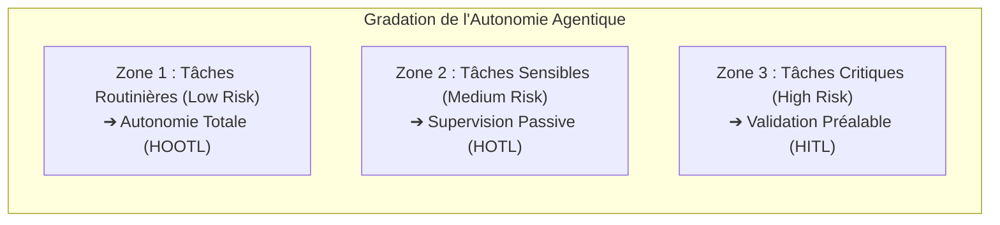
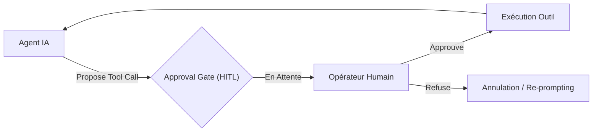
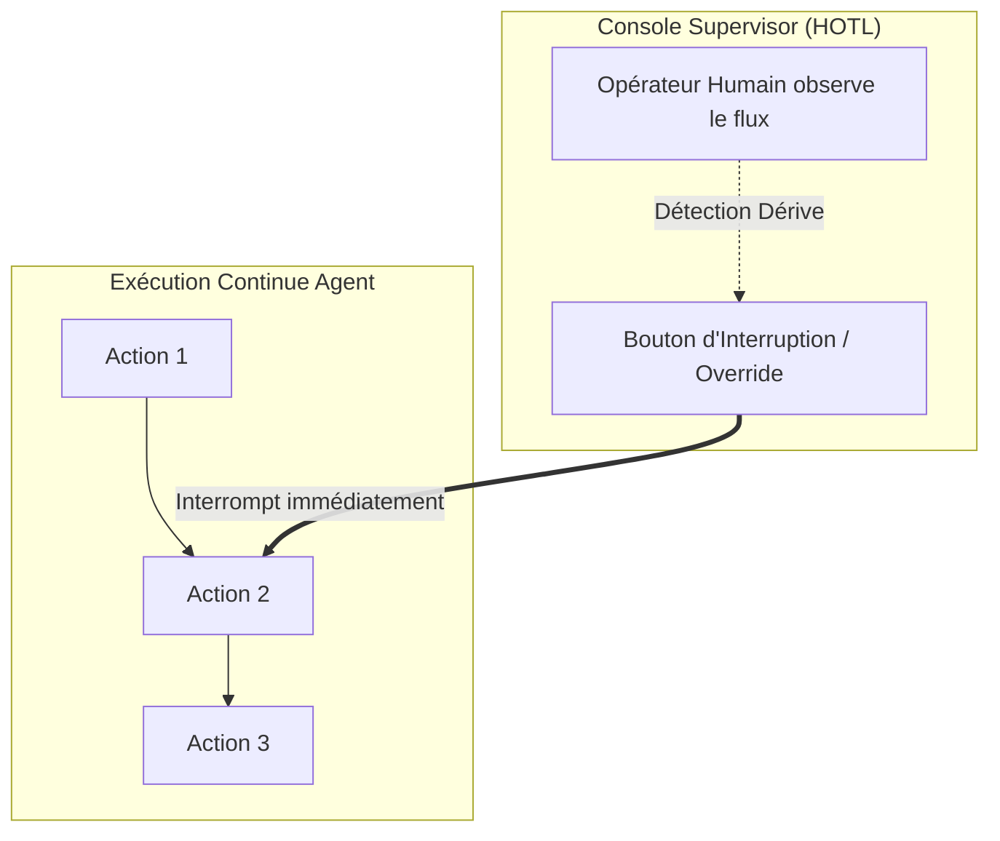
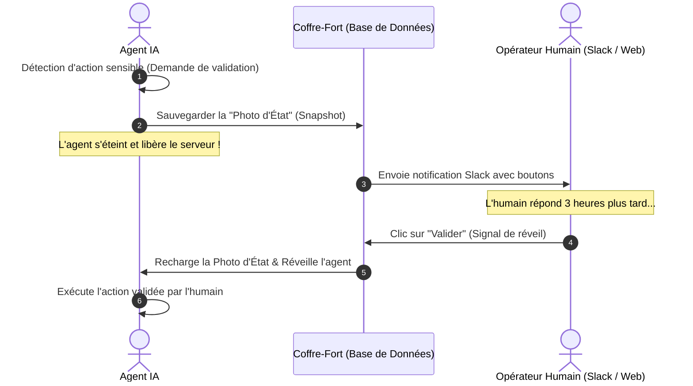
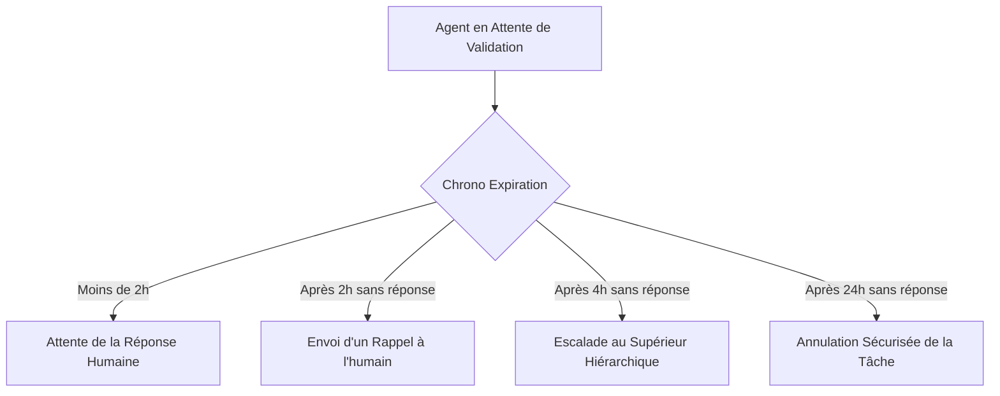
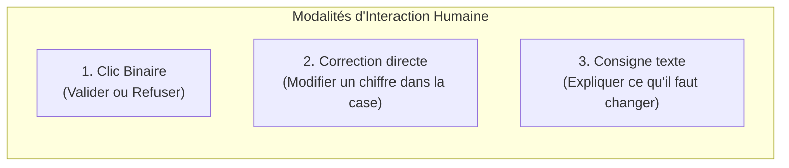
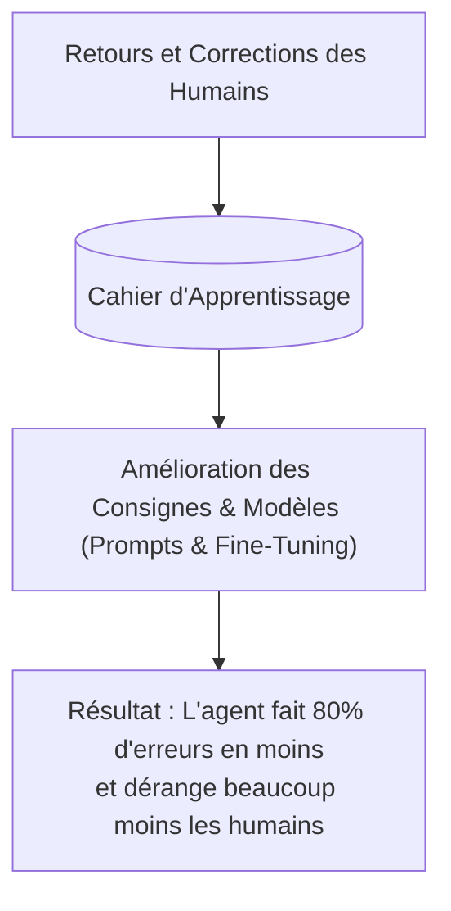
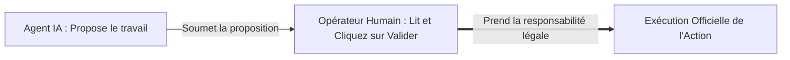

# Module 9 : Human-in-the-Loop (HITL) & Supervision Humain-Agent Masterclass

> [!ABSTRACT] Vision du Cours
> Abandonner un agent IA en autonomie totale sans aucun contrôle humain sur des actions critiques (virements bancaires, modifications de contrats, suppressions de données, envois d'emails massifs) est une imprudence industrielle majeure. La **Supervision Humain-Agent** et le motif **Human-in-the-Loop (HITL)** ne sont pas des freins à l'automatisation, mais le garde-fou fondamental qui rend le déploiement d'agents IA acceptable et sécurisé en entreprise. Ce module enseigne la théorie opérationnelle de la collaboration homme-machine, les 3 postures de supervision (*HITL, HOTL, HOOTL*), la définition chirurgicale des points de déclenchement (*Trigger Points*), l'architecture technique de pause et reprise asynchrone (*Snapshotting & Webhooks*), les modalités d'interaction (validation binaire, *Edit & Continue*, *Steering*), l'apprentissage continu par feedback (*Active Learning*) et l'établissement de registres d'audit inaltérables (*Audit Trails*). Aucun jargon mathématique inutile : chaque concept est illustré par une explication limpide, une analogie du monde réel et un cas d'usage agentique concret.

> [!NOTE] 📑 Table des Matières
> - [[#1. 💡 Section 1 : La Théorie Accessible & Concepts Clés|1. Section 1 : La Théorie Accessible & Concepts Clés]]
>   - [[#1.1. Pourquoi et Quand Intervenir ? Le Paradigme de la Supervision Humaine|1.1. Le Paradigme de la Supervision Humaine]]
>     - [[#1.1.1. Autonomie complète vs Supervision Humaine : Trouver le juste équilibre entre efficacité et contrôle|1.1.1. Autonomie complète vs Supervision Humaine]]
>     - [[#1.1.2. Pourquoi le HITL est indispensable en entreprise : Prévenir les actions irréparables|1.1.2. Pourquoi le HITL est indispensable en entreprise]]
>     - [[#1.1.3. La métaphore du copilote d'avion et de la double clé de validation bancaire|1.1.3. Métaphore du copilote et de la double clé]]
>   - [[#1.2. Les 3 Postures de Supervision Humain-Agent|1.2. Les 3 Postures de Supervision Humain-Agent]]
>     - [[#1.2.1. Human-in-the-Loop (HITL) : Validation préalable obligatoire par l'humain avant exécution|1.2.1. Human-in-the-Loop (HITL)]]
>     - [[#1.2.2. Human-on-the-Loop (HOTL) : Surveillance en temps réel avec bouton d'arrêt d'urgence|1.2.2. Human-on-the-Loop (HOTL)]]
>     - [[#1.2.3. Human-out-of-the-Loop (HOOTL) : Autonomie totale avec audit a posteriori|1.2.3. Human-out-of-the-Loop (HOOTL)]]
>   - [[#1.3. Les Déclencheurs d'Intervention Humaine (Trigger Points)|1.3. Les Déclencheurs d'Intervention Humaine (Trigger Points)]]
>     - [[#1.3.1. Seuil d'Incertitude (Confidence Score Threshold) : Demande d'aide quand le score baisse|1.3.1. Seuil d'Incertitude]]
>     - [[#1.3.2. Sensibilité de l'Action : Interruption automatique sur les opérations à fort impact|1.3.2. Sensibilité de l'Action]]
>     - [[#1.3.3. Détection d'Anomalies : Alerte en cas de comportement inattendu ou hors-cadre|1.3.3. Détection d'Anomalies]]
> - [[#2. ⚡ Section 2 : Les Notions Avancées & Garde-Fous Opérationnels|2. Section 2 : Notions Avancées & Garde-Fous Opérationnels]]
>   - [[#2.1. Architecture Technique de Pause & Reprise (State Persistence & Asynchronous Resume)|2.1. Architecture Technique de Pause & Reprise]]
>     - [[#2.1.1. Sérialisation complète de l'état de l'agent (Agent State Snapshotting)|2.1.1. Sérialisation de l'état de l'agent (Snapshotting)]]
>     - [[#2.1.2. Reprise asynchrone (Asynchronous Resumption) : Répondre plus tard sans bloquer le serveur|2.1.2. Reprise asynchrone]]
>     - [[#2.1.3. Politiques d'expiration et d'escalade (Timeout & Escalation Policies)|2.1.3. Politiques d'expiration et d'escalade]]
>   - [[#2.2. Canaux & Modalités d'Intervention Humaine|2.2. Canaux & Modalités d'Intervention Humaine]]
>     - [[#2.2.1. Canaux de communication : Slack, Teams, Tableaux de bord Web, Notifications Push|2.2.1. Canaux de communication]]
>     - [[#2.2.2. Modalités d'interaction : Approbation Binaire, Correction Guidée (Edit & Continue), Ré-orientation (Steering)|2.2.2. Modalités d'interaction]]
>   - [[#2.3. Apprentissage Continu par Feedback Humain (Active Learning)|2.3. Apprentissage Continu par Feedback Humain (Active Learning)]]
>     - [[#2.3.1. Constituer une base d'apprentissage avec les retours humains|2.3.1. Constituer une base d'apprentissage]]
>     - [[#2.3.2. Alignement continu : Rendre l'agent plus autonome mois après mois|2.3.2. Alignement continu]]
>   - [[#2.4. Auditabilité, Traçabilité & Responsabilité Légale|2.4. Auditabilité, Traçabilité & Responsabilité Légale]]
>     - [[#2.4.1. Registres d'audit inaltérables (Audit Trails) : La boîte noire des actions de l'agent|2.4.1. Registres d'audit inaltérables]]
>     - [[#2.4.2. Responsabilité partagée : Qui est responsable en cas d'erreur ?|2.4.2. Responsabilité partagée]]
> - [[#3. 📊 Section 3 : Fiche Synthèse / Tableau Récapitulatif|3. Section 3 : Fiche Synthèse & Check-list]]
>   - [[#3.1. Matrice Comparative des Postures de Supervision (HITL vs HOTL vs HOOTL)|3.1. Matrice Comparative des Postures]]
>   - [[#3.2. Check-list opérationnelle de l'Architecte HITL pour Agents IA|3.2. Check-list opérationnelle]]
> - [[#4. Liens entre Notes|4. Liens entre Notes]]

---

## 1. 💡 Section 1 : La Théorie Accessible & Concepts Clés

> [!INFO] Chapeau de la Section 1
> Déployer un agent IA en entreprise ne consiste pas à choisir aveuglement entre le 100 % manuel et le 100 % automatique. L'architecture moderne d'agents s'appuie sur une gradation de la supervision humaine. Cette première section pose le cadre décisionnel de l'intervention humaine, détaille les trois postures fondamentales de contrôle (*HITL, HOTL, HOOTL*), et définit la mécanique de déclenchement chirurgical des demandes de validation (*Trigger Points*).

---

### 1.1. Pourquoi et Quand Intervenir ? Le Paradigme de la Supervision Humaine

> [!INFO] Chapeau de sous-section
> La supervision humaine n'est pas un aveu de faiblesse de l'IA, mais le pilier de gouvernance qui permet de déléguer des tâches complexes à des agents tout en conservant une maîtrise absolue des risques en production.

---

#### 1.1.1. Autonomie complète vs Supervision Humaine : Trouver le juste équilibre entre efficacité et contrôle

L'ingénierie des agents IA est souvent victime d'une fausse dichotomie :
- Soit l'agent est conçu comme un **simple assistant de saisie** où chaque clic doit être validé par un humain (latence élevée, aucun gain de productivité).
- Soit l'agent est livré en **autonomie incontrôlée** (*Wild Agent*), capable de déclencher des appels d'outils irréversibles en arrière-plan sans avertissement.

L'**Architecte Système IA** cherche la zone d'équilibre optimale : la **Supervision Calibrée**. L'agent doit traiter en autonomie fluide 95 % des tâches répétitives à faible risque, mais savoir s'interrompre et passer le relais à un opérateur humain dès qu'il rencontre une décision critique, une ambiguïté majeure ou une action à fort impact.



*Maintenant que nous avons posé le principe de la supervision calibrée, analysons en détail pourquoi l'absence de HITL peut entraîner des catastrophes financières, juridiques ou de sécurité en entreprise.*

---

#### 1.1.2. Pourquoi le HITL est indispensable en entreprise : Prévenir les actions irréparables

Dans les systèmes logiciels traditionnels (ex. un formulaire web), les règles métiers sont déterministes. Dans un système fondé sur des LLM (Module 4), le comportement est probabiliste : il existe toujours une probabilité non nulle que le modèle interprète mal une consigne, subisse une hallucination ou soit victime d'une injection de prompt indirecte (Module 2).

Si cet agent dispose de droits d'accès en écriture (Module 5), une erreur probabiliste peut avoir des conséquences dévastatrices :
1. **Conséquences Financières** : Validation automatique d'un virement bancaire erroné ou génération d'une commande fournisseur de 100 000 € au lieu de 10 000 €.
2. **Conséquences Juridiques** : Envoi autonome d'un contrat engageant l'entreprise avec une clause de responsabilité illimitée.
3. **Conséquences Réputationnelles** : Publication d'un message public ou envoi d'un email de masse à des clients contenant des informations fausses.
4. **Conséquences de Sécurité** : Suppression définitive d'une base de données ou modification des droits d'accès d'un utilisateur.

Le motif **Human-in-the-Loop (HITL)** agit comme une **porte d'isolation étanche (*Safety Gate*)** : il autorise l'agent à préparer, calculer, rédiger et proposer l'action, mais réserve le déclenchement physique de l'action irréversible à la validation expresse d'un être humain responsable.

*Pour vulgariser cette nécessité de contrôle auprès de vos équipes métiers, appuyons-nous sur deux analogies fondamentales du monde réel.*

---

#### 1.1.3. La métaphore du copilote d'avion et de la double clé de validation bancaire

Pour faire comprendre le HITL à des équipes métiers ou des décideurs, deux analogies du monde réel s'imposent :

> [!TIP] Analogie 1 : Le Copilote d'Avion
> L'agent IA est le **pilote automatique de nouvelle génération** : il calcule la trajectoire, ajuste l'altitude et gère les paramètres de vol en temps réel (travail fastidieux). Mais lors des phases critiques (décollage, atterrissage, turbulences graves), le **commandant de bord humain** remet les mains sur le manche ou valide chaque décision importante du système.

> [!TIP] Analogie 2 : La Double Clé du Coffre-Fort Bancaire
> Dans une banque, l'ouverture d'un coffre haute sécurité nécessite l'insertion simultanée de deux clés distinctes. L'agent IA détient la **Clé n°1 (La proposition technique)** après avoir rassemblé et vérifié tous les dossiers ; l'opérateur humain détient la **Clé n°2 (La décision d'exécution)**. Le coffre ne s'ouvre que si les deux clés tournent ensemble.

> [!EXAMPLE] Cas d'usage agentique concret
> Un **Agent d'Indemnisation d'Assurance Automobile**. L'agent analyse les photos du sinistre via RAG Multimodal (Module 6), calcule le montant de l'indemnité d'après la grille tarifaire (1 450 €), prépare l'ordre de virement et rédige le courrier d'explication au client. Au lieu d'envoyer le virement directement, l'agent met la tâche en pause et affiche un bouton *"Valider le paiement de 1 450 €"* sur le tableau de bord du gestionnaire de sinistres. Le gestionnaire clique en 2 secondes après un coup d'œil rapide : l'agent a fait 99 % du travail, mais l'humain garde le contrôle financier.

*Une fois la nécessité du contrôle établie, il convient de classifier précisément les différentes formes que peut prendre la supervision humaine au sein de l'architecture.*

---

### 1.2. Les 3 Postures de Supervision Humain-Agent

> [!INFO] Chapeau de sous-section
> La supervision humaine s'articule autour de trois postures architecturales distinctes (HITL, HOTL, HOOTL), définies par le moment où l'humain intervient par rapport à l'exécution de l'action.

---

#### 1.2.1. Human-in-the-Loop (HITL) : Validation préalable obligatoire par l'humain avant exécution

Dans la posture **Human-in-the-Loop (HITL)**, le flux de contrôle de l'agent est **bloqué de manière synchrone ou asynchrone** devant une porte de validation (*Approval Gate*).

L'agent a généré la pensée et l'appel d'outil (`tool_call`), mais **l'exécution de la fonction est suspendue**. L'agent soumet sa proposition à l'humain. Tant que l'humain n'a pas explicitement répondu *"Approuvé"*, *"Refusé"* ou *"Modifié"*, l'outil n'est pas exécuté et l'agent ne peut pas poursuivre sa boucle.



- **Forces** : Sécurité absolue, 0 % d'action irréversible non désirée en production.
- **Limites** : Latence dépendante du temps de réaction humain, création de goulots d'étranglement si le volume de validations est massif.

> [!EXAMPLE] Quand utiliser le HITL ? (Exemple d'application)
> **Agent de Paiement et Virement Bancaire** : Lorsqu'un utilisateur demande à l'agent de régler une facture fournisseur de 15 000 €. L'agent rassemble le RIB, vérifie la facture, prépare l'ordre de virement JSON, puis **s'interrompt obligatoirement**. Le directeur financier reçoit une alerte Slack et doit cliquer sur "Approuver le virement de 15 000 €". Tant que le directeur n'a pas validé, l'argent ne quitte pas la banque.

*Si la posture HITL offre une sécurité maximale en bloquant l'agent avant l'action, voyons comment la deuxième posture, le Human-on-the-Loop (HOTL), permet d'exécuter des flux continus en temps réel tout en gardant un bouton d'arrêt d'urgence.*

---

#### 1.2.2. Human-on-the-Loop (HOTL) : Surveillance en temps réel avec bouton d'arrêt d'urgence

Dans la posture **Human-on-the-Loop (HOTL)**, l'agent s'exécute en autonomie continue, mais **sous le regard actif d'un opérateur** connecté à une console de supervision en temps réel.

L'humain ne valide pas chaque action au coup par coup (l'agent enchaîne les outils automatiquement), mais l'opérateur dispose d'un **Bouton d'Arrêt d'Urgence (*Emergency Kill Switch*)** et d'un mécanisme de **Prise de Contrôle (*Manual Override*)**. Si l'humain constate sur son écran que l'agent s'engage dans une mauvaise boucle ou commence à halluciner, il clique sur *Kill Switch* : l'agent est stoppé net et l'humain reprend la main sur la session.



- **Forces** : Latence nulle, débit d'exécution très élevé, idéal pour le traitement de volumes importants.
- **Limites** : Exige une attention humaine soutenue en temps réel (fatigue cognitive de l'observateur).

> [!EXAMPLE] Quand utiliser le HOTL ? (Exemple d'application)
> **Agent de Modération et Réponses aux Commentaires Live** : Lors d'un webinaire en direct suivi par 5 000 personnes, un agent répond automatiquement aux questions textuelles posées dans le chat. L'opérateur community manager observe sur son écran le flux des questions/réponses générées à grande vitesse. Si l'agent commence à mal interpréter une question sensible ou à bégayer, l'opérateur clique sur le bouton **Kill Switch / Override** pour stopper l'agent et reprendre la main directement sur le chat.

*Après avoir étudié le contrôle préalable (HITL) et la surveillance en temps réel (HOTL), examinons la troisième posture : l'autonomie totale contrôlée a posteriori (HOOTL).*

---

#### 1.2.3. Human-out-of-the-Loop (HOOTL) : Autonomie totale avec audit a posteriori

Dans la posture **Human-out-of-the-Loop (HOOTL)**, l'humain n'intervient **ni pendant ni avant** l'exécution. L'agent fonctionne de manière 100 % autonome, souvent en tâche de fond (cron job, worker d'arrière-plan).

La supervision s'effectue **a posteriori** : toutes les actions, pensées, appels d'outils et réponses de l'agent sont consignés dans un **Registre d'Audit inaltérable (*Audit Trail*)**. Des échantillons d'exécutions (ex. 5 % des sessions) sont relus quotidiennement par des auditeurs humains pour vérifier la qualité globale et nourrir le processus d'amélioration continue.

> [!EXAMPLE] Quand utiliser le HOOTL ? (Exemple d'application)
> **Agent Nocturne d'Indexation & Synthèse RAG** : Tous les soirs à 2h du matin, un agent parcourt automatiquement 500 nouveaux documents Notion et rapports PDF téléchargés par les équipes, les nettoie, génère leurs embeddings et met à jour la base vectorielle. Aucune validation humaine n'est nécessaire pendant la nuit. Le lendemain matin, l'équipe qualité consulte le journal d'audit (*Audit Trail*) pour vérifier que 100 % des documents ont été correctement traités.

| Critère | Human-in-the-Loop (HITL) | Human-on-the-Loop (HOTL) | Human-out-of-the-Loop (HOOTL) |
| :--- | :--- | :--- | :--- |
| **Moment de l'intervention** | **AVANT** l'action (Préalable) | **PENDANT** l'action (Temps Réel) | **APRÈS** l'action (A posteriori) |
| **Bloquant pour l'agent ?** | 🟢 Oui (Pause obligatoire) | 🔴 Non (Sauf si Kill Switch) | 🔴 Non (Autonomie 100 %) |
| **Niveau de risque métier** | 🔴 Élevé / Action Irréversible | 🟡 Moyen / Flux Continu | 🟢 Faible / Action Réversible |
| **Exemple typique** | Virement bancaire, Email de masse | Bot de modération Live Streaming | Classification de tickets N1 de nuit |

> [!TIP] Règle d'architecture
> Un même système multi-agents peut combiner les 3 postures : l'agent recherche des informations en **HOOTL**, rédige un rapport en **HOTL** sous les yeux de son manager, puis demande une validation **HITL** avant d'envoyer le document final au client.

*Savoir différencier les 3 postures permet désormais de répondre à la question clé : quels événements doivent automatiquement déclencher le passage en mode HITL ? C'est le rôle des Trigger Points.*

---

### 1.3. Les Déclencheurs d'Intervention Humaine (Trigger Points)

> [!INFO] Chapeau de sous-section
> Un bon système HITL ne demande pas l'avis de l'humain pour tout et n'importe quoi. Il s'appuie sur des déclencheurs stricts (*Trigger Points*) qui basculent l'agent en pause uniquement lorsque la situation l'exige.

---

#### 1.3.1. Seuil d'Incertitude (Confidence Score Threshold) : Demande d'aide quand le score baisse

Les LLM et les modules de classification peuvent associer un **score de confiance** ($0.0$ à $1.0$) à leurs prédictions ou à la pertinence des documents RAG extraits (Module 6).

Si l'agent évalue sa propre confiance sur une décision à une valeur inférieure à un seuil défini par l'architecte (ex. $\text{Confidence} < 0.80$), il s'interrompt automatiquement et émet une requête HITL : *"Je ne suis certain qu'à 65 % de la catégorie de ce document juridique. Merci de valider mon choix."*

```python
# Exemple de logique d'interruption sur Seuil de Confiance
if extraction_result.confidence_score < 0.80:
    trigger_hitl_pause(
        reason="Confidence score below threshold",
        current_state=agent_state,
        proposed_action=extraction_result.action
    )
```

> [!EXAMPLE] Exemple d'application : Seuil d'incertitude
> **Agent de Tri et Extraction de Mandats Immobiliers** : L'agent extrait les noms des propriétaires et montants de loyers sur des contrats scannés de mauvaise qualité. Sur un mandat gribouillé à la main, le module OCR/LLM évalue sa confiance d'extraction à $0.62$ (inférieure au seuil de $0.80$). L'agent s'interrompt et notifie l'assistant administratif : *"J'ai extrait un loyer de 1 250 € avec un score de confiance de 62%. Merci de vérifier l'image de la page 3 avant enregistrement."*

*Outre la baisse du score de confiance sur une décision, certains outils sont tellement sensibles par nature qu'ils doivent déclencher une interruption automatique, quel que soit le niveau de certitude de l'IA.*

---

#### 1.3.2. Sensibilité de l'Action : Interruption automatique sur les opérations à fort impact

Certains outils et fonctions sont classés comme **Critiques** dès leur conception dans le registre MCP (Module 5). Indépendamment du score de confiance du LLM (même s'il est sûr à 99.9 %), **la nature de l'action déclenche systématiquement le HITL**.

Exemples d'actions à sensibilité maximale :
- Appels de fonctions SQL de type `DELETE`, `UPDATE` ou `DROP`.
- Envoi d'un message vers une API externe publique (Slack, Email, SMS).
- Modification de données financières ou d'engagements contractuels.
- Modification des rôles de sécurité ou des clés d'accès (RBAC).

> [!EXAMPLE] Exemple d'application : Sensibilité de l'action
> **Agent d'Assistance Commerciale** : L'agent a le droit de lire le catalogue de produits, rechercher des tarifs et rédiger des brouillons de devis en autonomie complète (HOOTL). En revanche, l'action **"Envoyer un email officiel au client"** ou **"Appliquer une remise supérieure à 15 %"** est classée en **Sensibilité Maximale**. Dès que l'agent souhaite envoyer l'email final au client, le système se met en pause et demande une simple validation au responsable commercial.

*En plus du score de confiance et de la sensibilité de l'outil, le système doit aussi réagir aux comportements imprévus ou anormaux de l'agent : c'est la détection d'anomalies.*

---

#### 1.3.3. Détection d'Anomalies : Alerte en cas de comportement inattendu ou hors-cadre

Le système d'orchestration surveille la métrologie de l'agent (Module 11) et déclenche un débrayage HITL automatique en cas d'anomalie de comportement :
- **Anomalie de coût/volume** : L'agent tente d'exécuter un outil 50 fois d'affilée en moins de 30 secondes (détection de boucle).
- **Anomalie de format** : Le LLM génère une sortie qui viole 2 fois d'affilée le schéma Pydantic attendu.
- **Anomalie sémantique (Guardrail)** : Un filtre de sécurité (NeMo Guardrails, Llama Guard) détecte une tentative de jailbreak ou une dérive toxique dans les pensées de l'agent.

> [!EXAMPLE] Exemple d'application : Détection d'anomalies
> **Agent de Rédaction de Newsletters Marketing** : L'agent boucle de manière anormale en appelant l'outil `fetch_article_summary` 35 fois d'affilée en 10 secondes suite à un lien mort. Le système d'orchestration détecte l'anomalie de fréquence d'appel, coupe la boucle immédiatement et alerte le responsable marketing : *"L'agent est entré en boucle de répétition sur l'URL X. Exécution suspendue et passage en revue humaine."*

*Maintenant que les concepts et déclencheurs du HITL sont définis, abordons la Section 2 : l'architecture technique permettant d'arrêter un agent et de le relancer des heures plus tard sans faire crasher les serveurs.*

---

## 2. ⚡ Section 2 : Les Notions Avancées & Garde-Fous Opérationnels

> [!INFO] Chapeau de la Section 2
> Mettre un agent IA en pause pour attendre la réponse d'un humain souleve des questions très pratiques : Comment arrêter l'agent sans bloquer les serveurs ? Comment l'humain répond-il facilement ? Comment utiliser ces réponses pour rendre l'agent meilleur ? Et qui est responsable en cas d'erreur ? Cette section répond à ces questions de manière simple et concrète, avec des exemples pour chaque étape.

---

### 2.1. Architecture Technique de Pause & Reprise (State Persistence & Asynchronous Resume)

> [!INFO] Chapeau de sous-section
> Attendre une réponse humaine ne doit jamais paralyser l'informatique. Nous allons découvrir comment l'agent met son travail "au coffre", s'éteint pour ne pas consommer d'énergie, puis se réveille instantanément dès que l'humain donne son feu vert.

---

#### 2.1.1. Sérialisation complète de l'état de l'agent (Agent State Snapshotting)

Lorsqu'un agent rencontre une action sensible et doit s'interrompre, il effectue un **Snapshot d'État (*Photo Instantanée*)**. 

Au lieu de garder le logiciel ouvert, l'agent prend une "photo" complète de sa mémoire : ce que l'utilisateur lui a demandé, les recherches déjà effectuées, les pièces jointes lues et l'action exacte qu'il s'apprête à faire. Il range cette photo sous forme de fichier sécurisé dans une base de données.

> [!TIP] Analogie
> **Le marque-page dans un livre** : Quand vous devez arrêter de lire pour aller dîner, vous mettez un marque-page à la page 142 et vous refermez le livre. Vous n'avez pas besoin de laisser le livre ouvert à plat sur la table pendant tout le repas.

> [!EXAMPLE] Exemple d'application : Sauvegarde d'état (Snapshotting)
> **Agent d'Instruction de Crédit Immobilier** : L'agent a déjà analysé les bulletins de paie et l'avis d'imposition de l'emprunteur. Au moment d'envoyer la demande de validation du taux au directeur d'agence, il sauvegarde tout le dossier préparé dans la base de données. Même si le serveur est redémarré à midi, le dossier reste intact et prêt à être repris.

*Une fois cette photo d'état soigneusement rangée dans le coffre-fort de la base de données, découvrons comment l'agent s'éteint pour libérer le serveur et se réveille plus tard au moment précis où l'humain répond.*

---

#### 2.1.2. Reprise asynchrone (Asynchronous Resumption) : Répondre plus tard sans bloquer le serveur

Une fois la photo d'état enregistrée, l'agent **s'éteint complètement**. Le serveur informatique libère sa mémoire RAM et ses ressources. Aucune connexion ne reste bloquée en attente.

L'agent envoie une alerte à l'humain (par exemple une notification Slack ou un email avec un bouton d'action). Que l'humain réponde en 30 secondes ou 4 heures plus tard, son clic sur le bouton déclenche un "signal de réveil" (*Webhook*). Le système rallume un worker, recharge la photo d'état exacte depuis la base de données, et l'agent reprend sa tâche à la seconde près où il l'avait laissée.



> [!TIP] Analogie
> **Mettre une vidéo en pause sur sa TV** : Vous mettez un film en pause sur votre télévision le soir. Le lendemain, vous appuyez sur "Play" depuis l'application de votre téléphone portable : le film reprend exactement là où l'image s'était arrêtée.

> [!EXAMPLE] Exemple d'application : Reprise asynchrone (Async Resume)
> **Agent de Validation de Commandes Fournisseurs** : L'agent prépare un bon de commande de 8 000 € à 11h. Le directeur des achats, en déplacement, clique sur le bouton *"Approuver la commande"* depuis son smartphone sur Slack à 16h30. L'agent se réveille en 1 seconde et passe la commande sans qu'aucun serveur ne soit resté bloqué en attente pendant 5h30.

*Cette mécanique de mise en pause et de réveil fonctionne parfaitement tant que l'humain répond. Mais que se passe-t-il si l'humain oublie de répondre ou est absent ? C'est là que s'imposent les politiques d'expiration et d'escalade.*

---

#### 2.1.3. Politiques d'expiration et d'escalade (Timeout & Escalation Policies)

Si l'agent demande une validation à un responsable qui est en réunion, en congé ou qui oublie de répondre, la tâche ne doit pas rester bloquée pour toujours.

On configure des règles automatiques de gestion du temps (*Politiques de Timeout*) :
1. **Rappel automatique (ex: après 2 heures)** : Renvoyer une seconde notification d'alerte.
2. **Escalade hiérarchique (ex: après 4 heures)** : Envoyer la demande au supérieur hiérarchique (N+1).
3. **Annulation sécurisée (ex: après 24 heures)** : Annuler proprement la tâche et informer le demandeur que le délai de validation est dépassé.



> [!TIP] Analogie
> **Le recommandé à la Poste** : Si vous ne allez pas chercher votre lettre recommandée à la Poste dans un délai de 15 jours, le pli est automatiquement renvoyé à l'expéditeur.

> [!EXAMPLE] Exemple d'application : Expiration et Escalade
> **Agent de Demande de Congés Payés** : Un salarié demande un congé urgent pour le lendemain. L'agent sollicite le manager direct. Sans réponse au bout de 4 heures, l'agent transfère la demande de validation au Responsable RH de garde pour éviter que le salarié ne reste bloqué sans réponse.

*Maintenant que l'architecture de pause et de reprise est claire, voyons comment l'humain communique concrètement sa décision avec l'agent.*

---

### 2.2. Canaux & Modalités d'Intervention Humaine

> [!INFO] Chapeau de sous-section
> L'humain ne doit pas avoir à ouvrir un logiciel complexe pour répondre à l'agent. La supervision doit s'intégrer naturellement dans son outil de travail de tous les jours (Slack, Teams, Email, Page Web) et lui offrir des moyens simples de répondre.

---

#### 2.2.1. Canaux de communication : Slack, Teams, Tableaux de bord Web, Notifications Push

L'agent doit envoyer ses demandes de validation là où se trouvent déjà les équipes humaines :

1. **Messageries d'entreprise (Slack / Microsoft Teams)** : L'agent envoie une carte de notification directement dans une discussion avec des boutons cliquables *"Valider"* ou *"Refuser"*.
2. **Tableaux de bord Web (Dashboard)** : Une page web d'administration qui liste toutes les demandes en attente de validation dans l'entreprise, classées par urgence.
3. **Notifications Push Mobile** : Une alerte sur le smartphone du manager pour valider une urgence en un clic lors d'un déplacement.

> [!TIP] Analogie
> **La livraison à domicile** : Le livreur ne vous demande pas de venir chercher votre colis à l'entrepôt principal ; il vient directement frapper à votre porte d'entrée.

> [!EXAMPLE] Exemple d'application : Canaux de communication
> **Agent d'Alerte Incident Client VIP** : Dès qu'un client important signale un problème sur son compte, l'agent prépare une proposition de geste commercial et envoie une carte interactive dans le canal Slack `#validation-support` de l'équipe. Le responsable clique directement sur *"Valider l'envoi du bon d'achat de 50 €"* sans quitter Slack.

*Maintenant que nous savons par quels canaux (Slack, Teams, Web) contacter l'opérateur humain, étudions les 3 manières différentes qu'a l'humain de répondre à l'agent.*

---

#### 2.2.2. Modalités d'interaction : Approbation Binaire, Correction Guidée (Edit & Continue), Ré-orientation (Steering)

Intervenir ne veut pas toujours dire répondre par un simple "Oui" ou "Non". L'humain dispose de **3 façons de répondre** selon la situation :

##### 1. Approbation Binaire (*Approve / Reject*)
- **Approuver** : L'humain clique sur "Valider" ➔ L'agent exécute l'action telle quelle.
- **Refuser** : L'humain clique sur "Refuser" ➔ L'agent annule l'action.

##### 2. Correction Guidée (*Edit & Continue*)
L'agent propose une action avec des informations (ex. un montant de 5 000 €). L'humain repère une petite erreur : au lieu de tout refuser, **il modifie directement le chiffre dans la case de la fenêtre** (ex. 4 500 €) et clique sur "Valider". L'agent s'exécute immédiatement avec la valeur corrigée par l'humain.

##### 3. Ré-orientation (*Steering / Remarque en texte libre*)
L'humain refuse la proposition, mais ajoute une consigne en français : *"Refusé. Ne fait pas de remise de 20 %, propose seulement 10 % puis recommence."* L'agent lit la remarque de l'humain et adapte son travail.



> [!TIP] Analogie
> **Le chef cuisinier et son commis** : Le chef goûte la sauce préparée par le commis. Il peut dire "C'est parfait" (Binaire), rajouter lui-même une pincée de sel dans la casserole (Correction directe), ou dire au commis "Rajoute un peu de crème et réessaie" (Consigne texte).

> [!EXAMPLE] Exemple d'application : Modalités d'interaction
> **Agent de Rédaction de Devis Commercial** : L'agent prépare un devis de 5 000 €. Le commercial ouvre la notification. Grâce à la **Correction Guidée (Edit & Continue)**, il remplace 5 000 € par 4 500 € directement dans la case, puis clique sur "Valider". L'agent génère aussitôt le devis PDF officiel avec le montant exact de 4 500 €.

*Au-delà du contrôle immédiat, chaque décision humaine fournit une leçon précieuse pour rendre l'agent plus performant à l'avenir.*

---

### 2.3. Apprentissage Continu par Feedback Humain (Active Learning)

> [!INFO] Chapeau de sous-section
> Chaque correction apportée par un humain est une opportunité d'apprentissage. Nous allons voir comment enregistrer ces retours pour que l'agent s'améliore au fil du temps et demande de moins en moins d'aide.

---

#### 2.3.1. Constituer une base d'apprentissage avec les retours humains

Lorsqu'un opérateur humain valide, corrige ou refuse une proposition de l'agent, le système ne jette pas cette information. Il l'enregistre dans un **Cahier d'Erreurs et de Réussites (*Datastore de Feedback*)**.

Ce cahier conserve :
- Les propositions de l'agent qui ont été validées sans modification (bons exemples).
- Les erreurs de l'agent comparées aux corrections exactes apportées par l'humain (paires d'apprentissage).

> [!TIP] Analogie
> **Le cahier d'erreurs d'un élève** : L'élève note dans un carnet toutes les fautes corrigées par son professeur pendant les devoirs pour les relire avant l'examen.

> [!EXAMPLE] Exemple d'application : Base de feedback
> **Agent de Classement de Factures Comptables** : Au début, l'agent classe par erreur les factures d'électricité dans la catégorie "Fournitures de bureau". Le comptable humain corrige la catégorie en sélectionnant "Énergie". Le système enregistre automatiquement cette correction dans son cahier d'apprentissage.

*Une fois ce cahier de retours et de corrections constitué, voyons comment les développeurs l'utilisent concrètement pour rendre l'agent de plus en plus autonome mois après mois.*

---

#### 2.3.2. Alignement continu : Rendre l'agent plus autonome mois après mois

En relisant régulièrement ce cahier de retours humains, les développeurs mettent à jour les consignes de l'agent (*Prompts*) ou ré-entraînent le modèle (*Fine-Tuning DPO - Module 8*).

Au bout de quelques semaines d'apprentissage :
1. L'agent comprend mieux les règles subtiles de l'entreprise.
2. Son score de confiance augmente sur les tâches du quotidien.
3. Le nombre d'interventions humaines requises chute (ex: de 50 demandes par jour à seulement 5).



> [!TIP] Analogie
> **L'apprentissage de la conduite accompagnée** : Au début de l'apprentissage, le parent doit intervenir souvent sur le volant ou le frein. Après quelques mois de conseils et de corrections, l'apprenti conducteur maîtrise parfaitement les trajectoires et conduit de manière autonome.

> [!EXAMPLE] Exemple d'application : Alignement continu
> **Agent Support Client E-Commerce** : Grâce aux 300 corrections apportées par l'équipe support au cours du premier mois, la précision de l'agent passe de 70 % à 95 %. L'agent traite désormais 95 % des demandes simples sans déranger personne, et ne sollicite l'équipe que sur les 5 % de cas très particuliers.

*L'agent devient plus performant, mais une question essentielle demeure : qui est responsable juridiquement en cas de litige ou d'erreur ?*

---

### 2.4. Auditabilité, Traçabilité & Responsabilité Légale

> [!INFO] Chapeau de sous-section
> L'IA n'a pas de personnalité juridique : en cas d'erreur grave, la loi se tourne vers l'entreprise et l'humain qui exploite l'agent. Nous allons voir comment garder des preuves écrites infalsifiables et répartir clairement les responsabilités.

---

#### 2.4.1. Registres d'audit inaltérables (Audit Trails) : La boîte noire des actions de l'agent

Pour répondre aux normes de sécurité et de conformité (ex. *EU AI Act* européen, RGPD), tout système d'agent doit intégrer un **Registre d'Audit inaltérable (*Boîte Noire*)**.

Chaque fois qu'une validation humaine a lieu, le système enregistre automatiquement :
- L'heure et la date exactes de l'action.
- L'identité précise de l'humain qui a cliqué (nom, email, adresse IP).
- Ce que l'agent avait proposé et ce que l'humain a vu à l'écran.
- La décision exacte prise par l'humain (Approuvé, Refusé ou Modifié).

> [!TIP] Analogie
> **Le registre à l'entrée d'un bâtiment sécurisé** : Chaque visiteur doit inscrire son nom, la date, l'heure exacte d'arrivée et signer sur le registre du gardien avant de pouvoir franchir le portillon.

> [!EXAMPLE] Exemple d'application : Registre d'audit (Audit Trail)
> **Agent de Vérification de Conformité Banquaire (KYC)** : Lors d'un contrôle de la répression des fraudes deux ans plus tard, la banque peut extraire la fiche d'audit exacte prouvant que l'agent a soumis le dossier le 14 mars à 10h15, et que M. Martin (Responsable Conformité) a cliqué sur "Approuvé" à 10h17 après avoir vérifié la pièce d'identité du client.

*Au-delà de la conservation technique des preuves dans cette boîte noire (Audit Trail), examinons comment la loi découpe la responsabilité juridique entre l'agent IA et l'opérateur humain qui clique sur Valider.*

---

#### 2.4.2. Responsabilité partagée : Qui est responsable en cas d'erreur ?

Le motif Human-in-the-Loop établit une **délimitation juridique claire** :

1. **L'Agent IA** est un outil qui prépare et suggère un travail.
2. **L'Opérateur Humain** qui clique sur "Valider" accepte la proposition et **assume la responsabilité légale de l'exécution**.

En cliquant sur *"Valider"*, l'humain s'engage. C'est pourquoi les interfaces de validation doivent afficher des avertissements clairs (ex: *"En cliquant sur Valider, vous autorisez le paiement irréversible de 4 500 €"*).



> [!WARNING] Le piège du "Tampon Aveugle" (*Rubber-Stamping*)
> Si un opérateur humain prend l'habitude de cliquer sur "Valider" très vite sans rien lire, la sécurité du système est nulle. L'entreprise reste responsable des erreurs commises par son employé distrait.

> [!TIP] Analogie
> **La signature d'un chèque préparé par son comptable** : Le comptable a préparé le chèque et inscrit le montant, mais c'est le gérant qui signe. Si le chèque est fait au mauvais destinataire, c'est le gérant qui a signé qui est responsable vis-à-vis de sa banque.

> [!EXAMPLE] Exemple d'application : Responsabilité partagée
> **Agent de Rédaction de Contrats de Travail RH** : L'agent rédige un contrat d'embauche. La fenêtre de validation indique : *"En cliquant sur Valider, vous confirmez que le salaire et les dates sont exacts."* Le responsable RH valide. Si une erreur de salaire figurait dans le document, la responsabilité incombe au responsable RH qui a signé la validation, et non au logiciel IA.

*L'ensemble des notions de la Section 2 étant désormais claires et illustrées, résumons le module avec notre matrice comparative et notre check-list de déploiement.*

---

## 3. 📊 Section 3 : Fiche Synthèse / Tableau Récapitulatif

> [!INFO] Chapeau de la Section 3
> Cette dernière section résume l'ensemble du module sous la forme d'une matrice comparative des trois postures de supervision et d'une check-list de déploiement en dix points pour valider la mise en production de votre architecture HITL.

---

### 3.1. Matrice Comparative des Postures de Supervision (HITL vs HOTL vs HOOTL)

| Critère d'Architecture | Human-in-the-Loop (HITL) | Human-on-the-Loop (HOTL) | Human-out-of-the-Loop (HOOTL) |
| :--- | :--- | :--- | :--- |
| **Niveau de Risque Métier** | 🔴 **Critique / Irréversible** (Finances, Juridique, Suppressions) | 🟡 **Modéré / Flux Continu** (Modération, Monitoring Live) | 🟢 **Faible / Réversible** (Lecture RAG, Synthèses internes) |
| **Latence d'Exécution** | 🔴 Dépendante du temps humain (Minutes/Heures) | 🟢 Quasi-nulle (Temps réel) | 🟢 Ultra-rapide (Millisecondes) |
| **Coût Humain / Charge** | 🔴 Élevé (Validation au cas par cas) | 🟡 Moyen (Surveillance visuelle active) | 🟢 Nul lors du run (Seulement audit 5%) |
| **Mécanisme Technique** | **Approval Gate & Snapshotting Webhook** | **Console Live & Emergency Kill Switch** | **Background Execution & Audit Trail Logs** |
| **Exemple Concret** | Ordre de paiement de 10 000 € | Agent d'assistance téléphonique en direct | Indexation nightly de documents Notion |
| **Analogie Clé** | La double clé du coffre-fort bancaire | Le copilote avec la main sur le manche | Le rapport mensuel de l'inspecteur des impôts |

> [!TIP] Règle d'or de conception
> Commencez toujours par une posture **HITL stricte** lors des 3 premiers mois de déploiement d'un nouvel agent en production. Au fur et à mesure que les métriques d'évaluation (Module 12) et l'apprentissage par feedback prouvent la fiabilité de l'agent, **migrez progressivement les actions à faible risque vers du HOTL puis du HOOTL**.

---

### 3.2. Check-list opérationnelle de l'Architecte HITL pour Agents IA

> [!SUCCESS] Les 10 points de contrôle avant de déployer un système de supervision humain-agent
> 1. **Classification des outils par niveau de risque** : Identification claire des fonctions nécessitant une validation préalable obligatoire (HITL) vs celles s'exécutant en autonomie.
> 2. **Seuil d'incertitude configuré** : Interruption automatique de l'agent si son score de confiance est inférieur au seuil fixé (ex: $\text{Confidence} < 0.80$).
> 3. **Sérialisation d'état robuste (*Snapshotting*)** : Sauvegarde complète de la mémoire, des variables et de l'historique de l'agent en base de données (SQLite/Postgres) lors de la mise en pause.
> 4. **Reprise asynchrone par Webhooks (*Async Resume*)** : Capacité de couper le processus Python serveur pendant l'attente et de recharger l'état au clic sur un bouton d'action.
> 5. **Machine à états de Timeout & Escalade** : Politique d'expiration claire (rappel après 2h, annulation sécurisée ou fallback après 24h sans réponse).
> 6. **Multiplicité des canaux d'alerte** : Acheminement des demandes de validation sur les outils quotidiens des opérateurs (Slack, Teams, Dashboard Web, CLI).
> 7. **3 Modalités d'interaction disponibles** : Prise en charge de l'approbation binaire (*Yes/No*), de la correction d'argument (*Edit & Continue*) et du re-prompting (*Steering*).
> 8. **Pipeline d'Active Learning activé** : Capture automatique des corrections humaines pour constituer une base d'exemples Few-Shot et de datasets DPO.
> 9. **Registre d'Audit inaltérable (*Audit Trail*)** : Logging infalsifiable de l'horodatage, de l'identité SSO de l'opérateur, du Snaphot présenté et de la décision.
> 10. **Avertissement juridique explicite dans la modale** : Inscription claire des conséquences de l'action sur l'interface pour engager la responsabilité de l'opérateur humain.

---

> [!QUOTE] Principe final
> La supervision humaine n'est pas une béquille temporaire destinée à disparaître avec les progrès de l'IA ; c'est l'**interface de gouvernance permanente qui unit la vitesse d'exécution de l'agent à la responsabilité légale et éthique de l'humain**. Un bon architecte ne cherche pas à construire un agent 100 % autonome hors-sol, mais à concevoir une symphonie fluide où l'IA prépare le travail avec la précision d'un scalpel, et où l'humain conserve le pouvoir ultime de décision par la grâce d'un bouton de validation parfaitement intégré.

---

## 4. Liens entre Notes
- Aller au [[00_MOC_MAITRISE_AGENTS_IA]]
- Fiche précédente : [[08_Fine_Tuning_Et_Customization_Modeles_Agents_IA]]
- Fiche suivante : [[10_Persistence_Etat_Checkpoints_Reprise_Et_Time_Travel_Masterclass]]
