# Module 10 : Persistence d'État, Checkpoints, Reprise d'Agent & Time Travel Masterclass

> [!ABSTRACT] Vision du Cours
> Dans un environnement de production, les agents IA ne peuvent pas se permettre d'être éphémères. Ce module masterclass enseigne comment doter vos agents d'une **mémoire d'état persistante et résiliente**. Vous apprendrez à capturer automatiquement des **checkpoints**, à gérer la **reprise après un crash** ou une **pause Human-in-the-Loop**, à appliquer des **verrous de concurrence**, à faire voyager vos agents dans le temps avec le **Time Travel**, à forker des branches d'exécution (**State Forking**), et à gérer les **migrations de schéma d'état (v1 ➔ v2)** sans casser les sessions actives.

> [!NOTE] 📑 Table des Matières
> - [[#1. 💡 Section 1 : La Théorie Accessible & Concepts Clés|1. Section 1 : La Théorie Accessible & Concepts Clés]]
>   - [[#1.1. Pourquoi la Persistence d'État est Vitale pour les Agents IA ?|1.1. Pourquoi la Persistence d'État est Vitale pour les Agents IA ?]]
>     - [[#1.1.1. Le problème des agents sans état (Stateless Agents)|1.1.1. Le problème des agents sans état (Stateless Agents)]]
>     - [[#1.1.2. Définition du Checkpointing|1.1.2. Définition du Checkpointing]]
>     - [[#1.1.3. La métaphore des sauvegardes automatiques dans les jeux vidéo|1.1.3. La métaphore des sauvegardes automatiques dans les jeux vidéo]]
>   - [[#1.2. L'Anatomie d'un État d'Agent (Agent State Anatomy)|1.2. L'Anatomie d'un État d'Agent (Agent State Anatomy)]]
>     - [[#1.2.1. Qu'est-ce qu'on sauvegarde exactement ?|1.2.1. Qu'est-ce qu'on sauvegarde exactement ?]]
>     - [[#1.2.2. L'isolation par identifiants de session (thread_id / run_id)|1.2.2. L'isolation par identifiants de session (thread_id / run_id)]]
>   - [[#1.3. La Mécanique des Checkpointers (Checkpointer Architecture)|1.3. La Mécanique des Checkpointers (Checkpointer Architecture)]]
>     - [[#1.3.1. Le fonctionnement sous le capot (Step Hook / Middleware)|1.3.1. Le fonctionnement sous le capot (Step Hook / Middleware)]]
>     - [[#1.3.2. Checkpoint au niveau de la tâche vs au niveau de l'étape|1.3.2. Checkpoint au niveau de la tâche vs au niveau de l'étape]]
>     - [[#1.3.3. Synchronisation d'État Multi-Agents (Parent-Child State Sync)|1.3.3. Synchronisation d'État Multi-Agents (Parent-Child State Sync)]]
> - [[#2. ⚡ Section 2 : Les Notions Avancées & Garde-Fous Opérationnels|2. Section 2 : Les Notions Avancées & Garde-Fous Opérationnels]]
>   - [[#2.1. Sérialisation, Atomicité & Formats de Stockage|2.1. Sérialisation, Atomicité & Formats de Stockage]]
>     - [[#2.1.1. Sérialisation sûre : JSON et Pydantic vs Pickle|2.1.1. Sérialisation sûre : JSON et Pydantic vs Pickle]]
>     - [[#2.1.2. Écriture Atomique (Atomic Writes / Write-Ahead-Logging)|2.1.2. Écriture Atomique (Atomic Writes / Write-Ahead-Logging)]]
>     - [[#2.1.3. Migration de Schéma d'État & Rétrocompatibilité (v1 ➔ v2)|2.1.3. Migration de Schéma d'État & Rétrocompatibilité (v1 ➔ v2)]]
>     - [[#2.1.4. Choix des datastores de persistence (In-Memory, SQLite, Postgres, Redis)|2.1.4. Choix des datastores de persistence]]
>   - [[#2.2. Reprise Post-Crash, Reprise Post-Pause & Gestion de la Concurrence|2.2. Reprise Post-Crash, Reprise Post-Pause & Gestion de la Concurrence]]
>     - [[#2.2.1. Reprise automatique après crash (Crash Recovery / Fault Tolerance)|2.2.1. Reprise automatique après crash]]
>     - [[#2.2.2. Reprise post-pause HITL (Human-in-the-Loop Resume)|2.2.2. Reprise post-pause HITL]]
>     - [[#2.2.3. Verrous de Concurrence & Anti-Race-Conditions|2.2.3. Verrous de Concurrence & Anti-Race-Conditions]]
>   - [[#2.3. Time Travel, Reconstitution d'Événements & Branchement d'État|2.3. Time Travel, Reconstitution d'Événements & Branchement d'État]]
>     - [[#2.3.1. Le Time Travel (Voyage dans le Temps)|2.3.1. Le Time Travel (Voyage dans le Temps)]]
>     - [[#2.3.2. Reconstitution d'État par Flux d'Événements (Event-Sourcing / Event Delta Stream)|2.3.2. Reconstitution d'État par Flux d'Événements]]
>     - [[#2.3.3. Le Branchement d'État (State Forking / Rewind & Edit)|2.3.3. Le Branchement d'État (State Forking / Rewind & Edit)]]
>   - [[#2.4. Purge, Rétention & Sécurité des Checkpoints|2.4. Purge, Rétention & Sécurité des Checkpoints]]
>     - [[#2.4.1. Gestion du cycle de vie des sauvegardes (TTL & Chiffrement)|2.4.1. Gestion du cycle de vie des sauvegardes]]
>     - [[#2.4.2. Conformité RGPD et nettoyage des données personnelles|2.4.2. Conformité RGPD et nettoyage des données personnelles]]
> - [[#3. 📊 Section 3 : Fiche Synthèse / Tableau Récapitulatif|3. Section 3 : Fiche Synthèse / Tableau Récapitulatif]]
>   - [[#3.1. Matrice Comparative des Datastores & Métriques de Checkpointing|3.1. Matrice Comparative des Datastores & Métriques de Checkpointing]]
>   - [[#3.2. Check-list opérationnelle de l'Architecte de Persistence d'Agents IA|3.2. Check-list opérationnelle de l'Architecte de Persistence d'Agents IA]]
> - [[#4. Liens entre Notes|4. Liens entre Notes (Pied de page)]]

---

## 1. 💡 Section 1 : La Théorie Accessible & Concepts Clés

> [!INFO] Chapeau de la Section 1
> Lorsqu'un agent IA exécute un workflow complexe s'étalant sur plusieurs minutes ou plusieurs heures, la moindre panne de serveur, coupure réseau ou pause de validation humaine peut tout anéantir s'il n'existe aucun mécanisme de sauvegarde. Cette première section pose les bases théoriques indispensables de la persistence d'état : pourquoi les agents sans état sont inadaptés à la production, ce qu'est un checkpoint, comment se structure l'état interne d'un agent et comment s'articule la mécanique des checkpointers.

---

### 1.1. Pourquoi la Persistence d'État est Vitale pour les Agents IA ?

> [!INFO] Chapeau de sous-section
> Comprendre la vulnérabilité d'un agent IA sans état est le premier pas pour concevoir des architectures résilientes. Cette partie oppose le modèle stateless au modèle stateful basé sur le checkpointing.

---

#### 1.1.1. Le problème des agents sans état (Stateless Agents)

Dans la majorité des démonstrations simples, les agents IA fonctionnent de manière **sans état (*Stateless*)**. L'état complet de la conversation et de l'exécution est conservé uniquement en mémoire vive (RAM) temporaire le temps de la requête.

Si un agent exécute un plan en 15 étapes (ex. analyser 50 documents, faire 10 requêtes SQL et générer un rapport PDF) et que le serveur redémarre à l'étape 14 :
- **Perte totale de travail** : L'agent oublie tout ce qu'il a calculé pendant 20 minutes.
- **Explosion des coûts (FinOps)** : Toutes les étapes 1 à 13 doivent être réexécutées depuis le début, refaisant payer l'intégralité des jetons LLM et des appels API.
- **Incompatibilité HITL** : Impossible de mettre l'agent en pause pendant 4 heures le temps qu'un directeur humain valide une action sur Slack.

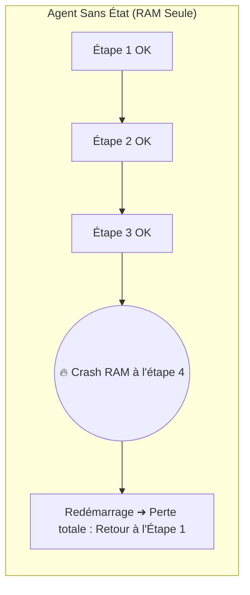

> [!TIP] Analogie
> **Rédiger une thèse sur un ordinateur sans disque dur** : Travailler avec un agent sans état, c'est comme rédiger un document de 200 pages dans un éditeur de texte qui n'a pas de bouton "Enregistrer". Si une coupure de courant survient à la dernière page, tout est perdu et vous devez tout retaper depuis le début.

> [!EXAMPLE] Exemple d'application : Le risque stateless en entreprise
> Un agent comptable analyse 500 factures mensuelles. À la 490e facture, une micro-coupure réseau interrompt le script. Sans persistence d'état, l'entreprise a dépensé 15 € de jetons LLM pour rien et doit relancer le traitement des 500 factures depuis le début.

*L'incompatibilité des agents sans état avec les contraintes industrielles impose d'introduire un mécanisme de capture automatique d'état : le checkpointing.*

---

#### 1.1.2. Définition du Checkpointing

Le **Checkpointing** désigne l'action d'enregistrer de manière automatique et transparente une "photographie" intégrale et sérialisée de l'état de l'agent dans une base de données permanente (base SQL, Redis ou fichier disque) à des moments clés de son exécution.

Chaque photographie enregistrée s'appelle un **Checkpoint**.

Un checkpoint contient l'état exact du système à l'instant $T$ :
- Les variables de travail et le contexte de l'agent.
- L'historique complet des réflexions et des outils appelés.
- L'étape exacte du graphe d'exécution à laquelle se trouve l'agent.

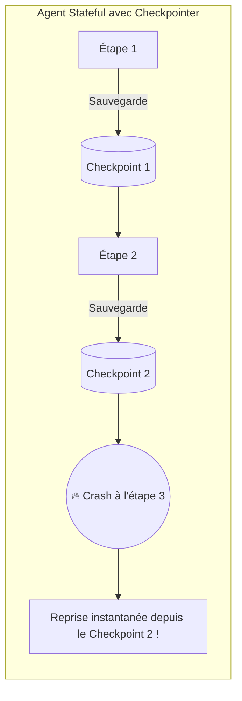

> [!TIP] Analogie
> **L'instantané photo du chantier de construction** : À la fin de chaque journée de travail, l'architecte prend une photo détaillée du chantier et note dans son registre l'emplacement exact de chaque brique et chaque outil. Si une tempête survient pendant la nuit, les ouvriers reprennent le travail le lendemain matin exactement là où la photo de la veille a été prise.

> [!EXAMPLE] Exemple d'application : Checkpoint automatique
> Dans un agent d'audit juridique, après la lecture et la synthèse de chaque clause contractuelle, le framework déclenche un `checkpoint`. Si le serveur crash à la clause 8, l'agent redémarre à la clause 8 en chargeant le dernier checkpoint de la base de données.

*Pour bien ancrer la dynamique du checkpointing chez les développeurs et les chefs de projet, la meilleure référence visuelle reste celle des jeux vidéo modernes.*

---

#### 1.1.3. La métaphore des sauvegardes automatiques dans les jeux vidéo

Pour comprendre intuitivement le checkpointing d'agent IA, pensez aux jeux vidéo d'aventure modernes :

- **Le point de contrôle (Checkpoint)** : Lorsque votre personnage franchit une porte ou bat un sous-boss, le jeu affiche un petit icône *"Sauvegarde automatique..."*. Si vous meurez 5 minutes plus tard, vous ne recommencez pas le jeu depuis le début de l'histoire, mais directement au niveau de cette porte.
- **La pause et reprise (Pause & Resume)** : Vous pouvez éteindre votre console en plein milieu d'une partie (Pause HITL), partir en vacances une semaine, et rallumer la console pour reprendre la partie exactement à la seconde où vous l'avez laissée.
- **La sauvegarde manuelle avant un choix risqué (Forking)** : Avant de combattre un boss difficile ou de faire un choix moral dans le jeu, vous créez une sauvegarde manuelle sur le slot A. Si votre choix se révèle mauvais, vous rechargez le slot A pour essayer la seconde option.

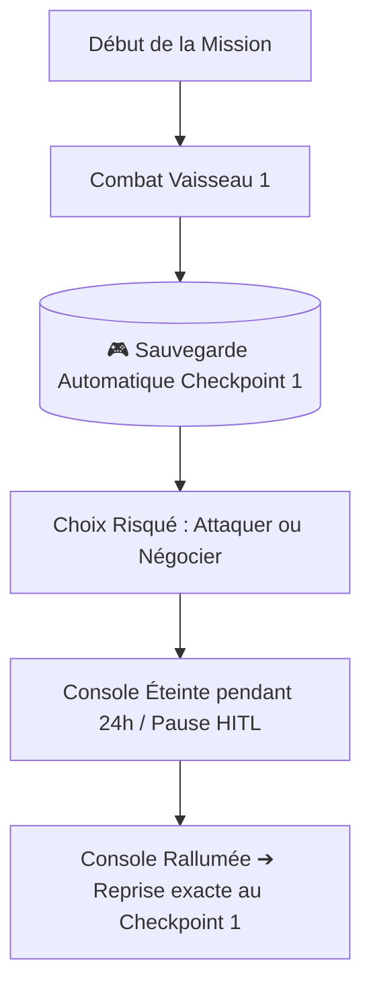

> [!TIP] Analogie
> **Le point de passage dans le jeu vidéo** : Le checkpoint d'agent IA est le point de passage lumineux posé sur le parcours de l'agent. Peu importe la violence du crash ou la durée de la pause humaine, l'agent renaît toujours au dernier point lumineux franchi.

*La notion de checkpoint étant clarifiée par l'analogie du jeu vidéo, étudions la composition exacte de cette photographie : l'anatomie de l'état d'un agent.*

---

### 1.2. L'Anatomie d'un État d'Agent (Agent State Anatomy)

> [!INFO] Chapeau de sous-section
> Un checkpoint ne se contente pas de sauvegarder du texte. Il capture une structure de données riche qui définit la mémoire, le contexte et l'identité d'exécution de l'agent à un instant donné.

---

#### 1.2.1. Qu'est-ce qu'on sauvegarde exactement ?

L'état d'un agent (*Agent State*) est un dictionnaire ou un objet Pydantic structuré qui regroupe **4 catégories de données critiques** :

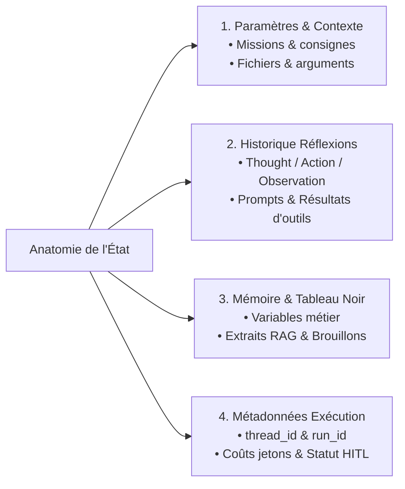

1. **Les paramètres et le contexte de la tâche (*Task Parameters*)** :
   - La consigne initiale reçue de l'utilisateur.
   - Les documents ou identifiants de fichiers associés.
2. **L'historique des réflexions et des outils (`Thought / Action / Observation`)** :
   - La liste ordonnée de tous les messages (utilisateur, assistant, outils, système).
   - Les arguments exacts transmis aux outils et leurs réponses brutes.
3. **La mémoire de session et le tableau noir (*Shared State / Blackboard*)** :
   - Les variables métier accumulées au fil de l'exécution (ex. `score_de_risque = 0.82`, `valideur = "Marie"`).
   - Les synthèses temporaires ou extraits de documents RAG en cache.
4. **Les métadonnées d'exécution (*Execution Metadata*)** :
   - L'identifiant unique de session (`thread_id`) et le numéro d'étape (`step`).
   - Le cumul de consommation des jetons LLM et des coûts financiers associés.
   - Le statut d'approbation (ex. `PENDING_HUMAN_APPROVAL`).

> [!TIP] Analogie
> **Le dossier médical du patient aux urgences** : Dans le dossier suspendu au lit du patient, le médecin trouve l'identité du patient (Métadonnées), le motif d'admission (Paramètres), la liste chronologique des examens passés et des médicaments injectés (Historique Réflexions & Outils) et les constantes actuelles comme la tension ou la température (Mémoire / Tableau Noir).

*Comprendre ce que contient l'état permet d'aborder sa gestion à grande échelle : comment isoler des milliers de conversations d'agents simultanées via les identifiants de session.*

---

#### 1.2.2. L'isolation par identifiants de session (thread_id / run_id)

Pour gérer des milliers d'agents travaillant en même temps pour des utilisateurs différents sans croiser leurs données, le système de checkpointing repose sur **deux niveaux d'identifiants uniques** :

1. **Le `thread_id` (Identifiant de Thread / Conversation)** :
   - Représente le canal de conversation ou la session globale de long terme.
   - *Exemple* : Une conversation spécifique entre l'utilisateur "Alice" et son agent assistant RH. Tous les checkpoints de cette conversation partagent le même `thread_id`.
2. **Le `run_id` (Identifiant d'Exécution / Tâche)** :
   - Représente un cycle d'exécution ou une tâche précise déclenchée au sein du thread.
   - *Exemple* : Alice demande à 14h00 d'analyser un CV (`run_id = 001`), puis à 15h00 d'envoyer un mail (`run_id = 002`).

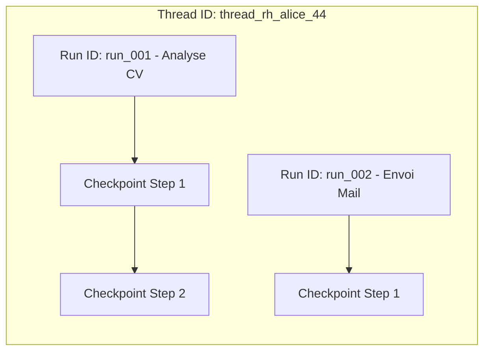

> [!TIP] Analogie
> **Le tiroir de classement et les chemises cartonnées** : Le `thread_id` est le **tiroir de meuble** portant le nom du client (ex. "Dossier Client Martin"). Le `run_id` est **chaque sous-chemise cartonnée** glissée dans ce tiroir pour traiter un problème spécifique à une date précise.

*Les composants de l'état et leurs identifiants de session étant posés, analysons le moteur applicatif qui réalise ces sauvegardes : la mécanique des checkpointers.*

---

### 1.3. La Mécanique des Checkpointers (Checkpointer Architecture)

> [!INFO] Chapeau de sous-section
> Un checkpointer est le composant d'arrière-plan responsable d'intercepter, de sérialiser et de persister l'état d'un agent sans alourdir le code métier du développeur.

---

#### 1.3.1. Le fonctionnement sous le capot (Step Hook / Middleware)

Sous le capot d'un framework agentique (ex. LangGraph, CrewAI, AutoGen), le checkpointer n'est pas appelé à la main à chaque ligne de code Python. Il fonctionne sous forme de **Middleware (ou Hook)** greffé directement sur la boucle d'exécution de l'agent.

À chaque fois que l'agent termine un tour de boucle ReAct ou franchit un nœud de son graphe d'exécution :
1. L'orchestrateur suspend temporairement l'exécution de l'agent pendant quelques millisecondes.
2. Le **Checkpointer Hook** extrait l'objet d'état courant.
3. Il calcule le hash du nouvel état et l'enregistre dans le datastore sous la clé `(thread_id, step)`.
4. L'orchestrateur reprend l'exécution de l'étape suivante.

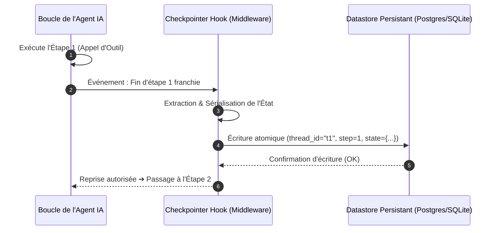

> [!TIP] Analogie
> **La boîte noire de l'avion** : Le pilote de l'avion (l'agent LLM) pilote l'appareil sans s'occuper d'enregistrer ses paramètres de vol. En arrière-plan, la boîte noire (le Checkpointer Hook) enregistre automatiquement la vitesse, l'altitude et les conversations toutes les secondes sans que le pilote n'ait à appuyer sur aucun bouton.

*Comprendre ce middleware d'arrière-plan pose la question du rythme de sauvegarde : faut-il enregistrer à chaque micro-action ou seulement à la fin d'une grande mission ?*

---

#### 1.3.2. Checkpoint au niveau de la tâche vs au niveau de l'étape

Un arbitrage fondamental pour l'architecte système concerne la **granularité des sauvegardes** :

1. **Checkpoint au niveau de l'étape (*Step-Level Checkpointing*)** :
   - L'état est sauvegardé à **chaque réflexion LLM** et après **chaque appel d'outil**.
   - 🟢 *Avantage* : Résilience absolue (en cas de crash, zéro seconde de travail perdue).
   - 🔴 *Inconvénient* : Nombre élevé d'écritures en base de données (latence d'écriture à surveiller).
2. **Checkpoint au niveau de la tâche (*Task-Level Checkpointing*)** :
   - L'état est sauvegardé uniquement lorsque l'agent valide **une sous-tâche complète** (ex. "Fiche de synthèse générée").
   - 🟢 *Avantage* : Performance maximale et très peu d'appels à la base de données.
   - 🔴 *Inconvénient* : Si l'agent crash au milieu d'une longue sous-tâche, il doit refaire les 3 dernières étapes de cette sous-tâche.

| Critère | Checkpoint au niveau de l'étape (Step-Level) | Checkpoint au niveau de la tâche (Task-Level) |
| :--- | :--- | :--- |
| **Résilience au crash** | 🟢 Maximale (Zéro perte de progression) | 🟡 Moyenne (Reprise au début de la tâche) |
| **Volume d'écriture DB** | 🔴 Élevé (1 écriture par tour ReAct) | 🟢 Faible (1 écriture par sous-ensemble) |
| **Cas d'usage recommandé** | Agents autonomes longs, outils coûteux, HITL | Micro-agents rapides, tâches déterministes courtes |

> [!TIP] Analogie
> **Marquer des points dans une course d'orientation** : Le *Step-Level* est comme poinçonner son carnet à chaque arbre remarquable croisé en forêt. Le *Task-Level* est comme poinçonner uniquement lorsqu'on atteint le sommet de chaque col de montagne.

> [!EXAMPLE] Exemple d'application : Step-Level vs Task-Level Checkpointing
> 
> - **Exemple Step-Level (Au niveau de l'étape)** : **Agent d'Investigation Financière**.
>   L'agent réalise 15 étapes ReAct complexes (interrogation d'API bancaires payantes, calculs de risques et requêtes SQL). L'état est sauvegardé après chaque micro-action (`Thought -> Action -> Observation`). Si le serveur crash au 14e tour, l'agent reprend directement au 14e tour sans ré-interroger les API payantes des étapes 1 à 13, économisant du temps et des jetons précieux.
> 
> - **Exemple Task-Level (Au niveau de la tâche)** : **Agent de Traitement par Lots de Documents**.
>   L'agent doit nettoyer la mise en page de 100 fichiers Markdown rapides (200 ms par fichier). Sauvegarder à chaque micro-action générerait 500 écritures SQL inutiles par minute. L'agent sauvegarde un checkpoint uniquement à la validation de chaque lot complet de 10 fichiers. Si un crash survient au 35e fichier, l'agent reprend au 30e fichier sans surcharger la base de données.

*La granularité d'un agent unique étant arbitrée, voyons comment se synchronisent les checkpoints lorsque plusieurs agents travaillent en équipe parent-enfant.*

---

#### 1.3.3. Synchronisation d'État Multi-Agents (Parent-Child State Sync)

Dans une architecture multi-agents hiérarchique (Module 3 et Module 7), un **Agent Manager (Parent)** délègue des sous-tâches à des **Agents Spécialistes (Enfants)**.

La persistence d'état pose ici un défi de synchronisation : comment s'assurer que le checkpoint de l'agent parent reste parfaitement cohérent avec les checkpoints de ses sous-agents enfants ?

La mécanique repose sur la **propagation d'état hiérarchique avec verrous** :
1. L'agent parent crée un checkpoint d'état d'attente (`PARENT_WAITING_CHILD`) et transmet un sous-identifiant `parent_thread_id / child_run_id` au sous-agent.
2. Le sous-agent enfant s'exécute avec son propre checkpointer local.
3. À la fin de sa mission, le sous-agent écrit son checkpoint final (`CHILD_COMPLETED`) et déclenche un **événement de fusion (State Merge Hook)**.
4. L'agent parent intercepte cet événement, fusionne le résultat dans son propre état et valide son nouveau checkpoint (`PARENT_RESUMED`).

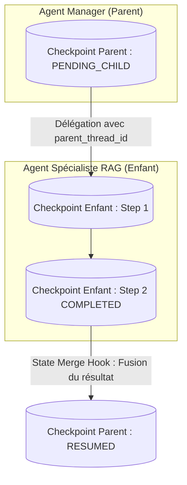

> [!TIP] Analogie
> **Le directeur d'entreprise et son chef de projet** : Le directeur (Agent Parent) note dans son livre de bord qu'il a confié l'étude de marché au chef de projet (Agent Enfant). Le chef de projet tient son propre journal de bord quotidien. Lorsqu'il remet son rapport final au directeur, celui-ci tamponne son propre journal de bord pour marquer la mission comme validée.

*Les concepts théoriques, l'anatomie de l'état et la mécanique des checkpointers étant maîtrisés, abordons la pratique de l'architecte : sérialisation, reprise après crash, verrous de concurrence et Time Travel.*

---

## 2. ⚡ Section 2 : Les Notions Avancées & Garde-Fous Opérationnels

> [!INFO] Chapeau de la Section 2
> La mise en production de checkpointers exige une rigueur d'ingénierie stricte. Cette seconde section aborde les 4 piliers avancés du checkpointing industriel : les choix de sérialisation et d'écriture atomique, la gestion de la reprise post-crash et des verrous de concurrence, la maîtrise du Time Travel et du forking d'état, et enfin la purge et la sécurité des données sensibles.

---

### 2.1. Sérialisation, Atomicité & Formats de Stockage

> [!INFO] Chapeau de sous-section
> Sérialiser l'état d'un agent consiste à convertir des objets Python vivants en octets stockables sur disque. Le choix du format, de la sécurité d'écriture et du datastore conditionne la stabilité et la sécurité du système.

---

#### 2.1.1. Sérialisation sûre : JSON et Pydantic vs Pickle

En Python, la tentation historique de nombreux développeurs est d'utiliser la bibliothèque native `pickle` pour sauvegarder des objets complexes en un clic. En production agentique, **l'usage de Pickle est une faute grave de sécurité**.

1. **Le danger absolu de Pickle (Injection de code RCE)** :
   - `pickle` ne sauvegarde pas seulement des données : il sauvegarde des instructions d'exécution de code Python.
   - Si un utilisateur malveillant parvient à modifier un checkpoint stocké dans votre base de données, la désérialisation via `pickle.loads()` exécutera du code arbitraire à votre insu (*Remote Code Execution*).
2. **La norme industrielle : JSON + Schémas Pydantic (`pydantic-settings` / `msgpack`)** :
   - Seules des données pures (chaînes de caractères, nombres, listes, dictionnaires) sont sérialisées en texte JSON ou en binaire ultra-rapide MsgPack.
   - La validation à la lecture est assurée par un **schéma Pydantic strict**, garantissant qu'aucune instruction de code ne peut être injectée.

| Format de Sérialisation | Sécurité | Lisibilité Humaine | Performance | Recommandation Production |
| :--- | :--- | :--- | :--- | :--- |
| **Pickle (`.pkl`)** | 🔴 Très Dangereux (Risque RCE) | 🔴 Non (Binaire brut) | 🟢 Rapide | ⛔ INTERDIT EN PRODUCTION |
| **JSON (`.json`)** | 🟢 Maximale (Données pures) | 🟢 Maximale (Texte clair) | 🟡 Moyenne | 🟢 Recommandé pour dev & audit |
| **Pydantic + MsgPack** | 🟢 Maximale (Validé par schéma) | 🟡 Binaire structuré | 🟢 Ultra-Rapide | 🟢 RECOMMANDÉ PRODUCTION |

> [!TIP] Analogie
> **Le colis postal inspecté vs le colis piégé** : Sérialiser avec JSON/Pydantic est comme recevoir une lettre en papier transparent : vous voyez les mots écrits sans aucun risque. Sérialiser avec Pickle est comme ouvrir un colis fermé sans l'inspecter à l'assommande : il peut contenir un objet utile ou une bombe qui explose à l'ouverture.

> [!EXAMPLE] Exemple d'application : Sérialisation sécurisée Pydantic
> **Agent Bancaire** : L'état de l'agent bancaire est validé à la désérialisation par `AccountState.model_validate_json(raw_checkpoint)`. Si un hacker a tenté d'injecter une commande Python dans le champ `balance`, Pydantic lève une exception de validation et refuse de charger le checkpoint altéré.

*La sécurité du format de sérialisation étant verrouillée, il faut garantir que l'écriture du fichier de sauvegarde ne soit jamais corrompue par une coupure de courant.*

---

#### 2.1.2. Écriture Atomique (Atomic Writes / Write-Ahead-Logging)

Une panne de serveur qui survient exactement pendant que le checkpointer écrit sur le disque peut couper le fichier de sauvegarde au milieu d'une ligne, rendant le checkpoint corrompu et inexploitable (*Partial Write Corruption*).

Pour garantir l'intégrité absolue des sauvegardes, les checkpointers industriels appliquent le principe d'**Écriture Atomique (*Atomic Writes*)** ou le journal d'écriture en avance (**Write-Ahead Logging / WAL**) :

1. **Technique du fichier temporaire + remplacement atomique** :
   Le checkpointer écrit le nouvel état dans un fichier temporaire masqué (`checkpoint_tmp_step4.json`). Une fois l'écriture 100 % achevée et vérifiée, le système de fichiers effectue un **renommage atomique instantané** vers `checkpoint_step4.json`. Si une panne survient pendant l'écriture, le fichier d'origine reste intact.
2. **Technique WAL (SQL / Postgres)** :
   La transaction SQL est inscrite dans un journal d'écriture sécurisé avant d'être appliquée à la table principale.

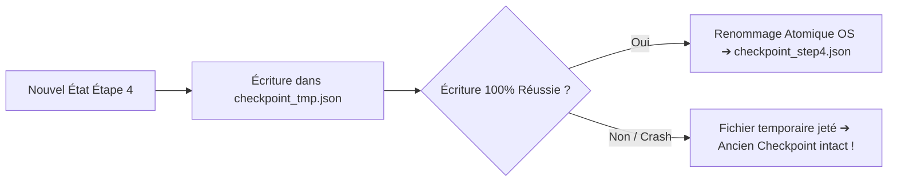

> [!TIP] Analogie
> **La signature du contrat en double exemplaire** : Avant de détruire l'ancien contrat de bail, le propriétaire rédigé le nouveau bail sur une feuille brouillon. Ce n'est qu'une fois la dernière signature apposée qu'il jette l'ancien contrat à la poubelle. Si le stylo tombe en panne au milieu de la rédaction, l'ancien bail reste le seul document valide.

> [!EXAMPLE] Exemple d'application : Écriture atomique en production
> Dans une application d'agent déployée sur Kubernetes, un nœud serveur est détruit brutalement par l'autoscaler pendant la sauvegarde de l'étape 12. Grâce aux écritures atomiques, le checkpointer n'a laissé aucun fichier corrompu. Le nouveau pod relancé charge le checkpoint parfait de l'étape 11 sans aucune erreur de syntaxe.

*Outre l'intégrité physique du fichier, le code Python de l'agent évolue au fil du temps. Comment gérer l'évolution des variables sans casser les sauvegardes existantes ? C'est le défi de la migration de schéma.*

---

#### 2.1.3. Migration de Schéma d'État & Rétrocompatibilité (v1 ➔ v2)

Dans une application vivante, les développeurs mettent fréquemment à jour le code de l'agent. Par exemple, la version 1 de l'état contenait la variable `user_name: str`, tandis que la version 2 la remplace par deux variables `first_name: str` et `last_name: str`.

Si 200 sessions d'agents sont en pause dans la base de données au format v1 et que l'application est déployée en v2, le chargement brut des anciens checkpoints déclenchera une erreur de validation Pydantic et fera crasher toutes les sessions en cours !

Pour éviter ce drame, l'architecte implémente un **Migrateur de Schéma d'État (*State Schema Migration*)** :

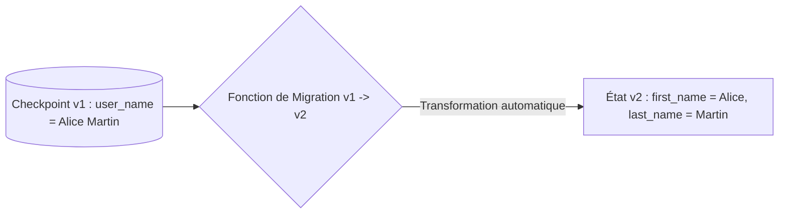

Les 3 règles d'or de la migration de schéma d'état :
1. **Horodatage et Versionnage de Schéma** : Chaque checkpoint enregistre la version de son schéma (ex. `"schema_version": 1`).
2. **Fonction de transition ascendante (*Upward Migration Hook*)** : Lors du chargement d'un checkpoint, si `schema_version < CURRENT_VERSION`, le checkpointer exécute automatiquement la fonction de conversion `migrate_v1_to_v2(old_state)`.
3. **Valeurs par défaut défensives** : Toute nouvelle variable ajoutée en v2 doit posséder une valeur par défaut (ex. `score: float = 0.0`) pour éviter d'échouer sur un ancien checkpoint où ce champ n'existait pas.

> [!TIP] Analogie
> **L'adaptateur de prise électrique pour voyageur** : Vous voyagez avec votre rasoir électrique acheté en France (Checkpoint v1). En arrivant aux États-Unis (Application v2), les prises murales ont une forme différente. Vous glissez un petit adaptateur universel (Fonction de migration) entre votre appareil et la prise pour que l'électricité circule parfaitement sans griller l'appareil.

> [!EXAMPLE] Exemple d'application : Migration d'état en production
> **Agent Support Client** : Lors de la mise à jour v2 de l'agent, un nouveau champ `priority_level: str = "MEDIUM"` est ajouté. L'agent de migration détecte les 50 checkpoints v1 en attente dans Postgres et injecte la valeur `"MEDIUM"` à la volée lors de la reprise, évitant tout crash de session.

*La sécurité, l'atomicité et la migration du format d'état étant maîtrisées, comparons les quatre datastores principaux pour héberger vos checkpoints.*

---

#### 2.1.4. Choix des datastores de persistence (In-Memory, SQLite, Postgres, Redis)

Le choix du support de stockage des checkpoints dépend du niveau de scalabilité, de la tolérance aux pannes et de l'architecture serveur ciblée :

1. **In-Memory Checkpointer (`MemorySaver`)** :
   - *Description* : Les checkpoints sont stockés dans un dictionnaire Python en RAM.
   - *Usage* : Tests unitaires, prototypage rapide et démonstrations locales.
   - 🔴 *Attention* : Redémarrer le script efface 100 % des sauvegardes.
2. **SQLite Checkpointer (`SqliteSaver`)** :
   - *Description* : Les checkpoints sont enregistrés dans un fichier base de données léger `.sqlite` local.
   - *Usage* : Outils CLI embarqués, applications de bureau et projets mono-serveur.
   - 🟢 *Avantage* : Zéro serveur à configurer, persistance parfaite sur disque local.
3. **Postgres Checkpointer (`PostgresSaver`)** :
   - *Description* : Stockage dans une base relationnelle robuste et hautement disponible.
   - *Usage* : Production industrielle, architectures multi-workers et applications d'entreprise.
   - 🟢 *Avantage* : Supporte des millions de transactions, requêtes SQL de recherche sur l'historique et verrous distants.
4. **Redis Checkpointer (`RedisSaver`)** :
   - *Description* : Stockage en mémoire vive distribuée avec persistance asynchrone sur disque (RDB/AOF).
   - *Usage* : Applications agentiques à très haute fréquence et très faible latence.
   - 🟢 *Avantage* : Temps de lecture/écriture inférieurs à la millisecondes, idéal pour les TTL d'expiration rapide.

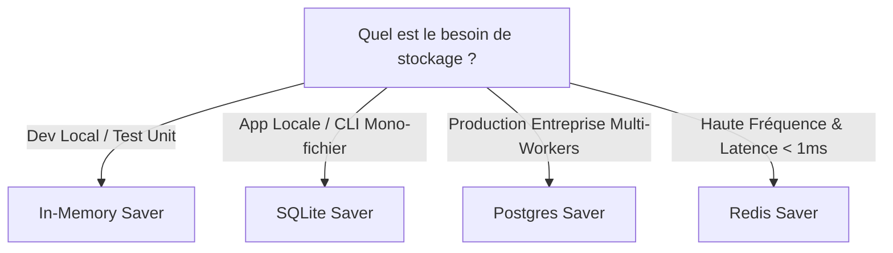

> [!TIP] Analogie
> **Les 4 conteneurs de rangement** :
> - *In-Memory* = Le tableau blanc effaçable de la salle de réunion (tout s'efface quand on éteint la lumière).
> - *SQLite* = Le cahier de notes en papier posé sur votre bureau personnel.
> - *Postgres* = La salle d'archives blindée et ignifugée du siège social d'une banque.
> - *Redis* = Le casier automatique à ouverture par empreinte digitale dans une gare TGV (accès ultra-rapide).

*Une fois le datastore de persistance sélectionné, étudions la dynamique de reprise après une interruption : crash serveur, pause humaine ou accès concourant.*

---

### 2.2. Reprise Post-Crash, Reprise Post-Pause & Gestion de la Concurrence

> [!INFO] Chapeau de sous-section
> La valeur ajoutée majeure d'un système stateful réside dans sa capacité à faire repartir un agent instantanément après une panne ou une pause, tout en empêchant les accès simultanés conflictuels.

---

#### 2.2.1. Reprise automatique après crash (Crash Recovery / Fault Tolerance)

Lorsqu'un serveur hébergeant un agent IA crash en plein milieu d'un traitement (panne matérielle, coupure de courant, dépassement de mémoire RAM), le système de **Reprise Post-Crash (*Crash Recovery*)** orchestre le redémarrage automatique en 3 étapes :

1. **Détection de la rupture** : Le gestionnaire de tâches (ex. Celery, Temporal ou Kubernetes) détecte l'arrêt brutal du worker.
2. **Requête du dernier checkpoint valide** : Le nouveau worker lancé interroge le datastore : `GET_LATEST_CHECKPOINT(thread_id="t44")`.
3. **Réhydratation de l'agent** : L'orchestrateur injecte cet état dans l'agent et relance la boucle à l'étape $N+1$.

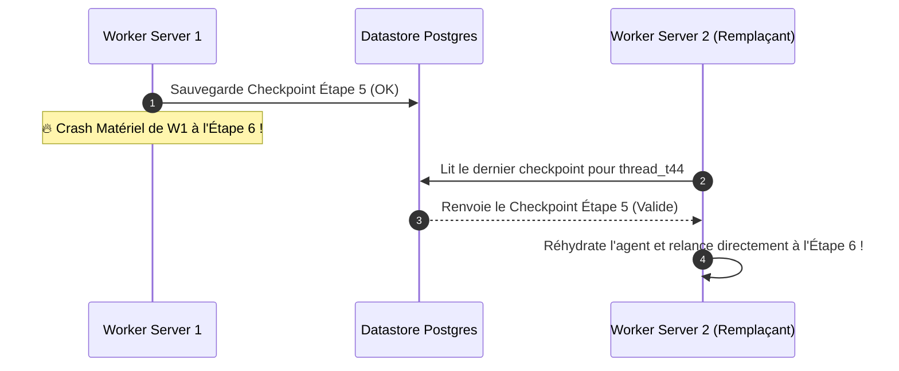

> [!TIP] Analogie
> **Le relais d'athlétisme après une chute** : Le premier coureur (Worker 1) s'effondre sur la piste en passant le témoin. Le second coureur (Worker 2) ramasse le témoin exactement là où il est tombé et reprend la course immédiatement sans repasser par la ligne de départ.

> [!EXAMPLE] Exemple d'application : Gain FinOps massif post-crash
> Un agent d'analyse financière a exécuté 45 minutes de traitements d'outils complexes (coût : 8,50 € de jetons LLM). Le serveur crash. Grâce à la reprise post-crash, l'agent reprend à la 45e minute et termine sa tâche en 2 minutes pour 0,10 € supplémentaire, au lieu de gaspiller 8,50 € en retapant tout le processus.

*La reprise post-crash répond aux pannes imprévues. La reprise post-pause répond quant à elle aux interruptions volontaires du workflow : les validations Human-in-the-Loop.*

---

#### 2.2.2. Reprise post-pause HITL (Human-in-the-Loop Resume)

Comme étudié dans le Module 9, les opérations sensibles (virement bancaire, envoi d'email de masse, suppression de données) exigent une **validation humaine explicite**.

Grâce au checkpointing, la mise en pause et la reprise s'effectuent sans maintenir aucun serveur en charge :
1. **Passage en statut `INTERRUPTED`** : Avant d'exécuter l'outil sensible, l'agent enregistre un checkpoint avec le statut `PENDING_HUMAN_APPROVAL` et stoppe son exécution. Les ressources serveur (CPU/RAM) sont libérées à 100 %.
2. **Attente indéterminée** : La session peut rester endormie dans le datastore pendant 5 minutes ou 3 semaines.
3. **Réveil par événement externe (`Resume Payload`)** : Lorsque le valideur humain clique sur *"Approuver le virement"* dans son interface Web ou Slack, l'application envoie une requête de réveil : `resume_agent(thread_id, approval_status=True)`.
4. **Réinjection et exécution** : L'orchestrateur charge le checkpoint, injecte la décision de l'humain dans l'état et poursuit l'exécution.

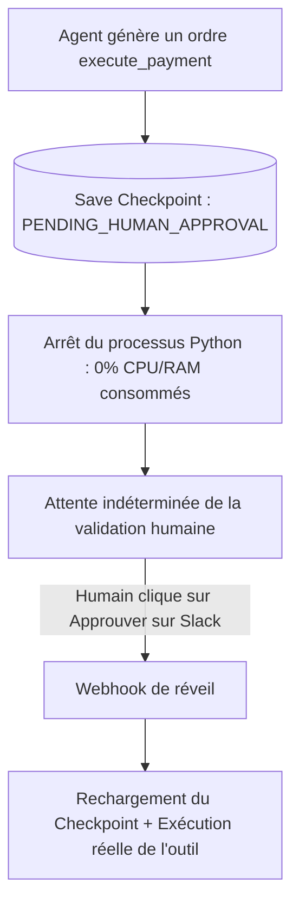

> [!TIP] Analogie
> **La belle au bois dormant** : L'agent s'endort profondément dans son berceau (le datastore) sans consommer la moindre énergie. Le clic de validation de l'humain agit comme le baiser du prince charmant qui le réveille instantanément pour poursuivre son histoire.

> [!EXAMPLE] Exemple d'application : Reprise HITL à grande échelle
> Un agent de recrutement prépare 50 promesses d'embauche. Chaque promesse est mise en pause et enregistrée en checkpoint. Les managers RH mettent entre 2 heures et 3 jours pour valider chaque dossier. À chaque clic de validation, l'agent se réveille pendant 2 secondes, envoie la promesse par email et se rendort.

*Le réveil d'agents en pause et l'accès multi-workers soulèvent un danger technique majeur : la concurrence d'accès sur une même session.*

---

#### 2.2.3. Verrous de Concurrence & Anti-Race-Conditions

Si deux requêtes Web ou deux workers d'arrière-plan tentent de lire, de modifier ou de réveiller le même `thread_id` exactement au même millième de seconde, une **Condition de Course (*Race Condition*)** survient : l'un des deux workers va écraser le travail de l'autre (*Lost Update*), corrompant définitivement l'état de l'agent.

Pour garantir l'intégrité des accès concurrents, l'architecte implémente deux stratégies de verrouillage :

1. **Verrouillage Optimiste (*Optimistic Locking / State Versioning*)** :
   - Chaque checkpoint possède un numéro de version incrémental (`version: 4`).
   - Lors de la sauvegarde, l'instruction SQL vérifie : `UPDATE checkpoints SET state = :new_state, version = 5 WHERE thread_id = :id AND version = 4`.
   - Si un autre worker a modifié la version entre-temps, la requête échoue et le second worker est invité à recharger l'état frais avant de retenter.
2. **Verrouillage Pessimiste / Distribué (*Pessimistic Locking / Redis Redlock*)** :
   - Avant de toucher à un `thread_id`, le worker doit acquérir un **verrou exclusif** temporaire dans Redis : `ACQUIRE_LOCK("lock:thread_t44", ttl=30s)`.
   - Tout autre worker tentant d'accéder au même `thread_id` est bloqué en file d'attente jusqu'à la libération du verrou.

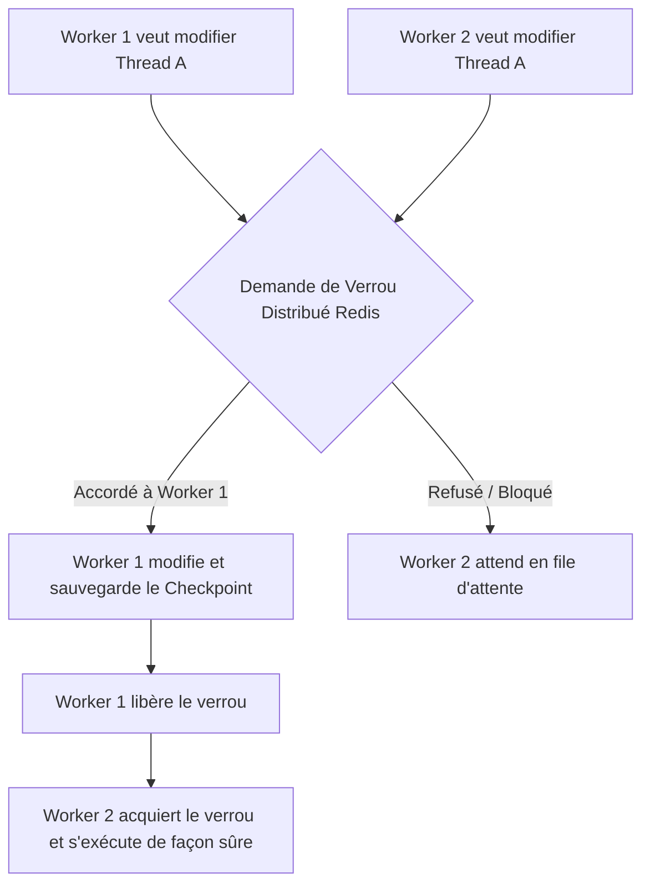

> [!TIP] Analogie
> **La cabine d'essayage de magasin de vêtements** : Le verrou pessimiste est le verrou physique de la porte de la cabine. Lorsque vous êtes à l'intérieur (Worker 1), la porte affiche le voyant "Occupé" rouge. Une autre personne (Worker 2) ne peut pas entrer dans la cabine pour essayer ses vêtements en même temps que vous ; elle attend patiemment dans le couloir que vous sortiez.

> [!EXAMPLE] Exemple d'application : Verrou distribué Redis
> Dans une plateforme SaaS, l'utilisateur clique frénétiquement deux fois d'affilée sur le bouton *"Relancer l'analyse"*. Le verrou distribué Redis bloque la deuxième requête HTTP pendant 300 ms, le temps que la première requête termine d'écrire son checkpoint, empêchant toute corruption de la base de données.

*La maîtrise de la résilience, des pauses et des verrous d'accès complète la gestion temporelle standard. Découvrons maintenant les fonctionnalités d'exploration temporelle avancée : le Time Travel et le Branchement d'État.*

---

### 2.3. Time Travel, Reconstitution d'Événements & Branchement d'État

> [!INFO] Chapeau de sous-section
> Le checkpointing ne sert pas uniquement à réparer les pannes. Il offre une capacité spectaculaire : remonter le temps, reconstruire le fil exact des événements et créer des réalités alternatives pour le débogage et l'A/B Testing.

---

#### 2.3.1. Le Time Travel (Voyage dans le Temps)

Le **Time Travel (Voyage dans le Temps)** désigne la capacité d'un développeur ou d'un système d'audit à charger n'importe quel checkpoint passé d'une session d'agent (ex. inspecter l'état à l'étape 3 sur 10) pour analyser le comportement historique du modèle.

Lorsqu'un agent produit un mauvais résultat à l'étape 10 (ex. une hallucination ou une mauvaise recommandation produit), lire la réponse finale ne suffit pas pour comprendre l'erreur. Le Time Travel permet de **voyager étape par étape vers le passé** pour repérer le moment exact où le LLM a dévié de sa trajectoire.

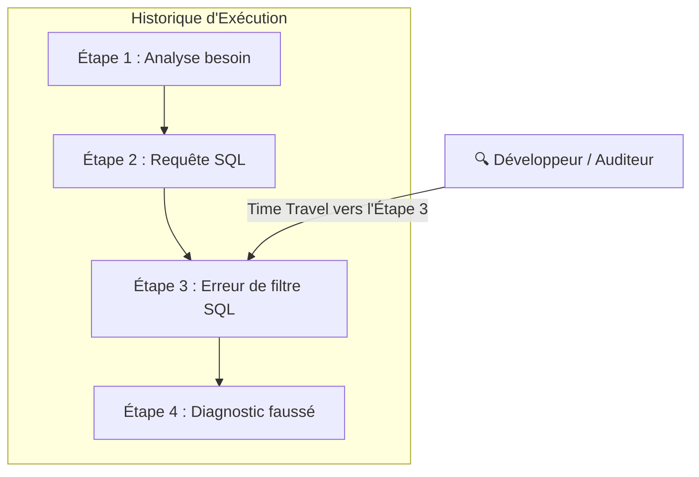

> [!TIP] Analogie
> **Le ralenti vidéo de l'arbitre VAR au football** : Lorsqu'une faute litigieuse survient sur le terrain à la 88e minute, l'arbitre ne devine pas ce qui s'est passé : il rembobine la bande vidéo jusqu'à la 84e minute et regarde la scène image par image pour déterminer qui a touché le ballon en premier.

> [!EXAMPLE] Exemple d'application : Audit de sécurité d'un agent
> Un agent de service client a accordé une remise anormale de 80 % à un client. Grâce au Time Travel, l'équipe technique remonte au checkpoint de l'étape 2 et découvre que le client avait réussi à injecter une consigne malveillante dans le champ du nom de famille.

*Le voyage dans le temps s'appuie sur la conservation de chaque état passé. Pour aller plus loin dans la traçabilité fine, analysons l'architecture par flux d'événements (Event-Sourcing).*

---

#### 2.3.2. Reconstitution d'État par Flux d'Événements (Event-Sourcing / Event Delta Stream)

Plutôt que d'enregistrer uniquement des photographies complètes de l'état (ce qui peut devenir lourd en volume de données), l'architecture **Event-Sourcing** enregistre une suite chronologique de **Deltas d'Événements (*Event Stream*)**.

L'état actuel n'est plus une donnée fixe stockée dans une table, mais le **résultat du rejeu dynamique de tous les événements accumulés** depuis la naissance du thread :

$$\text{État à l'Instant } T = \text{État Initial} + \sum_{i=1}^{T} \text{Événement}_i$$

Chaque événement est un objet immutable léger :
- `EVENT_USER_MESSAGE` : "Analyser la facture #40"
- `EVENT_TOOL_CALLED` : `get_invoice(id=40)`
- `EVENT_TOOL_RETURNED` : `{"total": 1200}`
- `EVENT_STATE_MUTATED` : `status = "VALIDATED"`

> [!TIP] Analogie
> **Le relevé de compte bancaire vs le solde final** : Le solde final de votre compte en banque (Snapshot) indique juste qu'il vous reste 1 500 €. Le relevé de compte (Event-Sourcing) liste chaque dépôt (+50 €) et chaque retrait (-20 €). En rejouant la liste des lignes du relevé depuis le 1er janvier, vous reconstruisez votre solde exact à n'importe quel jour de l'année.

> [!EXAMPLE] Exemple d'application : Rejeu d'audit financier
> Dans une banque, un auditeur doit prouver aux régulateurs comment un agent d'octroi de crédit a pris sa décision il y a 6 mois. Grâce à l'Event-Sourcing, l'application rejoue le flux exact des 12 événements enregistrés à l'époque, reconstruisant l'état sémantique au millième de seconde près.

*Conserver l'historique complet des étapes et des événements ouvre une possibilité ultime : modifier le passé pour lancer une réalité alternative. C'est le branchement d'état.*

---

#### 2.3.3. Le Branchement d'État (State Forking / Rewind & Edit)

Le **Branchement d'État (*State Forking / Rewind & Edit*)** permet de remonter à un checkpoint passé $N$, de **modifier une variable ou un prompt**, puis d'ouvrir une **nouvelle branche d'exécution alternative (Fork)** à partir de ce point sans effacer l'historique d'origine.

Ce mécanisme offre des possibilités d'ingénierie extraordinaires :
1. **Correction d'erreur à chaud (*Human-in-the-Loop Edit*)** : Si l'agent s'est trompé dans la formulation d'une requête SQL à l'étape 3, l'opérateur réécrit la requête dans le checkpoint 3 et relance l'exécution à partir de l'étape 3, évitant de payer les étapes 1 et 2.
2. **A/B Testing de Prompts en parallèle** : Dériver une session à l'étape 4 pour tester deux variantes du prompt système ($Branch_A$ avec GPT-4o vs $Branch_B$ avec Claude 3.5 Sonnet) sur le même contexte historique exact.

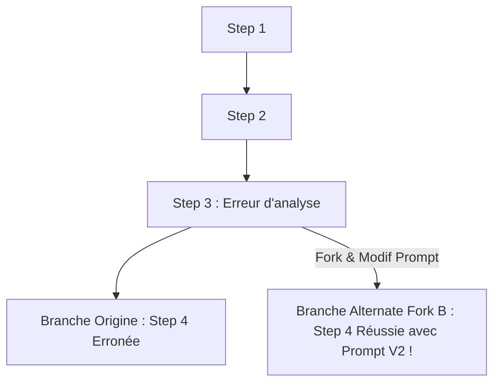

> [!TIP] Analogie
> **Les branches Git ou les univers parallèles dans les films** : Le Branchement d'État fonctionne exactement comme une branche `git checkout -b feature-test` en programmation, ou comme un voyageur temporel dans un film qui remonte en 1985, change un détail dans le passé et crée une ligne temporelle alternative parallèle.

> [!EXAMPLE] Exemple d'application : A/B Testing de modèle sur branche
> Un agent d'analyse médicale hésite sur un diagnostic à l'étape 4. L'équipe d'ingénierie fork le checkpoint 4 en deux branches : la branche A envoie le contexte à Claude 3.5 Sonnet et la branche B à Med-PaLM 2. L'équipe compare les deux réponses finales générées à partir du même état de départ.

*Les capacités avancées d'exploration temporelle et de forking génèrent un volume considérable de sauvegardes. Voyons comment gérer le nettoyage et la sécurité de ces données.*

---

### 2.4. Purge, Rétention & Sécurité des Checkpoints

> [!INFO] Chapeau de sous-section
> Conserver indéfiniment chaque étape de chaque agent sature rapidement les bases de données et crée des risques majeurs de fuite de données personnelles ou de secrets.

---

#### 2.4.1. Gestion du cycle de vie des sauvegardes (TTL & Chiffrement)

Pour éviter que votre base de données Postgres ou Redis ne sature sous des gigaoctets de checkpoints obsolètes, l'architecte définit une **Politique de Rétention du Cycle de Vie (*Lifecycle Retention Policy*)** :

1. **Durée de vie limitée (*Time-To-Live - TTL*)** :
   - Assigner un TTL automatique aux checkpoints temporaires (ex. suppression automatique des checkpoints de sessions terminées après 30 jours).
   - Les checkpoints marqués comme "Audits Réglementaires" sont archivés dans un stockage froid bon marché (S3 Glacier / Coldline Storage).
2. **Chiffrement au repos (*Encryption at Rest*)** :
   - Les états d'agents contiennent souvent des données sensibles (emails clients, jetons API temporaires, données financières).
   - Les checkpoints stockés en base SQL ou Redis doivent être **chiffrés avec des clés AES-256** gérées par un coffre-fort de secrets (ex. HashiCorp Vault, AWS KMS).

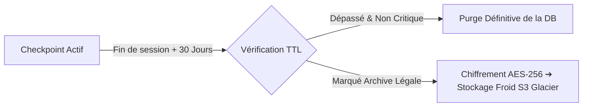

> [!TIP] Analogie
> **Le broyeur à documents et l'archiviste** : Dans un cabinet d'avocats, les notes brouillons prises pendant les réunions quotidiennes sont broyées après 30 jours (TTL). Seuls les contrats définitifs signés sont scellés dans une enveloppe blindée chiffrée (Chiffrement AES-256) et conservés dans le coffre d'archivage.

*La politique de rétention globale assure le nettoyage technique. Complétons-la par la conformité juridique et le respect de la vie privée (RGPD).*

---

#### 2.4.2. Conformité RGPD et nettoyage des données personnelles

En Europe, le Règlement Général sur la Protection des Données (RGPD) impose le **Droit à l'Oubli (*Right to be Forgotten*)** et la **Minimisation des Données**.

Si un utilisateur demande la suppression de ses données personnelles de votre plateforme :
- Supprimer son compte utilisateur dans la table principale ne suffit pas !
- Ses données personnelles (nom, adresse, numéro de téléphone, historique de chat) sont dupliquées à l'intérieur de des dizaines de **checkpoints sérialisés** stockés dans la table des checkpointers.

Pour garantir la conformité RGPD de vos checkpointers :
1. **Anonymisation / Pseudo-anonymisation à la source** : Remplacer les données identifiantes par des identifiants anonymes (`user_id = "usr_9981"`) dans l'état de l'agent avant sérialisation.
2. **Script de purge par `thread_id`** : Mettre en place une procédure d'effacement en cascade qui supprime tous les checkpoints associés au `thread_id` d'un utilisateur sur simple requête RGPD.

> [!TIP] Analogie
> **La gomme magique dans l'album photo** : Si une personne demande à ne plus apparaître dans votre album photo d'entreprise, vous devez parcourir chaque page de l'album (chaque checkpoint passé) et utiliser une gomme pour effacer son visage sur toutes les photos où elle figure.

> [!EXAMPLE] Exemple d'application : Purge RGPD de checkpoints
> Un utilisateur exerce son droit à l'oubli. Le système orchestre la commande `checkpointer.delete_thread(thread_id="usr_alice_88")`. Postgres supprime automatiquement les 45 checkpoints d'étapes accumulés lors des 3 mois de conversation d'Alice, garantissant la conformité juridique intégrale.

*L'ensemble des règles théoriques, des formats de sérialisation, des garde-fous de résilience et des stratégies de Time Travel étant maîtrisés, synthétisons le module sous forme de fiches opérationnelles pour l'Architecte de Persistence.*

---

## 3. 📊 Section 3 : Fiche Synthèse / Tableau Récapitulatif

> [!INFO] Chapeau de la Section 3
> Cette dernière section regroupe les outils de synthèse de l'Architecte de Persistence : la matrice comparative des 4 datastores principaux et la check-list opérationnelle des 10 points de contrôle avant tout déploiement en production.

---

### 3.1. Matrice Comparative des Datastores & Métriques de Checkpointing

| Datastore de Checkpoint | Latence d'Écriture | Résilience au Crash | Scalabilité Horizontale | Complexité Infra | Cas d'Usage Idéal |
| :--- | :--- | :--- | :--- | :--- | :--- |
| **In-Memory (`MemorySaver`)** | ⚡ < 0.1 ms | 🔴 Nulle (Perte au reboot) | 🔴 Impossible (1 seul process) | 🟢 Aucune (Code natif) | Tests unitaires, POC local, dev ultra-rapide |
| **SQLite (`SqliteSaver`)** | 🟡 ~1 - 5 ms | 🟢 Bonne (Fichier disque) | 🔴 Limité (Mono-serveur disque) | 🟢 Faible (1 fichier `.sqlite`) | Apps CLI embarquées, assistants de bureau desktop |
| **Postgres (`PostgresSaver`)** | 🟢 ~5 - 15 ms | 🟢 Maximale (ACID & WAL) | 🟢 Excellente (Multi-workers/Pods) | 🟡 Moyenne (Base SQL gérée) | **Standard industriel production, SaaS & Enterprise** |
| **Redis (`RedisSaver`)** | ⚡ < 1 ms | 🟡 Bonne (Si RDB/AOF actif) | 🟢 Maximale (Cluster Redis) | 🟡 Moyenne (Cluster RAM) | Agent ultra-haute fréquence, streaming & temps réel |

*La matrice récapitulative synthétise les arbitrages de datastores ; la check-list opérationnelle vous permet d'auditer votre système de persistance avant sa mise en production.*

---

### 3.2. Check-list opérationnelle de l'Architecte de Persistence d'Agents IA

> [!SUCCESS] Les 10 points de contrôle indispensables avant le déploiement en production
> 1. **Sérialisation sécurisée verrouillée** : Interdiction formelle de `pickle` ; usage exclusif de JSON ou Pydantic avec validation de schéma.
> 2. **Écritures atomiques vérifiées** : Garantie que la panne d'un serveur pendant la sauvegarde ne laisse aucun fichier de checkpoint corrompu.
> 3. **Migration de schéma v1 ➔ v2 active** : Implémentation d'un versionnage de schéma (`schema_version`) et d'un hook de migration pour préserver les sessions en pause lors des déploiements de code.
> 4. **Datastore de production dimensionné** : Choix de Postgres ou Redis avec haute disponibilité et réplication master-replica.
> 5. **Reprise automatique post-crash configurée** : Tests d'injection de pannes (Chaos Engineering) validant la reprise transparente à l'étape $N$ sans re-consommation de jetons.
> 6. **Gestion des pauses HITL sans charge** : Libération intégrale de la mémoire RAM et du CPU pendant les temps d'attente de validation humaine.
> 7. **Verrous de concurrence activés** : Verrouillage optimiste ou verrous distribués Redis (`Redlock`) configurés pour prévenir les race conditions sur un même `thread_id`.
> 8. **Time Travel et traçabilité configurés** : Capacité d'inspecter l'historique étape par étape pour l'audit et la résolution des hallucinations.
> 9. **Politique de rétention et TTL appliqués** : Purge automatique des checkpoints obsolètes et archivage froid des états réglementaires.
> 10. **Chiffrement et conformité RGPD validés** : Chiffrement AES-256 des données sensibles au repos et script de suppression en cascade des checkpoints par `thread_id`.

---

> [!QUOTE] Principe final
> Sans persistence d'état, un agent IA n'est qu'une démonstration éphémère. Le checkpointing est la colonne vertébrale qui transforme une intelligence discursive en un **système industriel résilient, tolérant aux pannes, capable de s'arrêter pour attendre l'humain et de voyager dans le temps pour s'auto-corriger**. Un état maîtrisé, c'est la garantie qu'aucune seconde de calcul ni aucun centime de jeton ne sera jamais gaspillé par une panne.

---

## 4. Liens entre Notes
- Aller au [[00_MOC_MAITRISE_AGENTS_IA]]
- Fiche précédente : [[09_Human_In_The_Loop_Et_Supervision_Humain_Agent_Masterclass]]
- Fiche suivante : [[11_Masterclass_Securite_Sandboxing_Docker_MicroVMs_Et_Anti_Injection]]
