# Module 12 : Masterclass Observabilité, Tracing Agentique & Télémétrie

> [!ABSTRACT] Vision du Cours
> Lorsqu'un agent IA autonome s'exécute en production, il effectue des dizaines d'appels LLM, interroge des bases vectorielles, exécute des outils Python et prend des décisions probabilistes en arrière-plan. Sans une observabilité dédiée, comprendre pourquoi un agent hallucine, boucle indéfiniment ou fait exploser votre facture API devient impossible. Ce module masterclass enseigne **l'Ingénierie de l'Observabilité et de la Télémétrie Agentique**. Vous apprendrez à passer des simples journaux de logs plats à des **arbres de Tracing hiérarchiques (Traces & Spans)**, à instrumenter votre code avec le standard **OpenTelemetry (OTEL)**, à piloter vos coûts en temps réel avec la **Télémétrie FinOps**, à mesurer les métriques de latence clés (**TTFT**), à déployer des **évaluateurs en direct (*Online LLM-as-a-Judge*)** et à garantir la conformité RGPD grâce à la **rédaction automatique des données personnelles (*PII Redaction*)**.

> [!NOTE] 📑 Table des Matières
> - [[#1. 💡 Section 1 : La Théorie Accessible & Concepts Clés|1. Section 1 : La Théorie Accessible & Concepts Clés]]
>   - [[#1.1. Pourquoi l'Observabilité des Agents IA est Vitale ?|1.1. Pourquoi l'Observabilité des Agents IA est Vitale ?]]
>     - [[#1.1.1. Le problème de la boîte noire agentique (Black Box Problem)|1.1.1. Le problème de la boîte noire agentique]]
>     - [[#1.1.2. La différence fondamentale entre Logging traditionnel et Tracing Agentique|1.1.2. Différence entre Logging traditionnel et Tracing Agentique]]
>     - [[#1.1.3. La métaphore de la boîte noire d'un avion de ligne et de la Formule 1|1.1.3. La métaphore de la boîte noire d'avion et de la Formule 1]]
>   - [[#1.2. L'Anatomie d'une Trace Agentique (Agent Trace Anatomy)|1.2. L'Anatomie d'une Trace Agentique (Agent Trace Anatomy)]]
>     - [[#1.2.1. La Trace : L'arbre d'exécution complet|1.2.1. La Trace : L'arbre d'exécution complet]]
>     - [[#1.2.2. Le Span : L'unité élémentaire de travail|1.2.2. Le Span : L'unité élémentaire de travail]]
>     - [[#1.2.3. Les métadonnées d'un Span|1.2.3. Les métadonnées d'un Span]]
>   - [[#1.3. Les 3 Piliers de la Télémétrie pour Agents IA|1.3. Les 3 Piliers de la Télémétrie pour Agents IA]]
>     - [[#1.3.1. 1. Tracing de Trajectoire|1.3.1. 1. Tracing de Trajectoire]]
>     - [[#1.3.2. 2. Télémétrie FinOps|1.3.2. 2. Télémétrie FinOps]]
>     - [[#1.3.3. 3. Télémétrie de Performance & Latence (TTFT, bout-en-bout, jetons/sec)|1.3.3. 3. Télémétrie de Performance & Latence]]
> - [[#2. ⚡ Section 2 : Les Notions Avancées & Garde-Fous Opérationnels|2. Section 2 : Les Notions Avancées & Garde-Fous Opérationnels]]
>   - [[#2.1. Standardisation & Protocoles de Télémétrie (OpenTelemetry - OTEL)|2.1. Standardisation & Protocoles de Télémétrie (OpenTelemetry - OTEL)]]
>     - [[#2.1.1. Le standard OpenTelemetry (OTEL) appliqué à l'IA Générative|2.1.1. Le standard OpenTelemetry (OTEL) appliqué à l'IA Générative]]
>     - [[#2.1.2. Intégration non intrusive (Decorators, Handlers, Callbacks)|2.1.2. Intégration non intrusive dans le code Python]]
>   - [[#2.2. Évaluation en Temps Réel en Production (Online Evals & User Feedback)|2.2. Évaluation en Temps Réel en Production (Online Evals & User Feedback)]]
>     - [[#2.2.1. Évaluation en direct par modèle évaluateur (Online LLM-as-a-Judge)|2.2.1. Évaluation en direct par modèle évaluateur]]
>     - [[#2.2.2. Boucle de rétroaction utilisateur (User Feedback Loop)|2.2.2. Boucle de rétroaction utilisateur]]
>   - [[#2.3. Détection d'Anomalies, Alerte & Protection FinOps|2.3. Détection d'Anomalies, Alerte & Protection FinOps]]
>     - [[#2.3.1. Alertes automatiques sur la consommation de jetons et seuils budgétaires|2.3.1. Alertes automatiques sur la consommation de jetons]]
>     - [[#2.3.2. Détection des boucles de raisonnement infinies et des défaillances d'outils|2.3.2. Détection des boucles de raisonnement infinies]]
>   - [[#2.4. Confidentialité des Données & Masquage dans la Télémétrie (PII Redaction)|2.4. Confidentialité des Données & Masquage dans la Télémétrie (PII Redaction)]]
>     - [[#2.4.1. Masquage et anonymisation automatique des Données Personnelles (PII Redaction)|2.4.1. Masquage et anonymisation automatique des PII]]
>     - [[#2.4.2. Conformité et gouvernance des données d'observabilité en entreprise|2.4.2. Conformité et gouvernance des données d'observabilité]]
> - [[#3. 📊 Section 3 : Fiche Synthèse / Tableau Récapitulatif|3. Section 3 : Fiche Synthèse / Tableau Récapitulatif]]
>   - [[#3.1. Matrice Comparative des Piliers & Métriques d'Observabilité Agentique|3.1. Matrice Comparative des Piliers & Métriques d'Observabilité Agentique]]
>   - [[#3.2. Check-list opérationnelle de l'Architecte Observabilité & Télémétrie pour Agents IA|3.2. Check-list opérationnelle de l'Architecte Observabilité]]
> - [[#4. Liens entre Notes|4. Liens entre Notes (Pied de page)]]

---

## 1. 💡 Section 1 : La Théorie Accessible & Concepts Clés

> [!INFO] Chapeau de la Section 1
> L'exécution d'agents IA autonomes pose un défi inédit : nous confions à un modèle probabiliste le pouvoir de générer du code, de lancer des commandes système et d'interagir avec des API d'entreprise. Sans isolation matérielle et logicielle stricte, la moindre vulnérabilité ou manipulation de prompt peut compromettre l'intégralité du réseau. Cette première section pose les fondations théoriques de la sécurité agentique : pourquoi la conteneurisation Docker est obligatoire, comment s'articule une architecture multi-services, quelle est la surface d'attaque spécifique des agents et comment fonctionnent les attaques par injection de prompt.

---

### 1.1. Pourquoi l'Observabilité des Agents IA est Vitale ?

> [!INFO] Chapeau de sous-section
> Comprendre l'opacité d'un agent autonome est le premier pas vers une ingénierie rigoureuse. Cette partie démontre pourquoi les outils de logging du Web 2.0 échouent face aux applications agentiques et présente la valeur du Tracing.

---

#### 1.1.1. Le problème de la "boîte noire" agentique (Black Box Problem)

Dans une application logicielle classique, le flux d'exécution est linéaire et déterministe : une fonction A appelle une fonction B qui écrit dans une base de données. Si une erreur survient, la pile d'appels (*Stack Trace*) et un simple fichier journal texte (`app.log`) suffisent à repérer la ligne de code défaillante.

Dans un système fondé sur des agents IA, cette simplicité s'effondre en raison du **Problème de la Boîte Noire (*Black Box Problem*)** :
- **Non-déterminisme des trajectoires** : Pour une même question utilisateur, un agent autonome peut décider d'exécuter 2 outils aujourd'hui, et 5 outils complètement différents demain.
- **Récursivité et boucles de décision** : L'agent passe par des étapes invisibles de réflexion (`Thought`), d'évaluation de résultats d'outils (`Observation`) et d'auto-correction (`Self-Refinement` - Module 7).
- **Opacité des coûts et des pannes** : Si un agent met 12 secondes à répondre ou consomme 3,50 € sur une unique requête, lire des logs texte bruts sur la console ne permet pas de savoir quel outil a ralenti l'exécution ni quel prompt a fait exploser le nombre de jetons.

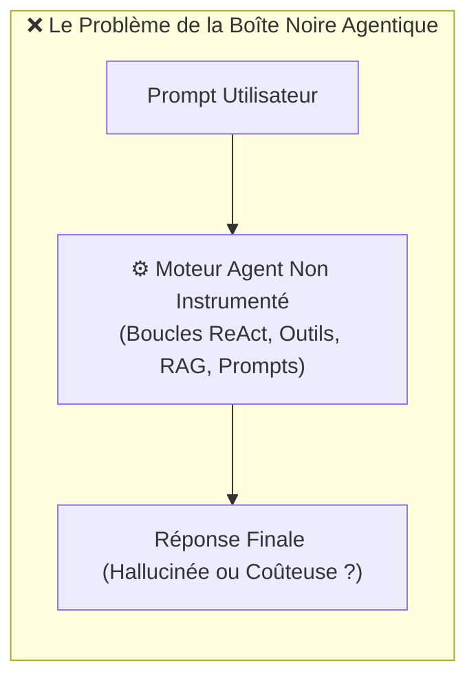

> [!TIP] Analogie
> **La montre mécanique scellée dans un boîtier opaque** : Utiliser un agent non instrumenté, c'est comme porter une montre mécanique complexe enfermée dans un boîtier en acier totalement opaque. Les aiguilles s'arrêtent ou retardent de 10 minutes, mais vous êtes dans l'incapacité totale d'ouvrir le boîtier pour voir quel engrenage interne s'est bloqué.

*L'incompatibilité des logs textes bruts avec la complexité des boucles de décision impose d'adopter une nouvelle norme de visualisation : le Tracing Agentique.*

---

#### 1.1.2. La différence fondamentale entre Logging traditionnel et Tracing Agentique

Pour instrumenter efficacement des agents IA, l'architecte doit faire évoluer sa culture technique du **Logging plat** vers le **Tracing hiérarchique** :

1. **Le Logging Traditionnel (Vue Plats en 1D)** :
   - Génère des lignes de texte chronologiques isolées dans un fichier journal (`2026-08-04 10:15:02 INFO LLM call success`).
   - 🔴 *Limite* : Impossible de savoir quel appel d'outil est le fils de quelle réflexion ReAct, ni de reconstituer l'arborescence des sous-agents délégués (Module 3 et Module 7).
2. **Le Tracing Agentique (Vue Arborescente en 3D)** :
   - Capture l'exécution sous la forme d'un **Arbre de Dépendances d'Actions (*Execution Graph*)**.
   - 🟢 *Avantage* : Chaque sous-opération (appel d'outil, recherche RAG, appel LLM) est reliée à sa sous-tâche parent, avec la mesure exacte du temps passé et du coût financier de chaque branche de l'arbre.

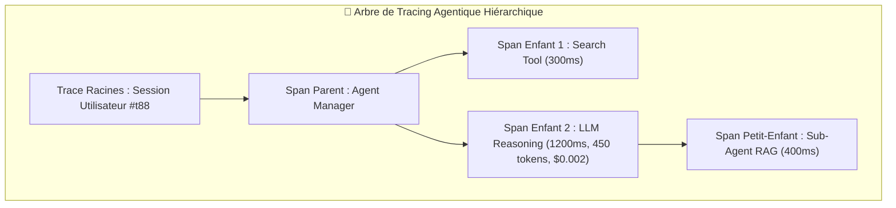

| Critère | Logging Traditionnel (Logs Bruts) | Tracing Agentique (Arbres Spans & Traces) |
| :--- | :--- | :--- |
| **Structure des données** | Lignes de texte chronologiques plates | Arbre hiérarchique parent-enfant (Graphe d'exécution) |
| **Contextualisation** | Faible (Message texte isolé) | Maximale (Contexte prompt, jetons, coûts, étapes ReAct) |
| **Résolution des bugs** | 🔴 Difficile (Parcours manuel de milliers de lignes) | 🟢 Instantanée (Visualisation de la branche défaillante) |
| **Suivi des coûts FinOps** | 🔴 Impossible au niveau de la sous-tâche | 🟢 Précis au centime près par sous-opération |

> [!TIP] Analogie
> **La liste de courses vs l'arbre généalogique de la famille** : Les logs plats sont comme une liste de courses déposée à terre : vous voyez des noms d'articles, mais sans savoir qui les a achetés ni pourquoi. Le Tracing agentique est comme un arbre généalogique complet qui vous montre exactement la filiation directe entre parents, enfants et petits-enfants.

*Pour bien ancrer la puissance opérationnelle du Tracing agentique, étudions les deux analogies reines du monde physique : l'aéronautique et la Formule 1.*

---

#### 1.1.3. La métaphore de la boîte noire d'un avion de ligne et de la Formule 1

Pour faire comprendre l'importance de l'observabilité aux décideurs et aux équipes d'ingénierie, deux métaphores du monde physique s'imposent :

> [!TIP] Analogie 1 : La Boîte Noire de l'Avion de Ligne (*Flight Data Recorder*)
> En aviation civil, les pilotes ne volent pas à l'aveugle. La boîte noire enregistre en continu des milliers de constantes (altitude, inclinaison, pression, vitesse des réacteurs et conversations du cockpit). Si une turbulence survient, les ingénieurs ne devinent pas l'origine de l'incident : ils rejouent la bande exacte de la boîte noire au millième de seconde près pour isoler le composant défaillant. Le **Tracing Agentique** est la boîte noire inaltérable de vos agents IA.

> [!TIP] Analogie 2 : La Télémétrie en Direct de la Formule 1
> Pendant un Grand Prix de Formule 1, la monoplace embarque plus de 300 capteurs de télémétrie en temps réel. Sur le stand de décision, les ingénieurs surveillent sur leurs écrans la température des freins, la pression des pneus et la consommation de carburant. Si un pneu surchauffe (surconsommation de jetons), le stand alerte le pilote avant même que le pneu n'éclate. La **Télémétrie Agentique** est votre stand d'ingénierie de Formule 1.

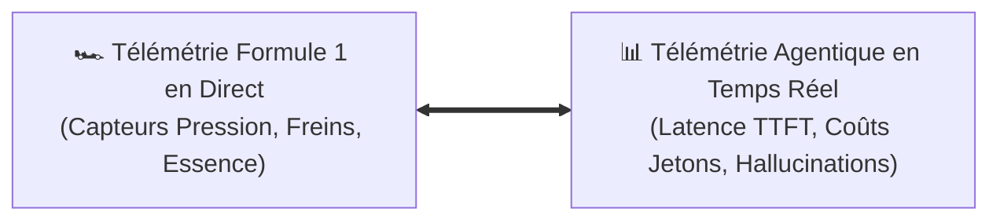

*Une fois la nécessité du Tracing établie par ces analogies, étudions la structure exacte de ces enregistrements : l'anatomie d'une trace d'agent.*

---

### 1.2. L'Anatomie d'une Trace Agentique (Agent Trace Anatomy)

> [!INFO] Chapeau de sous-section
> Une infrastructure de télémétrie s'articule autour de deux objets fondamentaux : la Trace et le Span. Cette partie détaille leur hiérarchie et la richesse des métadonnées indispensables à l'audit.

---

#### 1.2.1. La Trace : L'arbre d'exécution complet

La **Trace** représente l'intégralité du parcours d'exécution déclenché par une requête initiale (ex. le message de l'utilisateur ou l'exécution d'une tâche d'arrière-plan).

Elle possède un identifiant unique global (`trace_id = "tr_9981a_2026"`) qui accompagne la requête de son point d'entrée jusqu'à sa livraison finale.

Une Trace est l'enveloppe globale qui contient l'ensemble des sous-opérations. Elle enregistre :
- L'identifiant de la session utilisateur (`thread_id`).
- Le statut global de l'exécution (`SUCCESS`, `ERROR`, `INTERRUPTED_HITL`).
- Le temps total d'exécution de bout en bout (ex. `latence_totale = 4 250 ms`).
- Le coût financier cumulé de la session (ex. `cout_total = $0.0142`).

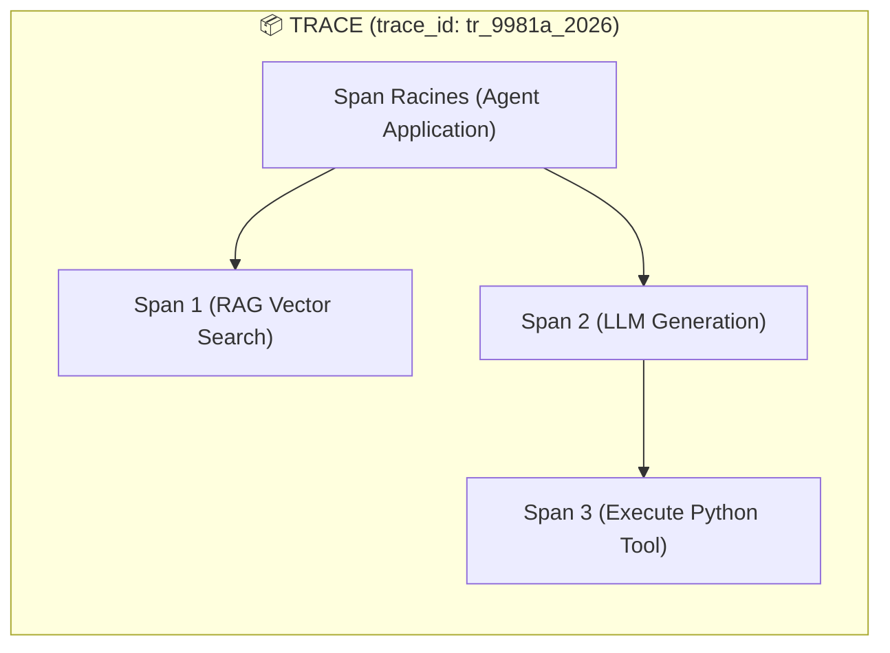

> [!TIP] Analogie
> **Le voyage complet d'un colis postal** : La Trace est le numéro de suivi général du colis (`FR123456789`). Il regroupe l'intégralité de l'itinéraire du colis, depuis son dépôt au bureau de Poste de départ jusqu'à sa remise en main propre à l'adresse de destination.

*La Trace forming l'enveloppe globale du parcours, étudions les blocs élémentaires qui la composent : les Spans.*

---

#### 1.2.2. Le Span : L'unité élémentaire de travail

Le **Span** est le bloc de construction fondamental d'une Trace. Il représente **une action individuelle précise et délimitée dans le temps**.

Chaque fois que l'agent prend une décision ou exécute un outil, le framework d'observabilité ouvre un nouveau Span, enregistre son heure de début, son heure de fin, et le rattache à son **Span Parent** (`parent_span_id`).

Les 4 types de Spans majeurs dans un écosystème d'agents :
1. **LLM Span** : Capture un appel direct vers un modèle de langage (ex. GPT-4o, Claude 3.5 Sonnet, vLLM local).
2. **Tool Span** : Capture l'exécution d'un outil métier (ex. exécution de requête SQL, appel d'API Stripe, Web Scraping Playwright).
3. **Retriever Span** : Capture une étape de recherche d'information (recherche vectorielle ChromaDB, algorithme HNSW - Module 6).
4. **Agent/Chain Span** : Capture la logique d'orchestration ou la boucle de raisonnement ReAct complète.

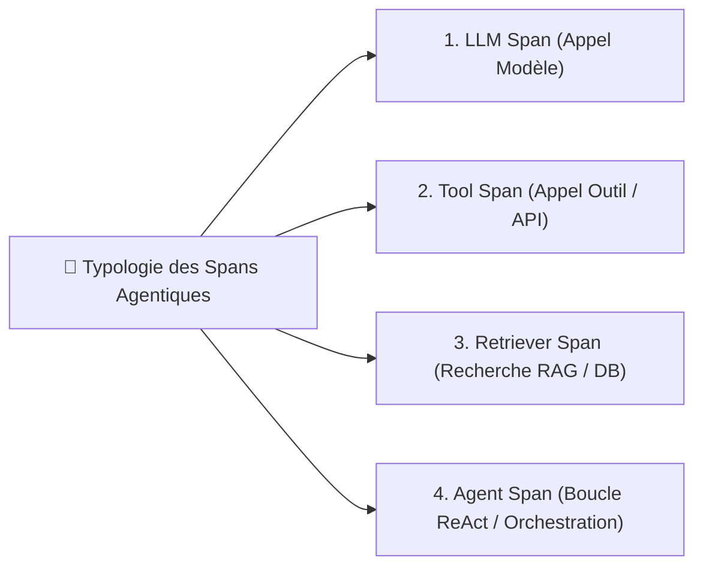

> [!TIP] Analogie
> **Chaque étape intermédiaire sur le bordereau de livraison** : Si la Trace est le suivi global du colis, le Span est le tampon apposé à chaque escale intermédiaire : *"Arrivé au centre de tri de Lyon à 14h02"* (Span 1), *"Chargé dans le camion n°4 à 16h15"* (Span 2).

*Pour qu'un Span apporte une valeur maximale lors de l'audit ou du débogage, il doit capturer un ensemble strict de métadonnées de santé et de coût.*

---

#### 1.2.3. Les métadonnées d'un Span

Chaque Span conserve un dictionnaire de **métadonnées riches (*Attributes & Metadata*)** indispensables pour piloter la performance, les coûts et la sécurité du système :

```json
{
  "span_id": "sp_4412_tool_sql",
  "parent_span_id": "sp_0010_react_loop",
  "name": "sql_database_query",
  "type": "TOOL",
  "status": "OK",
  "duration_ms": 142,
  "metrics": {
    "prompt_tokens": 520,
    "completion_tokens": 85,
    "total_cost_usd": 0.00185
  },
  "attributes": {
    "llm.model_name": "gpt-4o-2024-08-06",
    "llm.temperature": 0.2,
    "tool.name": "execute_read_only_sql",
    "tool.query_raw": "SELECT count(*) FROM users WHERE status = 'ACTIVE'"
  }
}
```

Les 6 catégories de métadonnées obligatoires d'un Span :
1. **Identité et Filiation** : `span_id`, `parent_span_id`, `name`, `type`.
2. **Prompts et Sorties Brutes** : Le prompt système, le prompt utilisateur et la réponse brute exacte générée par le modèle (ou le payload JSON transmitted à l'outil).
3. **Consommation de Jetons** : Décompte séparé des jetons d'entrée (*Prompt Tokens*) et des jetons de sortie (*Completion Tokens*).
4. **Impact Financier (FinOps)** : Coût exact en dollars ($) calculé automatiquement en fonction de la grille tarifaire du modèle.
5. **Chronométrie et Latence** : Heure de début au millième de seconde près (`start_time`), heure de fin (`end_time`) et durée totale (`duration_ms`).
6. **Statut et Stack Trace d'Erreur** : `SUCCESS` ou `ERROR` avec la capture complète du message d'exception Python en cas de crash.

> [!TIP] Analogie
> **La facture détaillée de réparation automobile** : Sur votre facture de garage, vous ne voyez pas juste "Réparation : 500 €". Vous voyez le détail complet : la pièce exacte changée (Nom du modèle/outil), le temps passé par le mécanicien au quart d'heure près (Latence), la quantité d'huile utilisée (Jetons) et le tarif unitaire hors taxe (Coût FinOps).

*La structure des Traces et des Spans étant posée, étudions comment ces données s'organisent au sein des trois piliers de la télémétrie.*

---

### 1.3. Les 3 Piliers de la Télémétrie pour Agents IA

> [!INFO] Chapeau de sous-section
> L'instrumentation d'un système d'agents IA s'évalue à travers trois dimensions complémentaires : la trajectoire cognitive, l'impact financier FinOps et la performance réseau/latence.

---

#### 1.3.1. 1. Tracing de Trajectoire

Le **Tracing de Trajectoire (*Trajectory Tracing*)** mesure la qualité du cheminement cognitif de l'agent.

Au lieu d'évaluer uniquement la réponse finale envoyée au client, le Tracing de Trajectoire reconstruit le fil de pensée exact de la boucle ReAct (Module 1) :
- Quelle a été la première pensée (`Thought 1`) du LLM ?
- Quel outil a été sélectionné (`Action 1`) et quels arguments ont été injectés ?
- Quelle réponse l'outil a-t-il renvoyée (`Observation 1`) ?
- L'agent a-t-il commis un aller-retour inutile ou une sous-tâche redondante ?

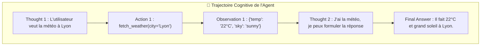

> [!TIP] Analogie
> **L'enregistreur de tracé GPS sur une randonnée** : Le tracé GPS ne vous montre pas seulement votre photo au sommet de la montagne. Il dessine sur la carte chaque virage, chaque pause sous un arbre et chaque détour manqué pris pendant l'ascension.

*Le suivi de la trajectoire cognitive garantit la justesse du raisonnement ; le second pilier s'assure que ce raisonnement ne ruine pas l'entreprise : la télémétrie FinOps.*

---

#### 1.3.2. 2. Télémétrie FinOps

Les modèles de langage et les outils de recherche vectorielle sont facturés à la consommation brute (au million de jetons ou à la requête API). Sans **Télémétrie FinOps**, un agent mal configuré peut consommer des milliers de dollars en quelques heures suite à un prompt mal cadré ou une boucle infinie.

La Télémétrie FinOps agrège les coûts calculés dans les Spans et offre 4 axes d'analyse analytique en temps réel :
1. **Coût par Utilisateur / Client (*Cost per User / Tenant*)** : Identifier quels clients ou comptes SaaS consomment le plus de budget API.
2. **Coût par Agent / Rôle (*Cost per Agent Role*)** : Comparer le coût de l'Agent Manager vs l'Agent Chercheur RAG.
3. **Coût par Modèle (*Cost per Provider/Model*)** : Mesurer la répartition des dépenses entre les modèles haut de gamme (ex. GPT-4o / Claude 3.5 Sonnet) et les modèles légers (ex. GPT-4o-mini / Llama 3.1 8B).
4. **Coût par Tâche Métier (*Cost per Workflow*)** : Calculer le coût moyen de génération d'une fiche produit ou de traitement d'un ticket support.

$$\text{Coût Total Session} = \sum_{i=1}^{N} \left( \text{InputTokens}_i \times \text{TarifInput} + \text{OutputTokens}_i \times \text{TarifOutput} \right)$$

> [!TIP] Analogie
> **Le compteur de consommation d'eau intelligente par pièce** : Au lieu de recevoir une facture d'eau globale à la fin de l'année sans détails, le compteur intelligent vous indique en temps réel l'eau consommée par la douche, par le lave-vaisselle et par l'arrosage du jardin.

*Le contrôle des coûts étant assuré par la télémétrie FinOps, examinons le troisième pilier essentiel pour l'expérience utilisateur : la performance et la latence.*

---

#### 1.3.3. 3. Télémétrie de Performance & Latence (TTFT, bout-en-bout, jetons/sec)

Dans une application d'agents IA, la sensation de vitesse est déterminante pour l'expérience utilisateur. La **Télémétrie de Performance** mesure 3 indicateurs clés de performance (KPI) :

1. **Temps jusqu'au Premier Jeton (*TTFT - Time To First Token*)** :
   - Mesure le délai entre le moment où l'utilisateur envoie son message et l'affichage du premier caractère sur l'écran (démarrage du streaming). Un bon TTFT doit être inférieur à $800\text{ ms}$.
2. **Latence Globale Bout-en-Bout (*End-to-End Latency*)** :
   - Temps total écoulé jusqu'à la livraison complète de la réponse ou la fin de l'exécution du workflow agentique.
3. **Débit de Génération (*Generation Throughput - Tokens/sec*)** :
   - Nombre de jetons générés par seconde par le modèle de langage en phase de complétion (ex. $45\text{ tokens/sec}$).

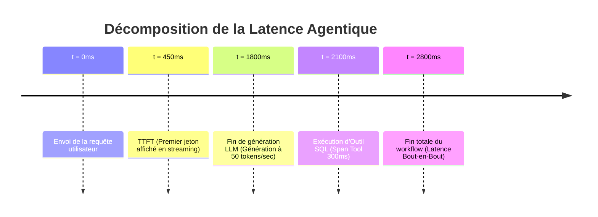

> [!TIP] Analogie
> **Le temps de commande et de service au restaurant** : Le **TTFT** est le temps que met le serveur à poser la carafe d'eau et le pain sur votre table juste après votre commande. La **latence bout-en-bout** est le temps total écoulé jusqu'à ce que vous ayez terminé votre dessert.

*Les concepts théoriques, l'anatomie de l'état d'une trace et les 3 piliers de la télémétrie étant maîtrisés, abordons la pratique de l'architecte dans la Section 2 : standardisation OpenTelemetry, évaluation en direct et anonymisation PII.*

---

## 2. ⚡ Section 2 : Les Notions Avancées & Garde-Fous Opérationnels

> [!INFO] Chapeau de la Section 2
> La mise en production d'une infrastructure d'observabilité exige une rigueur d'ingénierie stricte. Cette seconde section aborde les 4 piliers avancés de la télémétrie industrielle : la standardisation OpenTelemetry (OTEL), l'évaluation en direct par LLM-as-a-Judge, les mécanismes d'alerte FinOps, et le masquage automatique des données personnelles (PII Redaction).

---

### 2.1. Standardisation & Protocoles de Télémétrie (OpenTelemetry - OTEL)

> [!INFO] Chapeau de sous-section
> Adopter un format de télémétrie propriétaire ferme votre architecture chez un seul fournisseur SaaS. Cette partie explique l'importance du standard OpenTelemetry et montre comment l'intégrer proprement dans votre code Python sans le polluer.

---

#### 2.1.1. Le standard OpenTelemetry (OTEL) appliqué à l'IA Générative

**OpenTelemetry (OTEL)** est le standard ouvert universel de la Cloud Native Computing Foundation (CNCF) pour la collecte des traces, métriques et logs.

Historiquement conçu pour les micro-services web, OpenTelemetry a intégré des **Spécifications Sémantiques Spécifiques à l'IA Générative (*Semantic Conventions for GenAI*)**.

Les avantages majeurs du standard OpenTelemetry pour les agents IA :
- **Indépendance vis-à-vis des vendeurs (*No Vendor Lock-in*)** : Votre code Python émet des Spans OTEL standardisés. Vous pouvez rediriger ces traces indifféremment vers des plateformes spécialisées (Langfuse, Arize Phoenix, LangSmith) ou des géants du APM traditionnel (Datadog, Dynatrace, New Relic) sur simple modification d'une variable d'environnement.
- **Normalisation des noms d'attributs** : Tous les frameworks utilisant OTEL partagent les mêmes clés d'attributs (ex. `gen_ai.system`, `gen_ai.request.model`, `gen_ai.usage.input_tokens`).

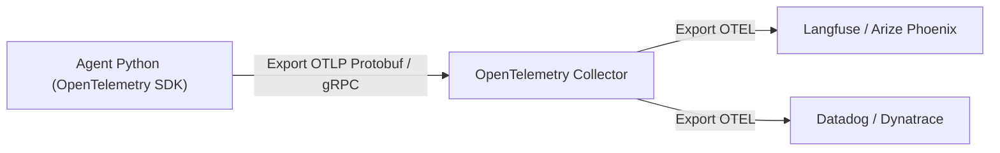

> [!TIP] Analogie
> **La prise de courant universelle internationale et les adaptateurs** : OpenTelemetry est comme la prise électrique femelle universelle. Peu importe la marque de votre appareil (CrewAI, LangGraph) ou le pays où vous le branchez (Langfuse, Datadog), le courant passe immédiatement sans devoir recâbler toute l'installation électrique de la maison.

> [!EXAMPLE] Exemple d'application : Migration sans réécriture de code
> **Plateforme SaaS d'Entreprise** : Une entreprise décide de quitter son fournisseur de télémétrie SaaS A pour déployer un serveur d'observabilité open-source B sur son propre cluster Kubernetes. Grâce au standard OpenTelemetry, les ingénieurs modifient une unique ligne de configuration (`OTEL_EXPORTER_OTLP_ENDPOINT`) sans toucher à une seule ligne de code Python des 20 agents de l'entreprise.

*La puissance du standard OpenTelemetry étant posée, étudions comment capturer ces traces dans votre code Python sans alourdir la logique métier.*

---

#### 2.1.2. Intégration non intrusive (Decorators, Handlers, Callbacks) dans le code Python

L'instrumentation du code ne doit jamais forcer le développeur à écrire 15 lignes d'enregistrement manuel de logs autour de chaque appel de fonction Python.

Les frameworks d'observabilité modernes s'intègrent de manière **100 % non intrusive (*Non-Intrusive Auto-Instrumentation*)** grâce aux motifs de programmation Python suivants :

1. **Les Décorateurs Python (`@observe`)** :
   - Poser une simple annotation au-dessus des fonctions clés de l'agent. Le décorateur intercepte automatiquement les arguments d'entrée, la valeur de retour, calcule le temps d'exécution et émet le Span en arrière-plan.
2. **Les Gestionnaires d'Événements (*Handlers / Callbacks*)** :
   - Injecter un gestionnaire de télémétrie dans la configuration de l'agent (ex. `callbacks=[LangfuseHandler()]`). L'orchestrateur émet silencieusement des Spans lors de chaque événement de la boucle ReAct.

```python
# Exemple d'instrumentation propre et non intrusive avec décorateur
from langfuse.decorators import observe

@observe(name="execute_financial_audit")
def audit_company_task(company_name: str) -> dict:
    # La logique métier reste 100% propre !
    data = fetch_financial_data(company_name)
    report = agent_manager.run(data)
    return report
```

> [!TIP] Analogie
> **Le microphone de cravate sans fil lors d'une conférence** : L'instrumentation par décorateur est comme équiper un conférencier d'un petit micro-cravate sans fil. Le conférencier s'exprime et se déplace naturellement sur scène (logique métier) sans devoir tenir un gros microphone à la main ou s'arrêter à chaque phrase pour parler dans un haut-parleur.

> [!EXAMPLE] Exemple d'application : Instrumentation automatique de CrewAI
> Dans un script d'agent multi-agents CrewAI, l'ajout de l'option `os.environ["LANGCHAIN_TRACING_V2"] = "true"` active l'instrumentation automatique par callbacks. Sans modifier le code des agents ou des outils, l'ensemble de la séquence de délégation parent-enfant s'affiche immédiatement sous forme d'arbre de traces dans la console d'observabilité.

*L'instrumentation automatique et standardisée capturant l'ensemble des traces, voyons comment évaluer en direct la qualité des réponses générées en production.*

---

### 2.2. Évaluation en Temps Réel en Production (Online Evals & User Feedback)

> [!INFO] Chapeau de sous-section
> Tester son agent sur un benchmark en phase de développement ne garantit pas son comportement face aux vrais utilisateurs. Cette partie enseigne l'évaluation continue par LLM-as-a-Judge et la captation des retours utilisateurs.

---

#### 2.2.1. Évaluation en direct par modèle évaluateur (Online LLM-as-a-Judge)

Le motif **LLM-as-a-Judge (Le LLM Juge)** consiste à utiliser un second modèle de langage léger et rapide (ex. GPT-4o-mini ou Llama 3.1 8B) pour **évaluer automatiquement la qualité des réponses générées en arrière-plan** sur un échantillon des sessions réelles (ex. 10 % des traces de production).

L'évaluateur en direct (*Online Judge*) analyse le Span et lui attribue des **scores continus ($0.0$ à $1.0$)** sur des critères clés :
- **Score d'Hallucination (*Faithfulness*)** : La réponse s'appuie-t-elle strictement sur les documents extraits par le RAG (Module 6) ?
- **Pertinence de la réponse (*Answer Relevance*)** : La réponse répond-elle directement à la question posée par l'utilisateur ?
- **Score de Toxicité et Sécurité (*Toxicity & Guardrails*)** : La réponse contient-elle un propos inapproprié ou une violation des consignes de cadrage ?

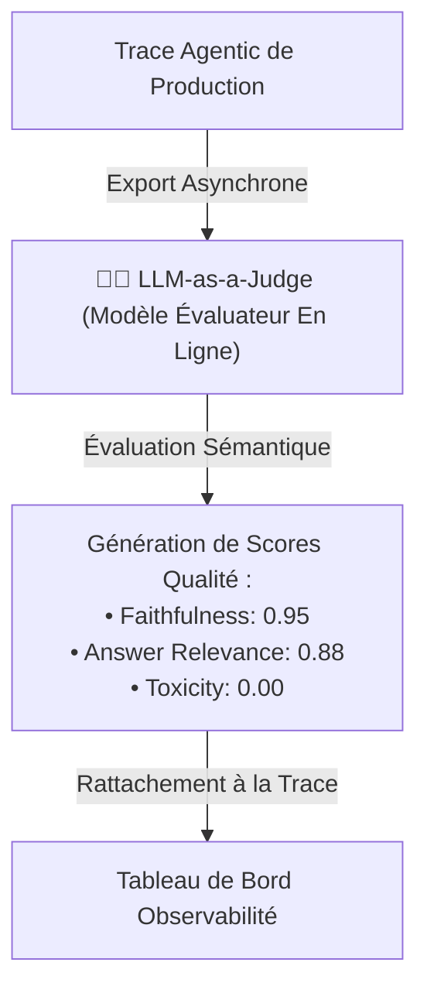

> [!TIP] Analogie
> **L'inspecteur mystère du contrôle qualité en restaurant** : Le chef de cuisine (l'Agent IA) prépare les plats pour les clients. De temps en temps, un inspecteur de qualité anonyme (Online LLM-as-a-Judge) s'assoit en salle, goûte un plat servi, évalue sa cuisson et sa présentation, et attribue une note sur sa fiche de contrôle sans ralentir le service en cuisine.

> [!EXAMPLE] Exemple d'application : Détection automatique d'hallucination RAG
> **Agent Support Médical** : L'agent répond à un utilisateur sur le posologie d'un médicament. En arrière-plan, l'évaluateur *LLM-as-a-Judge* compare le Span du résultat RAG avec la réponse finale de l'agent. L'évaluateur détecte une contradiction numérique sur le dosage et lui attribue immédiatement un score de `Faithfulness = 0.12`. La trace est immédiatement marquée en rouge sur le tableau de bord d'alerte.

*Outre l'évaluation automatisée par un modèle juge, la seconde source d'évaluation incontournable provient des utilisateurs finaux eux-mêmes.*

---

#### 2.2.2. Boucle de rétroaction utilisateur (User Feedback Loop)

L'évaluation automatisée par LLM doit être croisée avec la perception réelle du terrain : la **Boucle de Rétroaction Utilisateur (*User Feedback Loop*)**.

Lorsqu'un utilisateur interagit avec l'agent dans l'interface web ou mobile, l'application lui propose de donner son avis :
- **Votes binaires (*Thumbs Up / Thumbs Down*)** : Un simple clic sur le pouce haut 👍 ou le pouce bas 👎.
- **Corrections textuelles précises** : La possibilité de saisir un commentaire explicatif (ex. *"La réponse est correcte mais le ton est trop agressif"*).

**La mécanique technique de raccordement** :
Lors de l'émission du feedback sur le composant Web, le frontend transmet le score joint à l'identifiant exact de la trace (`trace_id`). Le serveur d'observabilité associe le pouce bas directement au Span parent correspondant.

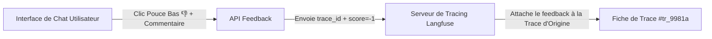

> [!TIP] Analogie
> **Le boîtier d'évaluation de satisfaction aux caisses de supermarché** : En sortant du magasin, vous appuyez sur un bouton vert (content) ou rouge (mécontent). Le système informatique du magasin enregistre votre vote et le rattache au ticket de caisse et à l'heure exacte de votre passage pour savoir quel caissier travaillait à ce moment-là.

> [!EXAMPLE] Exemple d'application : Constitution d'un dataset de fine-tuning DPO
> **Agent de Rédaction d'Emails** : Les traces de production qui reçoivent un vote 👍 de l'utilisateur sont automatiquement tagguées et exportées sous forme de paires de trajectoires d'excellence (*Few-Shot Examples*). Les traces recevant un vote 👎 avec une correction humaine sont réservées pour constituer le dataset de Fine-Tuning DPO (Module 8).

*L'évaluation en direct et le feedback utilisateur identifient les dérives qualitatives ; abordons maintenant la protection en temps réel contre les emballements budgétaires et techniques.*

---

### 2.3. Détection d'Anomalies, Alerte & Protection FinOps

> [!INFO] Chapeau de sous-section
> Un agent défaillant peut consommer des milliers de jetons ou boucler en quelques minutes. Cette partie montre comment configurer des seuils d'alerte automatiques et neutraliser les boucles infinies.

---

#### 2.3.1. Alertes automatiques sur la consommation de jetons et seuils budgétaires

La gestion de la production exige de mettre en place des **Seuils d'Alerte FinOps (*Budget & Token Spike Guardrails*)** pour intervenir avant que la facture API ne devienne critique.

Le système de télémétrie surveille en permanence trois métriques dérivées et déclenche des alertes en temps réel (sur Slack, PagerDuty ou par Email) :
1. **Pic de consommation de jetons (*Token Spike*)** : Une requête unique qui consomme plus de 50 000 jetons de manière anormale.
2. **Franchissement de plafond par session (*Session Cost Cap*)** : Une session d'agent dont le coût cumulé dépasse $1.00\text{ USD}$.
3. **Plafond budgétaire quotidien (*Daily Burn Rate*)** : La consommation globale de l'entreprise dépasse de 50 % la moyenne quotidienne habituelle.

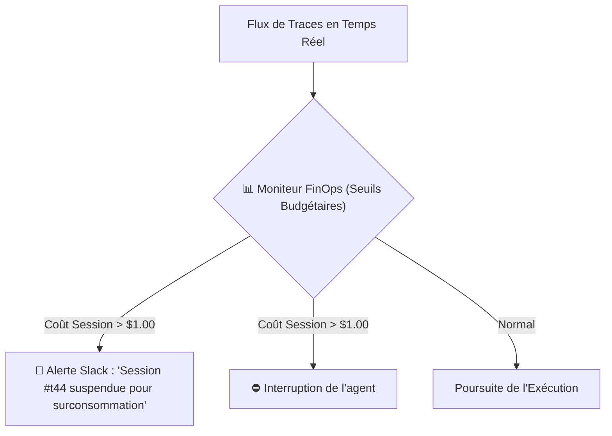

> [!TIP] Analogie
> **Le forfait téléphonique bloqué avec alerte SMS** : Votre opérateur de téléphonie vous envoie un SMS automatique dès que vous consommez 80 % de votre forfait Internet mobile, et bloque la connexion data dès que vous atteignez le plafond pour vous éviter tout hors-forfait surprenant.

> [!EXAMPLE] Exemple d'application : Blocage automatique d'une attaque par déni de budget
> Un pirate tente d'envoyer un prompt de 100 000 mots répétitifs (*Context Stuffing Attack*) pour faire payer l'entreprise. Dès que le premier Span LLM franchit la limite de $0.50$, le système de télémétrie coupe la requête, alerte l'équipe d'astreinte sur Slack et bloque temporairement la clé API de l'utilisateur.

*Outre l'emballement budgétaire d'un prompt géant, le deuxième danger technique est l'emballement comportemental : la boucle de raisonnement infinie.*

---

#### 2.3.2. Détection des boucles de raisonnement infinies et des défaillances d'outils

Lorsqu'un agent IA ne parvient pas à résoudre un problème ou rencontre un outil qui renvoie un message d'erreur qu'il ne comprend pas, il peut tomber dans une **Boucle Infinie ReAct (*Infinite Loop / Death Spiral*)** :
- L'agent appelle l'outil `fetch_data` ➔ Erreur 404.
- L'agent réessaie avec le même paramètre ➔ Erreur 404.
- L'agent réessaie 50 fois d'affilée en boucle fermée.

La télémétrie agentique intègre des **Détecteurs de Récursion Anormale (*Recursion & Error Rate Monitors*)** :
- **Seuil de répétition de Spans** : Si 3 Spans consécutifs possèdent le même nom d'outil et les mêmes arguments d'entrée, l'orchestrateur interrompt la boucle.
- **Seuil de taux d'échec d'outils** : Si plus de 40 % des Spans de type `TOOL` d'une même trace renvoient un statut `ERROR`, la trace est immédiatement coupée.

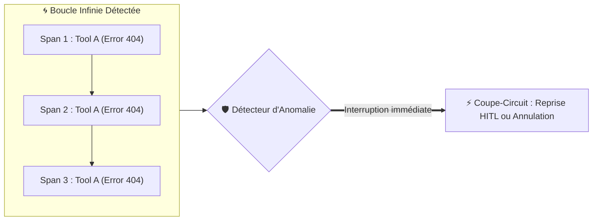

> [!TIP] Analogie
> **Le disjoncteur thermique du moteur de la tondeuse** : Si une pierre ou une grosse branche coince la lame de votre tondeuse à gazon, le moteur force et chauffe. Le disjoncteur thermique de la tondeuse coupe automatiquement le moteur en 1 seconde avant que les fils de cuivre ne fondent sous la chaleur.

> [!EXAMPLE] Exemple d'application : Interruption d'agent bloqué sur un lien mort
> **Agent de Veille Concurrentielle** : L'agent tente de scraper le site d'un concurrent dont le serveur est tombé. L'agent essaie 3 fois d'affilée d'appeler l'outil `scrape_url`. À la 3e tentative consécutive échouée, la plateforme de télémétrie déclenche le coupe-circuit, stoppe l'agent et consigne la trace avec l'erreur : `RECURSION_LIMIT_REACHED`.

*La maîtrise de la latence, des coûts et des défaillances d'outils assure le bon fonctionnement technique du système. Abordons le dernier garde-fou indispensable : la protection de la vie privée et le masquage des données sensibles.*

---

### 2.4. Confidentialité des Données & Masquage dans la Télémétrie (PII Redaction)

> [!INFO] Chapeau de sous-section
> Envoyer des prompts et des réponses brutes vers des plateformes d'observabilité peut créer de graves fuites de données personnelles et de secrets d'entreprise. Cette partie détaille les mécanismes de masquage PII et les règles de gouvernance.

---

#### 2.4.1. Masquage et anonymisation automatique des Données Personnelles (PII Redaction)

En envoyant l'intégralité du texte du prompt et de la réponse LLM vers un serveur de Tracing (qu'il soit SaaS ou self-hosted), l'entreprise s'expose au stockage en texte clair de **Données Personnelles Identifiables (*PII - Personally Identifiable Information*)** : noms, adresses emails, numéros de téléphone, numéros de sécurité sociale ou coordonnées bancaires.

Pour respecter le RGPD et les politiques de sécurité internes, le SDK de télémétrie doit intégrer un **Filtre de Rédaction Automatique (*PII Redactor / Sensitive Data Masking*)** en amont de l'export des Spans.

Le filtre applique des règles de remplacement par motifs Regex ou par des modèles d'Entités Nommées (NER - Named Entity Recognition) :
- Les numéros de téléphone sont remplacés par `[PHONE_REDACTED]`.
- Les adresses emails sont remplacées par `[EMAIL_REDACTED]`.
- Les mots de passe et clés d'accès sont masqués par `[SECRET_REDACTED]`.

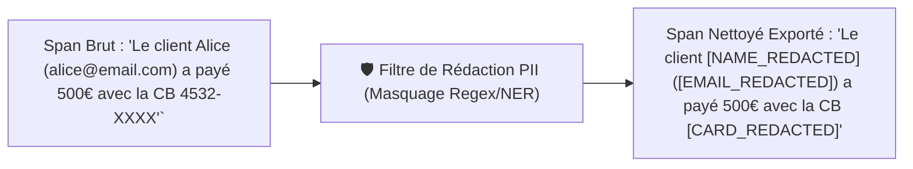

> [!TIP] Analogie
> **Le feutre noir de déclassification des documents secrets** : Avant de publier un rapport d'enquête d'État au grand public, l'archiviste repasse un coup de feutre noir opaque sur les noms des agents secrets, les adresses privées et les numéros de téléphone pour que la lecture du document soit possible sans mettre personne en danger.

> [!EXAMPLE] Exemple d'application : Masquage automatique en secteur bancaire
> **Agent Conseiller Bancaire** : Un utilisateur tape dans le chat : *"Mon numéro de compte est le FR76 3000 4000 5000 et mon code secret est 4412"*. Avant que le Span ne soit exporté vers la console d'observabilité Langfuse, le masqueur PII intercepte le texte et le convertit en : *"Mon numéro de compte est le [IBAN_REDACTED] et mon code secret est [SECRET_REDACTED]"*. L'équipe d'ingénieurs qui consulte les traces n'a jamais accès aux vraies données bancaires.

*Le masquage technique PII protège les individus. Complétons cette protection par le cadre global de gouvernance des données d'observabilité en entreprise.*

---

#### 2.4.2. Conformité et gouvernance des données d'observabilité en entreprise

La conservation de gigaoctets de traces agentiques soulève des exigences strictes de gouvernance des données (*Data Governance*) :

1. **Souveraineté des données et hébergement (*Data Residency*)** :
   - Pour les secteurs réglementés (santé, défense, banque), les traces ne doivent pas quitter le territoire national. Déploiement obligatoire d'instances d'observabilité **auto-hébergées (*Self-Hosted*)** sur des serveurs souverains (ex. Langfuse Community Edition sur AWS EU Paris ou Scaleway).
2. **Durée de rétention limitée (*Retention Policy*)** :
   - Purge automatique des Spans contenant du texte de prompt après 30 jours (TTL). Seules les métriques numériques agrégées (nombre de jetons, latence, coûts) sont conservées sur le long terme pour les bilans comptables.
3. **Contrôle d'accès basé sur les rôles (RBAC)** :
   - Restreindre l'accès à la consultation des Prompts bruts dans la console d'observabilité aux seuls ingénieurs sécurité habilités, tandis que les décideurs métiers n'ont accès qu'aux tableaux de bord anonymisés.

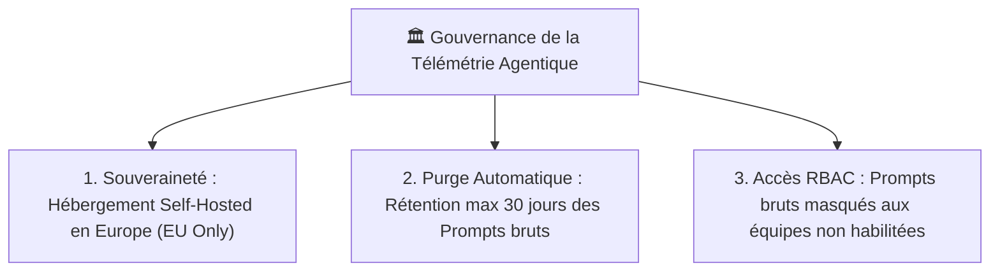

> [!TIP] Analogie
> **La boîte à archives à fermeture à clé et le destructeur de documents** : Les pièces d'archives de l'entreprise sont rangées dans une salle fermée par un badge spécial (RBAC). À la fin du délai légal de 30 jours, un automate transporte les dossiers directement dans le broyeur industriel pour une destruction définitive sans copie.

*L'ensemble des règles théoriques, de l'anatomie des Spans, des 3 piliers de la télémétrie, du standard OpenTelemetry et des garde-fous PII étant maîtrisés, synthétisons le module sous forme de fiches opérationnelles pour l'Architecte Observabilité.*

---

## 3. 📊 Section 3 : Fiche Synthèse / Tableau Récapitulatif

> [!INFO] Chapeau de la Section 3
> Cette dernière section regroupe les outils de référence opérationnels de l'Architecte Observabilité : la matrice comparative des piliers et métriques de télémétrie et la check-list des 10 points de contrôle indispensables avant tout déploiement en production.

---

### 3.1. Matrice Comparative des Piliers & Métriques d'Observabilité Agentique

| Pilier d'Observabilité | Utilité Principale | Métriques Clés Mesurées | Risque si Absent | Cas d'Usage Idéal |
| :--- | :--- | :--- | :--- | :--- |
| **Tracing de Trajectoire** | Visualiser l'arborescence des réflexions ReAct et des appels d'outils | `parent_span_id`, séquence d'outils, cheminement cognitif | Impossibilité de déboguer les hallucinations et les dérives | Débogage d'agents multi-agents complexes et pipelines RAG |
| **Télémétrie FinOps** | Contrôler et ventiler les dépenses financières en jetons LLM | Coût en $, jetons `input`/`output`, coût/user, coût/agent | Explosion budgétaire imprévue et faillite FinOps sur requêtes géantes | Pilotage budgétaire des plateformes SaaS et suivi de marge |
| **Performance & Latence** | Mesurer la vitesse d'exécution et le confort d'utilisation | **TTFT** (ms), latence bout-en-bout, `tokens/sec` | Frustration utilisateur, taux d'abandon élevé sur réponses lentes | Assistants conversationnels en temps réel, interfaces de streaming |
| **Évaluation en Ligne (*Online Evals*)** | Auditer la qualité sémantique des réponses générées en direct | Scores `Faithfulness`, `Answer Relevance`, `Toxicity` ($0.0-1.0$) | Dégradation silencieuse de la qualité des modèles en production | Applications médicales, juridiques, financières et support client |

*La matrice comparative synthétise les arbitrages de métriques d'observabilité ; la check-list opérationnelle vous permet d'auditer votre système avant sa mise en production.*

---

### 3.2. Check-list opérationnelle de l'Architecte Observabilité & Télémétrie pour Agents IA

> [!SUCCESS] Les 10 points de contrôle indispensables avant le déploiement en production
> 1. **Standardisation OpenTelemetry (OTEL) activée** : Émission de Spans et Traces conformes aux spécifications sémantiques CNCF GenAI sans enfermement propriétaire.
> 2. **Filiation Hiérarchique des Spans (Parent-Child)** : Garantie que chaque appel d'outil et recherche RAG est rattaché à son Span parent ReAct et à son `trace_id` unique.
> 3. **Captation complète des jetons et coûts FinOps** : Calcul automatique et ventilation des coûts en dollars ($) par utilisateur, par agent et par modèle.
> 4. **Mesure automatique du TTFT et de la latence bout-en-bout** : Suivi des métriques de temps jusqu'au premier jeton pour garantir une expérience streaming sous les $800\text{ ms}$.
> 5. **Instrumentation non intrusive par décorateurs** : Usage d'annotations Python (`@observe`) ou de callbacks pour isoler la télémétrie de la logique métier.
> 6. **Évaluateurs en Ligne (*Online LLM-as-a-Judge*) déployés** : Échantillonnage automatique des traces de production pour calculer le score d'hallucination (*Faithfulness*).
> 7. **Boucle de feedback utilisateur raccordée** : Capture des votes 👍/👎 et raccordement direct de l'avis utilisateur à la `trace_id` correspondante dans la console.
> 8. **Seuils d'alerte et disjoncteurs FinOps configurés** : Alertes automatiques sur Slack en cas de pic de jetons ou de dépassement de plafond budgétaire par session.
> 9. **Détecteurs de boucles infinies actifs** : Interruption automatique du workflow agentique en cas de répétition anormale du même outil (limite de récursion).
> 10. **Masquage PII et conformité RGPD validés** : Filtrage automatique Regex/NER des données identifiables et des secrets avant l'exportation des traces, avec purge TTL sous 30 jours.

---

> [!QUOTE] Principe final
> On ne peut améliorer que ce que l'on mesure. L'observabilité agentique n'est pas une simple option de confort pour les développeurs ; elle est la **condition sine qua non du passage de l'agent IA du stade de prototype fascinant au statut de système industriel maîtrisable**. Transformer des milliers de lignes de logs bruts en arbres de Tracing lisibles, c'est se donner le pouvoir de comprendre chaque pensée de l'agent, d'arrêter chaque centime de dépense inutile et de bâtir des applications souveraines, ultra-rapides et dignes de la confiance absolue de vos utilisateurs.

---

## 4. Liens entre Notes
- Aller au [[00_MOC_MAITRISE_AGENTS_IA]]
- Fiche précédente : [[11_Masterclass_Securite_Sandboxing_Docker_MicroVMs_Et_Anti_Injection]]
- Fiche suivante : [[13_L_Ecosysteme_CrewAI_Et_LiteLLM]]
