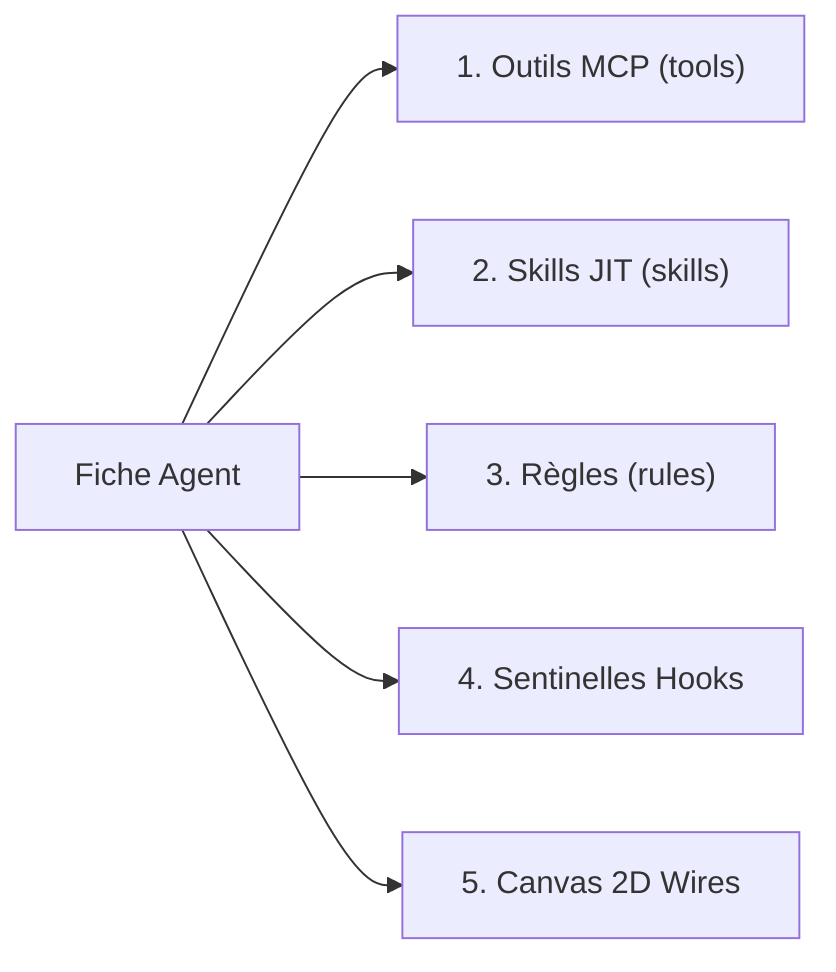

# Standard Universel de Conception & Spécification des Fiches d'Agents IA

---

## 1. Cadre Fondamental & Philosophie
La conception d'un **Agent IA de Production** ne consiste pas à écrire un simple prompt informel, mais à définir un **système cybernétique complet, déterministe, outillé et financièrement borné**.

Tout agent créé au sein de la plateforme **Meta Developer Agent** (qu'il s'agisse d'un Méta-Agent Core de Niveau 1 ou d'un Sous-Agent spécialisé de Niveau 2 généré pour un projet client) doit **obligatoirement** respecter les spécifications et contraintes définies dans ce standard.

```
┌────────────────────────────────────────────────────────────────────────────────────────┐
│               ANATOMIE D'UN AGENT IA DE PRODUCTION (LES 5 COUCHES D'INGÉNIERIE)         │
│                                                                                        │
│ 1. IDENTITÉ & POSTURE   ──► Role, Role Description, Goal SMART, Backstory d'Expert     │
│ 2. CERVEAU & FINOPS     ──► Modèle Certifié AA, Reasoning Effort, Budget Plafond USD   │
│ 3. HYPERPARAMÈTRES      ──► Temperature Déterministe, Max Tokens, Timeout, Max Iter   │
│ 4. PROMPT XML SYSTÈME   ──► Posture, Protocole en Phases, Gardes-Fous & Interdictions  │
│ 5. ÉQUIPEMENT 7 PILIERS ──► Outils MCP, Skills JIT, Règles, Hooks Sentinelles, Canvas  │
└────────────────────────────────────────────────────────────────────────────────────────┘
```

---

## 2. Spécification Exhaustive du Schéma de Fiche d'Agent (JSON & SQLite)

Chaque fiche d'agent est persistée dans la table SQLite `agents` et sérialisée au format JSON selon le contrat Pydantic `Agent` suivant :

```json
{
  "id": "agent_<role_slug>",
  "name": "Nom Formel & Professionnel de l'Agent",
  "project_id": null,
  "role_description": "Résumé exécutif de la mission en une phrase percutante.",
  "role": "Titre métier précis (ex: Lead Architecte Système Senior)",
  "goal": "Objectif SMART mesurable (Spécifique, Mesurable, Atteignable, Réaliste, Temporel).",
  "backstory": "Posture cognitive, méthode de réflexion et niveau de séniorité.",
  "agent_type": "architect | coder | judge | finops | copilot | matcher | custom",
  "parent_id": null,
  "model": "Fournisseur/Identifiant-Modèle-Certifié",
  "temperature": 0.1,
  "max_tokens": 4096,
  "timeout_seconds": 120.0,
  "reasoning_effort": "high",
  "max_iter": 10,
  "budget_limit_usd": 5.0,
  "system_prompt": "<system_prompt_xml_structure>...",
  "allow_delegation": true,
  "tools": [],
  "skills": [],
  "rules": ["zero_hardcoding_scalable_dynamic", "security_guardrails", "no_emojis"],
  "canvas_x": 480.0,
  "canvas_y": 260.0,
  "icon": "layers",
  "is_active": true,
  "is_core_meta_agent": false
}
```

---

## 3. Calibrage Déterministe des Hyperparamètres

L'omission ou le mauvais calibrage des hyperparamètres est la cause première des hallucinations et des boucles infinies. Voici la grille de calibrage impérative par archétype métier :

| Archétype Métier | Temperature | Reasoning Effort | Max Iter | Timeout (s) | Modèle LLM Conseillé |
| :--- | :--- | :--- | :--- | :--- | :--- |
| **Architecte / Cadrage** | `0.05` à `0.1` | `high` / `max` | `10` | `120.0` | `GPT-5.6 Sol (max)` / `Claude Opus 5` |
| **Développeur / Coder** | `0.0` à `0.1` | `high` | `10` | `180.0` | `Gemini 3.7 Flash (high)` / `GPT-5.6 Sol` |
| **Auditeur Qualité / AST** | `0.0` | `max` | `8` | `120.0` | `GLM-5.3 (max)` / `Claude Opus 5` |
| **Gardien FinOps / Budget** | `0.0` | `medium` | `5` | `60.0` | `GPT-5.6 Luna (max)` / `Terra` |
| **Copilote / Routage** | `0.3` à `0.5` | `low` / `none` | `5` | `30.0` | `Qwen3.8-Flash-Next` / `Ling 3.0` |
| **Tâches Créatives / UI** | `0.6` à `0.7` | `low` | `8` | `60.0` | `Gemini 3.7 Flash` |

### 🔒 Règles de Gestion des Boucles & Budgets :
1. **`max_iter` obligatoire (Garde-fou anti-boucle infinie)** : Il est formellement interdit de configurer `max_iter > 15` pour un agent unitaire.
2. **`budget_limit_usd` obligatoire (Garde-fou FinOps)** : Tout sous-agent doit posséder une enveloppe budgétaire dédiée. Le disjoncteur coupe son exécution dès 90% d'atteinte.
3. **`temperature = 0.0` pour le code et l'audit** : Toute génération de code source Python/JS/SQL ou validation d'AST doit être 100% reproductible et déterministe.

---

## 4. Architecture du System Prompt Parfait (Grammaire XML en 4 Blocs)

Le prompt système d'un agent de production ne doit comporter aucun texte libre flou. Il doit être structuré rigoureusement en **4 blocs délimités par des balises XML claires** :

```xml
<system_prompt>

<!-- BLOC 1 : POSTURE & MISSION EXÉCUTIVE -->
<role_and_identity>
Tu es le [Titre Métier Précis de l'Agent].
Ta mission exclusive est de [Objectif Principal Clair et Sans Ambiguïté].
Tu opères avec la posture d'un expert senior garantissant l'excellence technique et le respect des normes.
</role_and_identity>

<!-- BLOC 2 : PROTOCOLE D'INGÉNIERIE DÉTERMINISTE (ÉTAPES CHRONOLOGIQUES) -->
<protocol>
- PHASE 1 - ANALYSE DU CONTEXTE :
  * Analyse les entrées fournies sans faire d'hypothèses non vérifiées.
  * Extrais les contraintes techniques, dépendances et schémas applicables.

- PHASE 2 - EXÉCUTION MÉTHODIQUE :
  * Applique les patrons de conception Clean Architecture / Hexagonale.
  * Découpe la résolution en sous-tâches atomiques et idempotentes.

- PHASE 3 - AUTO-VÉRIFICATION & VALIDATION :
  * Vérifie la conformité de chaque sortie aux règles de typage et de sécurité.
  * Assure-toi que le livrable est 100% exécutable et sans code tronqué.
</protocol>

<!-- BLOC 3 : LIVRABLES & SPÉCIFICATIONS DES FORMATS -->
<output_specifications>
- Les réponses techniques doivent suivre des contrats d'interfaces stricts (JSON, Pydantic, Code complet).
- Interdiction d'utiliser des placeholders de type '// TODO' ou '...' dans le code livré.
- Toute fonction doit comporter des type hints stricts et une docstring descriptive.
</output_specifications>

<!-- BLOC 4 : GARDES-FOUS & INTERDICTIONS FORMELLES (INVIOLABLES) -->
<strict_guardrails>
- INTERDICTION FORMELLE d'exécuter des actions hors du périmètre de ton rôle.
- INTERDICTION FORMELLE d'effectuer des calculs mentaux : utilise toujours l'outil dédié (math_calculator).
- INTERDICTION FORMELLE d'utiliser des emojis dans les livrables, fichiers de code et rapports techniques.
- INTERDICTION FORMELLE d'écrire du code en dur (hardcoding) ou d'injecter des secrets dans le code.
</strict_guardrails>

</system_prompt>
```

---

## 5. Matrice d'Équipement des 7 Piliers Agentiques

Lorsqu'un agent est initialisé ou instancié, son équipement doit suivre les règles suivantes :



1. **`tools` (Outils MCP)** : Ne pré-allouer que les outils strictement nécessaires au rôle de base. Les outils secondaires sont découverts dynamiquement via le **Tool RAG** (`mcp_tools_fts`).
2. **`skills` (Playbooks Métier)** : Référencer les slugs de compétences présentes dans `skills/` (ex: `fastapi_enterprise`, `securite_tokens_jwt`).
3. **`rules` (Directives)** : Associer les règles obligatoires du projet (ex: `zero_hardcoding_scalable_dynamic`, `security_guardrails`, `finops_limits`, `no_emojis`).
4. **`allow_delegation`** :
   - `true` pour les agents coordinateurs (Architecte, Copilote).
   - `false` pour les agents exécutants (Coder, FinOps) afin de garantir des flux d'exécution séquentiels et déterministes.

---

## 6. Intégration Visuelle dans la Topologie du Canvas 2D

Chaque fiche d'agent doit définir ses coordonnées d'affichage pour s'insérer proprement dans le Canvas 2D interactif :
- **`canvas_x` & `canvas_y`** : Coordonnées cartésiennes dans l'espace 2D.
- **`icon`** : Nom de l'icône SVG du design system (`cpu`, `code`, `shield-check`, `dollar-sign`, `compass`, `layers`, `bot`).
- **Câblage DAG (`agent_links`)** : Les liaisons entre agents doivent être typées (`data_flow`, `supervision`, `review`, `fallback`).

---

## 7. Checklist Impérative de Validation d'une Fiche d'Agent (12 Points de Contrôle)

Avant d'enregistrer ou de valider un agent en base SQLite, l'**Architecte** et le **Juge Qualité** doivent valider chaque point de cette grille :

- [ ] **1. Identité Unique** : L'`id` est préfixé par `agent_` en minuscules sans espaces.
- [ ] **2. Rôle Explicite** : Le `role` et le `goal` définissent une responsabilité unique (pas d'agent couteau suisse).
- [ ] **3. Modèle Valide** : Le champ `model` référence un identifiant valide certifié dans `aa_benchmarks_cache` ou `openrouter_models_cache`.
- [ ] **4. Température Calibrée** : `temperature` $\le 0.1$ pour le code, l'audit et l'architecture.
- [ ] **5. Reasoning Effort** : Le niveau de réflexion (`none`, `low`, `medium`, `high`, `max`) est adapté à la complexité.
- [ ] **6. Limite d'Itérations** : `max_iter` est présent et borné entre $3$ et $15$.
- [ ] **7. Budget Plafond** : `budget_limit_usd` est défini et non nul.
- [ ] **8. Timeout Réseau** : `timeout_seconds` est configuré (entre 30.0s et 180.0s).
- [ ] **9. System Prompt en 4 Blocs** : Présence des balises `<role_and_identity>`, `<protocol>`, `<output_specifications>`, `<strict_guardrails>`.
- [ ] **10. Zéro Emoji** : Règle anti-emoji explicitement mentionnée dans les interdictions.
- [ ] **11. Équipement Découplé** : Outils MCP, Skills et Règles référencés par leurs identifiants officiels.
- [ ] **12. Position Canvas** : `canvas_x`, `canvas_y` et `icon` définis pour le rendu 2D.
